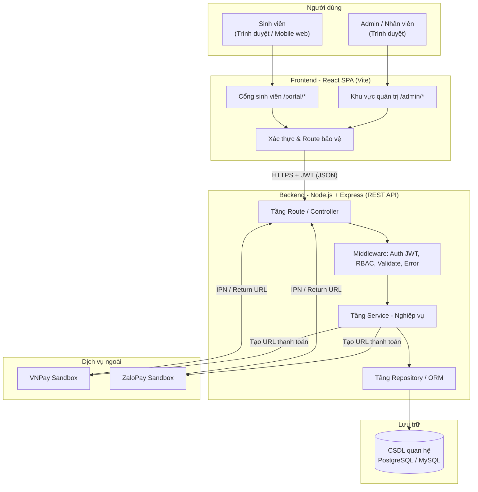

# 01 – TỔNG QUAN DỰ ÁN

**Tên đề tài:** Xây dựng hệ thống web quản lý ký túc xá
**Tên hệ thống:** DMS-KTX (Dormitory Management System)
**Phiên bản:** v1.0 – Baseline
**Ngày lập:** 11/09/2026

---

## 1. Bối cảnh và lý do chọn đề tài

### 1.1. Hiện trạng

Qua khảo sát thực tế công tác quản lý ký túc xá tại các trường đại học – cao đẳng ở Việt Nam, phần lớn Ban quản lý KTX hiện đang vận hành theo một trong ba hình thức:

| Hình thức | Mức độ phổ biến | Hạn chế |
|-----------|-----------------|---------|
| Sổ sách giấy + Excel rời rạc | Cao (trường quy mô vừa/nhỏ) | Dữ liệu phân mảnh, dễ sai lệch, không truy vết được |
| Phần mềm desktop cũ (Access/VB) | Trung bình | Chỉ dùng được tại phòng ban, sinh viên không truy cập được |
| Module KTX trong hệ thống ERP của trường | Thấp | Chi phí cao, khó tùy chỉnh, phụ thuộc nhà cung cấp |

### 1.2. Các vấn đề cụ thể được xác định

1. **Khó nắm bắt tình trạng chỗ ở theo thời gian thực.** Nhân viên phải mở nhiều file Excel để biết phòng nào còn giường trống, dẫn đến xếp trùng giường hoặc bỏ sót chỗ trống.
2. **Quy trình đăng ký thủ công, tốn thời gian.** Sinh viên phải đến trực tiếp văn phòng KTX, xếp hàng nộp đơn giấy, đặc biệt quá tải vào đầu mỗi học kỳ.
3. **Quản lý hợp đồng lỏng lẻo.** Không có cơ chế cảnh báo hợp đồng sắp hết hạn, dẫn đến tình trạng sinh viên ở quá hạn mà không có giấy tờ hợp lệ.
4. **Thu phí và đối soát công nợ khó khăn.** Tiền phòng, điện, nước, tiền cọc được ghi chép rời rạc; sinh viên không tra cứu được mình còn nợ bao nhiêu; thu tiền mặt tiềm ẩn rủi ro thất thoát.
5. **Thiếu số liệu tổng hợp cho lãnh đạo.** Muốn biết tỷ lệ lấp đầy hay tổng công nợ phải tổng hợp thủ công, mất nhiều ngày.
6. **Sinh viên bị động thông tin.** Không biết mình ở phòng nào, hợp đồng đến ngày nào, đã đóng bao nhiêu tiền nếu không hỏi trực tiếp nhân viên.

### 1.3. Khảo sát các giải pháp tương tự

Nhóm đã tham khảo các hệ thống trong và ngoài nước để xác định tập chức năng cốt lõi:

| Hệ thống tham khảo | Loại | Chức năng đáng học hỏi | Điểm không áp dụng cho v1 |
|--------------------|------|------------------------|---------------------------|
| Cổng KTX của các trường ĐH Việt Nam | Web nội bộ trường | Đăng ký trực tuyến theo đợt, tra cứu kết quả xếp phòng, tra cứu hóa đơn | Xét duyệt theo diện ưu tiên phức tạp, tích hợp hệ thống đào tạo |
| StarRez, RoomSync (quốc tế) | SaaS quản lý KTX | Cấu trúc Building → Room → Bed, sơ đồ trực quan, room assignment | Thuật toán ghép bạn cùng phòng, mobile app, đa cơ sở |
| Phần mềm quản lý nhà trọ Việt Nam | Web/app cho thuê trọ | Chốt chỉ số điện nước theo tháng, tự sinh hóa đơn, thanh toán online | Quản lý nhiều chủ trọ, chấm công nhân viên |
| Hệ thống quản lý khách sạn (PMS) | Thương mại | Máy trạng thái phòng (trống/đang ở/bảo trì), check-in/check-out | Đặt phòng theo đêm, khách vãng lai, housekeeping |

**Kết luận khảo sát:** Tập chức năng tối thiểu của một hệ thống quản lý KTX gồm 3 trụ cột — **(1) quản lý không gian ở (tòa/phòng/giường)**, **(2) quản lý vòng đời lưu trú (đăng ký → hợp đồng → gia hạn → trả phòng)**, **(3) quản lý tài chính (phí – hóa đơn – thanh toán)** — cộng thêm **cổng tự phục vụ cho sinh viên** và **dashboard cho quản lý**. Đây chính là phạm vi MVP của dự án.

---

## 2. Mục tiêu dự án

### 2.1. Mục tiêu tổng quát

Xây dựng ứng dụng web (SPA React + REST API Node.js) giúp Ban quản lý ký túc xá số hóa toàn bộ quy trình từ tiếp nhận đăng ký, xếp chỗ ở, quản lý hợp đồng, thu phí đến báo cáo thống kê; đồng thời cung cấp cổng tự phục vụ để sinh viên chủ động tra cứu và gửi yêu cầu trực tuyến.

### 2.2. Mục tiêu cụ thể (đo lường được)

| # | Mục tiêu | Chỉ số đo (KPI) |
|---|----------|-----------------|
| G1 | Số hóa dữ liệu chỗ ở | 100% tòa nhà/phòng/giường được quản lý trên hệ thống; trạng thái giường cập nhật tức thời |
| G2 | Rút ngắn thời gian đăng ký lưu trú | Từ ~30 phút (thủ công tại quầy) xuống dưới 5 phút thao tác trên hệ thống |
| G3 | Loại bỏ lỗi xếp trùng giường | 0 trường hợp 2 sinh viên đang hiệu lực trên cùng 1 giường (ràng buộc tại tầng CSDL) |
| G4 | Minh bạch công nợ | Sinh viên tra cứu được 100% hóa đơn và lịch sử thanh toán của mình, mọi lúc |
| G5 | Hỗ trợ thanh toán trực tuyến | Tích hợp tối thiểu 1 cổng (VNPay sandbox), có đối soát giao dịch |
| G6 | Cung cấp số liệu tức thời cho lãnh đạo | Dashboard hiển thị tỷ lệ lấp đầy, công nợ quá hạn, hợp đồng sắp hết hạn trong ≤ 2 giây |
| G7 | Hoàn thành đồ án đúng hạn | Bàn giao sản phẩm chạy được + báo cáo + demo trong 12 tuần |

### 2.3. Mục tiêu học thuật của nhóm

- Thực hành quy trình phát triển phần mềm đầy đủ: khảo sát → đặc tả → thiết kế → cài đặt → kiểm thử → triển khai.
- Nắm vững mô hình client–server tách biệt (SPA + REST API), xác thực JWT và phân quyền RBAC.
- Làm quen với làm việc nhóm bằng Git, code review, quản lý công việc theo sprint.

---

## 3. Phạm vi dự án

### 3.1. Trong phạm vi (In-scope) – MVP v1

| Nhóm chức năng | Nội dung tóm tắt | Ưu tiên |
|----------------|------------------|---------|
| **M1. Quản lý sinh viên** | Thêm/xem/sửa/vô hiệu hóa hồ sơ; tìm kiếm & lọc theo tên, MSSV, phòng, trạng thái lưu trú | M |
| **M2. Quản lý tòa nhà – phòng – giường** | Cấu trúc 3 cấp; trạng thái giường (trống/đã sử dụng/bảo trì); kiểm soát sức chứa | M |
| **M3. Đăng ký lưu trú & hợp đồng** | Xếp sinh viên vào giường cụ thể, tạo hồ sơ lưu trú; vòng đời hợp đồng (chờ duyệt → hiệu lực → hết hạn/chấm dứt); cảnh báo sắp hết hạn | M |
| **M4. Phí & thanh toán** | Danh mục phí (tiền phòng, điện, nước, cọc, khác); tạo & theo dõi hóa đơn; thanh toán toàn phần/một phần; VNPay/ZaloPay + ghi nhận thủ công | M |
| **M5. Dashboard & báo cáo** | Thống kê giường, tỷ lệ lấp đầy, công nợ quá hạn, hợp đồng sắp hết hạn; xuất Excel/CSV | M |
| **M6. Xác thực & phân quyền** | Đăng nhập/đăng xuất JWT; 4 vai trò: Admin, Nhân viên, Sinh viên, Người xem | M |
| **M7. Cổng sinh viên** | Đăng ký tài khoản, đăng nhập; xem phòng/giường trống, thông tin cư trú, hợp đồng, hóa đơn, lịch sử thanh toán; chỉ truy cập dữ liệu của chính mình | M |
| **M8. Gia hạn & trả phòng** | Sinh viên gửi yêu cầu; nhân viên duyệt/từ chối; duyệt trả phòng → kết thúc hợp đồng + giải phóng giường | M |

### 3.2. Ngoài phạm vi (Out-of-scope) – v1

Các hạng mục sau **được xác định rõ là KHÔNG làm trong v1**, nhằm bảo vệ tiến độ. Nếu phát sinh yêu cầu thuộc nhóm này, ghi vào Backlog v2.

| # | Hạng mục loại trừ | Lý do | Dự kiến |
|---|-------------------|-------|---------|
| 1 | Ứng dụng mobile native (iOS/Android) | Chi phí phát triển gấp đôi; web responsive đã đáp ứng | v2 |
| 2 | Cổng thanh toán ngoài VNPay/ZaloPay | Mỗi cổng cần quy trình tích hợp + đối soát riêng | v2 |
| 3 | Sinh viên tự chỉnh sửa thông tin cá nhân | Dữ liệu nhân thân phải do nhà trường kiểm soát để đảm bảo tính pháp lý của hợp đồng | v2 (cơ chế gửi yêu cầu sửa) |
| 4 | Quản lý nhiều khu/nhiều cơ sở KTX (multi-tenant) | Làm phức tạp mô hình dữ liệu và phân quyền | v2 |
| 5 | Gửi email/SMS tự động | Cần dịch vụ gửi tin trả phí và cấu hình domain | v2 |
| 6 | Quản lý bảo trì/sửa chữa (ticket sự cố) | Là một phân hệ riêng đủ lớn | v2 |
| 7 | Quản lý khách thăm / check-in ra vào | Cần thiết bị phần cứng (quẹt thẻ) | v2 |
| 8 | Phân tích BI, dự báo nâng cao | Vượt năng lực và thời gian của nhóm | Không |
| 9 | Đa ngôn ngữ (i18n) | Người dùng mục tiêu là sinh viên/nhân viên Việt Nam | v2 |
| 10 | Ký hợp đồng điện tử (chữ ký số) | Yêu cầu pháp lý phức tạp, cần nhà cung cấp CA | Không |

### 3.3. Giả định và ràng buộc

**Giả định:**
- Mỗi ký túc xá chỉ thuộc một trường; hệ thống vận hành cho một cơ sở duy nhất.
- Vì không có email/SMS tự động, **thông báo trong ứng dụng cũng nằm ngoài phạm vi v1**. Cơ chế nhắc việc duy nhất là số đếm (badge) trên sidebar. Người dùng quên mật khẩu được nhân viên đặt lại hộ (FR-09).
- Giá phòng là **giá mỗi sinh viên (mỗi giường) một tháng**, không phải giá cả phòng.
- Tiền phòng tháng đầu thu đủ một tháng dù vào ở giữa tháng; tiền điện nước chia đều theo đầu người, không theo số ngày ở (BR-34, BR-51).
- Tòa nhà `MIXED` nghĩa là tòa có **cả phòng nam và phòng nữ**, không phải nam nữ ở chung phòng (BR-17).
- Dữ liệu sinh viên (MSSV, họ tên, lớp, khoa) do Ban quản lý KTX nhập hoặc import từ file Excel — **không** tích hợp trực tiếp API hệ thống đào tạo.
- Mỗi sinh viên tại một thời điểm chỉ có tối đa **một** hợp đồng đang hiệu lực.
- Giá phòng cố định theo loại phòng, không có chính sách giảm giá theo diện ưu tiên trong v1.
- Chỉ số điện/nước được nhân viên nhập thủ công theo kỳ (không có đồng hồ thông minh).

**Ràng buộc:**
- Công nghệ bắt buộc: Frontend React, Backend Node.js.
- Thời gian: 12 tuần (chi tiết tại `13-LO-TRINH-TRIEN-KHAI.md`).
- Nhân lực: nhóm sinh viên, làm bán thời gian song song việc học.
- Ngân sách: 0 đồng → chỉ dùng dịch vụ miễn phí hoặc gói free tier; thanh toán dùng môi trường **sandbox**, không giao dịch tiền thật.

---

## 4. Các bên liên quan (Stakeholders)

| Bên liên quan | Vai trò trong hệ thống | Mối quan tâm chính |
|---------------|------------------------|--------------------|
| Ban quản lý KTX / Trưởng ban | Admin | Số liệu tổng hợp, tỷ lệ lấp đầy, công nợ, phân quyền nhân viên |
| Nhân viên quản lý KTX | Staff | Thao tác hằng ngày nhanh gọn: xếp phòng, lập hóa đơn, duyệt yêu cầu |
| Kế toán KTX | Staff (hoặc Viewer) | Đối soát thu chi, ghi nhận thanh toán, xuất báo cáo tài chính |
| Sinh viên nội trú | Student | Đăng ký chỗ ở, tra cứu hợp đồng/hóa đơn, thanh toán online, xin gia hạn/trả phòng |
| Ban giám hiệu / Phòng CTSV | Viewer | Xem báo cáo tổng hợp, không can thiệp dữ liệu |
| Giảng viên hướng dẫn | Bên đánh giá | Tính đầy đủ của tài liệu, chất lượng phân tích thiết kế, sản phẩm chạy được |
| Nhóm phát triển | Người thực hiện | Tiến độ, phân công rõ ràng, hợp đồng API ổn định giữa FE và BE |

---

## 5. Kiến trúc tổng thể (mức khái niệm)

**Nguyên tắc kiến trúc:**
1. **Tách biệt hoàn toàn FE và BE** — giao tiếp duy nhất qua REST API JSON, cho phép hai nhóm làm song song.
2. **Stateless authentication** — dùng JWT, server không lưu session, dễ mở rộng.
3. **Phân tầng rõ ràng ở backend** — Controller (nhận/trả HTTP) → Service (nghiệp vụ) → Repository (truy cập dữ liệu). Nghiệp vụ **không** viết trong controller.
4. **Ràng buộc toàn vẹn đặt tại tầng CSDL** — quy tắc sống còn (1 giường 1 người đang ở) phải có unique constraint, không chỉ kiểm tra ở code.

---

## 6. Tiêu chí thành công của dự án

| # | Tiêu chí | Cách nghiệm thu |
|---|----------|-----------------|
| S1 | 100% yêu cầu chức năng mức **Must (M)** được cài đặt và chạy được | Chạy kịch bản UAT trong `11-KE-HOACH-KIEM-THU.md` |
| S2 | Hệ thống chạy end-to-end với dữ liệu mẫu thực tế (≥ 3 tòa, ≥ 50 phòng, ≥ 200 giường, ≥ 100 sinh viên) | Demo trực tiếp |
| S3 | Không còn lỗi mức Critical/High tại thời điểm bàn giao | Bảng theo dõi lỗi |
| S4 | Thanh toán online chạy thông suốt trên sandbox (tạo URL → thanh toán → callback → cập nhật hóa đơn) | Demo 1 giao dịch thành công + 1 giao dịch thất bại |
| S5 | Tài liệu đầy đủ từ 01 đến 13, khớp với sản phẩm thực tế | GVHD rà soát |
| S6 | Toàn bộ mã nguồn trên Git, lịch sử commit thể hiện đóng góp của từng thành viên | Kiểm tra `git log` theo tác giả |
| S7 | Hệ thống được deploy công khai để GVHD truy cập thử | Cung cấp URL + tài khoản demo |

---

## 7. Rủi ro và phương án giảm thiểu

| ID | Rủi ro | Khả năng | Tác động | Phương án giảm thiểu |
|----|--------|----------|----------|----------------------|
| R1 | Hợp đồng API giữa FE và BE thay đổi liên tục | Cao | Cao | Chốt `06-DAC-TA-API.md` ở Sprint 1; mọi thay đổi phải qua PR và thông báo; FE bọc API trong lớp `services/` để giới hạn phạm vi ảnh hưởng |
| R2 | Backend chậm hơn kế hoạch, FE không có API để nối | Cao | Trung bình | FE dùng **mock server** (MSW hoặc json-server) đúng theo đặc tả API ngay từ Sprint 1, chỉ đổi base URL khi BE sẵn sàng |
| R3 | Tích hợp cổng thanh toán khó, tài liệu phức tạp | Trung bình | Cao | Làm sớm ở Sprint 5 (không để cuối); thiết kế `PaymentGateway` dạng interface; luôn có sẵn phương thức "ghi nhận thủ công" làm phương án dự phòng |
| R4 | Thành viên bận thi/học, tiến độ trễ | Cao | Cao | Chia task nhỏ ≤ 1 ngày công; standup 2 buổi/tuần; mỗi chức năng có 1 người backup |
| R5 | Phình phạm vi (scope creep) | Cao | Cao | Danh sách out-of-scope ở mục 3.2 là ràng buộc; ý tưởng mới ghi vào Backlog v2, không đưa vào sprint đang chạy |
| R6 | Lỗi logic nghiệp vụ: xếp trùng giường, tính sai công nợ | Trung bình | Cao | Ràng buộc unique ở DB; dùng transaction cho thao tác xếp giường & thanh toán; unit test cho hàm tính tiền |
| R7 | Mất mã nguồn / xung đột Git nghiêm trọng | Thấp | Cao | Push lên remote hằng ngày; theo Git flow ở `10-QUY-TRINH-LAM-VIEC.md`; cấm push thẳng vào `main` |
| R8 | Deploy thất bại sát ngày bảo vệ | Trung bình | Cao | Deploy thử ("dry run") ngay cuối Sprint 2 với phiên bản tối thiểu, không để đến tuần cuối |

---

## 8. Lịch sử phiên bản tài liệu

| Phiên bản | Ngày | Người thực hiện | Nội dung thay đổi |
|-----------|------|------------------|-------------------|
| v1.0 | 11/09/2026 | Cả nhóm | Khởi tạo tài liệu tổng quan, chốt phạm vi MVP |
