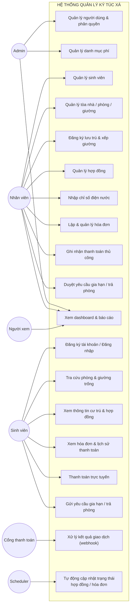

# 02 – ĐẶC TẢ YÊU CẦU PHẦN MỀM (SRS)

**Hệ thống:** DMS – Hệ thống quản lý ký túc xá
**Phiên bản:** v1.1 (MVP)
**Kiến trúc:** Monolith theo tính năng (modular monolith)
**Stack:** React + Vite (Frontend) · Node.js + Express.js (Backend) · MongoDB + Mongoose (Database)
**Quy mô đội:** 5 người
**Tài liệu tham chiếu:** `PRD.md` (phạm vi) · `ARCHITECTURE.md` (tổ chức mã) · `API.md` (endpoint) · `DATA-SCHEMA.md` (dữ liệu)

> **Mục đích tài liệu:** Đây là tài liệu **hợp đồng yêu cầu** của dự án cho phiên bản v1. Mỗi chức năng được cài đặt phải truy vết được về một mã `FR-xx` trong tài liệu này. Những gì không có trong `PRD.md` và tài liệu này thì **không** được tự ý cài đặt — kể cả bởi AI coding assistant.
>
> Khi tài liệu này và `PRD.md` nói khác nhau về **phạm vi**, lấy theo `PRD.md`.

---

## 1. Tác nhân (Actors)

| Mã | Tác nhân | Mô tả | Cách có tài khoản |
|----|----------|-------|-------------------|
| AC-1 | **Admin** | Quản trị viên KTX. Toàn quyền hệ thống: quản lý người dùng, cấu hình danh mục phí. | Tạo sẵn khi khởi tạo hệ thống (seed) |
| AC-2 | **Staff** | Nhân viên KTX. Nghiệp vụ hằng ngày: sinh viên, phòng/giường, lưu trú, hợp đồng, hóa đơn, thanh toán, duyệt yêu cầu. | Admin tạo |
| AC-3 | **Student** | Sinh viên đang/sắp lưu trú. Chỉ thao tác trên dữ liệu của chính mình. | Tự đăng ký tài khoản, liên kết với hồ sơ do Staff quản lý |
| AC-4 | **Viewer** | Người xem báo cáo (ban giám hiệu, phòng ban liên quan). Chỉ đọc. | Admin tạo |
| AC-5 | **Payment Gateway** (tác nhân hệ thống) | VNPay / ZaloPay. Gửi kết quả giao dịch về hệ thống qua webhook. | Không áp dụng |
| AC-6 | **Scheduler** (tác nhân hệ thống) | Job nền chạy theo lịch: chuyển hợp đồng hết hạn, đánh dấu hóa đơn quá hạn. | Không áp dụng |

*Admin kế thừa toàn bộ quyền của Staff; Staff kế thừa quyền đọc của Viewer trên các báo cáo.*

---

## 2. Sơ đồ Use Case tổng quát

---

## 3. Yêu cầu chức năng (Functional Requirements)

**Ký hiệu ưu tiên:** M = Must (bắt buộc v1) · S = Should · C = Could
**Ký hiệu ⭐** = ba nghiệp vụ bổ sung ngày 12/09/2026 theo quyết định của nhóm (`PRD.md` §2.9).

### 3.1. M1 – Xác thực & phân quyền

| Mã | Yêu cầu | Ưu tiên | Tác nhân |
|----|---------|---------|----------|
| FR-01 | Hệ thống cho phép đăng nhập bằng email và mật khẩu; trả về JWT kèm vai trò người dùng. | M | Tất cả |
| FR-02 | Hệ thống cho phép đăng xuất; token phía client bị xóa. | M | Tất cả |
| FR-03 | Mật khẩu được băm bằng bcrypt (cost ≥ 10); không bao giờ lưu hoặc trả về mật khẩu gốc. | M | – |
| FR-04 | Mỗi API được kiểm tra quyền theo ma trận RBAC (`admin`/`staff`/`student`/`viewer`); từ chối với mã `403` nếu không đủ quyền. | M | – |
| FR-05 | Giới hạn tần suất gọi `/api/auth/login` để chống dò mật khẩu (dùng `express-rate-limit`). | M | – |
| FR-06 | Admin tạo, sửa, khóa/mở khóa tài khoản và gán vai trò. | M | Admin |
| FR-07 | Người dùng tự đổi mật khẩu sau khi xác nhận đúng mật khẩu hiện tại. | M | Tất cả |
| FR-08 | JWT có thời hạn 7 ngày; hết hạn thì đăng nhập lại. *(v1 không dùng refresh token.)* | M | – |
| FR-09 | Admin/Staff đặt lại mật khẩu cho tài khoản bị quên, sinh mật khẩu tạm hiển thị **một lần** để trao trực tiếp; bắt buộc đổi ở lần đăng nhập kế tiếp. Staff **không** được reset tài khoản Admin. *(Vì email/SMS ngoài phạm vi v1, đây là phương án bắt buộc để tránh khóa vĩnh viễn tài khoản.)* | M | Admin, Staff |

### 3.2. M2 – Quản lý sinh viên

| Mã | Yêu cầu | Ưu tiên | Tác nhân |
|----|---------|---------|----------|
| FR-10 | Staff tạo hồ sơ sinh viên: họ tên, mã số SV, ngày sinh, **giới tính**, SĐT, email, lớp, khoa, người liên hệ khẩn cấp (tên + SĐT + quan hệ). | M | Staff |
| FR-11 | Mã số sinh viên là duy nhất trong toàn hệ thống; báo lỗi rõ ràng nếu trùng. | M | – |
| FR-12 | Staff xem chi tiết hồ sơ sinh viên, gồm thông tin cư trú hiện tại, hợp đồng và công nợ. | M | Staff |
| FR-13 | Staff cập nhật thông tin hồ sơ sinh viên. | M | Staff |
| FR-14 | Staff vô hiệu hóa (soft-delete) hồ sơ; hệ thống **không cho phép** nếu sinh viên còn hợp đồng `pending`/`active` hoặc còn công nợ. | M | Staff |
| FR-15 | Danh sách sinh viên có phân trang, tìm kiếm (họ tên, mã SV, SĐT) và lọc theo trạng thái, giới tính, tòa nhà, phòng. | M | Staff, Viewer |
| FR-16 | Sắp xếp danh sách theo họ tên, mã SV, ngày tạo. | S | Staff |
| FR-17 | Xuất danh sách sinh viên đang lọc ra file CSV. | S | Staff, Viewer |

### 3.3. M3 – Quản lý tòa nhà, phòng & giường

| Mã | Yêu cầu | Ưu tiên | Tác nhân |
|----|---------|---------|----------|
| FR-20 | Staff thêm/sửa/ngừng hoạt động **tòa nhà**: mã, tên, địa chỉ, mô tả. | M | Staff |
| FR-21 | Staff thêm/sửa/ngừng hoạt động **phòng** thuộc một tòa nhà: số phòng, **giới tính phòng**, sức chứa, giá thuê mỗi giường/tháng, trạng thái. | M | Staff |
| FR-22 | Staff thêm/sửa/xóa **giường** thuộc một phòng: mã giường, trạng thái. Giường có 3 trạng thái: `available` · `occupied` · `maintenance`. | M | Staff |
| FR-23 | Hỗ trợ sinh nhanh giường theo sức chứa của phòng (VD: phòng 4 người → tự tạo 4 giường). | S | Staff |
| FR-24 | Hệ thống không cho phép số giường thực tế trong một phòng vượt quá sức chứa đã khai báo. | M | – |
| FR-25 | Hệ thống không cho phép xóa tòa nhà/phòng/giường đang được sử dụng; chỉ cho chuyển sang ngừng hoạt động. | M | – |
| FR-26 | Hiển thị sơ đồ trực quan theo tòa: mỗi phòng hiển thị `đã ở/sức chứa`, tô màu theo mức lấp đầy. | S | Staff, Viewer |
| FR-27 | Cho phép chuyển giường sang `maintenance` và ngược lại; giường đang `occupied` không được chuyển sang `maintenance`. | M | Staff |
| FR-28 | Cung cấp API/màn hình tra cứu **giường còn trống**, lọc theo tòa nhà, giới tính, khoảng giá. | M | Staff, Student |
| ⭐ FR-29 | Mỗi phòng có thuộc tính **giới tính** (`male`/`female`) bắt buộc. Hệ thống **chặn** xếp sinh viên vào phòng không khớp giới tính, trả `422 GENDER_MISMATCH`. Việc kiểm tra thực hiện ở mức **phòng**, không phải mức tòa nhà. | M | – |

### 3.4. M4 – Đăng ký lưu trú & hợp đồng

| Mã | Yêu cầu | Ưu tiên | Tác nhân |
|----|---------|---------|----------|
| FR-30 | Staff tạo **Residency** gắn một sinh viên vào một giường cụ thể còn trống. | M | Staff |
| FR-31 | Hệ thống không cho phép xếp sinh viên vào giường đang `occupied` hoặc `maintenance`. Việc chiếm giường phải dùng **cập nhật có điều kiện nguyên tử**, không đọc-rồi-ghi. | M | – |
| FR-32 | Hệ thống không cho phép một sinh viên có đồng thời 2 hợp đồng ở trạng thái `pending` hoặc `active`. | M | – |
| FR-33 | Staff tạo **Contract** liên kết 1:1 với Residency: ngày bắt đầu, ngày kết thúc, giá/tháng, tiền cọc, điều khoản. Trạng thái khởi tạo `pending`. | M | Staff |
| FR-34 | Staff kích hoạt hợp đồng `pending` → `active`; giường chuyển `occupied`; hệ thống sinh **hai hóa đơn riêng**: một `deposit` (tiền cọc) và một `monthly` (tiền phòng kỳ đầu). | M | Staff |
| FR-35 | Danh sách hợp đồng có phân trang, lọc theo trạng thái, tòa nhà, khoảng ngày, từ khóa sinh viên. | M | Staff, Viewer |
| FR-36 | Scheduler tự chuyển hợp đồng sang `expired` khi quá ngày kết thúc mà không gia hạn, đồng thời giải phóng giường. | M | – |
| FR-37 | Hệ thống cảnh báo hợp đồng sắp hết hạn trong N ngày (mặc định 30) trên dashboard và danh sách hợp đồng. | M | Staff, Admin |
| FR-38 | Staff chấm dứt hợp đồng trước hạn kèm lý do; hệ thống giải phóng giường, đóng Residency và chốt công nợ. | M | Staff |
| FR-39 | Hệ thống lưu lịch sử lưu trú của sinh viên (hợp đồng cũ, giường đã ở) để tra cứu. | S | Staff, Student |

### 3.5. M5 – Phí, chỉ số điện nước & thanh toán

| Mã | Yêu cầu | Ưu tiên | Tác nhân |
|----|---------|---------|----------|
| FR-45 | Admin quản lý **danh mục loại phí**: tiền phòng, tiền điện, tiền nước, tiền cọc, phí khác — mã, tên, đơn vị, đơn giá mặc định. | M | Admin |
| FR-46 | Staff tạo **hóa đơn** cho một sinh viên gồm một hoặc nhiều dòng phí, kỳ thanh toán, hạn thanh toán. | M | Staff |
| FR-47 | Hệ thống hỗ trợ **lập hóa đơn hàng loạt** cho tất cả sinh viên đang ở trong một kỳ. Nếu sinh viên **đã có** hóa đơn `monthly` của kỳ đó, hệ thống **bổ sung các dòng phí còn thiếu** vào hóa đơn có sẵn thay vì bỏ qua sinh viên. | M | Staff |
| FR-48 | Hệ thống tự sinh mã hóa đơn duy nhất theo định dạng `INV-YYYYMM-XXXXX`. | M | – |
| FR-49 | Hệ thống tính `tổng tiền`, `đã trả`, `còn nợ` và cập nhật trạng thái hóa đơn: `unpaid`/`partial`/`paid`/`overdue`/`cancelled`. Trạng thái là **giá trị dẫn xuất**, client không được tự đặt. | M | – |
| FR-50 | Hệ thống hỗ trợ thanh toán một phần; mỗi lần thanh toán ghi thành một bản ghi `Payment` riêng. | M | – |
| FR-51 | Staff ghi nhận thanh toán thủ công (tiền mặt/chuyển khoản) kèm số tiền, ngày, phương thức, người ghi nhận. | M | Staff |
| FR-52 | Student thanh toán trực tuyến hóa đơn của mình qua **VNPay** hoặc **ZaloPay** (môi trường sandbox). | M | Student |
| FR-53 | Hệ thống tạo yêu cầu thanh toán với cổng, trả về URL/QR để chuyển hướng sinh viên. | M | – |
| FR-54 | Hệ thống nhận **webhook** từ cổng, **xác thực chữ ký** trước khi xử lý, rồi cập nhật giao dịch và hóa đơn. Chữ ký sai → ghi log cảnh báo, không thay đổi dữ liệu. | M | – |
| FR-55 | Hệ thống xử lý webhook theo cơ chế **idempotent**: nhận cùng thông báo nhiều lần chỉ ghi nhận thanh toán một lần. | M | – |
| FR-56 | Hệ thống lưu đầy đủ lịch sử giao dịch (`pending`/`success`/`failed`) kèm dữ liệu phản hồi thô từ cổng để đối soát. | M | – |
| FR-57 | Scheduler tự đánh dấu hóa đơn `overdue` khi quá hạn thanh toán mà chưa trả đủ. | M | – |
| FR-58 | Staff hủy hóa đơn lập sai, với điều kiện hóa đơn chưa phát sinh thanh toán thành công nào. | M | Staff |
| ⭐ FR-59 | Staff nhập **chỉ số công tơ điện/nước** theo từng phòng theo từng kỳ (chỉ số đầu kỳ, cuối kỳ). Hệ thống tự tính lượng tiêu thụ × đơn giá, rồi **chia đều** cho số sinh viên đang lưu trú trong phòng ở kỳ đó. Ràng buộc: chỉ số cuối ≥ chỉ số đầu; không sửa được sau khi đã lập hóa đơn; **tổng các phần chia phải bằng đúng tổng tiền của phòng** (dùng `Math.floor` + dồn phần dư cho sinh viên có mã SV nhỏ nhất). Đơn giá được **chốt lại trên bản ghi** để đổi giá sau này không làm sai hóa đơn cũ. | M | Staff |

### 3.6. M6 – Gia hạn & trả phòng

| Mã | Yêu cầu | Ưu tiên | Tác nhân |
|----|---------|---------|----------|
| FR-60 | Sinh viên có hợp đồng `active` gửi **yêu cầu gia hạn**: chọn ngày kết thúc mới, ghi lý do. | M | Student |
| FR-61 | Sinh viên có hợp đồng `active` gửi **yêu cầu trả phòng**: chọn ngày dự kiến trả, ghi lý do. | M | Student |
| FR-62 | Hệ thống không cho gửi yêu cầu mới khi đang có yêu cầu cùng loại ở trạng thái `pending`. | M | – |
| FR-63 | Staff xem danh sách yêu cầu, lọc theo loại và trạng thái; chi tiết yêu cầu hiển thị kèm công nợ của sinh viên. | M | Staff |
| FR-64 | Staff duyệt hoặc từ chối yêu cầu (từ chối bắt buộc nhập lý do). | M | Staff |
| FR-65 | Khi duyệt **gia hạn**: cập nhật `endDate` của hợp đồng, sinh hóa đơn tiền phòng cho các kỳ gia hạn. **Không** thu lại tiền cọc. | M | – |
| FR-66 | Khi duyệt **trả phòng**: hợp đồng → `terminated`, Residency → `closed`, giường → `available`, công nợ được chốt. | M | – |
| FR-67 | Sinh viên xem được trạng thái (`pending`/`approved`/`rejected`) các yêu cầu đã gửi và tự hủy được yêu cầu khi còn `pending`. | M | Student |
| ⭐ FR-68 | Khi duyệt trả phòng, hệ thống **quyết toán tiền cọc**: `tiền hoàn = tiền cọc − công nợ còn lại`. Nếu dương → tạo hóa đơn `settlement` và ghi nhận việc chi trả bằng một bản ghi `Payment` loại `refund`. Nếu âm → tạo hóa đơn `settlement` ghi phần sinh viên còn nợ. | M | – |
| ⭐ FR-69 | Nếu sinh viên còn công nợ khi duyệt trả phòng, hệ thống trả `422 STUDENT_HAS_DEBT` kèm số tiền; Staff phải gửi lại với cờ `forceConfirm: true` để tiếp tục. | M | Staff |

### 3.7. M7 – Dashboard & giám sát tình trạng phòng

| Mã | Yêu cầu | Ưu tiên | Tác nhân |
|----|---------|---------|----------|
| FR-70 | Dashboard hiển thị tổng số giường, số giường `occupied`/`available`/`maintenance`, tỷ lệ lấp đầy (%) — toàn hệ thống và theo từng tòa. Luôn thỏa `tổng = occupied + available + maintenance`. | M | Admin, Staff, Viewer |
| FR-71 | Dashboard hiển thị số sinh viên đang lưu trú và số hợp đồng theo từng trạng thái. | M | Admin, Staff, Viewer |
| FR-72 | Dashboard hiển thị tổng công nợ và số hóa đơn quá hạn. | M | Admin, Staff, Viewer |
| FR-73 | Dashboard hiển thị danh sách hợp đồng sắp hết hạn trong N ngày tới. | M | Admin, Staff |
| FR-74 | Dashboard hiển thị số yêu cầu đang chờ xử lý và danh sách giường còn trống. | M | Staff, Viewer |
| FR-75 | Người dùng có thể lọc số liệu dashboard theo tòa nhà. | S | Admin, Staff, Viewer |

### 3.8. M8 – Cổng tự phục vụ sinh viên

| Mã | Yêu cầu | Ưu tiên | Tác nhân |
|----|---------|---------|----------|
| FR-80 | Sinh viên tự đăng ký tài khoản (email + mật khẩu), liên kết với hồ sơ sinh viên có sẵn do Staff quản lý. | M | Student |
| FR-81 | Nếu thông tin không khớp hồ sơ đang quản lý, hệ thống từ chối đăng ký và yêu cầu liên hệ Staff. | M | Student |
| FR-82 | Sinh viên xem thông tin cư trú hiện tại: tòa nhà, phòng, giường, ngày bắt đầu/kết thúc hợp đồng, tóm tắt công nợ. | M | Student |
| FR-83 | Sinh viên xem danh sách phòng/giường còn trống (chỉ đọc): tòa nhà, phòng, sức chứa, số chỗ còn lại, giá. | M | Student |
| FR-84 | Sinh viên xem hóa đơn của mình, chi tiết từng dòng phí và lịch sử thanh toán. | M | Student |
| FR-85 | **Ràng buộc bảo mật:** mọi API của cổng sinh viên lấy danh tính từ **JWT**, không bao giờ từ tham số client gửi lên. Truy cập dữ liệu người khác bị từ chối với mã `403`. | M | – |
| FR-86 | Sinh viên không được sửa thông tin cá nhân; màn hình hồ sơ ở chế độ chỉ đọc. | M | – |

### 3.9. Yêu cầu hệ thống chung

| Mã | Yêu cầu | Ưu tiên |
|----|---------|---------|
| FR-90 | Mọi danh sách hỗ trợ phân trang `?page=&limit=`, trả về `{ items, total, page, limit }`. | M |
| FR-91 | Scheduler chạy **một job nền** hằng ngày: chuyển hợp đồng hết hạn, đánh dấu hóa đơn quá hạn, hết hạn giao dịch treo. | M |
| FR-92 | Hệ thống hiển thị thông báo lỗi thân thiện bằng tiếng Việt cho người dùng cuối; ghi log kỹ thuật chi tiết ở server. | M |
| FR-93 | Dữ liệu nhạy cảm (SĐT người thân, thông tin định danh) chỉ hiển thị cho Admin/Staff, không lộ qua API cổng sinh viên. | M |

**Tổng: 69 yêu cầu chức năng** (66 gốc + 3 bổ sung ⭐).

---

## 4. Yêu cầu phi chức năng (Non-Functional Requirements)

| Mã | Loại | Yêu cầu | Cách kiểm chứng |
|----|------|---------|-----------------|
| NFR-01 | Hiệu năng | API danh sách (≤ 50 bản ghi/trang) phản hồi < 500ms với ~1.000 sinh viên / 500 giường. | Đo bằng Postman |
| NFR-02 | Hiệu năng | API dashboard phản hồi < 2 giây. | Đo trực tiếp |
| NFR-03 | Hiệu năng | Frontend đạt First Contentful Paint < 3s trên mạng 3G nhanh. | Lighthouse |
| NFR-04 | Khả năng mở rộng | Đáp ứng tối thiểu 50 người dùng đồng thời không suy giảm rõ rệt. | Test tải cơ bản |
| NFR-05 | Bảo mật | Mật khẩu băm bcrypt cost ≥ 10; không lưu mật khẩu dạng rõ ở bất kỳ đâu (kể cả log). | Code review |
| NFR-06 | Bảo mật | Toàn bộ API (trừ đăng nhập/đăng ký/webhook) yêu cầu JWT hợp lệ. | Test bảo mật |
| NFR-07 | Bảo mật | Dùng Mongoose (không nối chuỗi query) chống injection; escape đầu ra chống XSS; bật CORS whitelist. | Code review |
| NFR-08 | Bảo mật | Dữ liệu nhạy cảm chỉ hiển thị cho Admin/Staff, không lộ qua cổng sinh viên. | Test phân quyền |
| NFR-09 | Khả dụng | Giao diện responsive, dùng tốt từ ≥ 360px đến desktop. | Kiểm thử thủ công |
| NFR-10 | Khả dụng | Mọi form có validation phía client + phía server, báo lỗi ngay tại trường nhập liệu. | Kiểm thử thủ công |
| NFR-11 | Khả dụng | Thao tác nguy hiểm (vô hiệu hóa SV, chấm dứt hợp đồng, hủy hóa đơn, duyệt trả phòng) có hộp thoại xác nhận. | Kiểm thử thủ công |
| NFR-12 | Tương thích | Hoạt động đúng trên Chrome, Edge, Firefox bản mới nhất và 1 bản trước đó. | Kiểm thử chéo trình duyệt |
| NFR-13 | Bảo trì | ESLint không báo lỗi; tuân thủ quy ước tại `10-QUY-TRINH-LAM-VIEC.md`. | Chạy `npm run lint` trước mỗi PR |
| NFR-14 | Bảo trì | Backend phân tầng **Route → Controller → Service → Model**; không viết truy vấn/nghiệp vụ trong controller. | Code review |
| NFR-15 | Toàn vẹn dữ liệu | Thao tác đa collection dùng **cập nhật có điều kiện nguyên tử** (`findOneAndUpdate`) làm cơ chế chính; chỉ dùng Mongo transaction khi thực sự cần và khi CSDL chạy dạng replica set. | Code review + test đồng thời |
| NFR-16 | Toàn vẹn dữ liệu | Dữ liệu quan trọng dùng soft-delete; không xóa cứng hợp đồng, hóa đơn, thanh toán. | Code review |
| NFR-17 | Sao lưu | CSDL được sao lưu định kỳ (tối thiểu: script `mongodump` có tài liệu hướng dẫn). | Có script + tài liệu |
| NFR-18 | Nhật ký | Ghi log theo cấp độ (error/warn/info); thao tác đổi trạng thái quan trọng ghi dòng `[AUDIT]` kèm người thực hiện. | Kiểm tra log |
| NFR-19 | Tài liệu | API có Postman collection đồng bộ với `API.md`. | Rà soát |
| NFR-20 | Ngôn ngữ | Toàn bộ giao diện và thông báo lỗi hiển thị bằng **tiếng Việt**. | Kiểm thử thủ công |

---

## 5. Đặc tả use case chi tiết

> 7 use case cốt lõi, phức tạp nhất về nghiệp vụ. Các use case CRUD đơn giản theo mẫu chuẩn, không đặc tả riêng.

### UC-01: Đăng nhập hệ thống

| Mục | Nội dung |
|-----|----------|
| **Tác nhân** | Admin, Staff, Student, Viewer |
| **Yêu cầu liên quan** | FR-01, FR-03, FR-05, FR-09 |
| **Điều kiện trước** | Người dùng đã có tài khoản ở trạng thái hoạt động |
| **Điều kiện sau** | Người dùng được cấp JWT và chuyển đến trang chủ tương ứng vai trò |

**Luồng chính:**
1. Người dùng nhập email và mật khẩu, bấm "Đăng nhập".
2. Hệ thống kiểm tra định dạng dữ liệu đầu vào.
3. Hệ thống tìm tài khoản theo email, so khớp mật khẩu với chuỗi băm đã lưu.
4. Hệ thống kiểm tra `isActive`.
5. Hệ thống sinh JWT chứa `userId`, `role`, `studentId`; trả về kèm thông tin người dùng.
6. Frontend lưu token, điều hướng: `admin`/`staff`/`viewer` → khu quản trị; `student` → cổng sinh viên.

**Luồng ngoại lệ:**
- **E1 – Sai thông tin:** Trả `401 UNAUTHORIZED`, thông báo chung "Email hoặc mật khẩu không đúng" (không nói rõ trường nào sai).
- **E2 – Tài khoản bị khóa:** Trả `403` "Tài khoản đã bị khóa, vui lòng liên hệ quản trị viên".
- **E3 – Gọi quá nhiều lần:** Trả `429` (FR-05).
- **E4 – `mustChangePassword = true`:** Frontend điều hướng cưỡng bức sang màn hình đổi mật khẩu, chặn mọi thao tác khác cho tới khi đổi xong (FR-09).

---

### UC-02: Staff đăng ký sinh viên vào phòng/giường

| Mục | Nội dung |
|-----|----------|
| **Tác nhân chính** | Staff |
| **Yêu cầu liên quan** | FR-29, FR-30, FR-31, FR-32, FR-33, FR-34 |
| **Điều kiện trước** | Hồ sơ sinh viên đã tồn tại; sinh viên không có hợp đồng `pending`/`active` |
| **Điều kiện sau** | Residency + Contract được tạo, giường `occupied`, sinh 2 hóa đơn kỳ đầu |

**Luồng chính:**
1. Staff mở hồ sơ sinh viên → "Đăng ký lưu trú".
2. Hệ thống chỉ hiển thị phòng có `gender` khớp giới tính sinh viên và còn giường trống.
3. Staff chọn giường cụ thể, nhập ngày bắt đầu.
4. Hệ thống **chiếm giường bằng cập nhật có điều kiện nguyên tử**: `findOneAndUpdate({_id, status:'available'}, {status:'occupied'})`. Nếu trả về `null` ⇒ giường vừa bị người khác lấy → `409`.
5. Hệ thống tạo Residency, rồi tạo Contract trạng thái `pending`; Staff nhập ngày kết thúc, giá, tiền cọc, điều khoản.
6. Staff kích hoạt hợp đồng → Contract `active`; hệ thống sinh **hai hóa đơn**: `deposit` và `monthly`.
7. Hệ thống hiển thị thông báo thành công kèm mã hai hóa đơn.

**Luồng ngoại lệ:**
- **E1 – Giường vừa bị chiếm:** `409 BED_NOT_AVAILABLE`, gợi ý chọn giường khác, làm mới danh sách.
- **E2 – Sinh viên đã có hợp đồng đang mở:** `422 STUDENT_HAS_ACTIVE_CONTRACT`.
- **E3 – Giới tính không khớp phòng:** `422 GENDER_MISMATCH` (FR-29).
- **E4 – Số giường đã đạt sức chứa:** `409 ROOM_CAPACITY_EXCEEDED`.

---

### UC-03: Nhập chỉ số điện nước ⭐

| Mục | Nội dung |
|-----|----------|
| **Tác nhân chính** | Staff |
| **Yêu cầu liên quan** | FR-59 |
| **Điều kiện trước** | Kỳ tính chưa được lập hóa đơn |
| **Điều kiện sau** | Bản ghi `UtilityReading` được lưu với đơn giá đã chốt |

**Luồng chính:**
1. Staff chọn "Chỉ số điện nước", chọn kỳ (tháng/năm) và tòa nhà.
2. Hệ thống hiển thị danh sách phòng kèm chỉ số đầu kỳ **điền sẵn** bằng chỉ số cuối kỳ trước.
3. Staff nhập chỉ số cuối kỳ cho từng phòng.
4. Hệ thống kiểm tra chỉ số cuối ≥ chỉ số đầu, tính tiêu thụ × đơn giá, lưu kèm đơn giá tại thời điểm nhập.
5. Hệ thống hiển thị tổng tiền điện/nước từng phòng để Staff đối chiếu.

**Luồng ngoại lệ:**
- **E1 – Chỉ số cuối < chỉ số đầu:** `422 INVALID_METER_READING`, chặn lưu.
- **E2 – Kỳ đã lập hóa đơn:** `422 READING_ALREADY_INVOICED`, chỉ cho xem.

---

### UC-04: Lập hóa đơn hàng loạt theo kỳ

| Mục | Nội dung |
|-----|----------|
| **Tác nhân chính** | Staff |
| **Yêu cầu liên quan** | FR-46, FR-47, FR-48, FR-49, FR-59 |
| **Điều kiện trước** | Đã nhập chỉ số điện nước cho các phòng của kỳ |
| **Điều kiện sau** | Hóa đơn `unpaid` được tạo/bổ sung cho từng sinh viên đang lưu trú |

**Luồng chính:**
1. Staff chọn "Lập hóa đơn kỳ", chọn tháng/năm, phạm vi, hạn thanh toán.
2. Hệ thống hiển thị **xem trước**: số phòng đã/chưa nhập chỉ số, số hóa đơn dự kiến.
3. Staff xác nhận.
4. Với mỗi phòng: đếm `n` = số sinh viên đang lưu trú trong kỳ; tính tiền điện/nước cả phòng; **chia đều** (`Math.floor` + dồn dư cho mã SV nhỏ nhất).
5. Với mỗi sinh viên: nếu chưa có hóa đơn `monthly` kỳ này → tạo mới (tiền phòng + điện + nước); nếu đã có → **bổ sung dòng phí còn thiếu** vào hóa đơn đó.
6. Hệ thống hiển thị kết quả: số hóa đơn tạo mới, số hóa đơn được bổ sung, tổng tiền, danh sách phòng bị bỏ qua kèm lý do.

**Luồng ngoại lệ:**
- **E1 – Phòng chưa nhập chỉ số:** Bỏ qua phòng đó, ghi vào danh sách cảnh báo, không chặn các phòng khác.
- **E2 – Phòng không có sinh viên nào ở:** Bỏ qua, không tạo hóa đơn điện nước.

> ⚠️ **Cạm bẫy đã biết:** không được để hóa đơn tiền cọc dùng chung khóa `(sinh viên, monthly, kỳ)` với hóa đơn tiền phòng. Nếu gộp, bước 5 sẽ thấy "đã có hóa đơn" và bỏ qua sinh viên ⇒ **thất thu toàn bộ tiền điện nước kỳ đó**. Đây là lý do FR-34 bắt buộc tách hai hóa đơn.

---

### UC-05: Sinh viên thanh toán hóa đơn trực tuyến

| Mục | Nội dung |
|-----|----------|
| **Tác nhân chính** | Student · **Tác nhân phụ:** Payment Gateway |
| **Yêu cầu liên quan** | FR-52 → FR-56, FR-50 |
| **Điều kiện trước** | Sinh viên có hóa đơn còn nợ |
| **Điều kiện sau** | Giao dịch được ghi nhận; hóa đơn cập nhật `paidAmount` và `status` |

**Luồng chính:**
1. Sinh viên mở chi tiết hóa đơn, bấm "Thanh toán trực tuyến".
2. Chọn cổng và số tiền (mặc định = số còn nợ, cho phép trả một phần).
3. Hệ thống tạo `Payment` trạng thái `pending` với `transactionRef` duy nhất, ký dữ liệu, trả URL thanh toán.
4. Frontend chuyển hướng sinh viên sang cổng.
5. Sinh viên hoàn tất thanh toán.
6. Cổng gọi **webhook** về backend kèm kết quả và chữ ký.
7. Hệ thống **xác thực chữ ký trước tiên**, rồi đối chiếu `transactionRef` và số tiền.
8. Nếu hợp lệ và thành công: `Payment` → `success`, tính lại `Invoice.paidAmount` và `status`.
9. Sinh viên quay về trang kết quả; frontend tra cứu trạng thái giao dịch từ backend để hiển thị.

**Luồng ngoại lệ:**
- **E1 – Chữ ký không hợp lệ:** Ghi log cảnh báo bảo mật, **không** thay đổi dữ liệu, trả `GATEWAY_SIGNATURE_INVALID`.
- **E2 – Sinh viên hủy:** `Payment` → `failed`, hóa đơn giữ nguyên.
- **E3 – Webhook đến nhiều lần:** Nếu `Payment` đã `success` thì xác nhận và không làm gì thêm (FR-55).
- **E4 – Số tiền không khớp:** Không cập nhật hóa đơn, đánh dấu cần đối soát thủ công.
- **E5 – Không nhận được webhook:** Staff dùng `POST /api/payments/:id/reconcile` để tra cứu lại và chốt trạng thái.

---

### UC-06: Sinh viên gửi yêu cầu trả phòng và Staff duyệt ⭐

| Mục | Nội dung |
|-----|----------|
| **Tác nhân chính** | Student, Staff |
| **Yêu cầu liên quan** | FR-61, FR-62, FR-64, FR-66, FR-68, FR-69 |
| **Điều kiện trước** | Sinh viên có hợp đồng `active`, không có yêu cầu `pending` cùng loại |
| **Điều kiện sau** | Hợp đồng `terminated`, Residency `closed`, giường `available`, tiền cọc được quyết toán |

**Luồng chính:**
1. Sinh viên vào "Yêu cầu của tôi" → "Tạo yêu cầu trả phòng", nhập ngày dự kiến và lý do.
2. Hệ thống tạo `Request` trạng thái `pending`.
3. Staff mở danh sách yêu cầu, xem chi tiết **kèm tình trạng công nợ**.
4. Staff bấm "Duyệt".
5. Nếu sinh viên còn nợ → `422 STUDENT_HAS_DEBT` kèm số tiền; Staff xác nhận lại với `forceConfirm: true` (FR-69).
6. Hệ thống thực hiện: `Request` → `approved`; `Contract` → `terminated`; `Residency` → `closed`; `Bed` → `available`.
7. Hệ thống **quyết toán tiền cọc** (FR-68): tính `hoàn = cọc − công nợ`, tạo hóa đơn `settlement`, và nếu hoàn > 0 thì ghi một `Payment` loại `refund` để lưu vết đã chi trả.
8. Hệ thống hiển thị bảng tóm tắt quyết toán cho Staff; sinh viên xem được trạng thái mới.

**Luồng thay thế:**
- **A1 – Từ chối:** Staff nhập `reviewNote` (bắt buộc) → `Request` `rejected`, hợp đồng giữ nguyên, sinh viên xem được lý do.

---

### UC-07: Xem dashboard tổng quan

| Mục | Nội dung |
|-----|----------|
| **Tác nhân chính** | Admin, Staff, Viewer |
| **Yêu cầu liên quan** | FR-70 → FR-75 |
| **Điều kiện sau** | Không thay đổi dữ liệu |

**Luồng chính:**
1. Người dùng truy cập Dashboard.
2. Hệ thống hiển thị: số liệu giường (tổng/occupied/available/maintenance, tỷ lệ lấp đầy), số sinh viên đang ở, hợp đồng theo trạng thái, tổng công nợ, hóa đơn quá hạn, hợp đồng sắp hết hạn, yêu cầu chờ xử lý.
3. Người dùng lọc theo tòa nhà; hệ thống tải lại số liệu.

**Luồng ngoại lệ:**
- **E1 – Người dùng là Viewer:** Các nút thao tác nhanh bị ẩn; chỉ hiển thị số liệu.

---

## 6. Ma trận truy vết yêu cầu

| Nhóm | Yêu cầu | Use case | Module (BE) | Nhóm API |
|------|---------|----------|-------------|----------|
| M1 Xác thực | FR-01 → FR-09 | UC-01 | `auth` | `/api/auth/*`, `/api/users/*` |
| M2 Sinh viên | FR-10 → FR-17 | – | `students` | `/api/students/*` |
| M3 Cơ sở vật chất | FR-20 → FR-29 | UC-02 | `rooms` | `/api/buildings/*`, `/api/rooms/*`, `/api/beds/*` |
| M4 Lưu trú & hợp đồng | FR-30 → FR-39 | UC-02 | `residencies`, `contracts` | `/api/residencies/*`, `/api/contracts/*` |
| M5 Tài chính | FR-45 → FR-59 | UC-03, UC-04, UC-05 | `fees`, `payments` | `/api/fee-types/*`, `/api/utility-readings/*`, `/api/invoices/*`, `/api/payments/*` |
| M6 Yêu cầu | FR-60 → FR-69 | UC-06 | `requests` | `/api/requests/*`, `/api/portal/my-requests` |
| M7 Dashboard | FR-70 → FR-75 | UC-07 | `dashboard` | `/api/dashboard/*` |
| M8 Cổng sinh viên | FR-80 → FR-86 | UC-05, UC-06 | (dùng lại các module) | `/api/portal/*` |
| M9 Hệ thống chung | FR-90 → FR-93 | – | `core` | (middleware xuyên suốt) |

---

## 7. Lịch sử phiên bản

| Phiên bản | Ngày | Người thực hiện | Nội dung thay đổi |
|-----------|------|------------------|-------------------|
| v1.0 | 12/09/2026 | Cả nhóm | Khởi tạo SRS dựa trên `PRD.md`; 66 yêu cầu chức năng và 19 yêu cầu phi chức năng. |
| v1.1 | 12/09/2026 | Cả nhóm | Bổ sung 3 yêu cầu theo `PRD.md` §2.9: **FR-29** giới tính phòng, **FR-59** chỉ số điện nước + chia đều, **FR-68/69** quyết toán tiền cọc. Thêm UC-03 (nhập chỉ số) và UC-06 (quyết toán khi trả phòng). Làm rõ FR-34 (tách 2 hóa đơn) và FR-47 (bổ sung dòng phí thay vì bỏ qua). Thêm NFR-20 (giao diện tiếng Việt); NFR-15 đổi sang cập nhật nguyên tử thay vì bắt buộc transaction. **Tổng: 69 FR / 20 NFR.** |
