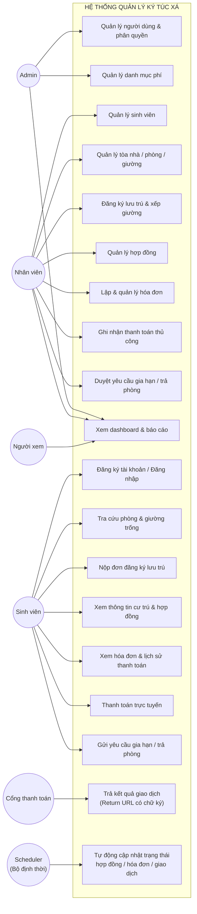

# 02 – ĐẶC TẢ YÊU CẦU PHẦN MỀM (SRS)

**Hệ thống:** DMS-KTX – Hệ thống web quản lý ký túc xá
**Phiên bản:** v1.0
**Tài liệu tham chiếu:** `01-TONG-QUAN-DU-AN.md`, `03-PHAN-TICH-NGHIEP-VU.md`

> ⚠️ **Chức năng giữ nguyên 100% ở bản v1-lite.** Chỉ một số *cách cài đặt* được đơn giản hóa (đánh dấu trực tiếp trong các ô dưới đây) — xem [`14-PHIEN-BAN-DON-GIAN-HOA.md`](14-PHIEN-BAN-DON-GIAN-HOA.md).

> Đây là tài liệu **hợp đồng yêu cầu** của dự án. Mỗi chức năng được cài đặt phải truy vết được về một mã `FR-xx` trong tài liệu này. Mỗi test case trong `11-KE-HOACH-KIEM-THU.md` cũng phải truy vết ngược về `FR-xx`.

---

## 1. Tác nhân (Actors)

| Mã | Tác nhân | Mô tả | Cách có tài khoản |
|----|----------|-------|-------------------|
| AC-1 | **Admin** (Quản trị viên) | Trưởng ban quản lý KTX. Toàn quyền trên hệ thống, bao gồm quản lý người dùng và cấu hình danh mục phí. | Tạo sẵn khi khởi tạo hệ thống (seed) |
| AC-2 | **Staff** (Nhân viên) | Nhân viên/kế toán KTX. Thực hiện nghiệp vụ hằng ngày: quản lý sinh viên, xếp phòng, hợp đồng, hóa đơn, duyệt yêu cầu. Không quản lý được người dùng hệ thống. | Admin tạo |
| AC-3 | **Student** (Sinh viên) | Sinh viên đang hoặc sắp lưu trú. Chỉ thao tác trên dữ liệu của chính mình. | Tự đăng ký, liên kết bằng MSSV |
| AC-4 | **Viewer** (Người xem) | Ban giám hiệu / Phòng CTSV. Chỉ đọc dữ liệu tổng hợp và danh sách, không sửa đổi bất cứ dữ liệu nào. | Admin tạo |
| AC-5 | **Payment Gateway** (Tác nhân hệ thống) | VNPay (sandbox). Trả kết quả giao dịch về hệ thống qua Return URL kèm chữ ký để backend xác thực. | Không áp dụng |
| AC-6 | **Scheduler** (Tác nhân hệ thống) | Bộ định thời của chính hệ thống. Tự kích hoạt các nghiệp vụ theo lịch mà không cần con người: chuyển hợp đồng hết hạn, đánh dấu hóa đơn quá hạn, hủy đơn treo, hết hạn giao dịch. Chi tiết 6 tác vụ tại `03-PHAN-TICH-NGHIEP-VU.md` mục 6. | Không áp dụng |

---

## 2. Sơ đồ Use Case tổng quát

*Lưu ý: Admin kế thừa toàn bộ quyền của Staff; Staff kế thừa quyền đọc của Viewer. Sơ đồ trên chỉ vẽ các use case đặc trưng để tránh rối.*

---

## 3. Yêu cầu chức năng (Functional Requirements)

**Ký hiệu ưu tiên:** M = Must (bắt buộc v1) · S = Should · C = Could

### 3.1. M6 – Xác thực & phân quyền

| Mã | Yêu cầu | Ưu tiên | Tác nhân |
|----|---------|---------|----------|
| FR-01 | Hệ thống cho phép người dùng đăng nhập bằng email (hoặc MSSV với sinh viên) và mật khẩu; trả về JWT access token kèm thông tin vai trò. | M | Tất cả |
| FR-02 | Hệ thống cho phép đăng xuất; token phía client bị xóa khỏi `localStorage` và người dùng được đưa về trang đăng nhập. | M | Tất cả |
| FR-03 | Hệ thống mã hóa mật khẩu bằng thuật toán băm một chiều có salt (bcrypt, cost ≥ 10); không bao giờ lưu hoặc trả về mật khẩu gốc. | M | – |
| FR-04 | Hệ thống kiểm tra quyền truy cập trên **từng** API theo ma trận RBAC (`07-PHAN-QUYEN-BAO-MAT.md`); từ chối với mã `403` nếu không đủ quyền. | M | – |
| FR-05 | Hệ thống giới hạn tần suất gọi `/auth/login` (tối đa 10 lần / 15 phút / IP) để chống dò mật khẩu. *(v1-lite dùng `express-rate-limit` thay cho cơ chế đếm và khóa theo tài khoản.)* | M | – |
| FR-06 | Admin có thể tạo, sửa, khóa/mở khóa tài khoản người dùng và gán vai trò (Admin/Staff/Student/Viewer). | M | Admin |
| FR-07 | Người dùng có thể đổi mật khẩu của chính mình sau khi xác nhận đúng mật khẩu hiện tại. | M | Tất cả |
| FR-08 | JWT có thời hạn **7 ngày**; hết hạn thì người dùng đăng nhập lại. *(v1-lite bỏ refresh token — xem `14` mục 4.11.)* | M | – |
| FR-09 | Admin/Nhân viên có thể **đặt lại mật khẩu** cho một tài khoản bị quên mật khẩu. Hệ thống sinh mật khẩu tạm ngẫu nhiên, hiển thị **một lần duy nhất** cho người thực hiện để trao trực tiếp cho chủ tài khoản, và bắt buộc người dùng đổi mật khẩu ở lần đăng nhập kế tiếp. *(Do gửi email/SMS tự động nằm ngoài phạm vi v1 — xem `01` mục 3.2 — đây là phương án thay thế bắt buộc phải có, nếu không người dùng quên mật khẩu sẽ bị khóa vĩnh viễn khỏi hệ thống.)* | M | Admin, Staff |

### 3.2. M1 – Quản lý sinh viên

| Mã | Yêu cầu | Ưu tiên | Tác nhân |
|----|---------|---------|----------|
| FR-10 | Nhân viên có thể **thêm mới** hồ sơ sinh viên gồm: MSSV, họ tên, ngày sinh, giới tính, CCCD, SĐT, email, lớp, khoa, khóa, quê quán, người liên hệ khẩn cấp (tên + SĐT). | M | Staff |
| FR-11 | Hệ thống bắt buộc MSSV là **duy nhất** trong toàn hệ thống; báo lỗi rõ ràng nếu trùng. | M | – |
| FR-12 | Nhân viên có thể **xem chi tiết** hồ sơ sinh viên, bao gồm thông tin cư trú hiện tại, hợp đồng và công nợ. | M | Staff |
| FR-13 | Nhân viên có thể **cập nhật** thông tin hồ sơ sinh viên. | M | Staff |
| FR-14 | Nhân viên có thể **vô hiệu hóa** (soft-delete) hồ sơ sinh viên. Hệ thống **không cho phép** vô hiệu hóa nếu sinh viên còn hợp đồng đang hiệu lực hoặc còn công nợ chưa thanh toán. | M | Staff |
| FR-15 | Hệ thống cung cấp danh sách sinh viên có **phân trang**, **tìm kiếm** theo từ khóa (họ tên, MSSV, SĐT, email) và **lọc** theo: trạng thái lưu trú (đang ở / chưa ở / đã rời), tòa nhà, phòng, giới tính, khoa. | M | Staff, Viewer |
| FR-16 | Hệ thống cho phép sắp xếp danh sách sinh viên theo họ tên, MSSV, ngày tạo. | S | Staff |
| ~~FR-17~~ | ~~Nhập hàng loạt sinh viên từ Excel/CSV~~ — **không làm ở v1-lite** (ưu tiên `C`); dữ liệu nhập tay hoặc qua script seed. | W | – |
| FR-18 | Hệ thống cho phép xuất (export) danh sách sinh viên đang lọc ra file **CSV** (mở được bằng Excel). | S | Staff, Viewer |

### 3.3. M2 – Quản lý tòa nhà, phòng & giường

| Mã | Yêu cầu | Ưu tiên | Tác nhân |
|----|---------|---------|----------|
| FR-20 | Nhân viên có thể thêm/sửa/xóa **tòa nhà** gồm: mã tòa, tên tòa, số tầng, giới tính áp dụng (Nam/Nữ/Hỗn hợp), mô tả, trạng thái hoạt động. | M | Staff |
| FR-21 | Nhân viên có thể thêm/sửa/xóa **phòng** thuộc một tòa nhà, gồm: mã phòng, số phòng, tầng, loại phòng, sức chứa (số giường), giá thuê/tháng, trạng thái. | M | Staff |
| FR-22 | Nhân viên có thể thêm/sửa/xóa **giường** thuộc một phòng, gồm: mã giường, ký hiệu giường (A1, A2…), trạng thái. Giường có **4 trạng thái**: *Trống · Giữ chỗ · Đã sử dụng · Bảo trì*. Trong đó *Giữ chỗ* do hệ thống tự đặt khi có đơn đăng ký chờ duyệt, nhân viên **không** chỉnh tay được (xem máy trạng thái tại `03` mục 2.1). | M | Staff |
| FR-23 | Hệ thống hỗ trợ **sinh nhanh giường** theo sức chứa của phòng (ví dụ phòng 8 người → tự tạo 8 giường ký hiệu A1…A8). | S | Staff |
| FR-24 | Hệ thống **không cho phép** số giường thực tế trong một phòng vượt quá sức chứa đã khai báo. | M | – |
| FR-25 | Hệ thống **không cho phép** xóa tòa nhà/phòng/giường đang được sử dụng (có hợp đồng hiệu lực liên quan); chỉ cho phép chuyển sang trạng thái ngừng hoạt động. | M | – |
| FR-26 | Hệ thống hiển thị **sơ đồ trực quan** theo tòa: mỗi phòng là một ô hiển thị `đã ở/sức chứa`, tô màu theo mức lấp đầy (trống / còn chỗ / đầy / bảo trì). | S | Staff, Viewer |
| FR-27 | Hệ thống cho phép chuyển trạng thái một giường sang **bảo trì** và ngược lại. Giường đang có người ở không được chuyển sang bảo trì cho tới khi người đó chuyển đi. | M | Staff |
| FR-28 | Hệ thống cung cấp API/màn hình tra cứu **giường còn trống**, lọc theo tòa nhà, loại phòng, giới tính, khoảng giá. | M | Staff, Student |
| FR-29 | Nhân viên có thể **chuyển phòng** cho sinh viên: chọn giường đích còn trống, hệ thống giải phóng giường cũ, cập nhật hợp đồng (bao gồm **cập nhật `monthly_price` theo giá phòng mới**, áp dụng từ kỳ kế tiếp) và ghi lại lịch sử chuyển phòng. | S | Staff |

### 3.4. M3 – Đăng ký lưu trú & hợp đồng

| Mã | Yêu cầu | Ưu tiên | Tác nhân |
|----|---------|---------|----------|
| FR-30 | Sinh viên có thể **nộp đơn đăng ký lưu trú** trực tuyến: chọn tòa nhà / loại phòng / giường mong muốn, chọn thời hạn (ngày bắt đầu – ngày kết thúc), ghi chú nguyện vọng. | M | Student |
| FR-31 | Nhân viên có thể **tạo hợp đồng trực tiếp** cho sinh viên (trường hợp sinh viên đăng ký tại quầy) bằng cách chọn sinh viên + giường cụ thể + thời hạn. | M | Staff |
| FR-32 | Hệ thống **không cho phép** xếp sinh viên vào giường đã có người đang ở hoặc giường đang bảo trì. | M | – |
| FR-33 | Hệ thống **không cho phép** một sinh viên có đồng thời 2 hợp đồng ở trạng thái *Chờ duyệt* hoặc *Đang hiệu lực*. | M | – |
| FR-34 | Hệ thống kiểm tra **giới tính** của sinh viên khớp với giới tính áp dụng của tòa nhà trước khi xếp giường. | M | – |
| FR-35 | Nhân viên có thể **duyệt** hoặc **từ chối** đơn đăng ký. Khi duyệt: hợp đồng chuyển sang *Đang hiệu lực*, giường chuyển sang *Đã sử dụng*, hệ thống tự sinh **hai hóa đơn riêng biệt**: một hóa đơn loại `DEPOSIT` (tiền cọc) và một hóa đơn loại `MONTHLY` (tiền phòng kỳ đầu). Khi từ chối: phải nhập lý do. | M | Staff |
| FR-36 | Hệ thống hiển thị danh sách hợp đồng có phân trang, lọc theo: trạng thái, tòa nhà, phòng, khoảng ngày bắt đầu/kết thúc, từ khóa sinh viên. | M | Staff, Viewer |
| FR-37 | Hệ thống tự động chuyển hợp đồng sang trạng thái *Hết hạn* khi quá ngày kết thúc mà không được gia hạn (job chạy hằng ngày), đồng thời giải phóng giường. | M | – |
| FR-38 | Hệ thống **cảnh báo hợp đồng sắp hết hạn** trong vòng N ngày (mặc định N = 30, cấu hình được), hiển thị trên dashboard và trong danh sách hợp đồng. | M | Staff, Admin |
| FR-39 | Nhân viên có thể **chấm dứt hợp đồng trước hạn** kèm lý do; hệ thống giải phóng giường và chốt công nợ tại thời điểm chấm dứt. | M | Staff |
| FR-40 | Hệ thống lưu **lịch sử lưu trú** của sinh viên (các hợp đồng cũ, phòng/giường đã ở, thời gian) và cho phép tra cứu. | S | Staff, Student |
| FR-41 | Hệ thống cho phép **in hợp đồng** theo mẫu (dùng chức năng in của trình duyệt, người dùng chọn "Lưu thành PDF"). *(v1-lite — `14` mục 4.8.)* | C | Staff |

### 3.5. M8 – Gia hạn & trả phòng

| Mã | Yêu cầu | Ưu tiên | Tác nhân |
|----|---------|---------|----------|
| FR-45 | Sinh viên có hợp đồng đang hiệu lực có thể gửi **yêu cầu gia hạn**, chọn ngày kết thúc mới và ghi lý do. | M | Student |
| FR-46 | Sinh viên có hợp đồng đang hiệu lực có thể gửi **yêu cầu trả phòng**, chọn ngày dự kiến trả và ghi lý do. | M | Student |
| FR-47 | Hệ thống **không cho phép** gửi yêu cầu mới khi sinh viên đang có một yêu cầu cùng loại ở trạng thái *Chờ xử lý*. | M | – |
| FR-48 | Nhân viên xem được danh sách yêu cầu, lọc theo loại (gia hạn/trả phòng) và trạng thái. | M | Staff |
| FR-49 | Nhân viên có thể **duyệt** hoặc **từ chối** yêu cầu (từ chối phải nhập lý do). | M | Staff |
| FR-50 | Khi duyệt **gia hạn**: hệ thống cập nhật ngày kết thúc hợp đồng và sinh hóa đơn tiền phòng cho kỳ gia hạn. | M | – |
| FR-51 | Khi duyệt **trả phòng**: hệ thống chuyển hợp đồng sang *Đã chấm dứt*, giường chuyển về *Trống*, chốt công nợ và xử lý hoàn/khấu trừ tiền cọc. | M | – |
| FR-52 | Hệ thống **cảnh báo** cho nhân viên khi duyệt trả phòng mà sinh viên còn hóa đơn chưa thanh toán; nhân viên vẫn có thể tiếp tục nhưng phải xác nhận. | M | Staff |
| FR-53 | Sinh viên xem được trạng thái và kết quả xử lý các yêu cầu đã gửi. | M | Student |

### 3.6. M4 – Phí & thanh toán

| Mã | Yêu cầu | Ưu tiên | Tác nhân |
|----|---------|---------|----------|
| FR-55 | Admin quản lý **danh mục loại phí**: tiền phòng, tiền điện, tiền nước, tiền cọc, phí gửi xe, phí khác — gồm mã, tên, đơn vị tính, đơn giá mặc định, cách tính (cố định / theo chỉ số / theo tháng). | M | Admin |
| FR-56 | Nhân viên có thể **nhập chỉ số điện/nước** theo phòng theo từng kỳ (chỉ số đầu kỳ, chỉ số cuối kỳ); hệ thống tự tính lượng tiêu thụ và thành tiền. | M | Staff |
| FR-57 | Hệ thống hỗ trợ **chia đều** tiền điện/nước của phòng cho số sinh viên đang ở thực tế trong phòng đó tại kỳ tính. | M | – |
| FR-58 | Nhân viên có thể **tạo hóa đơn** cho một sinh viên gồm nhiều dòng phí, có kỳ thanh toán (tháng/năm), hạn thanh toán, ghi chú. | M | Staff |
| FR-59 | Hệ thống hỗ trợ **tạo hóa đơn hàng loạt** cho tất cả sinh viên đang ở của một kỳ (tiền phòng + điện + nước). Nếu sinh viên **đã có** hóa đơn `MONTHLY` của kỳ đó (trường hợp mới duyệt hợp đồng giữa kỳ), hệ thống **không bỏ qua sinh viên đó** mà **bổ sung các dòng phí còn thiếu** (điện, nước) vào chính hóa đơn đã có và tính lại tổng tiền. | M | Staff |
| FR-60 | Hệ thống tự sinh **mã hóa đơn** duy nhất theo định dạng `INV-YYYYMM-XXXXX`. | M | – |
| FR-61 | Hệ thống tính `tổng tiền = tổng các dòng phí`, `đã trả = tổng thanh toán thành công`, `còn nợ = tổng tiền − đã trả` và cập nhật trạng thái hóa đơn (*Chưa thanh toán* / *Thanh toán một phần* / *Đã thanh toán* / *Quá hạn* / *Đã hủy*). | M | – |
| FR-62 | Hệ thống hỗ trợ **thanh toán một phần**; mỗi lần thanh toán được ghi thành một bản ghi riêng trong lịch sử. | M | – |
| FR-63 | Nhân viên có thể **ghi nhận thanh toán thủ công** (tiền mặt / chuyển khoản) kèm số tiền, ngày, phương thức, mã tham chiếu và người ghi nhận. | M | Staff |
| FR-64 | Sinh viên có thể **thanh toán trực tuyến** hóa đơn của mình qua **VNPay** (môi trường sandbox). *(v1-lite bỏ ZaloPay — một cổng là đủ để chứng minh năng lực tích hợp.)* | M | Student |
| FR-65 | Hệ thống tạo URL thanh toán, nhận kết quả trả về từ cổng qua **Return URL**, **xác thực chữ ký HMAC**, rồi mới cập nhật trạng thái giao dịch và hóa đơn. *(v1-lite — xem `14` mục 4.10.)* | M | – |
| FR-66 | Hệ thống xử lý **idempotent**: nhận cùng một kết quả giao dịch nhiều lần chỉ ghi nhận thanh toán một lần. | M | – |
| FR-67 | Hệ thống lưu đầy đủ **lịch sử giao dịch** (thành công, thất bại, đang xử lý) kèm dữ liệu phản hồi thô từ cổng để đối soát. | M | – |
| FR-68 | Hệ thống tự đánh dấu hóa đơn **Quá hạn** khi qua hạn thanh toán mà chưa trả đủ (job chạy hằng ngày). | M | – |
| FR-69 | Nhân viên có thể **hủy hóa đơn** lập sai, với điều kiện hóa đơn chưa phát sinh thanh toán nào. | M | Staff |
| FR-70 | Sinh viên xem được danh sách hóa đơn của mình, chi tiết từng dòng phí và lịch sử thanh toán. | M | Student |
| FR-71 | Hệ thống cho phép **in hóa đơn** (dùng chức năng in của trình duyệt). *(v1-lite — `14` mục 4.8.)* | C | Staff, Student |

### 3.7. M5 – Dashboard & báo cáo

| Mã | Yêu cầu | Ưu tiên | Tác nhân |
|----|---------|---------|----------|
| FR-75 | Dashboard hiển thị các chỉ số tổng quan: tổng số tòa nhà, phòng, giường; số giường đã sử dụng / trống / bảo trì; **tỷ lệ lấp đầy (%)**. | M | Admin, Staff, Viewer |
| FR-76 | Dashboard hiển thị số sinh viên đang lưu trú và số hợp đồng theo từng trạng thái. | M | Admin, Staff, Viewer |
| FR-77 | Dashboard hiển thị **tổng công nợ**, số hóa đơn quá hạn và danh sách top sinh viên nợ nhiều nhất. | M | Admin, Staff, Viewer |
| FR-78 | Dashboard hiển thị danh sách **hợp đồng sắp hết hạn** trong N ngày tới, có link thao tác nhanh. | M | Admin, Staff |
| FR-79 | Dashboard hiển thị **biểu đồ tỷ lệ lấp đầy theo tòa nhà** và **biểu đồ doanh thu theo tháng** (6–12 tháng gần nhất). | S | Admin, Staff, Viewer |
| FR-80 | Hệ thống cung cấp báo cáo **danh sách giường trống** theo tòa/phòng, xuất được **CSV**. | M | Staff, Viewer |
| FR-81 | Hệ thống cung cấp báo cáo **công nợ theo sinh viên/theo kỳ**, xuất được **CSV**. | S | Staff, Viewer |
| FR-82 | Hệ thống cung cấp báo cáo **doanh thu theo kỳ** (đã thu / chưa thu). | S | Admin, Viewer |

### 3.8. M7 – Cổng sinh viên

| Mã | Yêu cầu | Ưu tiên | Tác nhân |
|----|---------|---------|----------|
| FR-85 | Sinh viên có thể **tự đăng ký tài khoản** bằng MSSV + email + mật khẩu. Hệ thống đối chiếu MSSV với hồ sơ sinh viên do KTX quản lý để liên kết. | M | Student |
| FR-86 | Nếu MSSV chưa tồn tại trong hồ sơ, hệ thống vẫn cho tạo tài khoản ở trạng thái **chờ liên kết**, nhân viên sẽ xác nhận/liên kết sau. | S | Student, Staff |
| FR-87 | Sinh viên xem được **thông tin cư trú hiện tại**: tòa nhà, phòng, giường, ngày bắt đầu, ngày kết thúc, danh sách bạn cùng phòng (chỉ họ tên + MSSV). | M | Student |
| FR-88 | Sinh viên xem được **danh sách phòng/giường còn trống** để tham khảo trước khi đăng ký. | M | Student |
| FR-89 | **Ràng buộc bảo mật:** mọi API của cổng sinh viên chỉ trả về dữ liệu thuộc về chính người đang đăng nhập. Truy cập dữ liệu người khác (kể cả khi biết ID) phải bị từ chối với mã `403`. | M | – |
| FR-90 | Sinh viên **không** được phép sửa thông tin cá nhân (ngoài phạm vi v1); màn hình hồ sơ ở chế độ chỉ đọc. | M | – |
| FR-91 | Sinh viên xem được lịch sử lưu trú, hợp đồng cũ và toàn bộ lịch sử thanh toán của mình. | M | Student |

### 3.9. Yêu cầu hệ thống chung

| Mã | Yêu cầu | Ưu tiên |
|----|---------|---------|
| FR-95 | Mọi thao tác thay đổi dữ liệu quan trọng (tạo/sửa/xóa hợp đồng, hóa đơn, thanh toán, người dùng) được **ghi nhật ký ra file log của máy chủ** gồm: người thực hiện, hành động, đối tượng, thời điểm. *(v1-lite bỏ bảng `audit_log` — xem `14` mục 4.13.)* | S |
| FR-96 | Mọi danh sách đều hỗ trợ phân trang với tham số `page`, `limit` và trả về tổng số bản ghi. | M |
| FR-97 | Hệ thống có **một job nền** chạy hằng ngày lúc 00:05 làm 4 việc: cập nhật hợp đồng hết hạn, hủy đơn chờ duyệt quá hạn, đánh dấu hóa đơn quá hạn, hết hạn giao dịch treo. *(v1-lite gộp 6 job thành 1 — `14` mục 4.9.)* | M |
| FR-98 | Hệ thống hiển thị thông báo lỗi thân thiện bằng tiếng Việt cho người dùng cuối, đồng thời ghi log kỹ thuật chi tiết ở phía server. | M |

---

## 4. Yêu cầu phi chức năng (Non-Functional Requirements)

| Mã | Loại | Yêu cầu | Cách kiểm chứng |
|----|------|---------|-----------------|
| NFR-01 | Hiệu năng | API danh sách (có phân trang, ≤ 50 bản ghi/trang) phản hồi < 500 ms với bộ dữ liệu 1.000 sinh viên / 500 giường. | Đo bằng Postman/k6 |
| NFR-02 | Hiệu năng | API dashboard phản hồi < 2 giây. | Đo trực tiếp |
| NFR-03 | Hiệu năng | Frontend đạt thời gian tải lần đầu (First Contentful Paint) < 3 giây trên mạng 3G nhanh. | Lighthouse |
| NFR-04 | Khả năng mở rộng | Hệ thống đáp ứng tối thiểu 50 người dùng đồng thời không suy giảm rõ rệt. | Test tải cơ bản |
| NFR-05 | Bảo mật | Mật khẩu băng bcrypt cost ≥ 10. Không lưu mật khẩu dạng rõ ở bất kỳ đâu (kể cả log). | Code review |
| NFR-06 | Bảo mật | Toàn bộ API (trừ đăng nhập/đăng ký/IPN) yêu cầu JWT hợp lệ. | Test bảo mật |
| NFR-07 | Bảo mật | Chống SQL Injection bằng truy vấn tham số hóa/ORM; chống XSS bằng escape đầu ra; bật CORS whitelist. | Code review + `security-review` |
| NFR-08 | Bảo mật | Dữ liệu nhạy cảm (CCCD, SĐT) chỉ hiển thị cho Admin/Staff, không lộ qua API công khai. | Test phân quyền |
| NFR-09 | Khả dụng | Giao diện responsive, dùng tốt trên màn hình ≥ 360px (điện thoại) đến desktop. | Kiểm thử thủ công |
| NFR-10 | Khả dụng | Mọi form có validation phía client + phía server, thông báo lỗi rõ ràng ngay tại trường nhập liệu. | Kiểm thử thủ công |
| NFR-11 | Khả dụng | Thao tác nguy hiểm (xóa, chấm dứt hợp đồng, hủy hóa đơn) phải có hộp thoại xác nhận. | Kiểm thử thủ công |
| NFR-12 | Tương thích | Hoạt động đúng trên Chrome, Edge, Firefox phiên bản mới nhất và 1 phiên bản trước đó. | Kiểm thử chéo trình duyệt |
| NFR-13 | Bảo trì | Mã nguồn tuân thủ quy ước tại `10-QUY-TRINH-LAM-VIEC.md`; ESLint không báo lỗi khi build. | Tự chạy `npm run lint` trước mỗi PR |
| NFR-14 | Bảo trì | Backend phân tầng **Controller – Service**; Service gọi Prisma trực tiếp, Controller **không** được gọi Prisma. | Code review |
| NFR-15 | Toàn vẹn dữ liệu | Các thao tác đa bảng (duyệt hợp đồng, ghi nhận thanh toán) phải chạy trong **transaction**. | Code review + test |
| NFR-16 | Toàn vẹn dữ liệu | Dữ liệu quan trọng dùng **soft delete**; không xóa cứng hợp đồng, hóa đơn, thanh toán. | Code review |
| NFR-17 | Sao lưu | CSDL được sao lưu định kỳ (tối thiểu: script dump thủ công có tài liệu hướng dẫn). | Có script + tài liệu |
| NFR-18 | Nhật ký | Ghi log theo cấp độ (error/warn/info); mỗi request có `requestId` để truy vết. | Kiểm tra log |
| NFR-19 | Ngôn ngữ | Toàn bộ giao diện và thông báo bằng tiếng Việt. | Kiểm thử thủ công |
| NFR-20 | Tài liệu | API có **Postman collection** đồng bộ với `06-DAC-TA-API.md`, chia sẻ cho cả nhóm. | Rà soát |

---

## 5. Đặc tả use case chi tiết

> Dưới đây là 8 use case cốt lõi, phức tạp nhất về nghiệp vụ. Các use case CRUD đơn giản (thêm/sửa/xóa sinh viên, tòa nhà…) theo mẫu chuẩn, không đặc tả riêng.

### UC-01: Đăng nhập hệ thống

| Mục | Nội dung |
|-----|----------|
| **Mã** | UC-01 |
| **Tên** | Đăng nhập hệ thống |
| **Tác nhân** | Admin, Staff, Student, Viewer |
| **Yêu cầu liên quan** | FR-01, FR-03, FR-05 |
| **Điều kiện trước** | Người dùng đã có tài khoản ở trạng thái hoạt động |
| **Điều kiện sau** | Người dùng được cấp JWT và chuyển đến trang chủ tương ứng với vai trò |

**Luồng chính:**
1. Người dùng mở trang đăng nhập.
2. Người dùng nhập email/MSSV và mật khẩu, bấm "Đăng nhập".
3. Hệ thống kiểm tra định dạng dữ liệu đầu vào.
4. Hệ thống tìm tài khoản theo email/MSSV.
5. Hệ thống so khớp mật khẩu với chuỗi băm đã lưu.
6. Hệ thống kiểm tra tài khoản không bị khóa.
7. Hệ thống sinh JWT chứa `userId`, `role`, thời hạn; trả về kèm thông tin người dùng.
8. Frontend lưu token, điều hướng: Admin/Staff/Viewer → `/admin/dashboard`; Student → `/portal/home`.

**Luồng ngoại lệ:**
- **E1 – Sai thông tin đăng nhập (bước 4, 5):** Hệ thống trả `401` với thông báo chung "Email hoặc mật khẩu không đúng" (không tiết lộ trường nào sai); tăng bộ đếm đăng nhập sai.
- **E2 – Tài khoản bị khóa (bước 6):** Hệ thống trả `403` "Tài khoản đã bị khóa, vui lòng liên hệ quản trị viên".
- **E3 – Vượt quá 5 lần sai:** Hệ thống khóa đăng nhập 15 phút, trả `429` kèm thời gian còn lại.

---

### UC-02: Sinh viên nộp đơn đăng ký lưu trú

| Mục | Nội dung |
|-----|----------|
| **Mã** | UC-02 |
| **Tác nhân chính** | Sinh viên |
| **Yêu cầu liên quan** | FR-30, FR-32, FR-33, FR-34, FR-88 |
| **Điều kiện trước** | Sinh viên đã đăng nhập; hồ sơ sinh viên đã được liên kết; không có hợp đồng nào đang *Chờ duyệt* hoặc *Đang hiệu lực* |
| **Điều kiện sau** | Một hợp đồng ở trạng thái *Chờ duyệt* được tạo; giường mục tiêu được **giữ chỗ** |

**Luồng chính:**
1. Sinh viên vào mục "Đăng ký chỗ ở".
2. Hệ thống hiển thị danh sách tòa nhà phù hợp với giới tính của sinh viên.
3. Sinh viên chọn tòa nhà → hệ thống hiển thị các phòng còn giường trống kèm giá thuê.
4. Sinh viên chọn phòng → hệ thống hiển thị danh sách giường trống trong phòng.
5. Sinh viên chọn giường, nhập ngày bắt đầu, ngày kết thúc, ghi chú.
6. Hệ thống kiểm tra: giường vẫn trống (BR-05), giới tính khớp (BR-06), sinh viên chưa có hợp đồng đang mở (BR-04), thời hạn hợp lệ (BR-07).
7. Hệ thống tạo hợp đồng trạng thái *Chờ duyệt*, đặt giường sang trạng thái **Giữ chỗ**.
8. Hệ thống hiển thị thông báo thành công và mã hợp đồng.

**Luồng ngoại lệ:**
- **E1 – Giường vừa bị người khác chọn (bước 6):** Trả `409 Conflict` "Giường này vừa được đăng ký, vui lòng chọn giường khác"; làm mới danh sách giường.
- **E2 – Đã có hợp đồng đang mở:** Trả `422` kèm thông tin hợp đồng hiện tại.
- **E3 – Giới tính không phù hợp với tòa nhà:** Trả `422` "Tòa nhà này chỉ dành cho sinh viên [Nam/Nữ]".
- **E4 – Ngày bắt đầu ở quá khứ hoặc thời hạn < 1 tháng:** Trả `422` với thông báo tương ứng. *(Lưu ý: sinh viên tự nộp đơn **không** được chọn ngày bắt đầu trong quá khứ. Riêng nhân viên tạo hợp đồng trực tiếp tại quầy được phép lùi tối đa 30 ngày để nhập bù hồ sơ cũ — xem BR-22.)*

---

### UC-03: Nhân viên duyệt đơn đăng ký lưu trú

| Mục | Nội dung |
|-----|----------|
| **Mã** | UC-03 |
| **Tác nhân chính** | Nhân viên |
| **Yêu cầu liên quan** | FR-35, FR-32, FR-58 |
| **Điều kiện trước** | Tồn tại hợp đồng ở trạng thái *Chờ duyệt* |
| **Điều kiện sau** | Hợp đồng *Đang hiệu lực*, giường *Đã sử dụng*, hóa đơn kỳ đầu được tạo |

**Luồng chính:**
1. Nhân viên mở danh sách "Đơn đăng ký chờ duyệt".
2. Nhân viên mở chi tiết một đơn, xem thông tin sinh viên và chỗ ở đề nghị.
3. Nhân viên bấm "Duyệt".
4. Hệ thống mở **transaction**:
   a. Kiểm tra lại giường vẫn ở trạng thái *Giữ chỗ* bởi chính hợp đồng này.
   b. Cập nhật hợp đồng → *Đang hiệu lực*, ghi người duyệt và thời điểm duyệt.
   c. Cập nhật giường → *Đã sử dụng*.
   d. Sinh hóa đơn kỳ đầu gồm dòng **tiền cọc** và **tiền phòng** tháng đầu, hạn thanh toán = ngày bắt đầu + 7 ngày.
   e. Ghi audit log.
5. Hệ thống commit transaction và hiển thị thông báo thành công kèm mã hóa đơn vừa tạo.

**Luồng thay thế:**
- **A1 – Từ chối đơn (bước 3):** Nhân viên bấm "Từ chối", bắt buộc nhập lý do → hợp đồng chuyển *Bị từ chối*, giường trở về *Trống*, ghi lý do để sinh viên xem được.

**Luồng ngoại lệ:**
- **E1 – Giường không còn hợp lệ (bước 4a):** Rollback toàn bộ, trả `409`, gợi ý nhân viên chọn giường thay thế.
- **E2 – Lỗi khi sinh hóa đơn (bước 4d):** Rollback toàn bộ giao dịch; không được phép để hợp đồng hiệu lực mà thiếu hóa đơn.

---

### UC-04: Lập hóa đơn kỳ (tiền phòng + điện + nước)

| Mục | Nội dung |
|-----|----------|
| **Mã** | UC-04 |
| **Tác nhân chính** | Nhân viên |
| **Yêu cầu liên quan** | FR-56, FR-57, FR-58, FR-59, FR-60, FR-61 |
| **Điều kiện trước** | Đã nhập chỉ số điện/nước của kỳ cho các phòng liên quan |
| **Điều kiện sau** | Hóa đơn được tạo cho từng sinh viên đang lưu trú, trạng thái *Chưa thanh toán* |

**Luồng chính:**
1. Nhân viên chọn "Lập hóa đơn kỳ", chọn tháng/năm và phạm vi (toàn bộ / theo tòa nhà).
2. Hệ thống liệt kê các phòng có hợp đồng hiệu lực trong kỳ và trạng thái nhập chỉ số điện nước của từng phòng.
3. Nhân viên xác nhận.
4. Với mỗi phòng, hệ thống:
   a. Đếm số sinh viên đang lưu trú thực tế trong kỳ → `n`.
   b. Tính tiền điện phòng = (chỉ số cuối − chỉ số đầu) × đơn giá điện; tương tự tiền nước.
   c. Chia đều tiền điện/nước cho `n` sinh viên (phần dư đồng xu dồn vào sinh viên đầu tiên theo thứ tự MSSV).
   d. Với mỗi sinh viên, tạo hóa đơn gồm các dòng: tiền phòng (giá phòng / số giường thực ở hoặc theo đơn giá/người tùy cấu hình), tiền điện, tiền nước.
5. Hệ thống hiển thị bảng kết quả: số hóa đơn đã tạo, tổng tiền, danh sách phòng bị bỏ qua kèm lý do.

**Luồng ngoại lệ:**
- **E1 – Phòng chưa nhập chỉ số điện/nước:** Bỏ qua phòng đó, ghi vào danh sách cảnh báo, không chặn các phòng còn lại.
- **E2 – Hóa đơn của kỳ đã tồn tại cho sinh viên:** Bỏ qua, ghi cảnh báo "đã lập trước đó" (đảm bảo không tạo trùng).
- **E3 – Chỉ số cuối kỳ nhỏ hơn chỉ số đầu kỳ:** Chặn ngay khi nhập liệu (BR-20).

---

### UC-05: Sinh viên thanh toán hóa đơn trực tuyến

| Mục | Nội dung |
|-----|----------|
| **Mã** | UC-05 |
| **Tác nhân chính** | Sinh viên |
| **Tác nhân phụ** | Cổng thanh toán (VNPay/ZaloPay) |
| **Yêu cầu liên quan** | FR-64, FR-65, FR-66, FR-67, FR-62 |
| **Điều kiện trước** | Sinh viên có hóa đơn còn nợ |
| **Điều kiện sau** | Giao dịch được ghi nhận; hóa đơn cập nhật số tiền đã trả và trạng thái |

**Luồng chính:**
1. Sinh viên mở chi tiết hóa đơn, bấm "Thanh toán trực tuyến".
2. Sinh viên chọn cổng (VNPay/ZaloPay) và số tiền thanh toán (mặc định = số còn nợ; cho phép nhập nhỏ hơn nếu trả một phần).
3. Hệ thống tạo bản ghi giao dịch trạng thái *Đang xử lý* với mã tham chiếu duy nhất, ký dữ liệu và trả về URL thanh toán.
4. Frontend chuyển hướng sinh viên sang trang của cổng thanh toán.
5. Sinh viên hoàn tất thanh toán trên cổng.
6. Cổng gọi **IPN** về backend kèm kết quả và chữ ký.
7. Hệ thống xác thực chữ ký, đối chiếu mã tham chiếu và số tiền.
8. Nếu hợp lệ và thành công: trong transaction — cập nhật giao dịch → *Thành công*, tạo bản ghi thanh toán, tính lại `đã trả`/`còn nợ` và trạng thái hóa đơn.
9. Cổng chuyển hướng sinh viên về **Return URL**; frontend hiển thị kết quả dựa trên trạng thái giao dịch tra cứu từ backend.

**Luồng ngoại lệ:**
- **E1 – Chữ ký không hợp lệ (bước 7):** Ghi log cảnh báo bảo mật, **không** cập nhật hóa đơn, trả mã lỗi cho cổng.
- **E2 – Sinh viên hủy giao dịch:** Giao dịch chuyển *Thất bại*, hóa đơn giữ nguyên.
- **E3 – IPN đến nhiều lần cho cùng giao dịch (FR-66):** Kiểm tra trạng thái giao dịch, nếu đã *Thành công* thì trả về "đã ghi nhận" mà không tạo thêm bản ghi thanh toán.
- **E4 – Không nhận được IPN:** Hệ thống cung cấp chức năng "Kiểm tra lại trạng thái giao dịch" để nhân viên đối soát thủ công.
- **E5 – Số tiền cổng trả về khác số tiền yêu cầu:** Ghi log, đánh dấu giao dịch cần đối soát thủ công, không tự động cập nhật.

---

### UC-06: Sinh viên gửi yêu cầu trả phòng và nhân viên duyệt

| Mục | Nội dung |
|-----|----------|
| **Mã** | UC-06 |
| **Tác nhân chính** | Sinh viên, Nhân viên |
| **Yêu cầu liên quan** | FR-46, FR-47, FR-49, FR-51, FR-52 |
| **Điều kiện trước** | Sinh viên có hợp đồng *Đang hiệu lực*, không có yêu cầu trả phòng nào đang *Chờ xử lý* |
| **Điều kiện sau** | Hợp đồng *Đã chấm dứt*, giường *Trống*, công nợ được chốt, tiền cọc được xử lý |

**Luồng chính:**
1. Sinh viên vào "Yêu cầu của tôi" → "Tạo yêu cầu trả phòng".
2. Sinh viên nhập ngày dự kiến trả phòng và lý do, gửi yêu cầu.
3. Hệ thống tạo yêu cầu trạng thái *Chờ xử lý*.
4. Nhân viên mở danh sách yêu cầu, xem chi tiết kèm **tình trạng công nợ** của sinh viên.
5. Nhân viên bấm "Duyệt".
6. Nếu sinh viên còn nợ, hệ thống hiển thị cảnh báo yêu cầu xác nhận (FR-52).
7. Hệ thống mở transaction: cập nhật yêu cầu → *Đã duyệt*; hợp đồng → *Đã chấm dứt* với ngày kết thúc thực tế; giường → *Trống*; tính tiền phòng phần lẻ của kỳ cuối (nếu có); xử lý tiền cọc — hoàn lại phần còn dư hoặc khấu trừ vào công nợ; ghi audit log.
8. Hệ thống hiển thị **biên bản thanh lý** tóm tắt: tổng phải trả, đã trả, cọc, số tiền hoàn/còn nợ.

**Luồng thay thế:**
- **A1 – Từ chối yêu cầu:** Nhân viên nhập lý do → yêu cầu *Bị từ chối*, hợp đồng giữ nguyên, sinh viên xem được lý do.

---

### UC-07: Nhân viên chuyển phòng cho sinh viên

| Mục | Nội dung |
|-----|----------|
| **Mã** | UC-07 |
| **Tác nhân chính** | Nhân viên |
| **Yêu cầu liên quan** | FR-29, FR-32, FR-34 |
| **Điều kiện trước** | Sinh viên có hợp đồng *Đang hiệu lực*; tồn tại giường đích còn trống và phù hợp giới tính |
| **Điều kiện sau** | Hợp đồng trỏ tới giường mới; giường cũ *Trống*; giường mới *Đã sử dụng*; lịch sử chuyển phòng được ghi nhận |

**Luồng chính:**
1. Nhân viên mở chi tiết hợp đồng, bấm "Chuyển phòng".
2. Hệ thống hiển thị bộ lọc giường trống (tòa nhà, loại phòng, khoảng giá).
3. Nhân viên chọn giường đích, nhập ngày chuyển và lý do.
4. Hệ thống kiểm tra giường đích trống, đúng giới tính, không trùng với giường hiện tại.
5. Hệ thống mở transaction: giải phóng giường cũ; gán giường mới; cập nhật hợp đồng; ghi bản ghi lịch sử chuyển phòng; ghi audit log.
6. Hệ thống thông báo thành công.

**Luồng ngoại lệ:**
- **E1 – Chênh lệch giá phòng:** Hệ thống cảnh báo mức chênh lệch và áp dụng giá mới kể từ kỳ tiếp theo; các hóa đơn đã lập không bị thay đổi.
- **E2 – Giường đích vừa bị chiếm:** Trả `409`, làm mới danh sách.

---

### UC-08: Xem dashboard tổng quan

| Mục | Nội dung |
|-----|----------|
| **Mã** | UC-08 |
| **Tác nhân chính** | Admin, Nhân viên, Người xem |
| **Yêu cầu liên quan** | FR-75 → FR-79 |
| **Điều kiện trước** | Người dùng đã đăng nhập với vai trò được phép |
| **Điều kiện sau** | Không thay đổi dữ liệu |

**Luồng chính:**
1. Người dùng truy cập trang Dashboard.
2. Hệ thống gọi API tổng hợp và hiển thị:
   - Thẻ chỉ số: tổng giường, đã sử dụng, trống, bảo trì, tỷ lệ lấp đầy.
   - Thẻ chỉ số: sinh viên đang ở, hợp đồng hiệu lực, hợp đồng chờ duyệt.
   - Thẻ chỉ số: tổng công nợ, số hóa đơn quá hạn.
   - Biểu đồ cột: tỷ lệ lấp đầy theo tòa nhà.
   - Biểu đồ đường: doanh thu 12 tháng gần nhất.
   - Bảng: hợp đồng sắp hết hạn trong 30 ngày.
   - Bảng: yêu cầu đang chờ xử lý.
3. Người dùng có thể lọc theo tòa nhà hoặc khoảng thời gian; hệ thống tải lại số liệu.

**Luồng ngoại lệ:**
- **E1 – Người dùng là Viewer:** Các nút thao tác nhanh (duyệt, lập hóa đơn) bị ẩn; chỉ hiển thị số liệu.

---

## 6. Ma trận truy vết yêu cầu (Requirements Traceability Matrix)

| Nhóm | Yêu cầu | Use case | Màn hình (xem `08`) | API (xem `06`) |
|------|---------|----------|----------------------|-----------------|
| M6 Xác thực | FR-01 → FR-09 | UC-01 | SCR-01 → SCR-05, SCR-81 | `/auth/*`, `/users/*` |
| M1 Sinh viên | FR-10 → FR-18 | – | SCR-11, SCR-12, SCR-13 | `/students/*` |
| M2 Cơ sở vật chất | FR-20 → FR-29 | UC-07 | SCR-21 → SCR-25 | `/buildings/*`, `/rooms/*`, `/beds/*` |
| M3 Hợp đồng | FR-30 → FR-41 | UC-02, UC-03 | SCR-31 → SCR-35 | `/contracts/*` |
| M8 Yêu cầu | FR-45 → FR-53 | UC-06 | SCR-41, SCR-42, SCR-69, SCR-70 | `/requests/*`, `/portal/my-requests` |
| M4 Tài chính | FR-55 → FR-71 | UC-04, UC-05 | SCR-51 → SCR-57, SCR-82, SCR-66 → SCR-68 | `/fee-types/*`, `/invoices/*`, `/payments/*`, `/utility-readings/*` |
| M5 Báo cáo | FR-75 → FR-82 | UC-08 | SCR-10, SCR-57 | `/dashboard/*`, `/reports/*` |
| M7 Cổng SV | FR-85 → FR-91 | UC-02, UC-05, UC-06 | SCR-61 → SCR-72 | `/portal/*` |

---

## 7. Lịch sử phiên bản

| Phiên bản | Ngày | Người thực hiện | Nội dung thay đổi |
|-----------|------|------------------|-------------------|
| v1.0 | 11/09/2026 | Cả nhóm | Khởi tạo SRS, chốt 84 yêu cầu chức năng và 20 yêu cầu phi chức năng |
| v1.2 | 12/09/2026 | BA | **Áp dụng v1-lite:** giữ nguyên toàn bộ chức năng; điều chỉnh cách cài đặt của FR-02, FR-05, FR-08, FR-64, FR-65, FR-66, FR-95, FR-97; chuyển FR-17 (import Excel) sang `W`; xuất CSV thay Excel, in bằng trình duyệt thay PDF. Xem `14` |
| v1.1 | 12/09/2026 | BA | Rà soát chéo: thêm tác nhân AC-6 Scheduler và use case U19; thêm FR-09 (đặt lại mật khẩu); làm rõ FR-22 (4 trạng thái giường), FR-29 (cập nhật giá khi chuyển phòng), FR-35 (tách 2 hóa đơn), FR-59 (bổ sung dòng phí thay vì bỏ qua); sửa ma trận truy vết màn hình; làm rõ UC-02 E4. Tổng: **85 FR** |
