# 03 – PHÂN TÍCH NGHIỆP VỤ

**Hệ thống:** DMS-KTX
**Phiên bản:** v1.0
**Mục đích:** Mô tả các quy tắc nghiệp vụ, máy trạng thái và luồng quy trình. Đây là tài liệu **backend phải đọc kỹ nhất** — mọi quy tắc `BR-xx` dưới đây phải được cài đặt ở tầng Service hoặc ràng buộc CSDL.

---

## 1. Mô hình nghiệp vụ tổng thể

### 1.1. Các thực thể nghiệp vụ chính

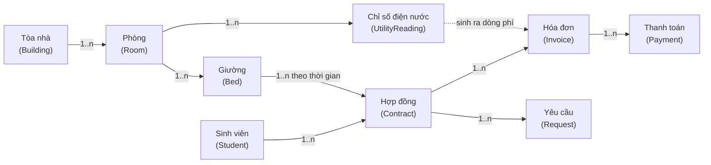

### 1.2. Vòng đời một sinh viên trong hệ thống

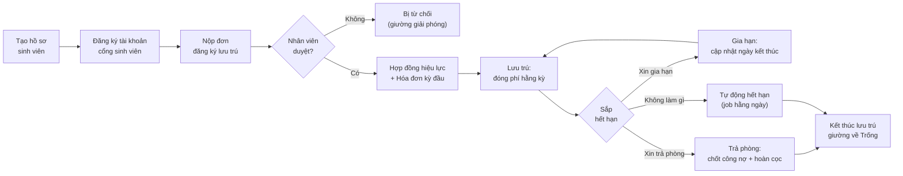

---

## 2. Máy trạng thái (State Machines)

### 2.1. Trạng thái giường (Bed Status)

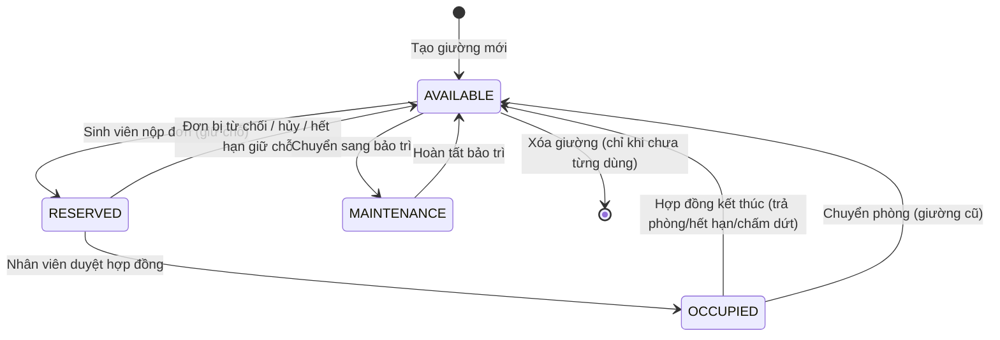

| Trạng thái | Mã | Ý nghĩa | Có thể xếp người? |
|-----------|-----|---------|-------------------|
| Trống | `AVAILABLE` | Sẵn sàng cho thuê | ✅ |
| Giữ chỗ | `RESERVED` | Có đơn đăng ký đang chờ duyệt | ❌ |
| Đã sử dụng | `OCCUPIED` | Đang có sinh viên ở theo hợp đồng hiệu lực | ❌ |
| Bảo trì | `MAINTENANCE` | Hỏng hóc/đang sửa chữa | ❌ |

> **Lưu ý cài đặt:** trạng thái giường là **dữ liệu suy diễn** từ hợp đồng. Để tránh lệch dữ liệu, hệ thống lưu trạng thái ở cột `status` (cho hiệu năng truy vấn) nhưng mọi thay đổi phải đi qua service `BedService.changeStatus()` trong cùng transaction với thay đổi hợp đồng. Định kỳ có job đối soát lại trạng thái giường với hợp đồng thực tế.

### 2.2. Trạng thái hợp đồng (Contract Status)

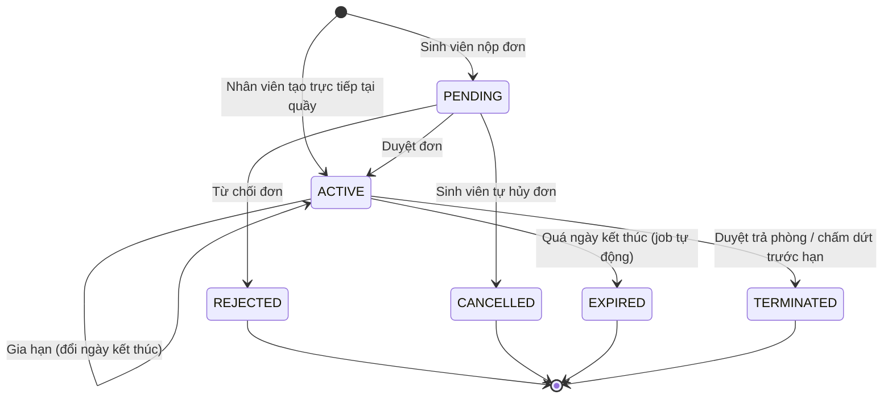

| Trạng thái | Mã | Ý nghĩa | Giường tương ứng |
|-----------|-----|---------|------------------|
| Chờ duyệt | `PENDING` | Đơn đã nộp, chưa xử lý | `RESERVED` |
| Đang hiệu lực | `ACTIVE` | Sinh viên đang lưu trú hợp lệ | `OCCUPIED` |
| Bị từ chối | `REJECTED` | Nhân viên không chấp thuận | `AVAILABLE` |
| Đã hủy | `CANCELLED` | Sinh viên rút đơn trước khi duyệt | `AVAILABLE` |
| Hết hạn | `EXPIRED` | Quá ngày kết thúc, không gia hạn | `AVAILABLE` |
| Đã chấm dứt | `TERMINATED` | Trả phòng sớm hoặc bị chấm dứt | `AVAILABLE` |

### 2.3. Trạng thái hóa đơn (Invoice Status)

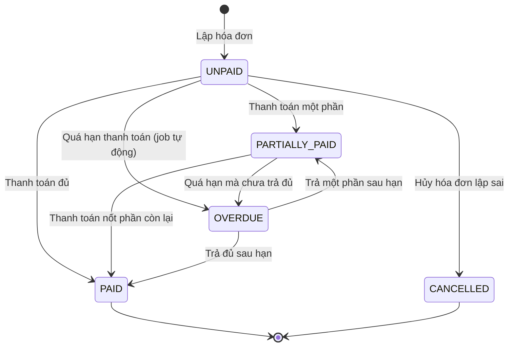

| Trạng thái | Mã | Điều kiện |
|-----------|-----|-----------|
| Chưa thanh toán | `UNPAID` | `paid_amount = 0` và chưa quá hạn |
| Thanh toán một phần | `PARTIALLY_PAID` | `0 < paid_amount < total_amount` |
| Đã thanh toán | `PAID` | `paid_amount >= total_amount` |
| Quá hạn | `OVERDUE` | `hôm nay > due_date` và `paid_amount < total_amount` |
| Đã hủy | `CANCELLED` | Do nhân viên hủy, chỉ khi chưa có thanh toán nào |

### 2.4. Trạng thái giao dịch thanh toán (Payment Status)

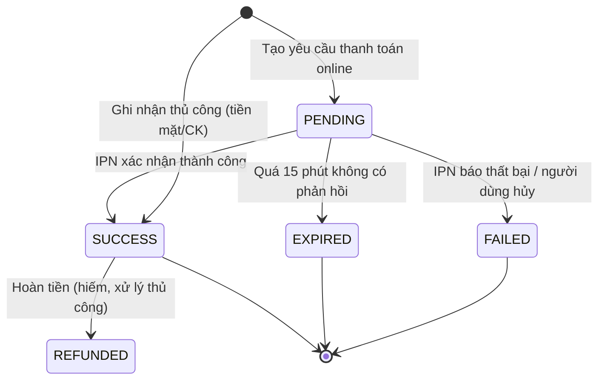

### 2.5. Trạng thái yêu cầu (Request Status)

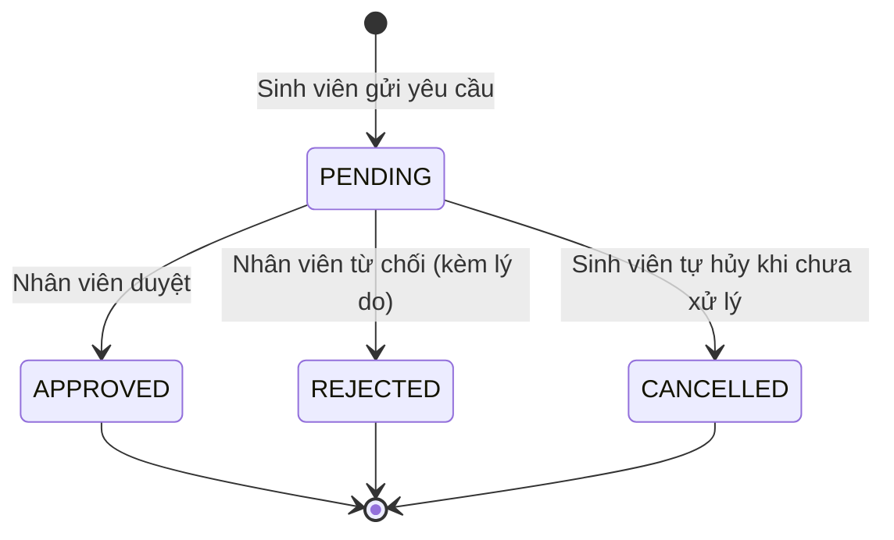

---

## 3. Quy tắc nghiệp vụ (Business Rules)

> Mỗi quy tắc ghi rõ **nơi cài đặt**: `DB` (ràng buộc cơ sở dữ liệu), `SV` (tầng service backend), `FE` (kiểm tra phía giao diện — chỉ để trải nghiệm tốt, **không** thay thế kiểm tra server).

### 3.1. Nhóm cơ sở vật chất

| Mã | Quy tắc | Nơi cài đặt |
|----|---------|-------------|
| BR-01 | Mã tòa nhà (`code`) là duy nhất trong hệ thống. | DB (unique) + SV |
| BR-02 | Số phòng (`room_number`) là duy nhất trong phạm vi một tòa nhà. | DB (unique composite) + SV |
| BR-03 | Ký hiệu giường (`bed_label`) là duy nhất trong phạm vi một phòng. | DB (unique composite) + SV |
| BR-04 | Số lượng giường thực tế của một phòng **không được vượt quá** `capacity` khai báo của phòng. | SV |
| BR-05 | Không thể xếp sinh viên vào giường có trạng thái khác `AVAILABLE`. | SV (`UPDATE ... WHERE status='AVAILABLE'`, xem `14` mục 4.6) |
| BR-06 | Giới tính sinh viên phải khớp với giới tính của **phòng** (`room.gender`). Giới tính phòng được suy ra từ `building.gender_policy` khi tòa là `MALE`/`FEMALE`, và do quản trị viên gán tay khi tòa là `MIXED` (xem BR-17). ⚠️ **Không** kiểm tra ở mức tòa nhà là đủ: tòa `MIXED` mà chỉ kiểm tra ở mức tòa sẽ cho phép nam và nữ ở chung phòng. | SV |
| BR-07 | Không được xóa cứng tòa nhà/phòng/giường nếu tồn tại hợp đồng (bất kỳ trạng thái nào) tham chiếu đến. Chỉ được chuyển `is_active = false`. | SV |
| BR-08 | Giường ở trạng thái `OCCUPIED` không thể chuyển trực tiếp sang `MAINTENANCE`; phải chuyển người ở đi trước. | SV |
| BR-09 | Khi giảm `capacity` của phòng xuống dưới số giường hiện có, hệ thống từ chối thao tác. | SV |
| BR-10 | `price_per_month` của phòng phải > 0. | DB (check) + SV + FE |

### 3.2. Nhóm sinh viên

| Mã | Quy tắc | Nơi cài đặt |
|----|---------|-------------|
| BR-11 | MSSV (`student_code`) là duy nhất trong toàn hệ thống, không phân biệt hoa thường. | DB (unique) + SV |
| BR-12 | Email và số CCCD, nếu có nhập, phải duy nhất. | DB (unique nullable) + SV |
| BR-13 | Không được vô hiệu hóa sinh viên đang có hợp đồng `PENDING` hoặc `ACTIVE`. | SV |
| BR-14 | Không được vô hiệu hóa sinh viên còn công nợ (`tổng còn nợ > 0`). | SV |
| BR-15 | Ngày sinh phải hợp lệ và sinh viên phải ≥ 16 tuổi tại thời điểm tạo hồ sơ. | SV + FE |
| BR-16 | Số điện thoại theo định dạng Việt Nam: 10 chữ số, bắt đầu bằng `0`. | SV + FE |
| BR-17 | Mỗi **phòng** có thuộc tính giới tính riêng (`room.gender`). Với tòa nhà `MALE`/`FEMALE`, giới tính phòng bắt buộc trùng giới tính tòa. Với tòa `MIXED`, quản trị viên **phải** gán giới tính cho từng phòng — hệ thống không cho phép xếp nam và nữ vào cùng một phòng. | DB (check) + SV |
| BR-18 | Khi đặt lại mật khẩu (FR-09), hệ thống sinh mật khẩu tạm ngẫu nhiên ≥ 10 ký tự, đặt cờ `must_change_password = true`; người dùng bị buộc đổi mật khẩu ngay sau khi đăng nhập, chưa đổi thì không gọi được API nghiệp vụ nào khác. | SV + FE |

### 3.3. Nhóm hợp đồng lưu trú

| Mã | Quy tắc | Nơi cài đặt |
|----|---------|-------------|
| BR-20 | **Mỗi giường tại một thời điểm chỉ có tối đa 1 hợp đồng ở trạng thái `PENDING` hoặc `ACTIVE`.** Đây là quy tắc quan trọng nhất của hệ thống. | SV — dùng **`UPDATE bed SET status=... WHERE id=? AND status='AVAILABLE'`** rồi kiểm tra số dòng bị ảnh hưởng, trong transaction. Xem mã nguồn mẫu tại `14` mục 4.6 |
| BR-21 | **Mỗi sinh viên tại một thời điểm chỉ có tối đa 1 hợp đồng ở trạng thái `PENDING` hoặc `ACTIVE`.** | SV — `findFirst` kiểm tra trong cùng transaction trước khi tạo |
| BR-22 | `start_date` phụ thuộc người tạo: **sinh viên tự nộp đơn** → không được ở quá khứ (phải ≥ hôm nay); **nhân viên tạo trực tiếp** → được lùi tối đa 30 ngày so với ngày tạo, để nhập bù hồ sơ cũ. | SV |
| BR-23 | `end_date` phải lớn hơn `start_date` tối thiểu 30 ngày (thời hạn tối thiểu 1 tháng). | DB (check) + SV + FE |
| BR-24 | Thời hạn hợp đồng tối đa 12 tháng cho một lần đăng ký; muốn ở lâu hơn phải gia hạn. | SV + FE |
| BR-25 | Khi duyệt hợp đồng, hệ thống **bắt buộc** sinh **hai hóa đơn riêng biệt** trong **cùng một transaction**: (1) hóa đơn `DEPOSIT` chứa tiền cọc, (2) hóa đơn `MONTHLY` chứa tiền phòng tháng đầu với `period_month/period_year` = tháng của `start_date`. ⚠️ **Không gộp chung một hóa đơn** — nếu gộp, hóa đơn đó sẽ chiếm chỗ khóa duy nhất `(student_id, MONTHLY, kỳ)` của BR-48, khiến đợt lập hóa đơn hàng loạt cuối kỳ bỏ qua sinh viên này và **không bao giờ thu được tiền điện nước của kỳ đó**. | SV |
| BR-26 | Hạn thanh toán của cả hai hóa đơn kỳ đầu = `start_date + 7 ngày`. | SV |
| BR-27 | Hợp đồng `PENDING` quá 7 ngày **kể từ ngày nộp đơn** mà không được xử lý sẽ tự động chuyển `CANCELLED` và giải phóng giường (job hằng ngày). ⚠️ Mốc tính là `created_at`, **không** phải `start_date` — sinh viên đăng ký sớm trước kỳ vẫn bị hủy nếu nhân viên không duyệt trong 7 ngày. Nhân viên phải duyệt đơn trong tuần; nếu mùa cao điểm xử lý chậm hơn, tăng `CONTRACT_PENDING_EXPIRE_DAYS` trong `config/settings.js`. | SV (job) |
| BR-28 | Hợp đồng có `end_date < hôm nay` và trạng thái `ACTIVE` sẽ tự chuyển `EXPIRED`, giường về `AVAILABLE` (job hằng ngày). | SV (job) |
| BR-29 | Hợp đồng được coi là "sắp hết hạn" khi `0 <= (end_date − hôm nay) <= N` với `N` mặc định 30 ngày, khai báo trong `config/settings.js`. | SV |
| BR-30 | Chỉ hợp đồng `ACTIVE` mới được gia hạn, chuyển phòng hoặc chấm dứt. | SV |
| BR-31 | Mã hợp đồng sinh tự động theo định dạng `HD-YYYY-XXXXX` (XXXXX là số thứ tự tăng dần trong năm). | SV |
| BR-32 | Khi chấm dứt hợp đồng trước hạn, tiền phòng của kỳ đang dở được tính theo **số ngày ở thực tế**: `tiền = giá tháng / số ngày trong tháng × số ngày ở`. | SV |
| BR-33 | Khi chuyển phòng, hệ thống cập nhật `contract.monthly_price` theo giá của phòng mới. Giá mới áp dụng **từ kỳ kế tiếp**; các hóa đơn đã lập của kỳ hiện tại và trước đó **không** bị thay đổi. | SV |
| BR-34 | **Tiền phòng tháng đầu thu đủ một tháng, không chia theo ngày**, kể cả khi sinh viên vào ở giữa tháng. Đây là đơn giản hóa có chủ ý của v1 (thống nhất với cách tính của phần lớn KTX thực tế: tính theo tháng lưu trú, không theo ngày). Lưu ý điều này **bất đối xứng** với BR-32 (trả phòng sớm thì chia theo ngày) — phải ghi rõ trong nội quy để tránh khiếu nại. | SV |

### 3.4. Nhóm phí, hóa đơn và thanh toán

| Mã | Quy tắc | Nơi cài đặt |
|----|---------|-------------|
| BR-40 | Mã hóa đơn sinh tự động theo định dạng `INV-YYYYMM-XXXXX`, duy nhất toàn hệ thống. | DB (unique) + SV |
| BR-41 | `total_amount` của hóa đơn = tổng `amount` của tất cả dòng phí; không cho phép sửa trực tiếp. | SV |
| BR-42 | Mỗi dòng phí: `amount = quantity × unit_price`. | SV |
| BR-43 | `paid_amount` của hóa đơn = tổng số tiền của các thanh toán trạng thái `SUCCESS`. Luôn tính lại từ bảng `payment`, không cộng dồn thủ công. | SV |
| BR-44 | Không cho phép thanh toán vượt quá số tiền còn nợ của hóa đơn. | SV + FE |
| BR-45 | Số tiền mỗi lần thanh toán phải > 0. | DB (check) + SV + FE |
| BR-46 | Không cho phép thanh toán hóa đơn đã ở trạng thái `PAID` hoặc `CANCELLED`. | SV |
| BR-47 | Chỉ được hủy hóa đơn khi chưa có bất kỳ thanh toán `SUCCESS` nào. | SV |
| BR-48 | Không lập trùng hóa đơn: với cùng `(student_id, period_month, period_year, invoice_type)` chỉ tồn tại 1 hóa đơn chưa hủy. Khi đợt lập hàng loạt gặp hóa đơn `MONTHLY` đã tồn tại của kỳ đó, **không bỏ qua sinh viên** mà kiểm tra từng loại phí: dòng phí nào chưa có (thường là điện, nước) thì **thêm vào hóa đơn hiện có** rồi tính lại `total_amount` (FR-59). Chỉ bỏ qua khi đã có đủ cả 3 dòng tiền phòng + điện + nước. | DB (unique partial) + SV |
| BR-49 | Chỉ số điện/nước cuối kỳ phải ≥ chỉ số đầu kỳ. | DB (check) + SV + FE |
| BR-50 | Chỉ số đầu kỳ của kỳ hiện tại phải bằng chỉ số cuối kỳ của kỳ liền trước (nếu có); hệ thống tự điền và cảnh báo nếu người dùng sửa. | SV |
| BR-51 | Tiền điện/nước của phòng được **chia đều** cho số sinh viên có hợp đồng `ACTIVE` trong phòng tại kỳ tính. Phần dư (do làm tròn) dồn vào sinh viên có MSSV nhỏ nhất. **Chia đều theo đầu người, không tính số ngày ở** — sinh viên vào ở giữa kỳ vẫn chịu một suất đầy đủ (đơn giản hóa có chủ ý của v1, phải ghi rõ trong nội quy). | SV |
| BR-52 | Nếu phòng không có sinh viên nào đang ở trong kỳ, không lập hóa đơn điện/nước cho phòng đó. | SV |
| BR-53 | Tiền cọc chỉ thu **một lần** khi bắt đầu hợp đồng, không thu lại khi gia hạn. | SV |
| BR-54 | Khi trả phòng: `số tiền hoàn = tiền cọc − tổng công nợ còn lại`. Nếu kết quả âm, sinh viên còn nợ phần chênh lệch. | SV |
| BR-54a | Việc **chi trả** tiền hoàn cọc phải được ghi nhận thành một bản ghi `payment` có `amount` **âm** (hoặc `status = 'REFUNDED'`) gắn với hóa đơn `SETTLEMENT`, kèm người thực hiện và thời điểm. Nếu chỉ tính ra con số mà không ghi nhận, sổ sách sẽ không đối soát được ai đã nhận lại cọc. | SV |
| BR-54b | Khi trả phòng, hệ thống sinh một hóa đơn loại `SETTLEMENT` (biên bản thanh lý) tổng hợp: tiền phòng phần lẻ kỳ cuối (BR-32), công nợ chuyển sang, khấu trừ cọc. Đây là chứng từ duy nhất khép lại vòng đời tài chính của hợp đồng. | SV |
| BR-55 | Mọi giao dịch online phải có `transaction_ref` duy nhất do hệ thống sinh, dùng để đối chiếu với cổng thanh toán. | DB (unique) + SV |
| BR-56 | Kết quả thanh toán phải được xử lý **idempotent**: nếu giao dịch đã ở trạng thái `SUCCESS`, bỏ qua và trả về xác nhận, không ghi nhận tiền lần hai. | SV |
| BR-57 | Chữ ký (checksum/MAC) từ cổng thanh toán phải được xác thực trước khi cập nhật bất kỳ dữ liệu nào. Chữ ký sai → ghi log cảnh báo bảo mật, không cập nhật. **Đây là điểm mấu chốt khiến việc nhận kết quả qua Return URL vẫn an toàn** — không có `VNP_HASH_SECRET` thì không giả mạo được chữ ký. | SV |
| BR-58 | Số tiền cổng trả về phải khớp với số tiền của giao dịch đã tạo; lệch → đánh dấu `NEEDS_RECONCILIATION`, không tự cập nhật hóa đơn. | SV |
| BR-59 | Giao dịch `PENDING` quá 15 phút không nhận được phản hồi → chuyển `EXPIRED` (job chạy mỗi 5 phút). | SV (job) |
| BR-60 | Hóa đơn quá `due_date` mà `paid_amount < total_amount` → chuyển `OVERDUE` (job hằng ngày). | SV (job) |

### 3.5. Nhóm yêu cầu gia hạn / trả phòng

| Mã | Quy tắc | Nơi cài đặt |
|----|---------|-------------|
| BR-70 | Chỉ sinh viên có hợp đồng `ACTIVE` mới được gửi yêu cầu. | SV |
| BR-71 | Không cho phép tồn tại 2 yêu cầu cùng loại ở trạng thái `PENDING` cho cùng một hợp đồng. | DB (unique partial) + SV |
| BR-72 | Yêu cầu gia hạn: `new_end_date` phải lớn hơn `end_date` hiện tại và không vượt quá 12 tháng kể từ ngày duyệt. | SV + FE |
| BR-73 | Yêu cầu trả phòng: `expected_checkout_date` không được ở quá khứ và nên cách ngày gửi tối thiểu 7 ngày (cảnh báo nếu ngắn hơn, không chặn). | SV + FE |
| BR-74 | Khi duyệt gia hạn: cập nhật `end_date` của hợp đồng và sinh hóa đơn tiền phòng cho các kỳ gia hạn, trong cùng transaction. | SV |
| BR-75 | Khi duyệt trả phòng: hợp đồng → `TERMINATED`, giường → `AVAILABLE`, tính công nợ chốt, xử lý tiền cọc — tất cả trong cùng transaction. | SV |
| BR-76 | Khi duyệt trả phòng mà sinh viên còn công nợ, hệ thống trả cảnh báo; nhân viên phải gửi lại yêu cầu với cờ `force_confirm = true` để tiếp tục. | SV + FE |
| BR-77 | Từ chối yêu cầu bắt buộc phải có `reject_reason` không rỗng. | SV + FE |
| BR-78 | Sinh viên chỉ được hủy yêu cầu của chính mình và chỉ khi yêu cầu còn `PENDING`. | SV |

### 3.6. Nhóm tài khoản và phân quyền

| Mã | Quy tắc | Nơi cài đặt |
|----|---------|-------------|
| BR-80 | Email tài khoản là duy nhất trong hệ thống. | DB (unique) + SV |
| BR-81 | Mật khẩu tối thiểu 8 ký tự, gồm ít nhất 1 chữ cái và 1 chữ số. | SV + FE |
| BR-82 | Một tài khoản `STUDENT` liên kết 1–1 với một hồ sơ sinh viên qua `student_id`. | DB (unique) + SV |
| BR-83 | Không cho phép xóa hoặc khóa tài khoản Admin cuối cùng còn hoạt động trong hệ thống. | SV |
| BR-84 | Người dùng không thể tự thay đổi vai trò của chính mình. | SV |
| BR-85 | Mọi API thuộc `/portal/*` phải lọc dữ liệu theo `student_id` lấy từ JWT, **không** lấy từ tham số client gửi lên. | SV |

---

## 4. Luồng quy trình chi tiết (Business Process Flows)

### 4.1. Quy trình đăng ký lưu trú (từ nộp đơn đến vào ở)

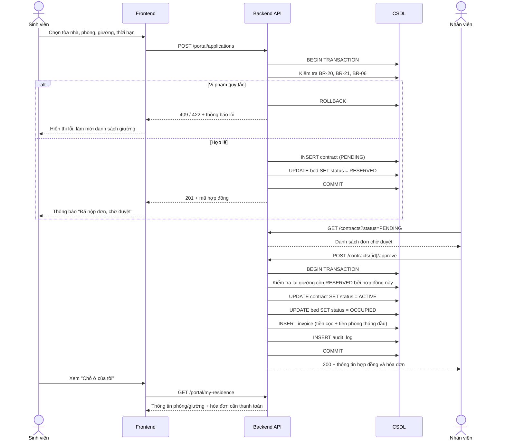

### 4.2. Quy trình lập hóa đơn định kỳ hằng tháng

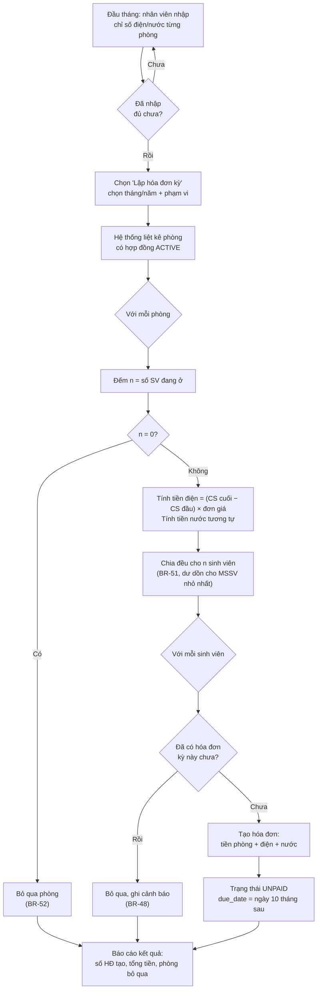

### 4.3. Quy trình thanh toán trực tuyến (VNPay)

> ⚠️ **Sơ đồ dưới đây là phương án gốc dùng IPN.** Dự án đang chạy theo **v1-lite**, nhận kết quả qua **Return URL có xác thực chữ ký** để khỏi phải dựng ngrok — xem sơ đồ và mã nguồn thay thế tại [`14` mục 4.10](14-PHIEN-BAN-DON-GIAN-HOA.md). Mọi quy tắc BR-55 → BR-58 vẫn giữ nguyên; chỉ đổi *ai gọi về backend*: trình duyệt thay vì máy chủ VNPay.

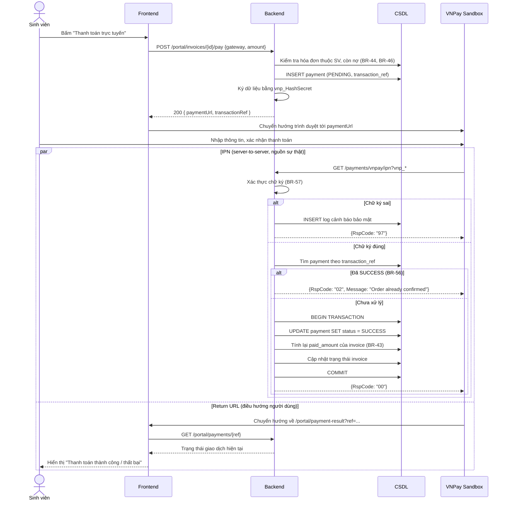

> **Điểm mấu chốt:** Return URL **không** phải nguồn sự thật (người dùng có thể đóng trình duyệt hoặc sửa URL). Chỉ **IPN** mới được phép thay đổi trạng thái hóa đơn.

### 4.4. Quy trình trả phòng và thanh lý

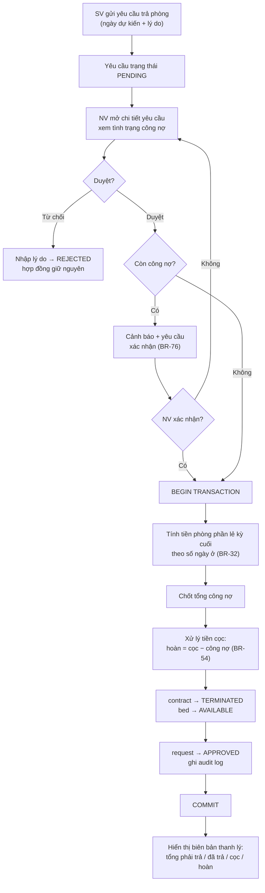

### 4.5. Quy trình gia hạn hợp đồng

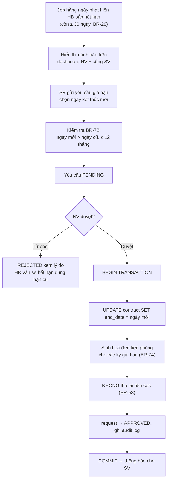

---

## 5. Quy tắc tính toán tài chính

### 5.1. Công thức tổng hợp

| Đại lượng | Công thức |
|-----------|-----------|
| Thành tiền một dòng phí | `amount = quantity × unit_price` |
| Tổng tiền hóa đơn | `total_amount = Σ amount của các dòng phí` |
| Đã thanh toán | `paid_amount = Σ payment.amount WHERE status = 'SUCCESS'` |
| Còn nợ của hóa đơn | `remaining = total_amount − paid_amount` |
| Tổng công nợ của sinh viên | `Σ remaining của các hóa đơn có status ∈ {UNPAID, PARTIALLY_PAID, OVERDUE}` |
| Tiền điện của phòng trong kỳ | `(chỉ số cuối − chỉ số đầu) × đơn giá điện` |
| Tiền điện mỗi sinh viên | `floor(tiền điện phòng / n)`, phần dư dồn vào sinh viên MSSV nhỏ nhất |
| Tiền phòng một tháng đủ | `room.price_per_month` — ⚠️ **quy ước chốt: đây là giá MỖI SINH VIÊN (mỗi giường) một tháng, KHÔNG phải giá cả phòng.** Ví dụ phòng 8 giường giá 400.000 → mỗi sinh viên trả 400.000đ/tháng, cả phòng thu 3.200.000đ/tháng. Không nhân/chia thêm cho `capacity` ở bất kỳ đâu |
| Tiền phòng theo ngày (trả phòng sớm) | `price_per_month / số ngày trong tháng × số ngày ở thực tế`, làm tròn đến đồng |
| Tỷ lệ lấp đầy | `số giường OCCUPIED / (tổng giường − số giường MAINTENANCE) × 100%` |
| Tiền hoàn cọc | `deposit_amount − tổng công nợ còn lại` (nếu < 0 → sinh viên còn nợ) |

### 5.2. Ví dụ minh họa: hóa đơn tháng 10/2026

**Bối cảnh:** Phòng B2-301, sức chứa 8 giường, hiện có 6 sinh viên đang ở. Giá phòng 400.000đ/người/tháng.
Chỉ số điện: đầu kỳ 1.250 → cuối kỳ 1.610 (tiêu thụ 360 kWh, đơn giá 2.500đ/kWh).
Chỉ số nước: đầu kỳ 85 → cuối kỳ 133 (tiêu thụ 48 m³, đơn giá 12.000đ/m³).

| Khoản mục | Tính toán | Kết quả |
|-----------|-----------|---------|
| Tiền điện cả phòng | 360 × 2.500 | 900.000đ |
| Tiền điện / sinh viên | 900.000 ÷ 6 | 150.000đ |
| Tiền nước cả phòng | 48 × 12.000 | 576.000đ |
| Tiền nước / sinh viên | 576.000 ÷ 6 = 96.000 | 96.000đ |
| Tiền phòng / sinh viên | Cố định | 400.000đ |
| **Tổng hóa đơn 1 sinh viên** | 400.000 + 150.000 + 96.000 | **646.000đ** |

*Trường hợp chia không hết:* nếu phòng có 7 sinh viên, tiền nước 576.000 ÷ 7 = 82.285,71 → mỗi người 82.285đ, tổng 575.995đ, phần dư 5đ cộng vào sinh viên có MSSV nhỏ nhất (82.290đ).

---

## 6. Các tác vụ nền (Scheduled Jobs)

| Mã | Tác vụ | Tần suất | Quy tắc áp dụng | Hành động |
|----|--------|----------|-----------------|-----------|
| JOB-01 | Cập nhật hợp đồng hết hạn | 00:05 hằng ngày | BR-28 | `ACTIVE` + `end_date < hôm nay` → `EXPIRED`, giường → `AVAILABLE` |
| JOB-02 | Hủy đơn chờ duyệt quá hạn | 00:10 hằng ngày | BR-27 | `PENDING` quá 7 ngày → `CANCELLED`, giường → `AVAILABLE` |
| JOB-03 | Đánh dấu hóa đơn quá hạn | 00:15 hằng ngày | BR-60 | `due_date < hôm nay` và còn nợ → `OVERDUE` |
| JOB-04 | Hết hạn giao dịch treo | Mỗi 5 phút | BR-59 | `payment PENDING` quá 15 phút → `EXPIRED` |
| JOB-05 | Đối soát trạng thái giường | 01:00 hằng ngày | – | So sánh `bed.status` với hợp đồng thực tế, ghi log nếu lệch và tự sửa |
| JOB-06 | Tính lại danh sách cảnh báo | 00:20 hằng ngày | BR-29 | Cập nhật bộ nhớ đệm danh sách hợp đồng sắp hết hạn cho dashboard |

> **Gợi ý cài đặt (v1-lite):** gộp **toàn bộ 6 tác vụ trên vào MỘT file `jobs/dailyJob.js`** chạy lúc 00:05 hằng ngày, thay vì 6 job riêng — xem mã mẫu tại `14` mục 4.9. JOB-04 (hết hạn giao dịch) và JOB-05 (đối soát giường) chạy chung trong lần đó luôn, không cần lịch riêng. Mỗi tác vụ phải **idempotent** (chạy lại nhiều lần không gây sai dữ liệu) và ghi log số bản ghi đã xử lý. Nếu deploy nhiều instance, chỉ bật job trên một instance (`ENABLE_CRON=true`).

---

## 7. Từ điển thuật ngữ nghiệp vụ

| Thuật ngữ | Định nghĩa |
|-----------|------------|
| **Tòa nhà (Building)** | Đơn vị nhà ở lớn nhất trong KTX, ví dụ "Tòa B2". Có chính sách giới tính riêng. |
| **Phòng (Room)** | Không gian ở trong tòa nhà, có sức chứa và giá thuê xác định. |
| **Giường (Bed)** | Đơn vị chỗ ở nhỏ nhất, là đối tượng được gán cho sinh viên. |
| **Hợp đồng lưu trú (Contract)** | Thỏa thuận cho sinh viên ở tại một giường trong khoảng thời gian xác định. |
| **Kỳ (Period)** | Đơn vị thời gian tính phí, ở đây là tháng dương lịch (`period_month`, `period_year`). |
| **Tiền cọc (Deposit)** | Khoản đặt cọc thu một lần đầu hợp đồng, hoàn lại khi trả phòng sau khi trừ công nợ. |
| **Công nợ** | Tổng số tiền sinh viên còn phải trả trên tất cả hóa đơn chưa thanh toán đủ. |
| **Tỷ lệ lấp đầy (Occupancy rate)** | Tỷ lệ giường đang có người ở trên tổng số giường khả dụng. |
| **IPN (Instant Payment Notification)** | Thông báo server-to-server từ cổng thanh toán về kết quả giao dịch. Là nguồn sự thật duy nhất. |
| **Return URL** | Đường dẫn cổng thanh toán chuyển hướng người dùng về sau khi thanh toán. Chỉ dùng để hiển thị, không dùng để cập nhật dữ liệu. |
| **Giữ chỗ (Reserved)** | Trạng thái tạm của giường khi có đơn đăng ký chờ duyệt. |
| **Biên bản thanh lý** | Bảng tổng kết tài chính khi kết thúc hợp đồng. |

---

## 8. Lịch sử phiên bản

| Phiên bản | Ngày | Người thực hiện | Nội dung thay đổi |
|-----------|------|------------------|-------------------|
| v1.0 | 11/09/2026 | Cả nhóm | Khởi tạo, chốt 65 quy tắc nghiệp vụ, 5 máy trạng thái, 5 luồng quy trình |
| v1.2 | 12/09/2026 | BE Lead | **Áp dụng v1-lite:** BR-05/BR-20/BR-21 đổi cách cài đặt sang `UPDATE` có điều kiện (bỏ `FOR UPDATE` + partial index); 6 cron job gộp thành 1; thanh toán nhận kết quả qua Return URL thay IPN; cấu hình chuyển từ bảng `system_config` sang file hằng số. Chức năng và quy tắc giữ nguyên — xem `14` |
| v1.1 | 12/09/2026 | BA, BE Lead | Rà soát chéo, bổ sung/sửa 10 quy tắc: BR-06 + BR-17 (giới tính mức phòng, bịt lỗ hổng tòa MIXED), BR-18 (mật khẩu tạm), BR-22 (phân biệt SV/NV nhập ngày), **BR-25 + BR-48 (tách hóa đơn cọc — bịt lỗ hổng thất thu tiền điện nước kỳ đầu)**, BR-27 (làm rõ mốc tính), BR-33 (giá khi chuyển phòng), BR-34 (không chia ngày tháng đầu), BR-51 (nêu rõ đơn giản hóa), BR-54a/54b (ghi nhận hoàn cọc + hóa đơn thanh lý). Chốt quy ước `price_per_month` là giá **mỗi người**. Tổng: **71 quy tắc** |
