# 03 – PHÂN TÍCH NGHIỆP VỤ

**Hệ thống:** DMS – Hệ thống quản lý ký túc xá
**Phiên bản:** v2.1 (MongoDB + Mongoose · đăng ký theo phòng)
**Mục đích:** Mô tả quy tắc nghiệp vụ, máy trạng thái và luồng quy trình.

> Đây là tài liệu **backend phải đọc kỹ nhất** — mọi quy tắc `BR-xx` dưới đây phải được cài đặt ở tầng **Service**.
> Cấu trúc dữ liệu xem `DATA-SCHEMA.md`, endpoint xem `API.md`, phạm vi xem `PRD.md`.

---

## 1. Mô hình nghiệp vụ tổng thể

### 1.1. Các thực thể chính

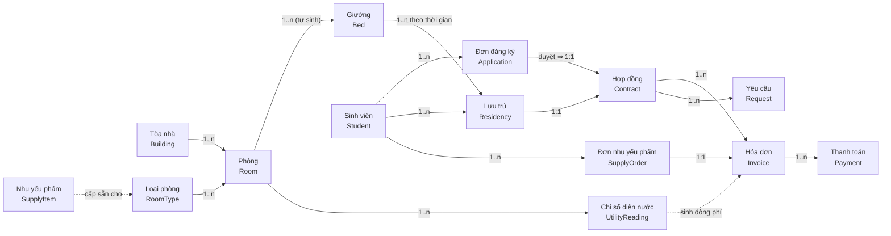

**Ba điểm cần nắm:**
- Giữa Sinh viên và Giường có thực thể trung gian **Residency** ("ai đang ở giường nào"), tách khỏi **Contract** ("giấy tờ pháp lý"). Một Residency ứng với đúng một Contract.
- 🆕 **Sinh viên đăng ký theo phòng, không theo giường.** Loại phòng quyết định giá, tiền cọc và đồ cấp sẵn. Giường vẫn tồn tại trong dữ liệu để đếm chỗ, chia tiền điện nước và chống xếp trùng, nhưng **luôn do hệ thống chọn**.
- 🆕 **Đơn đăng ký là giai đoạn chờ.** Hợp đồng chỉ ra đời khi đã có giường, nên hợp đồng không còn trạng thái `pending`.

### 1.2. Vòng đời một sinh viên

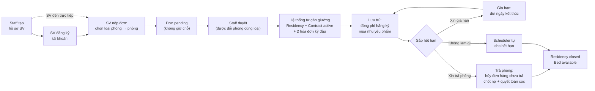

---

## 2. Máy trạng thái

### 2.1. Giường — `Bed.status`

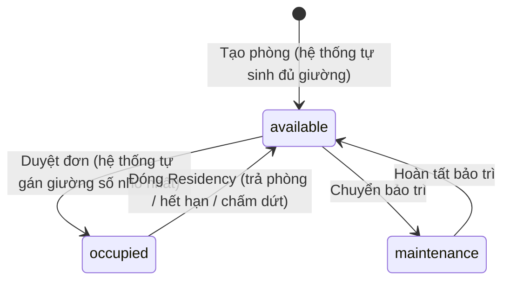

| Trạng thái | Ý nghĩa | Được gán cho sinh viên? |
|-----------|---------|-------------------------|
| `available` | Sẵn sàng | ✅ |
| `occupied` | Đang có sinh viên ở | ❌ |
| `maintenance` | Hỏng hóc / đang sửa | ❌ |

> **Vẫn chỉ 3 trạng thái.** Ở v1.2 sinh viên đã tự nộp đơn, nhưng **nộp đơn không giữ chỗ** (BR-34), nên vẫn không cần trạng thái `reserved`. Giữ chỗ sẽ kéo theo việc phải tự nhả chỗ khi đơn bị bỏ quên — đúng loại logic phiên bản này tránh.
>
> Không còn thao tác xóa giường: giường sinh ra cùng phòng và chỉ mất đi khi phòng đổi loại lúc đang trống (BR-09).

### 2.2. Lưu trú — `Residency.status`

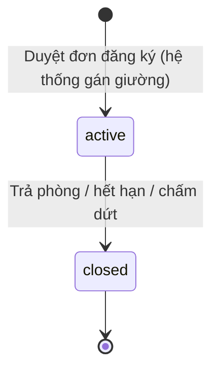

### 2.3. Hợp đồng — `Contract.status`

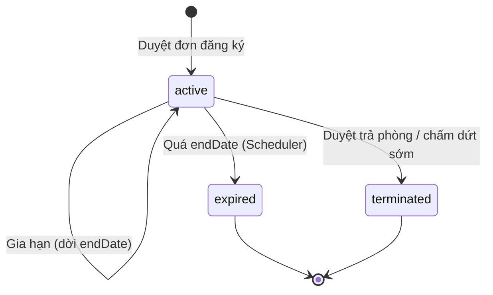

| Trạng thái | Ý nghĩa | Giường | Residency |
|-----------|---------|--------|-----------|
| `active` | Đang hiệu lực | `occupied` | `active` |
| `expired` | Quá hạn, không gia hạn | `available` | `closed` |
| `terminated` | Trả phòng sớm / bị chấm dứt | `available` | `closed` |

> 🆕 **Bỏ trạng thái `pending`.** Ở v2.0, hợp đồng `pending` đã chiếm giường nhưng chưa có hiệu lực — một trạng thái lưng chừng dễ bị quên kích hoạt. Giờ giai đoạn chờ nằm ở **đơn đăng ký** (mục 2.7), và giường chỉ bị chiếm tại **đúng một thời điểm**: lúc duyệt đơn.

### 2.4. Hóa đơn — `Invoice.status`

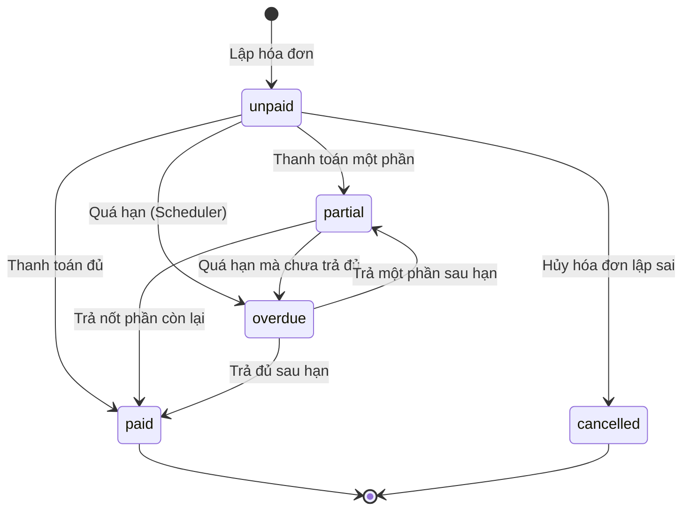

| Trạng thái | Điều kiện |
|-----------|-----------|
| `unpaid` | `paidAmount = 0` và chưa quá hạn |
| `partial` | `0 < paidAmount < totalAmount` |
| `paid` | `paidAmount >= totalAmount` |
| `overdue` | `hôm nay > dueDate` và `paidAmount < totalAmount` |
| `cancelled` | Staff hủy, chỉ khi chưa có thanh toán `success` |

### 2.5. Thanh toán — `Payment.status`

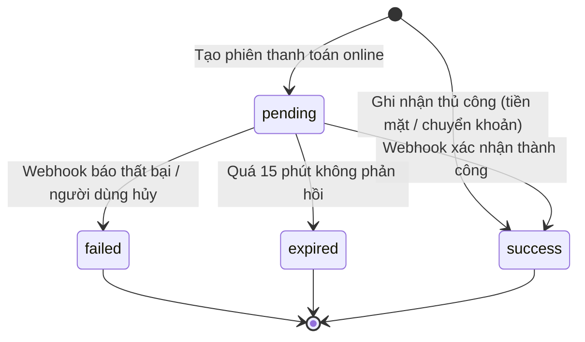

### 2.6. Yêu cầu — `Request.status`

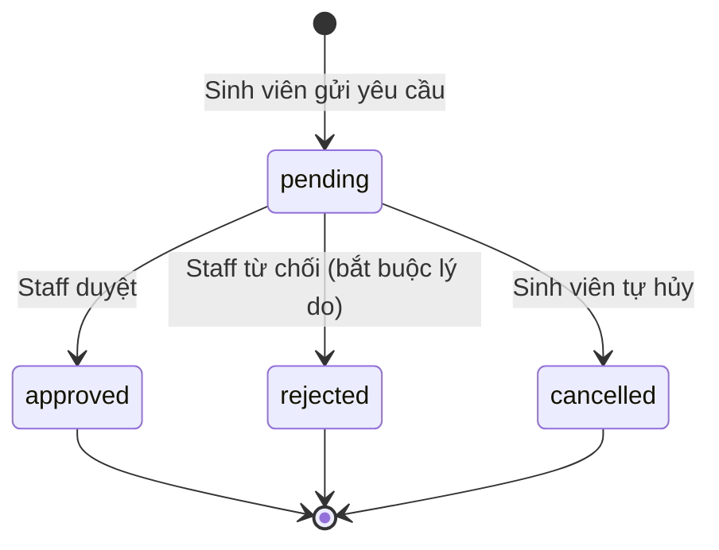

### 2.7. 🆕 Đơn đăng ký — `Application.status`

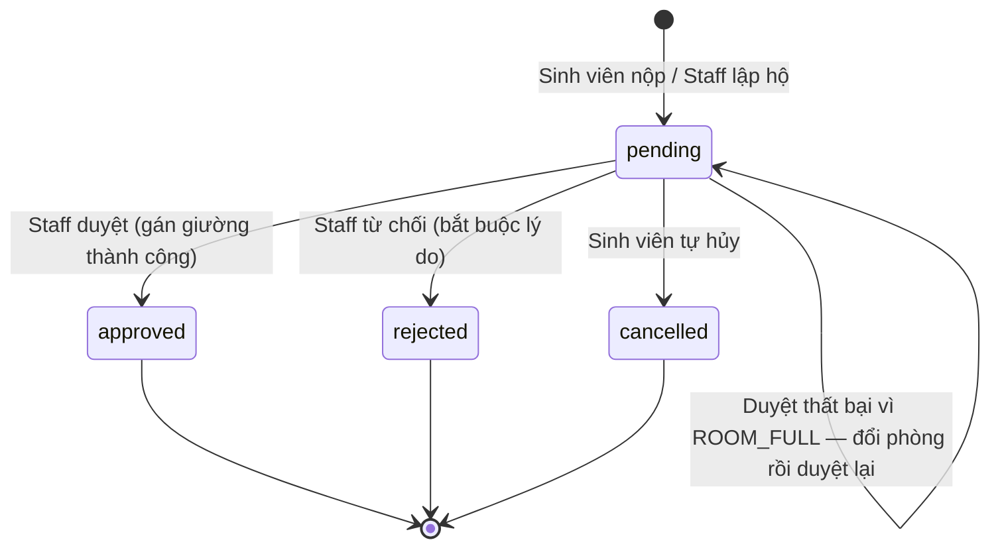

> Duyệt thất bại vì phòng hết chỗ **không** làm đơn đổi trạng thái — đơn vẫn `pending` để Staff chọn phòng khác cùng loại.

### 2.8. 🆕 Đơn nhu yếu phẩm — `SupplyOrder.status`

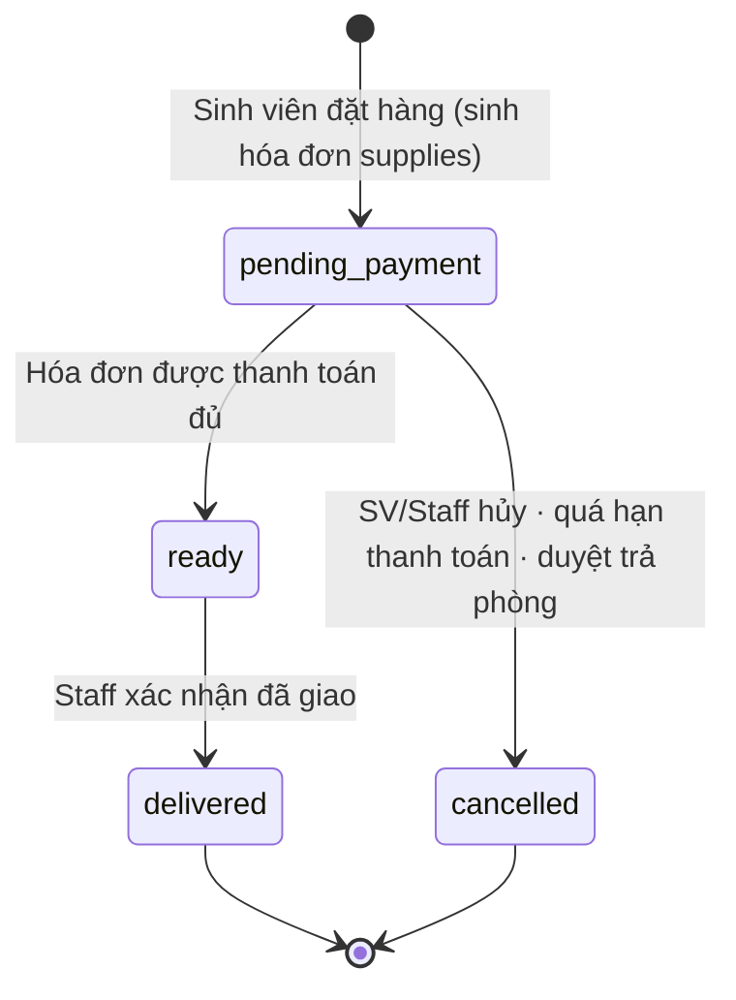

| Trạng thái | Nhãn hiển thị | Hóa đơn đi kèm |
|-----------|---------------|----------------|
| `pending_payment` | Chờ thanh toán | `unpaid` / `overdue` |
| `ready` | Chờ nhận hàng | `paid` |
| `delivered` | Đã giao | `paid` |
| `cancelled` | Đã hủy | `cancelled` |

---

## 3. Quy tắc nghiệp vụ (Business Rules)

> **Nơi cài đặt:** `DB` = ràng buộc/index Mongoose · `SV` = tầng service · `FE` = kiểm tra giao diện (chỉ để trải nghiệm, **không** thay thế kiểm tra server).
> **⭐** = quy tắc thuộc 3 nghiệp vụ bổ sung (`PRD.md` §2.9) · **🆕** = quy tắc thêm ở v2.1 cho đăng ký theo phòng và nhu yếu phẩm (`PRD.md` §2.10).

### 3.1. Cơ sở vật chất

| Mã | Quy tắc | Nơi | FR |
|----|---------|-----|-----|
| BR-01 | `Building.code` duy nhất trong hệ thống. | DB + SV | FR-20 |
| BR-02 | `Room.roomNumber` duy nhất trong phạm vi một tòa nhà. | DB (unique compound) + SV | FR-21 |
| BR-03 | `Bed.bedNumber` duy nhất trong phạm vi một phòng, đánh số liên tục từ 1. | DB (unique compound) + SV | FR-22 |
| 🆕 BR-04 | Khi tạo phòng, hệ thống **tự sinh đúng `capacity` giường** lấy từ loại phòng. Không có thao tác thêm hoặc xóa giường bằng tay. | SV | FR-22 |
| BR-05 | Chỉ gán được giường `available`. **Số chỗ trống của phòng = số giường `available`**, không tính bằng `capacity − số người ở` (cách đó đếm cả giường bảo trì là chỗ trống). | SV (xem BR-20) | FR-28, FR-31 |
| ⭐ BR-06 | Giới tính sinh viên phải khớp **`Room.gender`**. ⚠️ Kiểm tra ở mức **phòng**, không phải tòa nhà — kiểm tra ở mức tòa sẽ cho nam nữ ở chung phòng. Kiểm tra **cả lúc nộp đơn lẫn lúc duyệt**, vì Staff có thể đổi phòng. | SV | FR-29 |
| BR-07 | Không xóa cứng tòa nhà/phòng/giường đang được tham chiếu; chỉ chuyển `isActive: false`. | SV | FR-25 |
| BR-08 | Giường `occupied` không chuyển thẳng sang `maintenance` — sinh viên phải trả phòng trước. | SV | FR-27 |
| 🆕 BR-09 | Không đổi `tier`/`capacity` của loại phòng đã có phòng dùng (`ROOM_TYPE_IN_USE`). Không đổi `roomTypeId`/`gender` của phòng đang có người (`ROOM_HAS_OCCUPANTS`); đổi loại phòng lúc trống thì sinh lại giường theo sức chứa mới. | SV | FR-24 |
| 🆕 BR-10 | Mỗi tổ hợp **hạng × sức chứa** là một loại phòng duy nhất. `pricePerMonth > 0`, `depositAmount ≥ 0`. ⚠️ Giá là **mỗi sinh viên/tháng**, không nhân/chia cho sức chứa ở bất kỳ đâu. **Phòng không có trường giá.** | DB + SV + FE | FR-23 |

### 3.2. Sinh viên

| Mã | Quy tắc | Nơi | FR |
|----|---------|-----|-----|
| BR-11 | `Student.studentCode` duy nhất toàn hệ thống. | DB (unique) + SV | FR-11 |
| BR-12 | `Student.gender` bắt buộc — cần cho BR-06. | DB + SV | FR-10 |
| BR-13 | Không vô hiệu hóa sinh viên còn hợp đồng `active` hoặc đơn đăng ký `pending`. | SV | FR-14 |
| BR-14 | Không vô hiệu hóa sinh viên còn công nợ (`tổng còn nợ > 0`). | SV | FR-14 |
| BR-15 | Số điện thoại theo định dạng Việt Nam: 10 chữ số, bắt đầu bằng `0`. | SV + FE | FR-10 |

### 3.3. Đơn đăng ký, lưu trú & hợp đồng

| Mã | Quy tắc | Nơi | FR |
|----|---------|-----|-----|
| **BR-20** | **Mỗi giường tại một thời điểm chỉ có tối đa 1 Residency `active`.** Quy tắc quan trọng nhất hệ thống. Cài bằng **cập nhật có điều kiện nguyên tử lấy giường trống số nhỏ nhất** (mục 4.1) + partial unique index trên `Residency.bedId`. | SV + DB | FR-31 |
| **BR-21** | **Mỗi sinh viên tại một thời điểm chỉ có tối đa 1 hợp đồng `active`**; đang có hợp đồng `active` thì không nộp được đơn mới. | SV | FR-32 |
| BR-22 | `endDate > startDate`, thời hạn tối thiểu 1 tháng — áp dụng cho cả đơn đăng ký và hợp đồng. | SV + FE | FR-30 |
| BR-23 | `Contract` liên kết 1:1 với `Residency` và 1:1 với `Application`. | DB (unique) | FR-34 |
| BR-24 | Mã sinh tự động: hợp đồng `HD-YYYY-XXXXX`, đơn đăng ký `DK-YYYY-XXXXX`. | SV | FR-30, FR-34 |
| **BR-25** | Khi duyệt đơn, sinh **hai hóa đơn riêng**: một `type: 'deposit'` (`billingPeriod: null`) và một `type: 'monthly'`. ⚠️ **Tuyệt đối không gộp** — xem mục 5.3. | SV | FR-34 |
| BR-26 | Hạn thanh toán hai hóa đơn kỳ đầu = **`max(startDate, ngày duyệt)` + 7 ngày**. *(v2.1: trước đây là `startDate + 7`, khiến đơn duyệt muộn sinh ra hóa đơn quá hạn ngay lúc tạo.)* | SV | FR-34 |
| BR-27 | `Contract.monthlyPrice` và `Contract.depositAmount` **chốt từ loại phòng tại thời điểm duyệt**; đổi giá loại phòng sau này không làm thay đổi hợp đồng cũ. | SV | FR-24, FR-34 |
| BR-28 | Hợp đồng `active` có `endDate < hôm nay` → `expired`, Residency → `closed`, Bed → `available` (Scheduler). | SV (job) | FR-36 |
| BR-29 | "Sắp hết hạn" = `0 <= (endDate − hôm nay) <= N`, mặc định `N = 30`, khai báo ở `core/config/settings.js`. | SV | FR-37 |
| BR-30 | Chỉ hợp đồng `active` mới gia hạn hoặc chấm dứt được. | SV | FR-38 |
| BR-31 | Chấm dứt sớm: tiền phòng kỳ dở tính theo **số ngày ở thực tế** = `monthlyPrice / số ngày trong tháng × số ngày ở`. | SV | FR-38 |
| BR-32 | Tiền phòng **tháng đầu thu đủ một tháng**, không chia theo ngày, kể cả khi vào ở giữa tháng. Đơn giản hóa có chủ ý — **bất đối xứng** với BR-31, phải ghi rõ trong nội quy để tránh khiếu nại. | SV | FR-34 |
| 🆕 BR-33 | Mỗi sinh viên có tối đa **1 đơn `pending`**. | DB (partial unique) + SV | FR-30 |
| 🆕 BR-34 | **Nộp đơn không giữ chỗ.** Phòng phải còn ít nhất 1 giường `available` tại lúc nộp; nhiều đơn có thể cùng nhắm chỗ cuối cùng — đơn nào được duyệt trước thì được chỗ. | SV | FR-30 |
| 🆕 BR-35 | Khi duyệt, Staff chỉ được đổi sang phòng **cùng loại phòng** và cùng giới tính (`ROOM_TYPE_MISMATCH`). Đổi sang loại khác = thay đổi giá mà sinh viên chưa đồng ý. | SV + FE | FR-33 |
| 🆕 BR-36 | Duyệt đơn **theo đúng thứ tự**: gán giường (nguyên tử) → tạo Residency → tạo Contract → tạo 2 hóa đơn → cập nhật đơn. Lỗi xảy ra sau khi đã gán giường ⇒ **trả giường về `available`** rồi mới báo lỗi. | SV | FR-34 |
| 🆕 BR-37 | Từ chối đơn bắt buộc lý do tối thiểu 10 ký tự; sinh viên chỉ hủy được đơn của chính mình khi còn `pending`. | SV + FE | FR-33 |
| 🆕 BR-38 | **Không API nào nhận mã giường từ client.** Giường luôn do hệ thống chọn. | SV | FR-31 |

### 3.4. Phí, chỉ số điện nước & hóa đơn

| Mã | Quy tắc | Nơi | FR |
|----|---------|-----|-----|
| BR-40 | Mã hóa đơn sinh tự động `INV-YYYYMM-XXXXX`, duy nhất. | DB + SV | FR-48 |
| BR-41 | `totalAmount` = tổng `lineItems.amount`; client không được tự đặt. | SV | FR-49 |
| BR-42 | Mỗi dòng phí: `amount = quantity × unitPrice`. | SV | FR-46 |
| BR-43 | `paidAmount` **luôn tính lại** từ tổng `Payment` có `status: 'success'`, không cộng dồn thủ công. | SV | FR-49 |
| BR-44 | Số tiền thanh toán không vượt quá số còn nợ của hóa đơn. | SV + FE | FR-50 |
| BR-45 | Không thanh toán hóa đơn đã `paid` hoặc `cancelled`. | SV | FR-50 |
| BR-46 | Chỉ hủy hóa đơn khi chưa có thanh toán `success` nào. | SV | FR-58 |
| BR-47 | Không lập trùng: với cùng `(studentId, type, billingPeriod)` chỉ tồn tại 1 hóa đơn chưa hủy. | DB (partial unique) + SV | FR-47 |
| BR-48 | Khi lập hàng loạt gặp hóa đơn `monthly` đã có của kỳ đó, **bổ sung dòng phí còn thiếu** vào hóa đơn đó, **không bỏ qua sinh viên**. | SV | FR-47 |
| ⭐ BR-50 | `UtilityReading`: chỉ số cuối kỳ ≥ chỉ số đầu kỳ. | DB + SV + FE | FR-59 |
| ⭐ BR-51 | Chỉ số đầu kỳ mặc định bằng chỉ số cuối kỳ liền trước; hệ thống tự điền, cảnh báo nếu người dùng sửa. | SV | FR-59 |
| ⭐ BR-52 | Đơn giá điện/nước **chốt lại trên bản ghi `UtilityReading`**; đổi giá trong `FeeType` sau này không làm sai hóa đơn cũ. | SV | FR-59 |
| ⭐ BR-53 | Không sửa `UtilityReading` sau khi `isInvoiced: true`. | SV | FR-59 |
| ⭐ BR-54 | Tiền điện/nước của phòng **chia đều** cho số sinh viên có Residency `active` trong kỳ. Dùng `Math.floor`, phần dư dồn cho sinh viên có `studentCode` nhỏ nhất — xem công thức mục 5.2. Chia đều **theo đầu người, không theo số ngày ở**. | SV | FR-59 |
| ⭐ BR-55 | Phòng không có sinh viên nào ở trong kỳ → không lập hóa đơn điện/nước cho phòng đó. | SV | FR-59 |
| BR-56 | Hóa đơn quá `dueDate` mà `paidAmount < totalAmount` → `overdue` (Scheduler). | SV (job) | FR-57 |

### 3.5. Thanh toán

| Mã | Quy tắc | Nơi | FR |
|----|---------|-----|-----|
| BR-60 | Mỗi giao dịch online có `transactionRef` duy nhất do hệ thống sinh. | DB (unique) + SV | FR-53 |
| **BR-61** | **Xác thực chữ ký webhook trước khi làm bất cứ điều gì.** Chữ ký sai → ghi log cảnh báo bảo mật, **không** thay đổi dữ liệu, trả `GATEWAY_SIGNATURE_INVALID`. | SV | FR-54 |
| **BR-62** | **Idempotent:** nếu `Payment` đã `success`, xác nhận và không ghi nhận lần hai. Index unique sparse trên `gatewayTransactionId` là lớp chặn cuối. | SV + DB | FR-55 |
| BR-63 | Số tiền webhook trả về phải khớp số tiền giao dịch đã tạo; lệch → không cập nhật hóa đơn, đánh dấu cần đối soát. | SV | FR-54 |
| BR-64 | `Payment` `pending` quá 15 phút không phản hồi → `expired` (Scheduler). | SV (job) | FR-56 |
| BR-65 | Lưu nguyên `gatewayRawResponse` để đối soát về sau. | SV | FR-56 |

### 3.6. Gia hạn & trả phòng

| Mã | Quy tắc | Nơi | FR |
|----|---------|-----|-----|
| BR-70 | Chỉ sinh viên có hợp đồng `active` mới gửi được yêu cầu. | SV | FR-60, FR-61 |
| BR-71 | Không tồn tại 2 yêu cầu cùng loại `pending` cho cùng một hợp đồng. | DB (partial unique) + SV | FR-62 |
| BR-72 | Gia hạn: `requestedEndDate` phải lớn hơn `endDate` hiện tại. | SV + FE | FR-60 |
| BR-73 | Duyệt gia hạn: dời `endDate`, sinh hóa đơn `monthly` cho các kỳ gia hạn, **không thu lại tiền cọc**. | SV | FR-65 |
| BR-74 | Duyệt trả phòng: **hủy đơn nhu yếu phẩm chưa thanh toán** (BR-97), rồi `Contract` → `terminated`, `Residency` → `closed`, `Bed` → `available`, chốt công nợ. | SV | FR-66 |
| ⭐ BR-75 | Duyệt trả phòng khi sinh viên còn nợ → trả `422 STUDENT_HAS_DEBT` kèm số tiền; Staff gửi lại với `forceConfirm: true` mới tiếp tục. | SV + FE | FR-69 |
| ⭐ BR-76 | Quyết toán cọc: `hoàn = depositAmount − công nợ còn lại`. Tạo hóa đơn `type: 'settlement'`. | SV | FR-68 |
| ⭐ BR-77 | Nếu `hoàn > 0`, **phải ghi một `Payment` loại `refund`, `status: 'success'`** để lưu vết đã chi trả. Chỉ tính ra con số mà không ghi nhận thì không đối soát được ai đã nhận lại cọc. | SV | FR-68 |
| BR-78 | Từ chối yêu cầu bắt buộc có `reviewNote` không rỗng. | SV + FE | FR-64 |
| BR-79 | Sinh viên chỉ hủy được yêu cầu của chính mình và chỉ khi còn `pending`. | SV | FR-67 |

### 3.7. Tài khoản & phân quyền

| Mã | Quy tắc | Nơi | FR |
|----|---------|-----|-----|
| BR-80 | `User.email` duy nhất. | DB (unique) + SV | FR-06 |
| BR-81 | Mật khẩu tối thiểu 8 ký tự, có ít nhất 1 chữ và 1 số. | SV + FE | FR-03 |
| BR-82 | Tài khoản `student` liên kết 1–1 với một hồ sơ `Student`. | DB (unique sparse) + SV | FR-80 |
| BR-83 | Không khóa/xóa tài khoản `admin` cuối cùng còn hoạt động. | SV | FR-06 |
| BR-84 | Staff **không** được đặt lại mật khẩu tài khoản `admin` — chống leo thang đặc quyền. | SV | FR-09 |
| BR-85 | Đặt lại mật khẩu: sinh mật khẩu tạm ≥ 10 ký tự bằng `crypto.randomBytes`, trả về **một lần**, bật `mustChangePassword`. | SV | FR-09 |
| **BR-86** | **Mọi API `/api/portal/*` lấy danh tính từ JWT, không bao giờ từ tham số client gửi lên.** | SV | FR-85 |

### 3.8. 🆕 Nhu yếu phẩm

| Mã | Quy tắc | Nơi | FR |
|----|---------|-----|-----|
| BR-90 | Sản phẩm được cấp sẵn cho loại phòng nào thì **không hiển thị và không đặt được** với sinh viên đang ở loại phòng đó (`SUPPLY_ALREADY_INCLUDED`). | SV + FE | FR-101, FR-102 |
| BR-91 | Chỉ sinh viên có hợp đồng `active` mới xem cửa hàng và đặt hàng. | SV | FR-101 |
| **BR-92** | **Tổng tiền đơn tính ở server theo giá hiện hành.** Không nhận giá từ client. Tên và đơn giá sản phẩm được **sao chép vào đơn** lúc đặt — đổi giá sau này không làm sai đơn cũ. | SV | FR-102 |
| BR-93 | Mỗi sản phẩm 1–5 cái mỗi đơn; sản phẩm ngừng bán không đặt được (`SUPPLY_ITEM_INACTIVE`). | SV + FE | FR-102 |
| BR-94 | Mỗi đơn sinh đúng **1 hóa đơn** `type: 'supplies'`, `billingPeriod: null`, hạn = ngày đặt + 3 ngày. | SV | FR-102 |
| BR-95 | Hóa đơn `supplies` chuyển `paid` ⇒ đơn `ready`, bằng cập nhật có điều kiện `{ invoiceId, status: 'pending_payment' }` để webhook gửi lặp không xử lý hai lần. | SV | FR-103 |
| BR-96 | Chỉ giao được đơn `ready`. Chỉ hủy được đơn `pending_payment` **và** hóa đơn chưa có thanh toán nào; hủy đơn thì hủy luôn hóa đơn. | SV | FR-104, FR-105 |
| ⭐ BR-97 | Đơn `pending_payment` quá hạn thanh toán ⇒ **tự hủy** kèm hóa đơn (Scheduler). Khi duyệt trả phòng, hủy các đơn này **trước** khi tính công nợ. ⚠️ Nếu thiếu quy tắc này, đơn sinh viên bỏ quên thành công nợ và **bị trừ vào tiền cọc cho món hàng chưa từng nhận**. | SV (job) | FR-106 |

**Tổng: 81 quy tắc nghiệp vụ.**

---

## 4. Ba kỹ thuật cốt lõi

### 4.1. ⭐ Chống xếp trùng giường — tự gán giường bằng cập nhật có điều kiện nguyên tử

**Vấn đề:** hai Staff cùng duyệt hai đơn nhắm vào **chỗ cuối cùng** của phòng B203 trong cùng tích tắc. Nếu code là "tìm giường trống → thấy giường 06 → ghi `occupied`", cả hai đều tìm thấy giường 06 và cả hai đều ghi thành công ⇒ hai người một giường.

**Cách sai:**
```js
const bed = await Bed.findOne({ roomId, status: 'available' }).sort({ bedNumber: 1 });
if (!bed) throw new ApiError(409, 'ROOM_FULL', ...);   // ❌ khe hở nằm giữa dòng trên và dòng dưới
bed.status = 'occupied';
await bed.save();
```

**Cách đúng** — gộp "tìm" và "ghi" vào **một câu lệnh**. `findOneAndUpdate` trên một document là nguyên tử trong MongoDB, không cần transaction:
```js
const bed = await Bed.findOneAndUpdate(
  { roomId, status: 'available' },        // điều kiện nằm trong query
  { $set: { status: 'occupied' } },
  { sort: { bedNumber: 1 }, new: true }   // lấy giường số nhỏ nhất
);
if (!bed) {
  // Không trả về document ⇒ phòng vừa hết chỗ
  throw new ApiError(409, 'ROOM_FULL', 'Phòng B203 vừa hết chỗ. Vui lòng chọn phòng khác cùng loại');
}
```

MongoDB chỉ trao giường 06 cho **một** trong hai lệnh; lệnh còn lại không khớp điều kiện `status: 'available'` nữa và nhận `null`.

**Lớp bảo vệ thứ hai** ở tầng CSDL (`DATA-SCHEMA.md` §3.6):
```js
residencySchema.index(
  { bedId: 1 },
  { unique: true, partialFilterExpression: { status: 'active' } }
);
```

> Nếu tạo Residency, Contract hay hóa đơn thất bại sau khi đã gán giường, **phải trả giường lại** `available` trong khối `catch` (BR-36).
>
> 💡 **Vì sao đổi sang tự gán lại làm kỹ thuật này dễ hơn:** trước đây giao diện phải xử lý "giường bạn chọn vừa bị lấy", còn giờ chỉ còn một tình huống duy nhất là "phòng hết chỗ". Cả hệ thống có đúng một hàm chiếm giường — `bedService.claimBedInRoom` — nên chỉ cần kiểm thử một chỗ.

### 4.2. ⭐ Idempotent khi xử lý webhook thanh toán

**Vấn đề:** cổng thanh toán gửi lại webhook khi không nhận được phản hồi. Xử lý ngây thơ ⇒ ghi nhận tiền hai lần.

```js
export const handleWebhook = async (payload) => {
  // 1. Xác thực chữ ký TRƯỚC MỌI THỨ (BR-61)
  if (!verifySignature(payload)) {
    logger.warn('[BẢO MẬT] Chữ ký webhook không hợp lệ', { ref: payload.vnp_TxnRef });
    throw new ApiError(400, 'GATEWAY_SIGNATURE_INVALID', 'Chữ ký giao dịch không hợp lệ');
  }

  const payment = await Payment.findOne({ transactionRef: payload.vnp_TxnRef });
  if (!payment) throw new ApiError(404, 'NOT_FOUND', 'Không tìm thấy giao dịch');

  // 2. Đã xử lý rồi thì thoát sớm (BR-62)
  if (payment.status === 'success') return { alreadyConfirmed: true, payment };

  // 3. Số tiền phải khớp (BR-63)
  if (payment.amount !== Number(payload.vnp_Amount) / 100) {
    payment.gatewayRawResponse = payload;
    await payment.save();
    throw new ApiError(422, 'AMOUNT_MISMATCH', 'Số tiền giao dịch không khớp, cần đối soát');
  }

  // 4. Ghi nhận
  payment.status = payload.vnp_ResponseCode === '00' ? 'success' : 'failed';
  payment.gatewayTransactionId = payload.vnp_TransactionNo;
  payment.gatewayRawResponse = payload;
  if (payment.status === 'success') payment.paidAt = new Date();
  await payment.save();

  if (payment.status === 'success') await recalculateInvoice(payment.invoiceId);  // BR-43
  return { alreadyConfirmed: false, payment };
};
```

### 4.3. ⭐ Chia đều tiền điện nước không lệch đồng nào

```js
/**
 * Chia roomTotal cho n sinh viên sao cho TỔNG CÁC PHẦN = roomTotal chính xác.
 * @returns {number[]} mảng n phần tử, phần tử [0] dành cho MSSV nhỏ nhất
 */
export function splitEvenly(roomTotal, n) {
  if (n <= 0) return [];
  const base = Math.floor(roomTotal / n);      // KHÔNG dùng Math.round — tổng sẽ vượt
  const remainder = roomTotal - base * n;
  const shares = Array(n).fill(base);
  shares[0] += remainder;                       // dồn phần dư cho người đầu tiên
  return shares;
}
```

| Ví dụ | Kết quả | Kiểm chứng |
|---|---|---|
| 900 000 đ ÷ 6 | mỗi người 150 000 đ | 150 000 × 6 = 900 000 ✅ |
| 576 000 đ ÷ 7 | 1 người 82 290 đ, 6 người 82 285 đ | 82 290 + 82 285×6 = 576 000 ✅ |

> Nếu dùng `Math.round(576000/7) = 82286` thì tổng = 576 002 đ — **thu thừa 2 đồng**, sổ sách không khớp.

---

## 5. Công thức & ví dụ tính toán

### 5.1. Bảng công thức

| Đại lượng | Công thức |
|-----------|-----------|
| Thành tiền một dòng phí | `amount = quantity × unitPrice` |
| Tổng hóa đơn | `totalAmount = Σ lineItems.amount` |
| Đã thanh toán | `paidAmount = Σ Payment.amount` với `status: 'success'`, `type: 'payment'` |
| Còn nợ của hóa đơn | `totalAmount − paidAmount` |
| Tổng công nợ sinh viên | `Σ còn nợ` của các hóa đơn `unpaid`/`partial`/`overdue` |
| Tiền điện cả phòng | `(electricityEnd − electricityStart) × electricityUnitPrice` |
| Tiền điện mỗi sinh viên | `splitEvenly(tiền điện phòng, n)` — mục 4.3 |
| Tiền phòng một tháng | `Contract.monthlyPrice` (giá **mỗi người**, chốt từ `RoomType.pricePerMonth` lúc duyệt) |
| Số chỗ trống của phòng | số `Bed` có `status: 'available'` |
| Tổng đơn nhu yếu phẩm | `Σ quantity × SupplyItem.price` — tính ở server theo giá hiện hành |
| Tiền phòng theo ngày (trả sớm) | `monthlyPrice / số ngày trong tháng × số ngày ở`, làm tròn đến đồng |
| Tỷ lệ lấp đầy | `occupied / (tổng giường − maintenance) × 100%` |
| Tiền hoàn cọc | `depositAmount − tổng công nợ còn lại` (âm ⇒ sinh viên còn nợ) |

### 5.2. Ví dụ: hóa đơn tháng 10/2026

**Bối cảnh:** phòng B2-301 thuộc loại "Tiêu chuẩn · 8 người", hiện 6 sinh viên đang ở, hợp đồng chốt `monthlyPrice` = 400 000 đ/người/tháng.
Điện: 1 250 → 1 610 (360 kWh × 2 500 đ). Nước: 85 → 133 (48 m³ × 12 000 đ).

| Khoản | Tính | Kết quả |
|-------|------|---------|
| Tiền điện cả phòng | 360 × 2 500 | 900 000 đ |
| Tiền điện / sinh viên | `splitEvenly(900000, 6)` | 150 000 đ |
| Tiền nước cả phòng | 48 × 12 000 | 576 000 đ |
| Tiền nước / sinh viên | `splitEvenly(576000, 6)` | 96 000 đ |
| Tiền phòng / sinh viên | cố định | 400 000 đ |
| **Tổng hóa đơn 1 sinh viên** | | **646 000 đ** |

### 5.3. ⚠️ Cạm bẫy: gộp hóa đơn tiền cọc

**Tình huống:** đơn đăng ký được duyệt ngày 05/10. Nếu sinh **một** hóa đơn `type: 'monthly'`, `billingPeriod: '2026-10'` chứa cả tiền cọc và tiền phòng, thì cuối tháng 10 khi chạy lập hóa đơn hàng loạt:

1. Hệ thống thấy sinh viên **đã có** hóa đơn `monthly` kỳ 2026-10 (BR-47).
2. Bỏ qua sinh viên đó.
3. ⇒ **Tiền điện và tiền nước tháng 10 của sinh viên này không bao giờ được thu.**

Mỗi sinh viên mới lọt khoảng 250 000 đ. Vì vậy:
- **BR-25:** tách thành hai hóa đơn — `deposit` (`billingPeriod: null`) và `monthly`.
- **BR-48:** đợt lập hàng loạt phải **bổ sung dòng phí thiếu**, không bỏ qua sinh viên.

### 5.4. Ví dụ: quyết toán khi trả phòng

Sinh viên trả phòng 15/12, cọc 500 000 đ, còn nợ 246 000 đ.

| Bước | Kết quả |
|------|---------|
| Tiền phòng kỳ dở (15/31 ngày × 400 000) | 193 548 đ |
| Tổng công nợ chốt | 246 000 + 193 548 = 439 548 đ |
| Hoàn cọc = 500 000 − 439 548 | **60 452 đ** |
| Ghi nhận | Hóa đơn `settlement` + `Payment` loại `refund` 60 452 đ |

Nếu công nợ là 700 000 đ ⇒ hoàn = −200 000 ⇒ hoàn 0 đ, hóa đơn `settlement` ghi sinh viên còn nợ 200 000 đ.

> 🆕 Nếu sinh viên còn một đơn nhu yếu phẩm 160 000 đ **chưa thanh toán**, đơn đó bị hủy trước (BR-97) — công nợ chốt vẫn là 439 548 đ, không phải 599 548 đ. Nếu đơn **đã thanh toán nhưng chưa nhận**, không có gì bị trừ; giao diện chỉ nhắc Staff giao hàng trước khi duyệt.

---

## 6. Luồng quy trình chi tiết

### 6.1. 🆕 Nộp đơn và duyệt đơn đăng ký

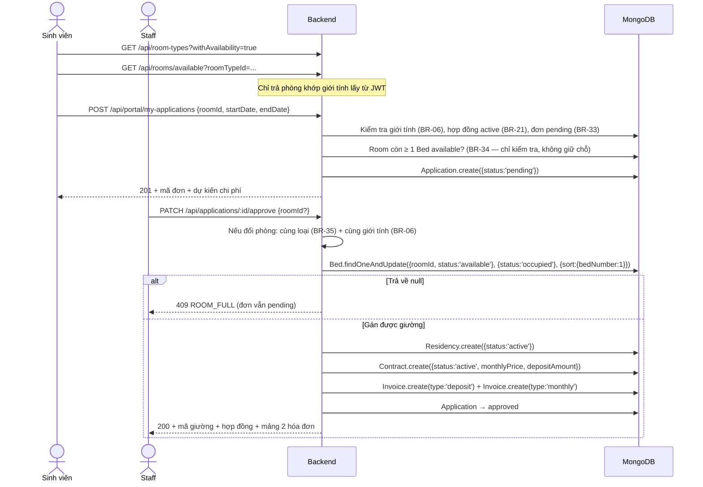

### 6.2. Lập hóa đơn định kỳ

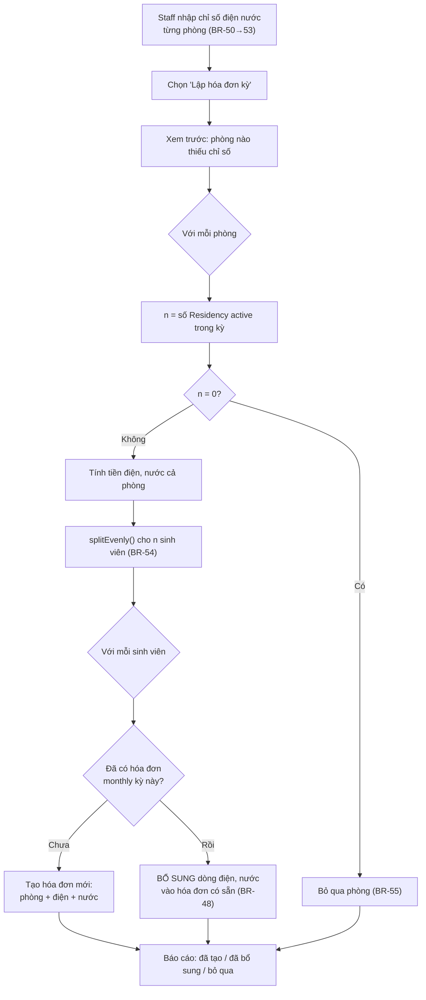

### 6.3. Trả phòng và quyết toán

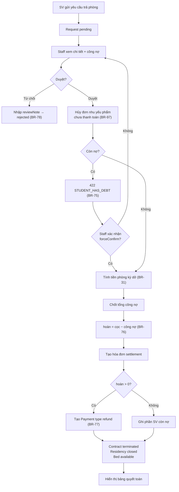

### 6.4. 🆕 Mua nhu yếu phẩm

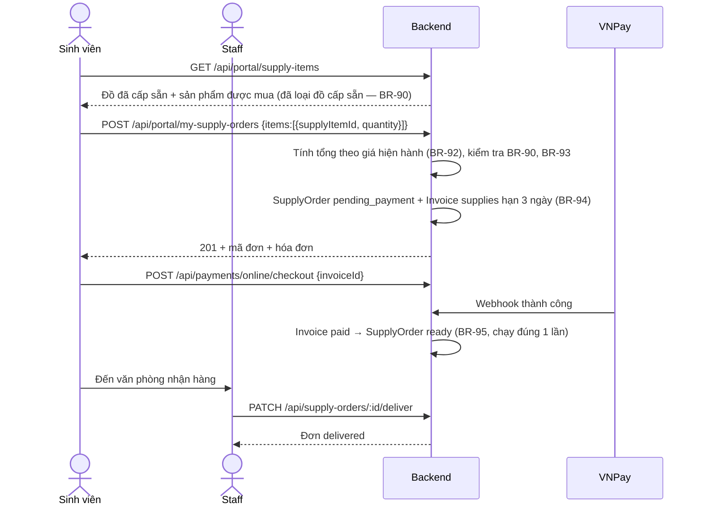

---

## 7. Tác vụ nền (Scheduler)

**Một job duy nhất** chạy 00:05 hằng ngày, làm 5 việc tuần tự:

| # | Việc | Quy tắc | Hành động |
|---|------|---------|-----------|
| 1 | Hợp đồng hết hạn | BR-28 | `active` + `endDate < hôm nay` → `expired`; Residency → `closed`; Bed → `available` |
| 2 | 🆕 Đơn nhu yếu phẩm quá hạn | BR-97 | `pending_payment` + hóa đơn quá `dueDate` + chưa có thanh toán → đơn `cancelled`, hóa đơn `cancelled`. **Chạy trước việc 3** để các hóa đơn này không bị đánh dấu quá hạn rồi mới hủy |
| 3 | Hóa đơn quá hạn | BR-56 | `dueDate < hôm nay` và còn nợ → `overdue` |
| 4 | Giao dịch treo | BR-64 | `Payment` `pending` quá 15 phút → `expired` |
| 5 | Đối soát trạng thái giường | – | So `Bed.status` với Residency thực tế, ghi log nếu lệch và tự sửa |

```js
// core/jobs/daily-job.js — chỉ chạy khi ENABLE_CRON=true
cron.schedule('5 0 * * *', runDailyTasks, { timezone: 'Asia/Ho_Chi_Minh' });

// Cho phép chạy tay để test: npm run job
if (process.argv[2] === 'run-now') runDailyTasks().then(() => process.exit(0));
```

> Mỗi việc phải **idempotent** — chạy lại nhiều lần không gây sai dữ liệu — và ghi log số bản ghi đã xử lý.

---

## 8. Từ điển thuật ngữ

| Thuật ngữ | Định nghĩa |
|-----------|------------|
| **Building / Room / Bed** | Ba cấp không gian ở. Bed là đơn vị nhỏ nhất, **do hệ thống tự gán** cho sinh viên khi duyệt đơn. |
| **RoomType (Loại phòng)** | Hạng × sức chứa, VD "Tiêu chuẩn · 6 người". Quyết định giá mỗi người/tháng, tiền cọc và đồ cấp sẵn. |
| **Application (Đơn đăng ký)** | Yêu cầu được ở một phòng. Giai đoạn chờ trước khi có hợp đồng; không giữ chỗ. |
| **Chỗ trống** | Số giường `available` của phòng — không tính giường bảo trì. |
| **SupplyOrder (Đơn nhu yếu phẩm)** | Đơn mua đồ dùng, thanh toán qua một hóa đơn `supplies` riêng, nhận tại văn phòng. |
| **Residency** | "Sinh viên X đang ở giường Y" — sự kiện ở thực tế, tách khỏi giấy tờ. |
| **Contract** | Giấy tờ pháp lý gắn với đúng một Residency: thời hạn, giá, tiền cọc, điều khoản. |
| **billingPeriod** | Kỳ tính phí, dạng chuỗi `"2026-10"`. |
| **Deposit** | Tiền cọc thu một lần đầu hợp đồng, quyết toán khi trả phòng. |
| **Settlement** | Hóa đơn thanh lý — chứng từ khép lại vòng đời tài chính của hợp đồng. |
| **Công nợ** | Tổng số tiền sinh viên còn phải trả trên mọi hóa đơn chưa thanh toán đủ. |
| **Tỷ lệ lấp đầy** | Tỷ lệ giường đang có người trên tổng giường khả dụng (trừ giường bảo trì). |
| **Webhook** | Lời gọi server-to-server từ cổng thanh toán báo kết quả giao dịch. **Nguồn sự thật duy nhất** về việc tiền đã vào hay chưa. |
| **Idempotent** | Thực hiện nhiều lần cho kết quả như thực hiện một lần. |

---

## 9. Lịch sử phiên bản

| Phiên bản | Ngày | Nội dung |
|-----------|------|----------|
| v1.0 | 11/09/2026 | Khởi tạo, 65 quy tắc nghiệp vụ (PostgreSQL) |
| v1.1 | 12/09/2026 | Rà soát chéo, bổ sung 6 quy tắc |
| **v2.1** | **13/09/2026** | **Đăng ký theo phòng + nhu yếu phẩm** (`PRD.md` §2.10). Thêm thực thể `RoomType`, `Application`, `SupplyItem`, `SupplyOrder`; máy trạng thái 2.7 (đơn đăng ký), 2.8 (đơn nhu yếu phẩm); hợp đồng bỏ `pending`, giường không còn thao tác xóa. Viết lại BR-03/04/05/09/10 (giường tự sinh, loại phòng), thêm BR-33→BR-38 (đơn đăng ký) và mục 3.8 BR-90→BR-97 (nhu yếu phẩm). **Sửa BR-26**: hạn hóa đơn kỳ đầu tính từ `max(startDate, ngày duyệt)`. Viết lại mục 4.1 (tự gán giường, `ROOM_FULL`), luồng 6.1; thêm luồng 6.4; Scheduler 5 việc. **Tổng: 81 quy tắc.** |
| v2.0 | 12/09/2026 | **Viết lại theo stack MongoDB + Mongoose.** Thêm thực thể `Residency`; bỏ trạng thái giường `reserved` (còn 3); bỏ quy tắc chuyển phòng (ngoài phạm vi v1); enum đổi sang chữ thường; đánh số lại BR và truy vết sang FR mới; thay `FOR UPDATE` bằng `findOneAndUpdate` nguyên tử; thay transaction bằng thao tác nguyên tử. **Tổng: 76 quy tắc.** |
