# 04 – THIẾT KẾ CƠ SỞ DỮ LIỆU

**Hệ thống:** DMS-KTX
**Phiên bản:** v1.0
**Hệ quản trị CSDL:** PostgreSQL 15+ **hoặc** MySQL 8 — ⭐ ở bản v1-lite, sau khi bỏ partial unique index, **hai hệ chạy như nhau**, chọn cái nào cài dễ hơn

**Quy ước đặt tên:** `snake_case`, tên bảng số ít, khóa chính `id`, khóa ngoại `<bảng>_id`

> ⚠️ **Đang áp dụng v1-lite:** schema còn **13 bảng** (đã bỏ `audit_log` và `system_config`), và **không dùng partial unique index**. Xem lý do tại [`14` mục 5](14-PHIEN-BAN-DON-GIAN-HOA.md).

---

## 1. Sơ đồ quan hệ thực thể (ERD)

```mermaid
erDiagram
    USER ||--o| STUDENT : "liên kết (role=STUDENT)"
    BUILDING ||--o{ ROOM : "chứa"
    ROOM ||--o{ BED : "chứa"
    ROOM ||--o{ UTILITY_READING : "ghi chỉ số"
    STUDENT ||--o{ CONTRACT : "ký"
    BED ||--o{ CONTRACT : "được gán"
    CONTRACT ||--o{ INVOICE : "phát sinh"
    CONTRACT ||--o{ REQUEST : "có yêu cầu"
    CONTRACT ||--o{ ROOM_TRANSFER : "lịch sử chuyển"
    INVOICE ||--o{ INVOICE_ITEM : "gồm các dòng"
    INVOICE ||--o{ PAYMENT : "được thanh toán"
    FEE_TYPE ||--o{ INVOICE_ITEM : "phân loại"
    STUDENT ||--o{ INVOICE : "chịu trách nhiệm"

    USER {
        bigint id PK
        varchar email UK
        varchar password_hash
        varchar full_name
        varchar role
        bigint student_id FK "NULL nếu không phải SV"
        varchar pending_student_code
        varchar phone
        boolean is_active
        boolean must_change_password
        timestamp last_login_at
        timestamp created_at
        timestamp updated_at
    }

    STUDENT {
        bigint id PK
        varchar student_code UK
        varchar full_name
        date date_of_birth
        varchar gender
        varchar id_card_number UK
        varchar phone
        varchar email UK
        varchar class_name
        varchar faculty
        varchar course_year
        varchar hometown
        varchar emergency_contact_name
        varchar emergency_contact_phone
        boolean is_active
        timestamp created_at
        timestamp updated_at
    }

    BUILDING {
        bigint id PK
        varchar code UK
        varchar name
        int total_floors
        varchar gender_policy
        text description
        boolean is_active
        timestamp created_at
        timestamp updated_at
    }

    ROOM {
        bigint id PK
        bigint building_id FK
        varchar room_number
        int floor_number
        varchar room_type
        varchar gender
        int capacity
        decimal price_per_month
        varchar status
        text description
        boolean is_active
        timestamp created_at
        timestamp updated_at
    }

    BED {
        bigint id PK
        bigint room_id FK
        varchar bed_label
        varchar status
        text note
        timestamp created_at
        timestamp updated_at
    }

    CONTRACT {
        bigint id PK
        varchar contract_code UK
        bigint student_id FK
        bigint bed_id FK
        date start_date
        date end_date
        date actual_end_date
        decimal monthly_price
        decimal deposit_amount
        varchar status
        text note
        text reject_reason
        bigint approved_by FK
        timestamp approved_at
        bigint created_by FK
        timestamp created_at
        timestamp updated_at
    }

    INVOICE {
        bigint id PK
        varchar invoice_code UK
        bigint student_id FK
        bigint contract_id FK
        varchar invoice_type
        int period_month
        int period_year
        decimal total_amount
        decimal paid_amount
        date issue_date
        date due_date
        varchar status
        text note
        bigint created_by FK
        timestamp created_at
        timestamp updated_at
    }

    INVOICE_ITEM {
        bigint id PK
        bigint invoice_id FK
        bigint fee_type_id FK
        varchar description
        decimal quantity
        decimal unit_price
        decimal amount
        timestamp created_at
    }

    FEE_TYPE {
        bigint id PK
        varchar code UK
        varchar name
        varchar unit
        decimal default_price
        varchar calculation_type
        boolean is_active
        timestamp created_at
        timestamp updated_at
    }

    PAYMENT {
        bigint id PK
        varchar transaction_ref UK
        bigint invoice_id FK
        decimal amount
        varchar method
        varchar gateway
        varchar status
        varchar gateway_txn_id
        jsonb gateway_response
        timestamp paid_at
        bigint recorded_by FK
        text note
        timestamp created_at
        timestamp updated_at
    }

    REQUEST {
        bigint id PK
        bigint contract_id FK
        bigint student_id FK
        varchar request_type
        date new_end_date
        date expected_checkout_date
        text reason
        varchar status
        text reject_reason
        bigint processed_by FK
        timestamp processed_at
        timestamp created_at
        timestamp updated_at
    }

    UTILITY_READING {
        bigint id PK
        bigint room_id FK
        int period_month
        int period_year
        decimal electricity_start
        decimal electricity_end
        decimal water_start
        decimal water_end
        boolean is_invoiced
        bigint recorded_by FK
        timestamp created_at
        timestamp updated_at
    }

    ROOM_TRANSFER {
        bigint id PK
        bigint contract_id FK
        bigint from_bed_id FK
        bigint to_bed_id FK
        date transfer_date
        text reason
        bigint performed_by FK
        timestamp created_at
    }
```



> **13 bảng.** Hai bảng `audit_log` và `system_config` của bản thiết kế đầu đã được thay bằng ghi log ra file và file hằng số — xem `14` mục 4.12, 4.13.

---

## 2. Bảng liệt kê giá trị enum

| Trường | Bảng | Giá trị hợp lệ | Ý nghĩa |
|--------|------|----------------|---------|
| `role` | `user` | `ADMIN`, `STAFF`, `STUDENT`, `VIEWER` | Vai trò người dùng |
| `gender` | `student` | `MALE`, `FEMALE`, `OTHER` | Giới tính |
| `gender_policy` | `building` | `MALE`, `FEMALE`, `MIXED` | Tòa dành cho giới tính nào. `MIXED` = tòa chứa cả phòng nam và phòng nữ, **không phải** phòng ở chung |
| `gender` | `room` | `MALE`, `FEMALE` | Giới tính của phòng — đây mới là trường dùng để kiểm tra khi xếp giường (BR-06, BR-17) |
| `room_type` | `room` | `STANDARD_4`, `STANDARD_6`, `STANDARD_8`, `VIP_2`, `VIP_4` | Loại phòng |
| `status` | `room` | `ACTIVE`, `MAINTENANCE`, `CLOSED` | Trạng thái phòng |
| `status` | `bed` | `AVAILABLE`, `RESERVED`, `OCCUPIED`, `MAINTENANCE` | Trạng thái giường (xem `03`, mục 2.1) |
| `status` | `contract` | `PENDING`, `ACTIVE`, `REJECTED`, `CANCELLED`, `EXPIRED`, `TERMINATED` | Trạng thái hợp đồng |
| `invoice_type` | `invoice` | `DEPOSIT`, `MONTHLY`, `UTILITY`, `SETTLEMENT`, `OTHER` | Loại hóa đơn |
| `status` | `invoice` | `UNPAID`, `PARTIALLY_PAID`, `PAID`, `OVERDUE`, `CANCELLED` | Trạng thái hóa đơn |
| `calculation_type` | `fee_type` | `FIXED`, `PER_UNIT`, `PER_MONTH`, `PER_PERSON` | Cách tính phí |
| `method` | `payment` | `CASH`, `BANK_TRANSFER`, `ONLINE` | Phương thức thanh toán |
| `gateway` | `payment` | `VNPAY`, `ZALOPAY`, `NULL` | Cổng thanh toán (NULL nếu thủ công) |
| `status` | `payment` | `PENDING`, `SUCCESS`, `FAILED`, `EXPIRED`, `REFUNDED`, `NEEDS_RECONCILIATION` | Trạng thái giao dịch |
| `request_type` | `request` | `EXTEND`, `CHECKOUT` | Loại yêu cầu |
| `status` | `request` | `PENDING`, `APPROVED`, `REJECTED`, `CANCELLED` | Trạng thái yêu cầu |
| `action` | `audit_log` | `CREATE`, `UPDATE`, `DELETE`, `APPROVE`, `REJECT`, `LOGIN`, `PAYMENT` | Hành động ghi nhật ký |

---

## 3. Từ điển dữ liệu chi tiết

### 3.1. Bảng `user` – Tài khoản hệ thống

| Cột | Kiểu | NULL | Mặc định | Ràng buộc | Mô tả |
|-----|------|------|----------|-----------|-------|
| `id` | BIGSERIAL | ✗ | auto | PK | Khóa chính |
| `email` | VARCHAR(150) | ✗ | – | UNIQUE | Email đăng nhập (BR-80) |
| `password_hash` | VARCHAR(255) | ✗ | – | – | Chuỗi băm bcrypt (BR-81, NFR-05) |
| `full_name` | VARCHAR(150) | ✗ | – | – | Họ tên hiển thị |
| `role` | VARCHAR(20) | ✗ | `'STUDENT'` | CHECK enum | Vai trò |
| `student_id` | BIGINT | ✓ | NULL | FK → `student.id`, UNIQUE | Liên kết hồ sơ sinh viên (BR-82) |
| `phone` | VARCHAR(15) | ✓ | NULL | – | Số điện thoại liên hệ |
| `is_active` | BOOLEAN | ✗ | `true` | – | Tài khoản còn hoạt động |
| `pending_student_code` | VARCHAR(20) | ✓ | NULL | – | MSSV người dùng khai khi đăng ký nhưng **chưa khớp** hồ sơ nào. Dùng cho trạng thái *chờ liên kết* (FR-86). `student_id IS NULL AND pending_student_code IS NOT NULL` ⇒ `linkStatus = PENDING_LINK` |
| `must_change_password` | BOOLEAN | ✗ | `false` | – | Bật khi Admin/Staff đặt lại mật khẩu (FR-09, BR-18); người dùng buộc đổi mật khẩu trước khi dùng tiếp |
| `last_login_at` | TIMESTAMPTZ | ✓ | NULL | – | Lần đăng nhập gần nhất |
| `created_at` | TIMESTAMPTZ | ✗ | `now()` | – | |
| `updated_at` | TIMESTAMPTZ | ✗ | `now()` | – | |

**Index:** `idx_user_email` (email), `idx_user_role` (role), `idx_user_student` (student_id)

### 3.2. Bảng `student` – Hồ sơ sinh viên

| Cột | Kiểu | NULL | Mặc định | Ràng buộc | Mô tả |
|-----|------|------|----------|-----------|-------|
| `id` | BIGSERIAL | ✗ | auto | PK | |
| `student_code` | VARCHAR(20) | ✗ | – | UNIQUE | MSSV (BR-11) |
| `full_name` | VARCHAR(150) | ✗ | – | – | Họ và tên |
| `date_of_birth` | DATE | ✗ | – | CHECK ≥ 16 tuổi | Ngày sinh (BR-15) |
| `gender` | VARCHAR(10) | ✗ | – | CHECK enum | Giới tính |
| `id_card_number` | VARCHAR(20) | ✓ | NULL | UNIQUE | Số CCCD (BR-12) |
| `phone` | VARCHAR(15) | ✓ | NULL | CHECK định dạng VN | SĐT (BR-16) |
| `email` | VARCHAR(150) | ✓ | NULL | UNIQUE | Email cá nhân |
| `class_name` | VARCHAR(50) | ✓ | NULL | – | Lớp |
| `faculty` | VARCHAR(100) | ✓ | NULL | – | Khoa |
| `course_year` | VARCHAR(20) | ✓ | NULL | – | Khóa (ví dụ K19) |
| `hometown` | VARCHAR(255) | ✓ | NULL | – | Quê quán |
| `emergency_contact_name` | VARCHAR(150) | ✓ | NULL | – | Người liên hệ khẩn cấp |
| `emergency_contact_phone` | VARCHAR(15) | ✓ | NULL | – | SĐT liên hệ khẩn cấp |
| `avatar_url` | VARCHAR(500) | ✓ | NULL | – | Ảnh đại diện |
| `is_active` | BOOLEAN | ✗ | `true` | – | Soft delete (BR-13, BR-14) |
| `created_at` | TIMESTAMPTZ | ✗ | `now()` | – | |
| `updated_at` | TIMESTAMPTZ | ✗ | `now()` | – | |

**Index:** `idx_student_code` (student_code), `idx_student_name` (full_name) — cân nhắc index GIN/trigram để tìm kiếm gần đúng, `idx_student_active` (is_active)

### 3.3. Bảng `building` – Tòa nhà

| Cột | Kiểu | NULL | Mặc định | Ràng buộc | Mô tả |
|-----|------|------|----------|-----------|-------|
| `id` | BIGSERIAL | ✗ | auto | PK | |
| `code` | VARCHAR(20) | ✗ | – | UNIQUE | Mã tòa, ví dụ `B2` (BR-01) |
| `name` | VARCHAR(150) | ✗ | – | – | Tên tòa nhà |
| `total_floors` | INT | ✗ | `1` | CHECK > 0 | Số tầng |
| `gender_policy` | VARCHAR(10) | ✗ | `'MIXED'` | CHECK enum | Giới tính áp dụng (BR-06) |
| `description` | TEXT | ✓ | NULL | – | Mô tả |
| `is_active` | BOOLEAN | ✗ | `true` | – | |
| `created_at` / `updated_at` | TIMESTAMPTZ | ✗ | `now()` | – | |

### 3.4. Bảng `room` – Phòng

| Cột | Kiểu | NULL | Mặc định | Ràng buộc | Mô tả |
|-----|------|------|----------|-----------|-------|
| `id` | BIGSERIAL | ✗ | auto | PK | |
| `building_id` | BIGINT | ✗ | – | FK → `building.id` | Thuộc tòa nào |
| `room_number` | VARCHAR(20) | ✗ | – | UNIQUE(`building_id`,`room_number`) | Số phòng (BR-02) |
| `floor_number` | INT | ✗ | – | CHECK > 0 | Tầng |
| `room_type` | VARCHAR(20) | ✗ | `'STANDARD_8'` | CHECK enum | Loại phòng |
| `gender` | VARCHAR(10) | ✗ | – | CHECK `MALE`/`FEMALE` | **Giới tính của phòng (BR-06, BR-17).** Với tòa `MALE`/`FEMALE` phải trùng `building.gender_policy`; với tòa `MIXED` do quản trị viên gán tay. Bắt buộc có — nếu chỉ kiểm tra giới tính ở mức tòa nhà thì tòa `MIXED` sẽ cho nam nữ ở chung phòng |
| `capacity` | INT | ✗ | – | CHECK BETWEEN 1 AND 20 | Sức chứa (BR-04, BR-09) |
| `price_per_month` | DECIMAL(12,2) | ✗ | – | CHECK > 0 | **Giá thuê MỘT GIƯỜNG (một sinh viên) / tháng** (BR-10). ⚠️ Không phải giá cả phòng — xem quy ước tại `03` mục 5.1 |
| `status` | VARCHAR(20) | ✗ | `'ACTIVE'` | CHECK enum | Trạng thái phòng |
| `description` | TEXT | ✓ | NULL | – | Tiện nghi, ghi chú |
| `is_active` | BOOLEAN | ✗ | `true` | – | |
| `created_at` / `updated_at` | TIMESTAMPTZ | ✗ | `now()` | – | |

**Index:** `idx_room_building` (building_id), `idx_room_status` (status)

### 3.5. Bảng `bed` – Giường

| Cột | Kiểu | NULL | Mặc định | Ràng buộc | Mô tả |
|-----|------|------|----------|-----------|-------|
| `id` | BIGSERIAL | ✗ | auto | PK | |
| `room_id` | BIGINT | ✗ | – | FK → `room.id` | Thuộc phòng nào |
| `bed_label` | VARCHAR(10) | ✗ | – | UNIQUE(`room_id`,`bed_label`) | Ký hiệu A1, A2… (BR-03) |
| `status` | VARCHAR(20) | ✗ | `'AVAILABLE'` | CHECK enum | Trạng thái (mục 2.1 của `03`) |
| `note` | TEXT | ✓ | NULL | – | Ghi chú bảo trì |
| `created_at` / `updated_at` | TIMESTAMPTZ | ✗ | `now()` | – | |

**Index:** `idx_bed_room` (room_id), `idx_bed_status` (status)

### 3.6. Bảng `contract` – Hợp đồng lưu trú

| Cột | Kiểu | NULL | Mặc định | Ràng buộc | Mô tả |
|-----|------|------|----------|-----------|-------|
| `id` | BIGSERIAL | ✗ | auto | PK | |
| `contract_code` | VARCHAR(30) | ✗ | – | UNIQUE | `HD-YYYY-XXXXX` (BR-31) |
| `student_id` | BIGINT | ✗ | – | FK → `student.id` | |
| `bed_id` | BIGINT | ✗ | – | FK → `bed.id` | Giường được gán |
| `start_date` | DATE | ✗ | – | – | Ngày bắt đầu (BR-22) |
| `end_date` | DATE | ✗ | – | CHECK `end_date > start_date` | Ngày kết thúc dự kiến (BR-23) |
| `actual_end_date` | DATE | ✓ | NULL | – | Ngày kết thúc thực tế (khi trả sớm) |
| `monthly_price` | DECIMAL(12,2) | ✗ | – | CHECK > 0 | Giá chốt tại thời điểm ký (không đổi khi giá phòng thay đổi) |
| `deposit_amount` | DECIMAL(12,2) | ✗ | `0` | CHECK ≥ 0 | Tiền cọc (BR-53) |
| `status` | VARCHAR(20) | ✗ | `'PENDING'` | CHECK enum | |
| `note` | TEXT | ✓ | NULL | – | Ghi chú/nguyện vọng |
| `reject_reason` | TEXT | ✓ | NULL | – | Lý do từ chối |
| `approved_by` | BIGINT | ✓ | NULL | FK → `user.id` | Người duyệt |
| `approved_at` | TIMESTAMPTZ | ✓ | NULL | – | Thời điểm duyệt |
| `created_by` | BIGINT | ✓ | NULL | FK → `user.id` | Người tạo (NULL nếu SV tự nộp) |
| `created_at` / `updated_at` | TIMESTAMPTZ | ✗ | `now()` | – | |

**Ràng buộc then chốt (BR-20, BR-21) — cách cài đặt ở v1-lite:**

❌ **Không dùng** partial unique index (chỉ PostgreSQL hỗ trợ, phải viết migration tay, MySQL phải dùng cột sinh rất rối).

✅ **Thay bằng `UPDATE` có điều kiện** — một câu `UPDATE` là thao tác nguyên tử, nên khi hai người cùng chạy chỉ một người đổi được dòng:

```js
// BR-20: giữ chỗ giường — chống hai sinh viên cùng chọn một giường
const updated = await tx.bed.updateMany({
  where: { id: bedId, status: 'AVAILABLE' },   // điều kiện nằm trong WHERE
  data:  { status: 'RESERVED' },
});
if (updated.count === 0) {
  throw new ApiError(409, 'Giường này vừa được đăng ký, vui lòng chọn giường khác', 'BED_NOT_AVAILABLE');
}

// BR-21: kiểm tra sinh viên chưa có hợp đồng đang mở (trong cùng transaction)
const existing = await tx.contract.findFirst({
  where: { studentId, status: { in: ['PENDING', 'ACTIVE'] } },
});
if (existing) throw new ApiError(422, 'Sinh viên đã có hợp đồng đang hiệu lực', 'STUDENT_HAS_ACTIVE_CONTRACT');
```

Mã nguồn đầy đủ và phần so sánh hai phương án: [`14` mục 4.6](14-PHIEN-BAN-DON-GIAN-HOA.md).

**Index khác:** `idx_contract_status` (status), `idx_contract_end_date` (end_date) — phục vụ cảnh báo sắp hết hạn, `idx_contract_student` (student_id)

### 3.7. Bảng `fee_type` – Danh mục loại phí

| Cột | Kiểu | NULL | Mặc định | Mô tả |
|-----|------|------|----------|-------|
| `id` | BIGSERIAL | ✗ | auto | |
| `code` | VARCHAR(30) | ✗ | – | UNIQUE. Ví dụ `ROOM_FEE`, `ELECTRICITY`, `WATER`, `DEPOSIT`, `PARKING` |
| `name` | VARCHAR(100) | ✗ | – | Tên hiển thị: "Tiền phòng", "Tiền điện"… |
| `unit` | VARCHAR(20) | ✓ | NULL | Đơn vị: `tháng`, `kWh`, `m3`, `lần` |
| `default_price` | DECIMAL(12,2) | ✗ | `0` | Đơn giá mặc định |
| `calculation_type` | VARCHAR(20) | ✗ | `'FIXED'` | Cách tính |
| `is_active` | BOOLEAN | ✗ | `true` | |
| `created_at` / `updated_at` | TIMESTAMPTZ | ✗ | `now()` | |

### 3.8. Bảng `invoice` – Hóa đơn

| Cột | Kiểu | NULL | Mặc định | Ràng buộc | Mô tả |
|-----|------|------|----------|-----------|-------|
| `id` | BIGSERIAL | ✗ | auto | PK | |
| `invoice_code` | VARCHAR(30) | ✗ | – | UNIQUE | `INV-YYYYMM-XXXXX` (BR-40) |
| `student_id` | BIGINT | ✗ | – | FK → `student.id` | |
| `contract_id` | BIGINT | ✓ | NULL | FK → `contract.id` | Hợp đồng liên quan |
| `invoice_type` | VARCHAR(20) | ✗ | `'MONTHLY'` | CHECK enum | |
| `period_month` | INT | ✓ | NULL | CHECK 1–12 | Tháng của kỳ |
| `period_year` | INT | ✓ | NULL | CHECK ≥ 2020 | Năm của kỳ |
| `total_amount` | DECIMAL(12,2) | ✗ | `0` | CHECK ≥ 0 | Tổng tiền (BR-41) |
| `paid_amount` | DECIMAL(12,2) | ✗ | `0` | CHECK ≥ 0 | Đã thanh toán (BR-43) |
| `issue_date` | DATE | ✗ | `CURRENT_DATE` | – | Ngày lập |
| `due_date` | DATE | ✗ | – | CHECK ≥ `issue_date` | Hạn thanh toán |
| `status` | VARCHAR(20) | ✗ | `'UNPAID'` | CHECK enum | |
| `note` | TEXT | ✓ | NULL | – | |
| `created_by` | BIGINT | ✓ | NULL | FK → `user.id` | |
| `created_at` / `updated_at` | TIMESTAMPTZ | ✗ | `now()` | – | |

**Ràng buộc chống lập trùng (BR-48):**
```sql
CREATE UNIQUE INDEX uq_invoice_period
  ON invoice (student_id, invoice_type, period_year, period_month)
  WHERE status <> 'CANCELLED' AND period_month IS NOT NULL;
```

> ⚠️ **Hệ quả quan trọng phải nắm trước khi code `InvoiceService`:** ràng buộc này khóa một sinh viên chỉ có **một** hóa đơn `MONTHLY` cho mỗi kỳ. Vì vậy:
> 1. Hóa đơn tiền cọc khi duyệt hợp đồng **bắt buộc** mang `invoice_type = 'DEPOSIT'` và để `period_month = NULL`, tách khỏi hóa đơn tiền phòng tháng đầu (BR-25). Gộp chung sẽ làm đợt lập hóa đơn cuối kỳ bỏ qua sinh viên và **thất thu toàn bộ tiền điện nước kỳ đó**.
> 2. Hàm lập hóa đơn hàng loạt phải theo logic **"bổ sung dòng phí còn thiếu"**, không phải **"bỏ qua nếu đã tồn tại"** (BR-48, FR-59).

**Ràng buộc giới tính phòng (BR-17):**
```sql
-- Phòng trong tòa MALE/FEMALE phải trùng giới tính tòa; tòa MIXED thì tự do (nhưng vẫn phải có giá trị)
ALTER TABLE room ADD CONSTRAINT chk_room_gender_matches_building
  CHECK (gender IN ('MALE', 'FEMALE'));
-- Phần so khớp với building.gender_policy kiểm tra ở tầng Service (CHECK không truy vấn được bảng khác)
```

**Index khác:** `idx_invoice_student` (student_id), `idx_invoice_status` (status), `idx_invoice_due` (due_date), `idx_invoice_period` (period_year, period_month)

### 3.9. Bảng `invoice_item` – Dòng chi tiết hóa đơn

| Cột | Kiểu | NULL | Mặc định | Mô tả |
|-----|------|------|----------|-------|
| `id` | BIGSERIAL | ✗ | auto | |
| `invoice_id` | BIGINT | ✗ | – | FK → `invoice.id`, ON DELETE CASCADE |
| `fee_type_id` | BIGINT | ✗ | – | FK → `fee_type.id` |
| `description` | VARCHAR(255) | ✗ | – | Ví dụ: "Tiền điện tháng 10/2026 (60 kWh)" |
| `quantity` | DECIMAL(12,3) | ✗ | `1` | Số lượng, CHECK > 0 |
| `unit_price` | DECIMAL(12,2) | ✗ | – | Đơn giá, CHECK ≥ 0 |
| `amount` | DECIMAL(12,2) | ✗ | – | `= quantity × unit_price` (BR-42) |
| `created_at` | TIMESTAMPTZ | ✗ | `now()` | |

### 3.10. Bảng `payment` – Giao dịch thanh toán

| Cột | Kiểu | NULL | Mặc định | Mô tả |
|-----|------|------|----------|-------|
| `id` | BIGSERIAL | ✗ | auto | |
| `transaction_ref` | VARCHAR(50) | ✗ | – | UNIQUE. Mã tham chiếu hệ thống sinh (BR-55) |
| `invoice_id` | BIGINT | ✗ | – | FK → `invoice.id` |
| `amount` | DECIMAL(12,2) | ✗ | – | CHECK > 0 (BR-45) |
| `method` | VARCHAR(20) | ✗ | – | `CASH`/`BANK_TRANSFER`/`ONLINE` |
| `gateway` | VARCHAR(20) | ✓ | NULL | `VNPAY`/`ZALOPAY` |
| `status` | VARCHAR(25) | ✗ | `'PENDING'` | CHECK enum |
| `gateway_txn_id` | VARCHAR(100) | ✓ | NULL | Mã giao dịch do cổng trả về |
| `gateway_response` | JSONB | ✓ | NULL | Dữ liệu thô từ cổng, để đối soát (FR-67) |
| `paid_at` | TIMESTAMPTZ | ✓ | NULL | Thời điểm thanh toán thành công |
| `recorded_by` | BIGINT | ✓ | NULL | FK → `user.id`. Người ghi nhận thủ công |
| `note` | TEXT | ✓ | NULL | |
| `created_at` / `updated_at` | TIMESTAMPTZ | ✗ | `now()` | |

**Index:** `idx_payment_invoice` (invoice_id), `idx_payment_status` (status), `idx_payment_ref` (transaction_ref), `idx_payment_paid_at` (paid_at) — phục vụ báo cáo doanh thu

### 3.11. Bảng `request` – Yêu cầu gia hạn / trả phòng

| Cột | Kiểu | NULL | Mặc định | Mô tả |
|-----|------|------|----------|-------|
| `id` | BIGSERIAL | ✗ | auto | |
| `contract_id` | BIGINT | ✗ | – | FK → `contract.id` |
| `student_id` | BIGINT | ✗ | – | FK → `student.id` |
| `request_type` | VARCHAR(20) | ✗ | – | `EXTEND` / `CHECKOUT` |
| `new_end_date` | DATE | ✓ | NULL | Bắt buộc khi `EXTEND` (BR-72) |
| `expected_checkout_date` | DATE | ✓ | NULL | Bắt buộc khi `CHECKOUT` (BR-73) |
| `reason` | TEXT | ✓ | NULL | Lý do sinh viên nêu |
| `status` | VARCHAR(20) | ✗ | `'PENDING'` | CHECK enum |
| `reject_reason` | TEXT | ✓ | NULL | Bắt buộc khi từ chối (BR-77) |
| `processed_by` | BIGINT | ✓ | NULL | FK → `user.id` |
| `processed_at` | TIMESTAMPTZ | ✓ | NULL | |
| `created_at` / `updated_at` | TIMESTAMPTZ | ✗ | `now()` | |

**Ràng buộc (BR-71):**
```sql
CREATE UNIQUE INDEX uq_request_pending
  ON request (contract_id, request_type)
  WHERE status = 'PENDING';
```

### 3.12. Bảng `utility_reading` – Chỉ số điện nước

| Cột | Kiểu | NULL | Mặc định | Mô tả |
|-----|------|------|----------|-------|
| `id` | BIGSERIAL | ✗ | auto | |
| `room_id` | BIGINT | ✗ | – | FK → `room.id` |
| `period_month` | INT | ✗ | – | CHECK 1–12 |
| `period_year` | INT | ✗ | – | CHECK ≥ 2020 |
| `electricity_start` | DECIMAL(12,2) | ✗ | `0` | Chỉ số điện đầu kỳ |
| `electricity_end` | DECIMAL(12,2) | ✗ | `0` | CHECK ≥ `electricity_start` (BR-49) |
| `water_start` | DECIMAL(12,2) | ✗ | `0` | Chỉ số nước đầu kỳ |
| `water_end` | DECIMAL(12,2) | ✗ | `0` | CHECK ≥ `water_start` (BR-49) |
| `electricity_unit_price` | DECIMAL(12,2) | ✗ | – | Đơn giá áp dụng cho kỳ (chốt lại để không bị ảnh hưởng khi đổi giá) |
| `water_unit_price` | DECIMAL(12,2) | ✗ | – | |
| `is_invoiced` | BOOLEAN | ✗ | `false` | Đã dùng để lập hóa đơn chưa |
| `recorded_by` | BIGINT | ✓ | NULL | FK → `user.id` |
| `created_at` / `updated_at` | TIMESTAMPTZ | ✗ | `now()` | |

**Ràng buộc:** `UNIQUE (room_id, period_year, period_month)`

### 3.13. Bảng `room_transfer` – Lịch sử chuyển phòng

| Cột | Kiểu | NULL | Mô tả |
|-----|------|------|-------|
| `id` | BIGSERIAL | ✗ | |
| `contract_id` | BIGINT | ✗ | FK → `contract.id` |
| `from_bed_id` | BIGINT | ✗ | FK → `bed.id` |
| `to_bed_id` | BIGINT | ✗ | FK → `bed.id` |
| `transfer_date` | DATE | ✗ | Ngày chuyển |
| `reason` | TEXT | ✓ | Lý do |
| `performed_by` | BIGINT | ✓ | FK → `user.id` |
| `created_at` | TIMESTAMPTZ | ✗ | |

### 3.14. ~~Bảng `audit_log`~~ — đã bỏ ở v1-lite

Thay bằng ghi nhật ký ra file log của máy chủ:

```js
// utils/logger.js
export const logAction = (userId, action, entity, entityId, extra = '') => {
  console.log(`[AUDIT] ${new Date().toISOString()} | user=${userId} | ${action} | ${entity}#${entityId} | ${extra}`);
};
```

Trên Render, log xem được ở tab **Logs**. Đủ để truy vết thao tác khi cần và vẫn đáp ứng FR-95 ở mức chấp nhận được. Xem `14` mục 4.13.

### 3.15. ~~Bảng `system_config`~~ — đã bỏ ở v1-lite

Thay bằng file hằng số `config/settings.js`:

```js
export const SETTINGS = {
  CONTRACT_EXPIRING_WARNING_DAYS: 30,   // BR-29
  CONTRACT_PENDING_EXPIRE_DAYS: 7,      // BR-27
  INVOICE_DUE_DAY_OF_MONTH: 10,
  ELECTRICITY_PRICE: 2500,              // đ/kWh
  WATER_PRICE: 12000,                   // đ/m³
  DEFAULT_DEPOSIT: 500000,
  PAYMENT_TIMEOUT_MINUTES: 15,          // BR-59
  DORMITORY_NAME: 'Ký túc xá ABC',
};
```

> ⚠️ **Ngoại lệ:** đơn giá điện/nước tại thời điểm lập hóa đơn **vẫn phải lưu vào `utility_reading`** (cột `electricity_unit_price`, `water_unit_price`). Nếu chỉ đọc từ file hằng số thì khi đổi giá, hóa đơn cũ sẽ bị tính lại sai. Xem `14` mục 4.12.

## 4. Dữ liệu khởi tạo (Seed Data)

### 4.1. Tài khoản mặc định

| Email | Mật khẩu (dev) | Vai trò | Ghi chú |
|-------|----------------|---------|---------|
| `admin@ktx.edu.vn` | `Admin@123` | ADMIN | Bắt buộc đổi mật khẩu ở môi trường thật |
| `staff@ktx.edu.vn` | `Staff@123` | STAFF | Tài khoản demo |
| `viewer@ktx.edu.vn` | `Viewer@123` | VIEWER | Tài khoản demo |
| `sv001@ktx.edu.vn` | `Student@123` | STUDENT | Liên kết MSSV `SV001` |

### 4.2. Danh mục phí mặc định

| `code` | `name` | `unit` | `default_price` | `calculation_type` |
|--------|--------|--------|-----------------|--------------------|
| `ROOM_FEE` | Tiền phòng | tháng | theo phòng | `PER_MONTH` |
| `ELECTRICITY` | Tiền điện | kWh | 2.500 | `PER_UNIT` |
| `WATER` | Tiền nước | m³ | 12.000 | `PER_UNIT` |
| `DEPOSIT` | Tiền đặt cọc | lần | 500.000 | `FIXED` |
| `PARKING` | Phí gửi xe | tháng | 50.000 | `PER_MONTH` |
| `OTHER` | Phí khác | lần | 0 | `FIXED` |

### 4.3. Dữ liệu mẫu tối thiểu cho demo

| Thực thể | Số lượng | Ghi chú |
|----------|----------|---------|
| Tòa nhà | 3 | B1 (Nam), B2 (Nữ), B3 (Hỗn hợp) |
| Phòng | 60 | 20 phòng/tòa, 5 tầng × 4 phòng |
| Giường | 400+ | Phòng 6 và 8 giường xen kẽ |
| Sinh viên | 120 | Dữ liệu giả lập, đủ nam/nữ |
| Hợp đồng | 90 ACTIVE, 5 PENDING, 10 EXPIRED | Tạo độ phủ trạng thái |
| Hóa đơn | 3 kỳ gần nhất | Đủ các trạng thái UNPAID/PARTIALLY_PAID/PAID/OVERDUE |
| Thanh toán | ~150 | Trộn CASH, BANK_TRANSFER, ONLINE |

> Viết script `seed.js` sinh dữ liệu này bằng `@faker-js/faker` với locale `vi`, để demo trông giống thật.

---

## 5. Truy vấn tiêu biểu

### 5.1. Đếm giường theo trạng thái (cho dashboard, FR-75)
```sql
SELECT b.status, COUNT(*) AS total
FROM bed b
JOIN room r ON r.id = b.room_id AND r.is_active = true
GROUP BY b.status;
```

### 5.2. Tỷ lệ lấp đầy theo tòa nhà (FR-79)
```sql
SELECT
  bu.code,
  bu.name,
  COUNT(b.id)                                              AS total_beds,
  COUNT(*) FILTER (WHERE b.status = 'OCCUPIED')            AS occupied,
  ROUND(
    COUNT(*) FILTER (WHERE b.status = 'OCCUPIED')::numeric
    / NULLIF(COUNT(*) FILTER (WHERE b.status <> 'MAINTENANCE'), 0) * 100
  , 2)                                                     AS occupancy_rate
FROM building bu
JOIN room r ON r.building_id = bu.id AND r.is_active = true
JOIN bed  b ON b.room_id = r.id
WHERE bu.is_active = true
GROUP BY bu.id, bu.code, bu.name
ORDER BY bu.code;
```

### 5.3. Hợp đồng sắp hết hạn trong 30 ngày (FR-38)
```sql
SELECT c.contract_code, s.student_code, s.full_name,
       bu.code AS building, r.room_number, b.bed_label,
       c.end_date,
       (c.end_date - CURRENT_DATE) AS days_left
FROM contract c
JOIN student s  ON s.id = c.student_id
JOIN bed b      ON b.id = c.bed_id
JOIN room r     ON r.id = b.room_id
JOIN building bu ON bu.id = r.building_id
WHERE c.status = 'ACTIVE'
  AND c.end_date BETWEEN CURRENT_DATE AND CURRENT_DATE + INTERVAL '30 days'
ORDER BY c.end_date ASC;
```

### 5.4. Tổng công nợ theo sinh viên (FR-77, FR-81)
```sql
SELECT s.student_code, s.full_name,
       SUM(i.total_amount - i.paid_amount) AS total_debt,
       COUNT(*) FILTER (WHERE i.status = 'OVERDUE') AS overdue_count
FROM invoice i
JOIN student s ON s.id = i.student_id
WHERE i.status IN ('UNPAID', 'PARTIALLY_PAID', 'OVERDUE')
GROUP BY s.id, s.student_code, s.full_name
HAVING SUM(i.total_amount - i.paid_amount) > 0
ORDER BY total_debt DESC
LIMIT 10;
```

### 5.5. Danh sách giường trống có bộ lọc (FR-28)
```sql
SELECT b.id AS bed_id, b.bed_label,
       r.id AS room_id, r.room_number, r.floor_number,
       r.room_type, r.gender, r.capacity, r.price_per_month,
       bu.code AS building_code, bu.name AS building_name
FROM bed b
JOIN room r      ON r.id = b.room_id AND r.is_active = true AND r.status = 'ACTIVE'
JOIN building bu ON bu.id = r.building_id AND bu.is_active = true
WHERE b.status = 'AVAILABLE'
  AND ($1::bigint IS NULL OR bu.id = $1)
  AND ($2::text   IS NULL OR r.gender = $2)   -- lọc theo giới tính PHÒNG, không phải tòa (BR-17)
  AND ($3::numeric IS NULL OR r.price_per_month <= $3)
ORDER BY bu.code, r.room_number, b.bed_label;
```

### 5.6. Doanh thu theo tháng (FR-82)
```sql
SELECT DATE_TRUNC('month', p.paid_at) AS month,
       SUM(p.amount) AS revenue,
       COUNT(*)      AS transaction_count
FROM payment p
WHERE p.status = 'SUCCESS'
  AND p.paid_at >= CURRENT_DATE - INTERVAL '12 months'
GROUP BY 1
ORDER BY 1;
```

---

## 6. Chiến lược migration

1. Dùng công cụ migration của ORM (**Prisma Migrate** hoặc **Sequelize CLI**) — **không** sửa schema thủ công trên CSDL.
2. Mỗi migration là một file có timestamp, đặt tên mô tả rõ: `20260915120000_create_contract_table.js`.
3. Không bao giờ sửa một migration đã được merge vào `main`; muốn thay đổi thì tạo migration mới.
4. Thứ tự tạo bảng (theo phụ thuộc khóa ngoại):
   `student` → `user` → `building` → `room` → `bed` → `fee_type` → `contract` → `invoice` → `invoice_item` → `payment` → `request` → `utility_reading` → `room_transfer` → `audit_log` → `system_config`
5. Seed data để trong script riêng (`npm run seed`), không trộn vào migration.

---

## 7. Ràng buộc toàn vẹn cần cài đặt ở tầng ứng dụng

Những quy tắc dưới đây **không thể** biểu diễn hoàn toàn bằng ràng buộc CSDL, phải kiểm tra trong Service (và bọc trong transaction):

| Quy tắc | Cách kiểm tra |
|---------|---------------|
| BR-04: số giường ≤ capacity | Đếm `bed` của phòng trước khi INSERT |
| BR-20, BR-21: một giường / một sinh viên chỉ 1 hợp đồng mở | `updateMany` có điều kiện + `findFirst`, trong transaction (`14` mục 4.6) |
| BR-06, BR-17: giới tính khớp **phòng** | JOIN `student.gender` với `room.gender` khi tạo hợp đồng; và kiểm tra `room.gender` khớp `building.gender_policy` khi tạo/sửa phòng |
| BR-25, BR-48: tách hóa đơn cọc, bổ sung dòng phí thiếu | Logic trong `InvoiceService.createFirstInvoices()` và `generatePeriodInvoices()` |
| BR-08: không chuyển giường OCCUPIED sang MAINTENANCE | Kiểm tra trạng thái hiện tại trước khi UPDATE |
| BR-13, BR-14: không vô hiệu hóa SV còn hợp đồng/công nợ | Truy vấn kiểm tra trước khi UPDATE `is_active` |
| BR-41, BR-43: total_amount, paid_amount | Tính lại sau mỗi thay đổi `invoice_item` / `payment` |
| BR-51: chia đều tiền điện nước | Logic trong `InvoiceService.generatePeriodInvoices()` |
| BR-56: idempotent IPN | `SELECT ... FOR UPDATE` trên `payment` theo `transaction_ref` |

> **Cảnh báo chống race condition:** ở v1-lite, **không** dùng `SELECT ... FOR UPDATE`. Thay vào đó đưa điều kiện trạng thái vào mệnh đề `WHERE` của câu `UPDATE` rồi kiểm tra số dòng bị ảnh hưởng — vừa an toàn vừa cho phép trả thông báo lỗi thân thiện. Xem `14` mục 4.6.

---

## 8. Ghi chú nếu dùng MySQL 8 thay cho PostgreSQL

| Khác biệt | PostgreSQL | Cách thay thế trên MySQL 8 |
|-----------|-----------|-----------------------------|
| Partial unique index | `CREATE UNIQUE INDEX ... WHERE ...` | Không hỗ trợ → dùng **cột sinh** (generated column) chứa `bed_id` khi status đang mở và `NULL` khi đã đóng, rồi tạo unique index trên cột đó |
| Kiểu `JSONB` | `JSONB` | Dùng `JSON` |
| `BIGSERIAL` | `BIGSERIAL` | `BIGINT AUTO_INCREMENT` |
| `TIMESTAMPTZ` | `TIMESTAMPTZ` | `DATETIME` + quy ước lưu UTC |
| `COUNT(*) FILTER (WHERE ...)` | Hỗ trợ | `SUM(CASE WHEN ... THEN 1 ELSE 0 END)` |
| `DATE_TRUNC('month', x)` | Hỗ trợ | `DATE_FORMAT(x, '%Y-%m-01')` |
| Tìm kiếm gần đúng | `pg_trgm` + GIN | `FULLTEXT INDEX` hoặc `LIKE '%...%'` |

Ví dụ cột sinh cho BR-20 trên MySQL:
```sql
ALTER TABLE contract
  ADD COLUMN active_bed_key BIGINT
    GENERATED ALWAYS AS (
      CASE WHEN status IN ('PENDING','ACTIVE') THEN bed_id ELSE NULL END
    ) STORED,
  ADD UNIQUE KEY uq_contract_active_bed (active_bed_key);
```

---

## 9. Lịch sử phiên bản

| Phiên bản | Ngày | Người thực hiện | Nội dung thay đổi |
|-----------|------|------------------|-------------------|
| v1.0 | 11/09/2026 | Nhóm Backend | Khởi tạo schema 15 bảng, ERD, từ điển dữ liệu, truy vấn mẫu |
| v1.2 | 12/09/2026 | BE Lead | **Áp dụng v1-lite:** bỏ bảng `audit_log` (→ ghi log file) và `system_config` (→ file hằng số) còn **13 bảng**; bỏ partial unique index, thay bằng `UPDATE` có điều kiện; nhờ đó chạy được trên cả MySQL và PostgreSQL. Xem `14` |
| v1.1 | 12/09/2026 | BE Lead | Rà soát chéo: thêm `room.gender` (BR-17), `user.pending_student_code` + `user.must_change_password`; bổ sung `user.phone` vào ERD; chốt `price_per_month` là giá mỗi giường; ghi rõ hệ quả của `uq_invoice_period`; sửa truy vấn giường trống lọc theo giới tính phòng |
