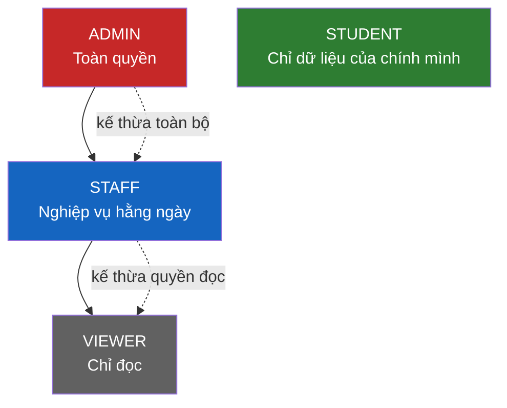

# 07 – PHÂN QUYỀN & BẢO MẬT

**Hệ thống:** DMS-KTX
**Phiên bản:** v2.1 (MongoDB + Mongoose · đăng ký theo phòng)

---

## 1. Mô hình phân quyền

Hệ thống dùng **RBAC (Role-Based Access Control)** với 4 vai trò cố định, không có quyền tùy biến theo từng người dùng trong v1.



| Vai trò | Nguyên tắc | Phạm vi dữ liệu |
|---------|------------|-----------------|
| `admin` | Toàn quyền, bao gồm quản lý tài khoản và cấu hình hệ thống | Toàn bộ |
| `staff` | Mọi nghiệp vụ vận hành, **trừ** quản lý tài khoản, cấu hình, xóa cứng | Toàn bộ dữ liệu nghiệp vụ |
| `viewer` | Chỉ đọc, không thay đổi bất cứ dữ liệu nào | Toàn bộ (chỉ đọc) |
| `student` | Chỉ thao tác trên dữ liệu của chính mình | Giới hạn theo `studentId` trong JWT |

> **Lưu ý:** `student` **không** kế thừa quyền của `viewer`. Đây là nhánh quyền hoàn toàn tách biệt — sinh viên không được xem danh sách sinh viên khác, không xem dashboard tổng hợp.

---

## 2. Ma trận phân quyền chi tiết

**Ký hiệu:** ✅ Toàn quyền · 👁 Chỉ đọc · 🔒 Chỉ dữ liệu của mình · ❌ Không có quyền

### 2.1. Quản trị hệ thống

| Chức năng | admin | staff | viewer | student |
|-----------|-------|-------|--------|---------|
| Xem danh sách tài khoản | ✅ | ❌ | ❌ | ❌ |
| Tạo/sửa tài khoản | ✅ | ❌ | ❌ | ❌ |
| Khóa/mở khóa tài khoản | ✅ | ❌ | ❌ | ❌ |
| Gán vai trò | ✅ | ❌ | ❌ | ❌ |
| Liên kết tài khoản ↔ hồ sơ sinh viên | ✅ | ✅ | ❌ | ❌ |
| Xem nhật ký hệ thống | ✅ (đọc file log của máy chủ) | ❌ | ❌ | ❌ |
| Đổi mật khẩu của chính mình | ✅ | ✅ | ✅ | ✅ |
| Đặt lại mật khẩu cho người khác (FR-09) | ✅ | ✅ (trừ tài khoản Admin) | ❌ | ❌ |

### 2.2. Quản lý sinh viên

| Chức năng | admin | staff | viewer | student |
|-----------|-------|-------|--------|---------|
| Xem danh sách sinh viên | ✅ | ✅ | 👁 | ❌ |
| Xem chi tiết hồ sơ | ✅ | ✅ | 👁 | 🔒 |
| Thêm hồ sơ sinh viên | ✅ | ✅ | ❌ | ❌ |
| Sửa hồ sơ sinh viên | ✅ | ✅ | ❌ | ❌ (FR-86) |
| Vô hiệu hóa hồ sơ | ✅ | ✅ | ❌ | ❌ |
| Export danh sách (CSV) | ✅ | ✅ | 👁 | ❌ |
| Xem thông tin nhạy cảm (CCCD, SĐT người thân) | ✅ | ✅ | ❌ | 🔒 |

### 2.3. Quản lý cơ sở vật chất

| Chức năng | admin | staff | viewer | student |
|-----------|-------|-------|--------|---------|
| Xem tòa nhà | ✅ | ✅ | 👁 | 👁 |
| Thêm/sửa tòa nhà | ✅ | ✅ | ❌ | ❌ |
| Ngừng hoạt động tòa nhà | ✅ | ❌ | ❌ | ❌ |
| Xem loại phòng (giá, tiền cọc, đồ cấp sẵn, số chỗ còn) | ✅ | ✅ | 👁 | 👁 (chỉ đếm phòng khớp giới tính) |
| **Thêm/sửa loại phòng — đặt giá và tiền cọc** | ✅ | ❌ | ❌ | ❌ |
| Xem phòng, sơ đồ tầng | ✅ | ✅ | 👁 | ❌ |
| Xem phòng còn chỗ (khi đăng ký) | ✅ | ✅ | ❌ | 👁 (chỉ phòng khớp giới tính) |
| Thêm/sửa phòng (giường tự sinh) | ✅ | ✅ | ❌ | ❌ |
| Ngừng hoạt động phòng | ✅ | ❌ | ❌ | ❌ |
| Đổi trạng thái giường (bảo trì) | ✅ | ✅ | ❌ | ❌ |
| ~~Thêm/xóa giường bằng tay~~ (bỏ ở v2.1 — giường tự sinh) | ❌ | ❌ | ❌ | ❌ |
| Xem người ở trong phòng | ✅ | ✅ | 👁 | 🔒 (chỉ phòng mình, chỉ họ tên + MSSV) |

> **Vì sao Staff không được sửa loại phòng:** giá thuê và tiền cọc là quyết định tài chính, cùng mức với danh mục loại phí (Admin). Staff vẫn tạo được phòng mới gắn vào loại phòng có sẵn.

### 2.4. Đơn đăng ký & hợp đồng

| Chức năng | admin | staff | viewer | student |
|-----------|-------|-------|--------|---------|
| Nộp đơn đăng ký chỗ ở | ❌ | ❌ | ❌ | 🔒 |
| Lập đơn hộ sinh viên đến trực tiếp | ✅ | ✅ | ❌ | ❌ |
| Tự hủy đơn khi còn chờ duyệt | ❌ | ❌ | ❌ | 🔒 |
| Xem hàng đợi đơn đăng ký | ✅ | ✅ | 👁 | 🔒 (đơn của mình) |
| **Duyệt đơn — hệ thống tự gán giường, tạo hợp đồng** | ✅ | ✅ | ❌ | ❌ |
| Đổi sang phòng khác cùng loại khi duyệt | ✅ | ✅ | ❌ | ❌ |
| Từ chối đơn | ✅ | ✅ | ❌ | ❌ |
| ~~Chọn giường cụ thể~~ (không ai được — BR-38) | ❌ | ❌ | ❌ | ❌ |
| Xem danh sách hợp đồng | ✅ | ✅ | 👁 | 🔒 |
| Sửa điều khoản hợp đồng | ✅ | ✅ | ❌ | ❌ |
| Chấm dứt hợp đồng trước hạn | ✅ | ✅ | ❌ | ❌ |
| ~~Chuyển phòng~~ (ngoài phạm vi v1) | ❌ | ❌ | ❌ | ❌ |
| Xem hợp đồng sắp hết hạn | ✅ | ✅ | 👁 | 🔒 (của mình) |
| In hợp đồng (qua trình duyệt) | ✅ | ✅ | ❌ | 🔒 |

### 2.5. Tài chính

| Chức năng | admin | staff | viewer | student |
|-----------|-------|-------|--------|---------|
| Quản lý danh mục loại phí | ✅ | 👁 | 👁 | ❌ |
| Nhập chỉ số điện nước | ✅ | ✅ | 👁 | ❌ |
| Xem danh sách hóa đơn | ✅ | ✅ | 👁 | 🔒 |
| Tạo hóa đơn thủ công | ✅ | ✅ | ❌ | ❌ |
| Lập hóa đơn hàng loạt theo kỳ | ✅ | ✅ | ❌ | ❌ |
| Sửa hóa đơn | ✅ | ✅ | ❌ | ❌ |
| Hủy hóa đơn | ✅ | ✅ | ❌ | ❌ |
| Ghi nhận thanh toán thủ công | ✅ | ✅ | ❌ | ❌ |
| Thanh toán trực tuyến | ❌ | ❌ | ❌ | 🔒 |
| Xem lịch sử thanh toán | ✅ | ✅ | 👁 | 🔒 |
| Đối soát giao dịch | ✅ | ✅ | ❌ | ❌ |

### 2.6. Yêu cầu gia hạn / trả phòng

| Chức năng | admin | staff | viewer | student |
|-----------|-------|-------|--------|---------|
| Gửi yêu cầu | ❌ | ❌ | ❌ | 🔒 |
| Tự hủy yêu cầu khi chờ xử lý | ❌ | ❌ | ❌ | 🔒 |
| Xem danh sách yêu cầu | ✅ | ✅ | 👁 | 🔒 |
| Duyệt / từ chối yêu cầu | ✅ | ✅ | ❌ | ❌ |

### 2.7. Dashboard

| Chức năng | admin | staff | viewer | student |
|-----------|-------|-------|--------|---------|
| Dashboard tổng quan | ✅ | ✅ | 👁 | ❌ |
| Tỷ lệ lấp đầy theo tòa | ✅ | ✅ | 👁 | ❌ |
| Số chỗ trống theo loại phòng | ✅ | ✅ | 👁 | ❌ |
| Xuất CSV danh sách sinh viên | ✅ | ✅ | 👁 | ❌ |

### 2.8. Nhu yếu phẩm *(v2.1)*

| Chức năng | admin | staff | viewer | student |
|-----------|-------|-------|--------|---------|
| Xem danh mục sản phẩm | ✅ | ✅ | 👁 | 🔒 (chỉ món không được cấp sẵn cho phòng mình) |
| Thêm/sửa sản phẩm, đặt giá, ngừng bán | ✅ | ✅ | ❌ | ❌ |
| Đặt hàng | ❌ | ❌ | ❌ | 🔒 (cần hợp đồng `active`) |
| Thanh toán đơn hàng | ❌ | ❌ | ❌ | 🔒 (qua hóa đơn `supplies`) |
| Thu tiền đơn hàng tại quầy | ✅ | ✅ | ❌ | ❌ |
| Xem danh sách đơn hàng | ✅ | ✅ | 👁 | 🔒 |
| Xác nhận đã giao | ✅ | ✅ | ❌ | ❌ |
| Hủy đơn chờ thanh toán | ✅ | ✅ | ❌ | 🔒 |

---

## 3. Cài đặt kiểm soát truy cập

### 3.1. Ba tầng kiểm soát

| Tầng | Cách làm | Mục đích |
|------|----------|----------|
| **1. Giao diện (FE)** | Ẩn menu/nút theo vai trò | Trải nghiệm tốt — **không** phải biện pháp bảo mật |
| **2. Route (FE)** | `<RoleRoute allowed={['admin','staff']}>` chặn truy cập URL | Ngăn người dùng gõ URL trực tiếp |
| **3. API (BE)** | Middleware `authenticate` + `authorize` trên từng route | **Biện pháp bảo mật thực sự** |

> ⚠️ **Nguyên tắc bất di bất dịch:** frontend chỉ làm nhiệm vụ hiển thị. Kẻ tấn công có thể gọi thẳng API bằng Postman. Mọi quyền hạn **phải** được kiểm tra ở backend.

### 3.2. Middleware backend

```js
// core/middlewares/auth.middleware.js
// Chữ ký thống nhất toàn dự án: new ApiError(httpStatus, CODE, message) — xem 14 mục 15.2
const authenticate = asyncHandler(async (req, res, next) => {
  const header = req.headers.authorization;
  if (!header?.startsWith('Bearer ')) {
    throw new ApiError(401, 'UNAUTHORIZED', 'Bạn chưa đăng nhập');
  }

  let payload;
  try {
    payload = jwt.verify(header.slice(7), env.JWT_SECRET);
  } catch (err) {
    const code = err.name === 'TokenExpiredError' ? 'TOKEN_EXPIRED' : 'UNAUTHORIZED';
    throw new ApiError(401, code, 'Phiên đăng nhập đã hết hạn, vui lòng đăng nhập lại');
  }

  // Kiểm tra lại tài khoản còn hoạt động (phòng trường hợp bị khóa sau khi cấp token)
  const user = await User.findOne({ _id: payload.userId, isActive: true }).lean();
  if (!user) throw new ApiError(401, 'UNAUTHORIZED', 'Tài khoản không còn hiệu lực');

  // studentId lấy từ hồ sơ Student gắn với tài khoản — KHÔNG lấy từ client
  const student = user.role === 'student'
    ? await Student.findOne({ userId: user._id }).select('_id').lean()
    : null;

  req.user = {
    id: user._id,
    role: user.role,
    studentId: student?._id ?? null,
    mustChangePassword: user.mustChangePassword,
  };
  next();
});

// Cùng file (v1 gộp chung, không tách rbac.middleware.js)
const authorize = (...allowedRoles) => (req, res, next) => {
  if (!allowedRoles.includes(req.user.role)) {
    throw new ApiError(403, 'FORBIDDEN', 'Bạn không có quyền thực hiện thao tác này');
  }
  next();
};

// Middleware riêng cho cổng sinh viên
const requireLinkedStudent = (req, res, next) => {
  if (req.user.role !== 'student' || !req.user.studentId) {
    throw new ApiError(403, 'FORBIDDEN', 'Tài khoản chưa được liên kết với hồ sơ sinh viên');
  }
  next();
};

module.exports = { authenticate, authorize, requireLinkedStudent };
```

**Cách dùng trong route:**
```js
router.get('/students',        authenticate, authorize('admin','staff','viewer'), studentController.list);
router.post('/students',       authenticate, authorize('admin','staff'),          studentController.create);
router.put('/room-types/:id', authenticate, authorize('admin'),                  roomTypeController.update);
router.patch('/applications/:id/approve', authenticate, authorize('admin','staff'), applicationController.approve);
router.use('/portal',          authenticate, authorize('student'), requireLinkedStudent, portalRoutes);
```

### 3.3. Kiểm soát quyền sở hữu dữ liệu (Ownership Check)

Đây là lỗ hổng phổ biến nhất (**IDOR – Insecure Direct Object Reference**): sinh viên A đổi ID trên URL để xem hóa đơn của sinh viên B.

**Cách làm SAI:**
```js
// ❌ NGUY HIỂM: lấy studentId từ query của client
const invoices = await invoiceService.findByStudent(req.query.studentId);
```

**Cách làm ĐÚNG:**
```js
// ✅ Luôn lấy studentId từ JWT (BR-86)
const invoices = await invoiceService.findByStudent(req.user.studentId);

// ✅ Với truy cập theo id cụ thể, phải kiểm tra quyền sở hữu
const getMyInvoiceDetail = asyncHandler(async (req, res) => {
  const invoice = await invoiceService.findById(req.params.id);
  if (!invoice) throw new ApiError(404, 'NOT_FOUND', 'Không tìm thấy hóa đơn');

  // ⚠️ ObjectId là object — so bằng !== thì LUÔN khác nhau và chặn nhầm cả chủ sở hữu.
  //    Phải dùng .equals() (hoặc so hai chuỗi String(a) === String(b)).
  if (!invoice.studentId.equals(req.user.studentId)) {
    // Trả 403 chứ không trả 404, để không lộ bản ghi có tồn tại hay không
    throw new ApiError(403, 'FORBIDDEN', 'Bạn không có quyền truy cập dữ liệu này');
  }
  res.json({ code: 'OK', message: 'Success', data: invoice });
});
```

**Danh sách endpoint bắt buộc kiểm tra ownership:**

| Endpoint | Kiểm tra |
|----------|----------|
| `GET /api/portal/my-invoices/:id` | `invoice.studentId.equals(req.user.studentId)` |
| `POST /api/payments/online/checkout` | hóa đơn trong body thuộc về `req.user.studentId` |
| `DELETE /api/portal/my-requests/:id` | `request.studentId` khớp **và** `status === 'pending'` |
| `DELETE /api/portal/my-applications/:id` | `application.studentId` khớp **và** `status === 'pending'` *(v2.1)* |
| `PATCH /api/portal/my-supply-orders/:id/cancel` | `order.studentId` khớp **và** `status === 'pending_payment'` *(v2.1)* |
| `GET /api/portal/my-residence` | lấy phòng từ Residency `active` của chính sinh viên; bạn cùng phòng chỉ trả họ tên + MSSV |
| `POST /api/portal/my-applications`, `POST /api/portal/my-supply-orders` | **không nhận** `studentId` trong body — lấy từ JWT *(v2.1)* |

> ⚠️ **Hai trường hợp đặc biệt của v2.1:**
> - `GET /api/rooms/available` và `GET /api/room-types?withAvailability=true` với vai trò `student`: lọc giới tính theo **hồ sơ của chính sinh viên**, bỏ qua mọi tham số `gender` client gửi lên. Nếu không, sinh viên nam gửi `?gender=female` là xem được và nộp đơn vào phòng nữ (backend vẫn chặn khi nộp nhờ BR-06, nhưng không được để lộ ngay từ bước xem).
> - `POST /api/portal/my-supply-orders`: **không nhận giá** từ client (BR-92). Client gửi giá thấp hơn thì sinh viên mua được hàng rẻ hơn giá thật.

### 3.4. Bảo vệ route phía Frontend

```jsx
// routes/RoleRoute.jsx
export function RoleRoute({ allowed, children }) {
  const { user, isAuthenticated } = useAuth();
  const location = useLocation();

  if (!isAuthenticated) {
    return <Navigate to="/login" state={{ from: location }} replace />;
  }
  if (!allowed.includes(user.role)) {
    return <Navigate to="/403" replace />;
  }
  return children;
}
```

```jsx
// Cách dùng trong AppRoutes
<Route element={<RoleRoute allowed={['admin','staff','viewer']}><AdminLayout /></RoleRoute>}>
  <Route path="/admin/dashboard" element={<DashboardPage />} />
  <Route path="/admin/students"  element={<StudentListPage />} />
  <Route element={<RoleRoute allowed={['admin']}><Outlet /></RoleRoute>}>
    <Route path="/admin/users"   element={<UserListPage />} />
    <Route path="/admin/settings" element={<SettingsPage />} />
  </Route>
</Route>

<Route element={<RoleRoute allowed={['student']}><PortalLayout /></RoleRoute>}>
  <Route path="/portal/home" element={<PortalHomePage />} />
</Route>
```

**Ẩn nút theo quyền:**
```jsx
// utils/permission.js — một nguồn quy tắc duy nhất cho giao diện (bản đầy đủ nằm ở file code)
const PERMISSIONS = {
  'student:create':     ['admin', 'staff'],
  'roomType:manage':    ['admin'],
  'room:create':        ['admin', 'staff'],
  'application:review': ['admin', 'staff'],
  'invoice:create':     ['admin', 'staff'],
  'payment:record':     ['admin', 'staff'],
  'supply:manage':      ['admin', 'staff'],
  'supplyOrder:deliver':['admin', 'staff'],
  'user:manage':        ['admin'],
};

export const can = (user, action) => PERMISSIONS[action]?.includes(user?.role) ?? false;

// Trong component
{can(user, 'application:review') && <Button onClick={handleApprove}>Duyệt và xếp phòng</Button>}
```

---

## 4. Luồng xác thực JWT


### 4.1. Nội dung JWT payload

```json
{
  "userId": 12,
  "role": "STUDENT",
  "studentId": 45,
  "iat": 1789012345,
  "exp": 1789015945
}
```
> **Không** đưa email, họ tên, hay bất kỳ thông tin nhạy cảm nào vào payload — JWT chỉ được ký, **không** được mã hóa; ai cũng giải mã đọc được nội dung.

### 4.2. Lưu token ở đâu trên Frontend?

| Cách lưu | Ưu điểm | Nhược điểm | Quyết định |
|----------|---------|------------|-----------|
| `localStorage` | Đơn giản, sống qua reload | Dễ bị đánh cắp nếu có lỗ hổng XSS | ✅ **Chọn cho v1** — đơn giản, phù hợp phạm vi đồ án |
| `httpOnly cookie` | An toàn trước XSS | Cần xử lý CSRF, cấu hình CORS phức tạp hơn | Cân nhắc cho v2 |

> ⚠️ **v1-lite:** token có hạn **7 ngày** (không dùng refresh token). Đánh đổi: nếu token bị lộ, kẻ tấn công dùng được lâu hơn so với phương án access token 60 phút. Ghi rõ điều này vào mục "Hạn chế" của báo cáo.
| Memory (biến) | An toàn nhất | Mất khi reload trang | Không phù hợp |

**Quyết định:** dùng `localStorage`, đồng thời **phải** phòng XSS nghiêm ngặt (mục 5.2) vì đây là đánh đổi đi kèm.

### 4.3. Axios interceptor xử lý token

Code thật nằm ở `src/lib/axiosClient.js`. v1 **không có refresh token** (FR-08): gặp `401` là xóa phiên và về trang đăng nhập.

```js
// src/lib/axiosClient.js
axiosClient.interceptors.request.use((config) => {
  const token = localStorage.getItem('token');
  if (token) config.headers.Authorization = `Bearer ${token}`;
  return config;
});

axiosClient.interceptors.response.use(
  (response) => response,
  (error) => {
    if (error.response?.status === 401) {
      localStorage.removeItem('token');
      localStorage.removeItem('user');
      if (window.location.pathname !== '/login') window.location.href = '/login';
    }
    return Promise.reject(error);
  },
);
```

> Mã lỗi đọc ở `error.response.data.code` (envelope `API.md` §1.1), **không phải** `errorCode`. Dùng sẵn `getErrorCode(err)` và `getErrorMessage(err)` trong cùng file.

---

## 5. Biện pháp bảo mật bắt buộc

### 5.1. Mật khẩu

| Biện pháp | Cài đặt |
|-----------|---------|
| Băm mật khẩu | `bcrypt` với `saltRounds = 10` (NFR-05) |
| Độ mạnh tối thiểu | ≥ 8 ký tự, có ít nhất 1 chữ cái và 1 chữ số (BR-81) |
| Không bao giờ trả về `passwordHash` | Đặt `select: false` trên trường này trong Mongoose schema, để mặc định mọi truy vấn đều không lấy nó |
| Không ghi mật khẩu vào log | Cấu hình logger lọc các trường `password`, `token`, `secret`, `temporaryPassword` |
| Đặt lại mật khẩu (FR-09) | Chỉ Admin/Staff; mật khẩu tạm sinh ngẫu nhiên ≥ 10 ký tự bằng `crypto.randomBytes`, **không** dùng `Math.random()`; trả về đúng **một lần** trong response, không lưu dạng rõ ở đâu; bật `mustChangePassword` (BR-85) |
| Chống leo thang đặc quyền | Staff **không** được reset mật khẩu tài khoản có `role = 'admin'` — nếu không, một Staff có thể chiếm quyền Admin |
| Đổi mật khẩu | Bắt buộc nhập lại mật khẩu hiện tại (FR-07) |
| Chống dò mật khẩu | Khóa 15 phút sau 5 lần sai (FR-05) + rate limit trên `/auth/login` |

### 5.2. Chống XSS

| Biện pháp | Cài đặt |
|-----------|---------|
| React tự escape | Mặc định an toàn — **tuyệt đối không** dùng `dangerouslySetInnerHTML` với dữ liệu người dùng nhập |
| Làm sạch đầu vào | Cắt khoảng trắng, loại bỏ thẻ HTML với các trường văn bản tự do (`note`, `reason`, `description`) |
| Content Security Policy | Bật qua `helmet()` ở backend |
| Escape khi xuất file | Khi xuất Excel/CSV, tránh lỗ hổng CSV injection: thêm dấu `'` trước các giá trị bắt đầu bằng `=`, `+`, `-`, `@` |

### 5.3. Chống SQL Injection

| Biện pháp | Cài đặt |
|-----------|---------|
| Dùng ORM | Mongoose tự tham số hóa toàn bộ truy vấn |
| Truy vấn thô | Nếu buộc phải dùng `$queryRaw`, **bắt buộc** dùng template literal có tham số: `` mongoose.$queryRaw`SELECT * FROM student WHERE id = ${id}` `` — **không** nối chuỗi |
| Whitelist cho sắp xếp | `sortBy` phải nằm trong danh sách cột cho phép, không truyền thẳng vào truy vấn |

### 5.4. Cấu hình bảo mật HTTP

```js
// app.js
app.use(helmet());                                    // Các header bảo mật cơ bản
app.use(cors({
  origin: env.CORS_ORIGIN.split(','),                  // Whitelist, KHÔNG dùng '*'
  credentials: true,
}));
app.use(express.json({ limit: '1mb' }));               // Chặn payload quá lớn

// Rate limit riêng cho các endpoint nhạy cảm
app.use('/api/auth/login',    rateLimit({ windowMs: 15*60*1000, max: 10 }));
app.use('/api/auth/register', rateLimit({ windowMs: 60*60*1000, max: 5  }));
app.use('/api',               rateLimit({ windowMs: 15*60*1000, max: 300 }));
```

### 5.5. Bảo mật thanh toán

| Rủi ro | Biện pháp | Quy tắc |
|--------|-----------|---------|
| Giả mạo IPN | Xác thực chữ ký HMAC bằng secret key trước mọi xử lý | BR-61 |
| Nhận kết quả trùng lặp | Kiểm tra trạng thái giao dịch bên trong transaction; nếu đã `success` thì bỏ qua, không ghi nhận lần hai | BR-56 |
| Sửa số tiền | So sánh số tiền trong IPN với số tiền của giao dịch đã tạo | BR-63 |
| Giả mạo kết quả tại Return URL | Ở v1-lite, kết quả **được** nhận qua Return URL nhưng **bắt buộc xác thực chữ ký HMAC ở backend** trước khi ghi nhận — không có `VNP_HASH_SECRET` thì không giả mạo được (`14` mục 4.10) | BR-61 |
| Lộ secret key | Để trong `.env`, không commit; ở production dùng biến môi trường của nền tảng | – |
| Thanh toán hộ người khác | Kiểm tra ownership hóa đơn trước khi tạo URL thanh toán | BR-85 |

### 5.6. Bảo vệ dữ liệu cá nhân

| Dữ liệu | Ai được xem | Cách xử lý |
|---------|-------------|------------|
| CCCD | Admin, Staff | Không trả trong API danh sách, chỉ ở API chi tiết |
| SĐT sinh viên | Admin, Staff, chính sinh viên | Che một phần khi hiển thị cho Viewer: `09xxxxx678` |
| SĐT người liên hệ khẩn cấp | Admin, Staff | Không lộ cho vai trò khác |
| Danh sách bạn cùng phòng | Sinh viên trong cùng phòng | **Chỉ** trả họ tên + MSSV, không trả SĐT/email/CCCD |
| Mật khẩu | Không ai | Chỉ lưu dạng băm |

---

## 6. Checklist bảo mật trước khi bàn giao

| # | Hạng mục | Cách kiểm tra | Đạt |
|---|----------|---------------|-----|
| 1 | Mọi endpoint (trừ nhóm công khai) đều có `authenticate` | Rà toàn bộ file route | ☐ |
| 2 | Mọi endpoint đều có `authorize` đúng theo ma trận mục 2 | Đối chiếu cột Roles trong các bảng endpoint mục 2–12 của `API.md` | ☐ |
| 3 | Mọi endpoint `/portal/*` lấy `studentId` từ JWT, không từ client | `grep -rn "req.query.studentId\|req.body.studentId" src/` phải không có kết quả | ☐ |
| 4 | Đã kiểm tra ownership ở các endpoint theo bảng mục 3.3 | Test thủ công: đăng nhập SV A, gọi API với ID của SV B → phải trả 403 | ☐ |
| 5 | Không có mật khẩu/token nào lọt vào response hoặc log | Rà response mẫu + đọc file log | ☐ |
| 6 | `.env` nằm trong `.gitignore` và chưa từng bị commit | `git log --all --full-history -- .env` phải trống | ☐ |
| 7 | Không còn secret key hardcode trong mã nguồn | `grep -rn "secret\|password\|apiKey" src/ --include=*.js` rà thủ công | ☐ |
| 8 | CORS chỉ whitelist domain frontend, không dùng `*` | Đọc `app.js` | ☐ |
| 9 | Rate limit đã bật cho `/auth/login` và `/auth/register` | Gọi 11 lần liên tiếp → lần cuối phải trả 429 | ☐ |
| 10 | Chữ ký IPN được xác thực trước khi cập nhật dữ liệu | Gửi IPN giả với chữ ký sai → hóa đơn không đổi, có log cảnh báo | ☐ |
| 11 | Mật khẩu mặc định của tài khoản seed đã đổi trên production | Thử đăng nhập bằng `Admin@123` → phải thất bại | ☐ |
| 12 | Production chạy trên HTTPS | Kiểm tra URL deploy | ☐ |
| 13 | Thông báo lỗi không lộ chi tiết kỹ thuật (stack trace) ra client | Gây lỗi 500 chủ ý, kiểm tra response | ☐ |
| 14 | Đã chạy `npm audit` và xử lý lỗ hổng mức high/critical | `npm audit --audit-level=high` | ☐ |
| 15 | Không so sánh ObjectId bằng `===`/`!==` | `grep -rn "studentId !==\|studentId ===" src/` phải không có kết quả | ☐ |
| 16 | Không API nào nhận `bedId`, `price`, `unitPrice`, `totalAmount` từ client *(v2.1)* | Rà các validator của `applications` và `supply-orders` | ☐ |

---

## 7. Lịch sử phiên bản

| Phiên bản | Ngày | Người thực hiện | Nội dung thay đổi |
|-----------|------|------------------|-------------------|
| v1.0 | 11/09/2026 | Cả nhóm | Chốt ma trận RBAC 4 vai trò, luồng JWT, checklist bảo mật |
| v1.1 | 12/09/2026 | BE Lead | Thêm quyền đặt lại mật khẩu (FR-09) kèm rào chặn leo thang đặc quyền Staff → Admin |
| **v2.1** | **13/09/2026** | BE Lead | **Đăng ký theo phòng + nhu yếu phẩm:** viết lại ma trận 2.3 (loại phòng — chỉ Admin đặt giá; bỏ thêm/xóa giường), 2.4 (đơn đăng ký, tự gán giường); thêm 2.8 Nhu yếu phẩm; rút gọn 2.7 theo phạm vi. Bảng ownership thêm đơn đăng ký, đơn hàng và hai trường hợp lọc giới tính / không nhận giá từ client. **Sửa mẫu code hỏng:** middleware còn cú pháp Prisma (`mongoose.user.findFirst({ where })`), thứ tự tham số `ApiError` ngược với phần còn lại của bộ tài liệu, so sánh ObjectId bằng `!==` (luôn chặn nhầm chủ sở hữu), mã lỗi không có trong `API.md`. Checklist thêm mục 15–16. |
| v2.0 | 12/09/2026 | BE Lead | **Rà soát theo bộ tài liệu v2.0:** vai trò và trạng thái đổi sang chữ thường; bỏ quyền chuyển phòng và nộp đơn của sinh viên (ngoài phạm vi v1); thêm quyền tạo Residency và kích hoạt hợp đồng; đăng nhập bằng email; `passwordHash` dùng `select: false` của Mongoose |
| v1.2 | 12/09/2026 | BE Lead | **Áp dụng v1-lite:** 1 JWT hạn 7 ngày (bỏ refresh token); gộp `rbac.middleware.js` vào `auth.middleware.js`; ghi nhật ký ra file thay bảng `audit_log`; xuất CSV thay Excel; làm rõ vì sao nhận kết quả thanh toán qua Return URL vẫn an toàn. Xem `14` |
