# 08 – THIẾT KẾ GIAO DIỆN (UI/UX)

**Hệ thống:** DMS-KTX
**Phiên bản:** v2.0 (MongoDB + Mongoose)
**Đối tượng:** Nhóm Frontend

---

## 1. Nguyên tắc thiết kế

| # | Nguyên tắc | Áp dụng cụ thể |
|---|------------|----------------|
| 1 | **Rõ ràng hơn đẹp mắt** | Đây là hệ thống quản trị nội bộ. Ưu tiên bảng dữ liệu dễ đọc, nhãn rõ ràng hơn là hiệu ứng động. |
| 2 | **Giảm số cú nhấp cho tác vụ thường xuyên** | Duyệt đơn, ghi nhận thanh toán, tra cứu giường trống phải thao tác được trong ≤ 3 cú nhấp từ dashboard. |
| 3 | **Trạng thái luôn nhìn thấy được** | Mọi trạng thái (hợp đồng, hóa đơn, giường) hiển thị bằng thẻ màu (Tag) thống nhất toàn hệ thống. |
| 4 | **Xác nhận trước hành động không thể hoàn tác** | Chấm dứt hợp đồng, hủy hóa đơn, vô hiệu hóa sinh viên đều phải có modal xác nhận nêu rõ hậu quả (NFR-11). |
| 5 | **Thông báo lỗi hữu ích** | Không hiện "Có lỗi xảy ra". Phải nói rõ lỗi gì và cách xử lý: "Giường A5 vừa được sinh viên khác đăng ký. Vui lòng chọn giường khác." |
| 6 | **Hai giao diện tách biệt** | Khu quản trị (dày đặc dữ liệu, sidebar) và cổng sinh viên (thoáng, tối giản, ưu tiên mobile) có bố cục riêng. |
| 7 | **Responsive** | Khu quản trị tối ưu cho desktop ≥ 1280px nhưng vẫn dùng được trên tablet. Cổng sinh viên **ưu tiên mobile trước** (NFR-09). |

---

## 2. Sitemap

```mermaid
flowchart TB
    ROOT["/"] --> LOGIN["/login"]
    ROOT --> REG["/register"]
    ROOT --> F403["/403 - Không có quyền"]
    ROOT --> F404["/404"]

    LOGIN -->|"ADMIN / STAFF / VIEWER"| ADMIN["/admin"]
    LOGIN -->|"STUDENT"| PORTAL["/portal"]

    ADMIN --> A1["/admin/dashboard"]
    ADMIN --> A2["/admin/students"]
    A2 --> A2a["/admin/students/new"]
    A2 --> A2b["/admin/students/:id"]
    ADMIN --> A3["/admin/buildings"]
    A3 --> A3a["/admin/buildings/:id"]
    A3 --> A3b["/admin/buildings/:id/map"]
    ADMIN --> A4["/admin/rooms"]
    A4 --> A4a["/admin/rooms/:id"]
    ADMIN --> A5["/admin/beds/available"]
    ADMIN --> A6["/admin/contracts"]
    A6 --> A6a["/admin/contracts/pending"]
    A6 --> A6b["/admin/contracts/new"]
    A6 --> A6c["/admin/contracts/:id"]
    A6 --> A6d["/admin/contracts/expiring"]
    ADMIN --> A7["/admin/requests"]
    A7 --> A7a["/admin/requests/:id"]
    ADMIN --> A8["/admin/invoices"]
    A8 --> A8a["/admin/invoices/new"]
    A8 --> A8b["/admin/invoices/generate"]
    A8 --> A8c["/admin/invoices/:id"]
    ADMIN --> A9["/admin/utility-readings"]
    ADMIN --> A10["/admin/payments"]
    ADMIN --> A11["/admin/reports"]
    ADMIN --> A12["/admin/users - chỉ ADMIN"]
    ADMIN --> A13["/admin/fee-types - chỉ ADMIN"]
    ADMIN --> A14["/admin/settings - chỉ ADMIN"]

    PORTAL --> P1["/portal/home"]
    PORTAL --> P2["/portal/my-residence"]
    PORTAL --> P3["/portal/available-beds"]
    PORTAL --> P4["/portal/apply"]
    PORTAL --> P5["/portal/my-contracts"]
    PORTAL --> P6["/portal/my-invoices"]
    P6 --> P6a["/portal/my-invoices/:id"]
    PORTAL --> P7["/portal/payment-result"]
    PORTAL --> P8["/portal/my-requests"]
    P8 --> P8a["/portal/my-requests/new"]
    PORTAL --> P9["/portal/profile"]
```



---

## 3. Bố cục chung

### 3.1. Khu quản trị (AdminLayout)

```
┌──────────────────────────────────────────────────────────────────────────┐
│ [☰] 🏢 QUẢN LÝ KÝ TÚC XÁ                  [Nguyễn Văn A ▾ (Nhân viên)]  │ ← Header 64px
├────────────┬─────────────────────────────────────────────────────────────┤
│            │  Trang chủ / Quản lý sinh viên                              │ ← Breadcrumb
│ 📊 Dashboard│ ┌─────────────────────────────────────────────────────────┐ │
│            │ │                                                         │ │
│ 👥 Sinh viên│ │              NỘI DUNG TRANG                             │ │
│            │ │                                                         │ │
│ 🏢 Cơ sở   ▸│ │                                                         │ │
│   Tòa nhà   │ │                                                         │ │
│   Phòng     │ │                                                         │ │
│   Giường trống│                                                         │ │
│            │ │                                                         │ │
│ 📋 Hợp đồng▸│ │                                                         │ │
│   Tất cả    │ │                                                         │ │
│   Chờ duyệt 5│                                                         │ │
│   Sắp hết hạn│ │                                                         │ │
│            │ │                                                         │ │
│ 📨 Yêu cầu 3│ │                                                         │ │
│            │ │                                                         │ │
│ 💰 Tài chính▸│ │                                                        │ │
│   Hóa đơn   │ │                                                         │ │
│   Chỉ số ĐN │ │                                                         │ │
│   Thanh toán│ │                                                         │ │
│            │ │                                                         │ │
│ 📈 Báo cáo  │ │                                                         │ │
│            │ │                                                         │ │
│ ⚙️ Hệ thống▸│ │                                                         │ │
│   (ADMIN)   │ └─────────────────────────────────────────────────────────┘ │
└────────────┴─────────────────────────────────────────────────────────────┘
   Sidebar 240px (thu gọn còn 80px)
```

**Quy tắc:**
- Sidebar hiển thị **số đếm (badge)** ở mục cần xử lý: yêu cầu gia hạn/trả phòng đang chờ (lấy từ `GET /api/dashboard/summary`).
- **Không có biểu tượng chuông thông báo** — hệ thống thông báo nằm ngoài phạm vi v1. Badge trên sidebar là cơ chế nhắc việc duy nhất.
- Các mục menu ẩn/hiện theo vai trò — dùng hàm `can()` ở `utils/permission.js`.
- Trên màn hình < 992px, sidebar tự thu gọn thành drawer.

### 3.2. Cổng sinh viên (PortalLayout)

```
┌────────────────────────────────────────────┐
│ 🏢 KTX ABC                 [Trần Thị B ▾] │ ← Header
├────────────────────────────────────────────┤
│                                            │
│              NỘI DUNG TRANG                │
│         (tối đa 960px, căn giữa)           │
│                                            │
├────────────────────────────────────────────┤
│  🏠      🛏️       📄       💰      👤     │ ← Tab bar dưới (mobile)
│ Trang  Chỗ ở  Hợp đồng  Hóa đơn  Cá nhân  │
└────────────────────────────────────────────┘
```
Trên desktop, tab bar chuyển thành menu ngang trên header.

---

## 4. Bảng màu & hệ thống thẻ trạng thái

### 4.1. Bảng màu

| Mục đích | Màu | Mã | Dùng ở đâu |
|----------|-----|-----|-----------|
| Chính (Primary) | Xanh dương | `#1677FF` | Nút chính, link, mục menu đang chọn |
| Thành công | Xanh lá | `#52C41A` | Đã thanh toán, hợp đồng hiệu lực, giường trống |
| Cảnh báo | Cam | `#FAAD14` | Sắp hết hạn, thanh toán một phần, chờ duyệt |
| Nguy hiểm | Đỏ | `#FF4D4F` | Quá hạn, từ chối, hành động xóa |
| Trung tính | Xám | `#8C8C8C` | Đã kết thúc, đã hủy, dữ liệu không hoạt động |
| Thông tin | Xanh ngọc | `#13C2C2` | Bảo trì, ghi chú |
| Nền | Xám nhạt | `#F5F5F5` | Nền trang |

### 4.2. Ánh xạ trạng thái → nhãn + màu

Toàn bộ định nghĩa này nằm ở **một file duy nhất** `src/constants/statuses.js` và dùng lại ở mọi nơi:

```js
export const CONTRACT_STATUS = {
  PENDING:    { label: 'Chờ duyệt',      color: 'warning' },
  ACTIVE:     { label: 'Đang hiệu lực',  color: 'success' },
  REJECTED:   { label: 'Bị từ chối',     color: 'error'   },
  CANCELLED:  { label: 'Đã hủy',         color: 'default' },
  EXPIRED:    { label: 'Hết hạn',        color: 'default' },
  TERMINATED: { label: 'Đã chấm dứt',    color: 'default' },
};

export const INVOICE_STATUS = {
  UNPAID:         { label: 'Chưa thanh toán',      color: 'warning' },
  partial: { label: 'Thanh toán một phần',  color: 'processing' },
  PAID:           { label: 'Đã thanh toán',        color: 'success' },
  OVERDUE:        { label: 'Quá hạn',              color: 'error'   },
  CANCELLED:      { label: 'Đã hủy',               color: 'default' },
};

export const BED_STATUS = {
  AVAILABLE:   { label: 'Trống',       color: 'success' },
  OCCUPIED:    { label: 'Đã sử dụng',  color: 'processing' },
  MAINTENANCE: { label: 'Bảo trì',     color: 'default' },
};

export const PAYMENT_STATUS = {
  PENDING:                { label: 'Đang xử lý',      color: 'processing' },
  SUCCESS:                { label: 'Thành công',      color: 'success' },
  FAILED:                 { label: 'Thất bại',        color: 'error' },
  EXPIRED:                { label: 'Hết hạn',         color: 'default' },
  REFUNDED:               { label: 'Đã hoàn tiền',    color: 'warning' },
  NEEDS_RECONCILIATION:   { label: 'Cần đối soát',    color: 'error' },
};

export const REQUEST_STATUS = {
  PENDING:   { label: 'Chờ xử lý',  color: 'warning' },
  APPROVED:  { label: 'Đã duyệt',   color: 'success' },
  REJECTED:  { label: 'Bị từ chối', color: 'error'   },
  CANCELLED: { label: 'Đã hủy',     color: 'default' },
};
```

### 4.3. Quy ước định dạng

| Loại dữ liệu | Định dạng | Ví dụ |
|--------------|-----------|-------|
| Tiền tệ | Dấu chấm phân cách nghìn + " đ" | `646.000 đ` |
| Ngày | `DD/MM/YYYY` | `15/12/2026` |
| Ngày giờ | `DD/MM/YYYY HH:mm` | `15/12/2026 14:30` |
| Kỳ | `Tháng MM/YYYY` | `Tháng 10/2026` |
| Tỷ lệ phần trăm | 2 chữ số thập phân | `87,75%` |
| Số điện thoại | Nhóm 4-3-3 | `0912 345 678` |

---

## 5. Danh sách màn hình

### 5.1. Nhóm công khai & xác thực

| Mã | Màn hình | Đường dẫn | Quyền | FR |
|----|----------|-----------|-------|-----|
| SCR-01 | Đăng nhập | `/login` | Public | FR-01 |
| SCR-02 | Đăng ký tài khoản sinh viên | `/register` | Public | FR-85 |
| SCR-03 | Đổi mật khẩu | `/change-password` | Tất cả | FR-07, FR-09 |
| SCR-04 | Không có quyền truy cập | `/403` | Tất cả | – |
| SCR-05 | Không tìm thấy trang | `/404` | Tất cả | – |

### 5.2. Khu quản trị

| Mã | Màn hình | Đường dẫn | Quyền | FR |
|----|----------|-----------|-------|-----|
| SCR-10 | Dashboard | `/admin/dashboard` | A S V | FR-75→79 |
| SCR-11 | Danh sách sinh viên | `/admin/students` | A S V | FR-15 |
| SCR-12 | Thêm/Sửa sinh viên | `/admin/students/new`, `/:id/edit` | A S | FR-10, FR-13 |
| SCR-13 | Chi tiết sinh viên | `/admin/students/:id` | A S V | FR-12 |
| SCR-21 | Danh sách tòa nhà | `/admin/buildings` | A S V | FR-20 |
| SCR-22 | Sơ đồ tòa nhà | `/admin/buildings/:id/map` | A S V | FR-26 |
| SCR-23 | Danh sách phòng | `/admin/rooms` | A S V | FR-21 |
| SCR-24 | Chi tiết phòng & quản lý giường | `/admin/rooms/:id` | A S V | FR-22, FR-23 |
| SCR-25 | Tra cứu giường trống | `/admin/beds/available` | A S V | FR-28 |
| SCR-31 | Danh sách hợp đồng | `/admin/contracts` | A S V | FR-36 |
| SCR-32 | Đăng ký lưu trú (xếp sinh viên vào giường) | `/admin/residencies` | A S | FR-30, FR-31 |
| SCR-33 | Tạo hợp đồng | `/admin/contracts/new` | A S | FR-31 |
| SCR-34 | Chi tiết hợp đồng | `/admin/contracts/:id` | A S V | FR-36, FR-39 |
| SCR-35 | Hợp đồng sắp hết hạn | `/admin/contracts/expiring` | A S | FR-38 |
| SCR-41 | Danh sách yêu cầu | `/admin/requests` | A S V | FR-48 |
| SCR-42 | Chi tiết & xử lý yêu cầu | `/admin/requests/:id` | A S | FR-49 |
| SCR-51 | Danh sách hóa đơn | `/admin/invoices` | A S V | FR-58 |
| SCR-52 | Tạo hóa đơn thủ công | `/admin/invoices/new` | A S | FR-58 |
| SCR-53 | Lập hóa đơn hàng loạt | `/admin/invoices/generate` | A S | FR-59 |
| SCR-54 | Chi tiết hóa đơn | `/admin/invoices/:id` | A S V | FR-70 |
| SCR-55 | Nhập chỉ số điện nước | `/admin/utility-readings` | A S | FR-56 |
| SCR-56 | Lịch sử thanh toán | `/admin/payments` | A S V | FR-67 |
| SCR-57 | Trung tâm báo cáo | `/admin/reports` | A S V | FR-80→82 |
| SCR-81 | Quản lý tài khoản | `/admin/users` | A | FR-06 |
| SCR-82 | Danh mục loại phí | `/admin/fee-types` | A | FR-55 |
| SCR-83 | Cấu hình hệ thống | `/admin/settings` | A | – |
| SCR-84 | Đặt lại mật khẩu người dùng (modal trong SCR-81) | `/admin/users` | A S | FR-09 |

### 5.3. Cổng sinh viên

| Mã | Màn hình | Đường dẫn | FR |
|----|----------|-----------|-----|
| SCR-61 | Trang chủ sinh viên | `/portal/home` | FR-82 |
| SCR-62 | Chỗ ở của tôi | `/portal/my-residence` | FR-82 |
| SCR-63 | Tra cứu giường trống | `/portal/available-beds` | FR-83 |
| SCR-64 | Nộp đơn đăng ký | `/portal/apply` | FR-30 |
| SCR-65 | Hợp đồng của tôi | `/portal/my-contracts` | FR-91 |
| SCR-66 | Hóa đơn của tôi | `/portal/my-invoices` | FR-70 |
| SCR-67 | Chi tiết hóa đơn & thanh toán | `/portal/my-invoices/:id` | FR-64, FR-70 |
| SCR-68 | Kết quả thanh toán | `/portal/payment-result` | FR-65 |
| SCR-69 | Yêu cầu của tôi | `/portal/my-requests` | FR-53 |
| SCR-70 | Gửi yêu cầu mới | `/portal/my-requests/new` | FR-45, FR-46 |
| SCR-72 | Hồ sơ cá nhân (chỉ đọc) | `/portal/profile` | FR-90 |

---

## 6. Đặc tả chi tiết các màn hình trọng yếu

### SCR-10: Dashboard

```
┌──────────────────────────────────────────────────────────────────────────┐
│ Dashboard                              [Tòa nhà: Tất cả ▾] [🔄 Làm mới]  │
├──────────────────────────────────────────────────────────────────────────┤
│ ┌──────────────┐┌──────────────┐┌──────────────┐┌──────────────┐        │
│ │ 🛏️ TỔNG GIƯỜNG││ ✅ ĐÃ SỬ DỤNG││ 🟢 CÒN TRỐNG ││ 📊 TỶ LỆ LẤP ĐẦY│      │
│ │     420      ││     358      ││      50      ││   87,75%     │        │
│ │              ││   ▲ +12 tuần ││              ││ ████████░░   │        │
│ └──────────────┘└──────────────┘└──────────────┘└──────────────┘        │
│ ┌──────────────┐┌──────────────┐┌──────────────┐┌──────────────┐        │
│ │ 👥 SV ĐANG Ở  ││ 📋 HĐ HIỆU LỰC││ 💰 TỔNG CÔNG NỢ││ ⚠️ HĐ QUÁ HẠN │      │
│ │     358      ││     358      ││  48.620.000đ ││      27      │        │
│ │              ││  5 chờ duyệt ││              ││ 12.480.000đ  │        │
│ └──────────────┘└──────────────┘└──────────────┘└──────────────┘        │
├────────────────────────────────┬─────────────────────────────────────────┤
│ TỶ LỆ LẤP ĐẦY THEO TÒA         │ DOANH THU 12 THÁNG                      │
│  B1 ████████████████░░ 91%     │      ╱╲    ╱╲                           │
│  B2 ██████████████░░░░ 87%     │   ╱╲╱  ╲╱╲╱  ╲___                       │
│  B3 ███████████░░░░░░░ 72%     │  1  3  5  7  9  11                      │
├────────────────────────────────┴─────────────────────────────────────────┤
│ ⚠️ HỢP ĐỒNG SẮP HẾT HẠN (23)                          [Xem tất cả →]     │
│ ┌────────────┬──────────────┬────────┬──────────┬─────────┬───────────┐ │
│ │ Mã HĐ      │ Sinh viên    │ Phòng  │ Hết hạn  │ Còn lại │ Thao tác  │ │
│ ├────────────┼──────────────┼────────┼──────────┼─────────┼───────────┤ │
│ │HD-2026-0042│Trần Thị B    │B2-301  │30/09/2026│ 🟠 19 ng│[Chi tiết] │ │
│ └────────────┴──────────────┴────────┴──────────┴─────────┴───────────┘ │
├──────────────────────────────────────────────────────────────────────────┤
│ 📥 CẦN XỬ LÝ                                                             │
│  • 5 đơn đăng ký chờ duyệt      [Xử lý →]                               │
│  • 3 yêu cầu gia hạn chờ duyệt  [Xử lý →]                               │
│  • 2 yêu cầu trả phòng chờ duyệt [Xử lý →]                              │
└──────────────────────────────────────────────────────────────────────────┘
```

**Ghi chú kỹ thuật:**
- Gọi song song 5 API bằng `Promise.all` trong một hook `useApi` riêng, hiển thị skeleton riêng cho từng khối.
- Viewer: ẩn cột "Thao tác" và toàn bộ khối "Cần xử lý".
- Thẻ chỉ số bấm được → điều hướng sang màn hình tương ứng đã lọc sẵn.

---

### SCR-11: Danh sách sinh viên

```
┌──────────────────────────────────────────────────────────────────────────┐
│ Quản lý sinh viên                    [📥 Import] [📤 Export] [+ Thêm SV] │
├──────────────────────────────────────────────────────────────────────────┤
│ [🔍 Tìm tên, MSSV, SĐT...] [Trạng thái ▾][Tòa ▾][Phòng ▾][Khoa ▾] [Xóa lọc]│
├──────────────────────────────────────────────────────────────────────────┤
│ ┌──┬─────────┬──────────────┬────┬──────────┬──────────┬─────────┬─────┐│
│ │# │ MSSV    │ Họ tên       │ GT │ Lớp      │ Chỗ ở    │ Công nợ │ ... ││
│ ├──┼─────────┼──────────────┼────┼──────────┼──────────┼─────────┼─────┤│
│ │1 │SV2024001│Trần Thị B    │ Nữ │CNTT2024A │B2-301-A3 │ 646.000đ│ ⋮   ││
│ │2 │SV2024002│Nguyễn Văn C  │Nam │KT2024B   │  —       │      0đ │ ⋮   ││
│ └──┴─────────┴──────────────┴────┴──────────┴──────────┴─────────┴─────┘│
│                                     ◀ 1 2 3 ... 7 ▶   Tổng: 137 SV      │
└──────────────────────────────────────────────────────────────────────────┘
```

**Đặc tả:**
- Ô tìm kiếm áp dụng **debounce 400ms** trước khi gọi API.
- Bộ lọc lưu vào URL query string để có thể chia sẻ link và giữ nguyên khi quay lại (dùng `useSearchParams`).
- Cột "Chỗ ở" hiện `—` khi chưa lưu trú, bấm được để mở phòng.
- Cột "Công nợ" tô đỏ khi > 0.
- Menu `⋮`: Xem chi tiết · Sửa · Tạo hợp đồng (nếu chưa có) · Vô hiệu hóa.
- Phân trang phía server, mặc định 20 bản ghi/trang.

---

### SCR-22: Sơ đồ tòa nhà

```
┌──────────────────────────────────────────────────────────────────────────┐
│ Sơ đồ Tòa B2 - Nữ          🟩 Trống  🟨 Còn chỗ  🟥 Đầy  ⬜ Bảo trì      │
├──────────────────────────────────────────────────────────────────────────┤
│ Tầng 5 │ ┌─────┐ ┌─────┐ ┌─────┐ ┌─────┐                                │
│        │ │ 501 │ │ 502 │ │ 503 │ │ 504 │                                │
│        │ │ 8/8 │ │ 6/8 │ │ 8/8 │ │ 0/8 │                                │
│        │ │ 🟥  │ │ 🟨  │ │ 🟥  │ │ ⬜  │                                │
│        │ └─────┘ └─────┘ └─────┘ └─────┘                                │
│ Tầng 4 │ ┌─────┐ ┌─────┐ ┌─────┐ ┌─────┐                                │
│        │ │ 401 │ │ 402 │ │ 403 │ │ 404 │                                │
│        │ │ 7/8 │ │ 8/8 │ │ 5/8 │ │ 8/8 │                                │
│        │ │ 🟨  │ │ 🟥  │ │ 🟨  │ │ 🟥  │                                │
│        │ └─────┘ └─────┘ └─────┘ └─────┘                                │
└──────────────────────────────────────────────────────────────────────────┘
```

**Đặc tả:**
- Rê chuột lên ô phòng → tooltip hiện loại phòng, giá, số giường trống.
- Bấm vào ô → mở drawer bên phải hiển thị danh sách giường và người ở, có nút "Xếp sinh viên vào giường trống".
- Dữ liệu từ `GET /buildings/:id/map`, màu lấy theo trường `fillLevel`.

---

### SCR-32: Đăng ký lưu trú — Staff xếp sinh viên vào giường

```
┌──────────────────────────────────────────────────────────────────────────┐
│ Đơn đăng ký chờ duyệt (5)                                                │
├──────────────────────────────────────────────────────────────────────────┤
│ ┌──────────────────────────────────────────────────────────────────────┐│
│ │ HD-2026-00043 · Nộp lúc 27/08/2026 14:02          [🟠 Chờ duyệt]     ││
│ │ ──────────────────────────────────────────────────────────────────── ││
│ │ 👤 Trần Thị B (SV2024001) · Nữ · CNTT2024A · 0912 345 678           ││
│ │ 🛏️ Tòa B2 - Phòng 301 - Giường A5 · 400.000đ/tháng                  ││
│ │ 📅 01/09/2026 → 30/06/2027 (10 tháng)                                ││
│ │ 💬 "Em muốn ở gần bạn cùng lớp"                                      ││
│ │                                                                      ││
│ │ ℹ️ Hóa đơn sẽ tạo khi duyệt: cọc 500.000đ + phòng T9 400.000đ       ││
│ │                                            = 900.000đ (hạn 08/09)    ││
│ │                                                                      ││
│ │                         [✗ Từ chối]  [✓ Duyệt đơn]                  ││
│ └──────────────────────────────────────────────────────────────────────┘│
└──────────────────────────────────────────────────────────────────────────┘
```

**Đặc tả:**
- Hiển thị dạng thẻ (card) thay vì bảng, vì nhân viên cần xem đủ thông tin để ra quyết định ngay.
- Khối "Hóa đơn sẽ tạo khi duyệt" giúp nhân viên biết trước hệ quả tài chính (dữ liệu từ `estimatedFirstInvoice`).
- Bấm "Duyệt" → modal xác nhận → gọi API → hiện thông báo kèm mã hóa đơn vừa tạo.
- Bấm "Từ chối" → modal bắt buộc nhập lý do (tối thiểu 10 ký tự).
- Nếu API trả `409 BED_NOT_AVAILABLE` → hiện cảnh báo đỏ ngay trên thẻ đó và gợi ý "Chọn giường khác".

---

### SCR-53: Lập hóa đơn hàng loạt

```
┌──────────────────────────────────────────────────────────────────────────┐
│ Lập hóa đơn theo kỳ                                                      │
├──────────────────────────────────────────────────────────────────────────┤
│ Bước 1: Chọn kỳ                                                          │
│   Kỳ thanh toán: [Tháng 10 ▾] [2026 ▾]    Hạn thanh toán: [10/11/2026]  │
│   Phạm vi: (•) Tất cả tòa nhà  ( ) Chọn tòa: [B1][B2][B3]              │
│   Khoản phí: [✓] Tiền phòng  [✓] Tiền điện  [✓] Tiền nước              │
│                                                     [Kiểm tra dữ liệu →] │
├──────────────────────────────────────────────────────────────────────────┤
│ Bước 2: Xem trước                                                        │
│ ✅ 58/60 phòng đã có chỉ số điện nước                                    │
│ ⚠️ 2 phòng chưa nhập chỉ số — sẽ bị bỏ qua:                             │
│    • B2-405: chưa nhập  [Nhập ngay →]                                   │
│    • B3-201: chưa nhập  [Nhập ngay →]                                   │
│ ⚠️ 1 sinh viên đã có hóa đơn kỳ này — sẽ bỏ qua: SV2024033             │
│                                                                          │
│ 📊 Dự kiến: 118 hóa đơn · Tổng tiền 76.228.000đ                         │
│                                        [Quay lại]  [✓ Xác nhận lập]     │
├──────────────────────────────────────────────────────────────────────────┤
│ Bước 3: Kết quả                                                          │
│ ✅ Đã lập thành công 118 hóa đơn, tổng 76.228.000đ                      │
│                          [Xem danh sách hóa đơn] [Lập kỳ khác]          │
└──────────────────────────────────────────────────────────────────────────┘
```

**Đặc tả:**
- Dùng component `Steps` của Ant Design, 3 bước.
- Bước 2 **bắt buộc** — không cho lập ngay từ bước 1, để nhân viên nhìn thấy cảnh báo trước.
- Nút "Nhập ngay" mở modal nhập chỉ số cho phòng đó mà không rời khỏi luồng.
- Đây là thao tác tạo nhiều bản ghi → nút xác nhận phải khóa trong lúc đang gọi API, tránh nhấn đúp.

---

### SCR-54: Chi tiết hóa đơn

```
┌──────────────────────────────────────────────────────────────────────────┐
│ Hóa đơn INV-202610-00201            [🟠 Thanh toán một phần]             │
│                                  [🖨 In PDF] [💵 Ghi nhận TT] [✗ Hủy HĐ] │
├──────────────────────────────────────────────────────────────────────────┤
│ Sinh viên: Trần Thị B (SV2024001)      Kỳ: Tháng 10/2026                │
│ Chỗ ở: Tòa B2 - Phòng 301 - Giường A3  Ngày lập: 01/11/2026             │
│ Hợp đồng: HD-2026-00042                Hạn TT: 10/11/2026               │
├──────────────────────────────────────────────────────────────────────────┤
│ ┌────┬──────────────────────────────────┬──────┬───────────┬───────────┐│
│ │ #  │ Khoản phí                        │ SL   │ Đơn giá   │ Thành tiền││
│ ├────┼──────────────────────────────────┼──────┼───────────┼───────────┤│
│ │ 1  │ Tiền phòng tháng 10/2026         │ 1    │  400.000  │  400.000  ││
│ │ 2  │ Tiền điện T10/2026 (60 kWh/người)│ 60   │    2.500  │  150.000  ││
│ │ 3  │ Tiền nước T10/2026 (8 m³/người)  │ 8    │   12.000  │   96.000  ││
│ ├────┴──────────────────────────────────┴──────┴───────────┼───────────┤│
│ │                                              TỔNG TIỀN   │  646.000đ ││
│ │                                              ĐÃ THANH TOÁN│ -400.000đ ││
│ │                                              CÒN NỢ      │  246.000đ ││
│ └──────────────────────────────────────────────────────────┴───────────┘│
├──────────────────────────────────────────────────────────────────────────┤
│ LỊCH SỬ THANH TOÁN                                                       │
│ ┌────────────┬───────────┬──────────┬──────────┬────────────┬──────────┐│
│ │ Mã GD      │ Ngày      │ Số tiền  │ Phương thức│ Trạng thái │ Người ghi││
│ ├────────────┼───────────┼──────────┼──────────┼────────────┼──────────┤│
│ │PAY...ABC123│05/11 10:23│ 400.000đ │VNPay     │🟢 Thành công│ (online) ││
│ └────────────┴───────────┴──────────┴──────────┴────────────┴──────────┘│
└──────────────────────────────────────────────────────────────────────────┘
```

**Đặc tả:**
- Nút "Hủy hóa đơn" **bị vô hiệu hóa** (kèm tooltip giải thích) khi hóa đơn đã có thanh toán thành công (BR-47).
- Nút "Ghi nhận TT" mở modal: số tiền (mặc định = còn nợ, không cho nhập vượt), phương thức, ngày, ghi chú.
- Sau khi ghi nhận thành công, hóa đơn cập nhật tại chỗ (invalidate query), không cần tải lại trang.

---

### SCR-61: Trang chủ sinh viên (ưu tiên mobile)

```
┌────────────────────────────────────┐
│ Xin chào, Trần Thị B 👋            │
├────────────────────────────────────┤
│ ┌────────────────────────────────┐ │
│ │ 🏠 CHỖ Ở CỦA TÔI               │ │
│ │ Tòa B2 · Phòng 301 · Giường A3 │ │
│ │ HĐ: 01/09/2026 → 30/06/2027    │ │
│ │ 🟢 Đang hiệu lực · còn 292 ngày│ │
│ │                    [Chi tiết →]│ │
│ └────────────────────────────────┘ │
│ ┌────────────────────────────────┐ │
│ │ ⚠️ CẦN THANH TOÁN              │ │
│ │        246.000 đ               │ │
│ │ Hạn: 10/11/2026 (còn 3 ngày)   │ │
│ │        [💳 Thanh toán ngay]     │ │
│ └────────────────────────────────┘ │
│ ┌────────────────────────────────┐ │
│ │ THAO TÁC NHANH                 │ │
│ │ [📄 Hóa đơn] [📋 Hợp đồng]     │ │
│ │ [📨 Gửi yêu cầu] [🛏️ Giường trống]│
│ └────────────────────────────────┘ │
├────────────────────────────────────┤
│ 🏠    🛏️    📄    💰    👤         │
└────────────────────────────────────┘
```

**Các trạng thái hiển thị khác nhau:**

| Tình huống sinh viên | Nội dung hiển thị |
|----------------------|-------------------|
| Chưa lưu trú | Thẻ "Bạn chưa được xếp chỗ ở" + hướng dẫn liên hệ văn phòng KTX (v1: **Staff xếp giường**, sinh viên không tự đăng ký) |
| Đã có hợp đồng `pending` | Thẻ "Hợp đồng của bạn đang chờ kích hoạt" + thông tin giường Staff đã xếp |
| Đơn bị từ chối | Thẻ đỏ hiện lý do từ chối + nút "Đăng ký lại" |
| Đang lưu trú, không nợ | Thẻ chỗ ở (xanh) + "Bạn đã thanh toán đầy đủ ✅" |
| Đang lưu trú, có nợ | Thẻ chỗ ở + thẻ cảnh báo công nợ (cam/đỏ nếu quá hạn) |
| Hợp đồng sắp hết hạn | Thêm thẻ "Hợp đồng sắp hết hạn, bạn có muốn gia hạn?" + nút gửi yêu cầu |

---

### SCR-64: Nộp đơn đăng ký (luồng 3 bước)

```
Bước 1: Chọn chỗ ở            Bước 2: Chọn thời gian      Bước 3: Xác nhận
┌──────────────────────┐      ┌──────────────────────┐    ┌──────────────────┐
│ Tòa nhà              │      │ Ngày bắt đầu         │    │ 📋 THÔNG TIN ĐƠN │
│ [Tòa B2 - Nữ    ▾]  │      │ [01/09/2026     📅]  │    │                  │
│                      │      │                      │    │ Tòa B2 · P.301   │
│ Lọc: [Loại phòng ▾]  │      │ Ngày kết thúc        │    │ Giường A5        │
│      [Giá tối đa ▾]  │      │ [30/06/2027     📅]  │    │ 01/09 → 30/06    │
│                      │      │                      │    │ (10 tháng)       │
│ Phòng còn trống:     │      │ ⏱ Thời hạn: 10 tháng│    │                  │
│ ┌──────────────────┐ │      │                      │    │ 💰 CHI PHÍ       │
│ │ P.301 · 2 chỗ    │ │      │ Ghi chú (tùy chọn)   │    │ Cọc:    500.000đ │
│ │ 400.000đ/tháng   │ │      │ [________________]   │    │ Phòng T9:400.000đ│
│ │ ○ A5  ○ A7       │ │      │                      │    │ ───────────────  │
│ └──────────────────┘ │      │                      │    │ Tổng:   900.000đ │
│ ┌──────────────────┐ │      │                      │    │ Hạn TT: 08/09    │
│ │ P.305 · 3 chỗ    │ │      │                      │    │                  │
│ └──────────────────┘ │      │                      │    │ [✓] Tôi đồng ý   │
│         [Tiếp theo →]│      │ [← Quay lại][Tiếp →] │    │    với nội quy   │
└──────────────────────┘      └──────────────────────┘    │  [✓ Nộp đơn]     │
                                                           └──────────────────┘
```

**Đặc tả:**
- Bước 1 chỉ hiện tòa nhà phù hợp giới tính của sinh viên (BR-06) — lọc ở backend, không để sinh viên chọn rồi mới báo lỗi.
- Chọn giường xong, **làm mới danh sách trước khi sang bước 3** để giảm khả năng chọn phải giường vừa bị người khác lấy.
- Nếu API trả `409 BED_NOT_AVAILABLE` → quay về bước chọn giường, hiện thông báo rõ ràng, tự động tải lại danh sách giường trống.
- Ô "Tôi đồng ý với nội quy" bắt buộc tích mới cho nộp.

---

### SCR-67: Chi tiết hóa đơn & thanh toán (sinh viên)

```
┌────────────────────────────────────┐
│ ← Hóa đơn tháng 10/2026            │
│ INV-202610-00201  [🟠 Còn nợ]      │
├────────────────────────────────────┤
│ Tiền phòng                400.000đ │
│ Tiền điện (60 kWh)        150.000đ │
│ Tiền nước (8 m³)           96.000đ │
│ ─────────────────────────────────  │
│ Tổng cộng                 646.000đ │
│ Đã thanh toán            -400.000đ │
│ ═════════════════════════════════  │
│ CÒN NỢ                    246.000đ │
│ Hạn thanh toán: 10/11/2026         │
├────────────────────────────────────┤
│ 💳 THANH TOÁN                      │
│ Số tiền: [246.000        ] đ       │
│          (tối đa 246.000đ)         │
│                                    │
│ Chọn phương thức:                  │
│  (•) 🔵 VNPay                      │
│      (v1-lite chỉ hỗ trợ VNPay)    │
│                                    │
│      [Thanh toán 246.000 đ]        │
├────────────────────────────────────┤
│ LỊCH SỬ THANH TOÁN                 │
│ 05/11 · 400.000đ · VNPay · ✅      │
└────────────────────────────────────┘
```

**Xử lý luồng thanh toán:**
1. Bấm thanh toán → gọi API → nhận `paymentUrl` → `window.location.href = paymentUrl`.
2. Trước khi chuyển hướng, lưu `transactionRef` vào `sessionStorage` để đối chiếu khi quay về.
3. Sau khi cổng chuyển về `/portal/payment-result?ref=...`, màn hình SCR-68 **hiển thị trạng thái đang kiểm tra**, gọi `GET /payments/:ref`, thử lại tối đa 5 lần cách nhau 2 giây (vì IPN có thể chưa kịp về).
4. Sau 5 lần vẫn `pending` → hiện "Giao dịch đang được xử lý, vui lòng kiểm tra lại sau ít phút" kèm nút làm mới. **Không** hiển thị "Thất bại" khi chưa chắc chắn.

---

## 7. Component dùng chung cần xây dựng

| Component | Mục đích | Dùng ở |
|-----------|----------|--------|
| `<DataTable>` | Bọc Ant Table: phân trang server, sắp xếp, trạng thái loading/empty thống nhất | Mọi màn hình danh sách |
| `<StatusTag status type>` | Hiển thị thẻ trạng thái theo `constants/statuses.js` | Khắp nơi |
| `<MoneyText value>` | Định dạng tiền tệ, tô đỏ khi là số nợ | Hóa đơn, dashboard |
| `<ConfirmModal>` | Hộp thoại xác nhận có mô tả hậu quả | Mọi hành động nguy hiểm |
| `<FilterBar>` | Thanh lọc đồng bộ với URL query string | Màn hình danh sách |
| `<EmptyState>` | Trạng thái rỗng có minh họa + nút hành động | Mọi danh sách |
| `<PageHeader>` | Tiêu đề + breadcrumb + nút hành động | Mọi trang |
| `<BedPicker>` | Chọn giường còn trống, đã lọc sẵn theo giới tính sinh viên | SCR-32, SCR-33 |
| `<StudentSelect>` | Ô chọn sinh viên có tìm kiếm từ xa | SCR-33, SCR-52 |
| `<InvoiceItemsEditor>` | Bảng nhập các dòng phí, tự tính tổng | SCR-52 |
| `<StatCard>` | Thẻ chỉ số dashboard | SCR-10 |
| `<ErrorBoundary>` | Bắt lỗi render, hiện màn hình lỗi thân thiện | Bọc toàn App |

---

## 8. Xử lý trạng thái loading, rỗng và lỗi

| Tình huống | Cách hiển thị |
|------------|---------------|
| Đang tải lần đầu | **Skeleton** đúng hình dạng nội dung (không dùng spinner toàn trang) |
| Đang tải lại (đã có dữ liệu) | Giữ dữ liệu cũ, hiện thanh loading mảnh phía trên bảng |
| Danh sách rỗng (chưa có dữ liệu) | `<EmptyState>` + nút "Thêm mới" |
| Danh sách rỗng (do lọc) | "Không tìm thấy kết quả phù hợp" + nút "Xóa bộ lọc" |
| Lỗi mạng | "Không kết nối được máy chủ" + nút "Thử lại" |
| Lỗi 403 | Chuyển sang `/403`, không hiện dữ liệu gì |
| Lỗi 422 (vi phạm nghiệp vụ) | Hiện `message` từ API ngay tại form/thẻ liên quan, không dùng toast biến mất |
| Lỗi 409 (xung đột) | Cảnh báo nổi bật + tự động làm mới dữ liệu liên quan |
| Đang gửi form | Khóa nút submit, hiện spinner trong nút, chặn nhấn đúp |
| Đăng nhập bằng mật khẩu tạm | `user.mustChangePassword = true` → điều hướng cưỡng bức sang SCR-03, chặn mọi route khác cho tới khi đổi xong (BR-85) |
| Thành công | Toast xanh ở góc trên bên phải, tự tắt sau 3 giây |

---

## 9. Checklist responsive

| Màn hình | Desktop ≥1280 | Tablet 768–1279 | Mobile <768 |
|----------|---------------|-----------------|-------------|
| Khu quản trị – Dashboard | 4 thẻ/hàng | 2 thẻ/hàng | 1 thẻ/hàng |
| Khu quản trị – Bảng | Đầy đủ cột | Ẩn cột phụ, cuộn ngang | Chuyển sang dạng thẻ |
| Khu quản trị – Sidebar | Cố định 240px | Thu gọn 80px (chỉ icon) | Drawer bật/tắt |
| Cổng SV – tất cả | Tối đa 960px căn giữa | Full width có lề | Full width, tab bar dưới |
| Form | 2 cột | 1 cột | 1 cột, input full width |

---

## 10. Lịch sử phiên bản

| Phiên bản | Ngày | Người thực hiện | Nội dung thay đổi |
|-----------|------|------------------|-------------------|
| v1.0 | 11/09/2026 | Nhóm Frontend | Chốt sitemap, 36 màn hình, design system, wireframe các màn hình trọng yếu |
| **v2.0** | **12/09/2026** | FE Lead | **Rà soát theo bộ tài liệu v2.0:** trạng thái đổi sang chữ thường, bỏ `reserved`; SCR-32 đổi từ "Đơn chờ duyệt" thành "Đăng ký lưu trú" (Staff xếp giường); bỏ luồng sinh viên tự nộp đơn; cấu trúc thư mục theo `features/` |
| v1.1 | 12/09/2026 | FE Lead | Rà soát chéo: đổi mã Trung tâm báo cáo SCR-71 → **SCR-57** để dải 61–72 dành trọn cho cổng sinh viên (trước đó bị chồng lấn); thêm SCR-84 (đặt lại mật khẩu); **bỏ biểu tượng chuông thông báo** khỏi 2 layout vì thông báo nằm ngoài phạm vi v1 (`01` mục 3.2) — giao diện không được vẽ chức năng không tồn tại |
