# 08 – THIẾT KẾ GIAO DIỆN (UI/UX)

**Hệ thống:** DMS-KTX
**Phiên bản:** v3.0 (đăng ký theo phòng · nhu yếu phẩm · ưu tiên máy tính)
**Đối tượng:** Nhóm Frontend

> **Bản thiết kế hình ảnh nằm trên Stitch.** Tài liệu này là **đặc tả hành vi**: màn hình nào có, ai được vào, gọi API nào, xử lý lỗi ra sao. Khi hình trên Stitch và tài liệu này khác nhau về **hành vi hoặc dữ liệu**, lấy theo tài liệu này; khác nhau về **bố cục, màu, khoảng cách**, lấy theo Stitch.
>
> Endpoint xem `API.md`, quy tắc nghiệp vụ xem `03`, mã yêu cầu xem `02`.

---

## 1. Nguyên tắc thiết kế

| # | Nguyên tắc | Áp dụng cụ thể |
|---|------------|----------------|
| 1 | **Rõ ràng hơn đẹp mắt** | Hệ thống quản trị nội bộ. Ưu tiên bảng dữ liệu dễ đọc, nhãn rõ ràng hơn hiệu ứng động. |
| 2 | **Giảm số cú nhấp cho tác vụ thường xuyên** | Duyệt đơn, ghi nhận thanh toán, xác nhận giao hàng thao tác được trong ≤ 3 cú nhấp từ dashboard. |
| 3 | **Trạng thái luôn nhìn thấy được** | Mọi trạng thái hiển thị bằng thẻ màu (`<StatusTag>`) thống nhất toàn hệ thống. |
| 4 | **Xác nhận trước hành động không thể hoàn tác** | Chấm dứt hợp đồng, hủy hóa đơn, duyệt trả phòng, vô hiệu hóa sinh viên đều có modal xác nhận nêu rõ hậu quả (NFR-11). |
| 5 | **Thông báo lỗi hữu ích** | Không hiện "Có lỗi xảy ra". Phải nói rõ lỗi gì và cách xử lý: "Phòng B203 vừa hết chỗ. Vui lòng chọn phòng khác cùng loại." |
| 6 | **Hai giao diện tách biệt** | Khu quản trị (dày dữ liệu, sidebar trái) và cổng sinh viên (thoáng, menu ngang trên cùng, không sidebar). |
| 7 | **Ưu tiên máy tính** | Cả hai khu thiết kế và code cho màn hình **≥ 1280px trước** (NFR-09). Bản điện thoại là phần mở rộng làm sau; trong lúc chờ, giao diện chỉ cần không vỡ ở 360px. |
| 8 | **Không ai chọn giường** | Không màn hình nào có ô chọn giường. Giường chỉ **hiển thị** (sơ đồ phòng, kết quả sau khi duyệt) — hệ thống tự gán (BR-38). |

---

## 2. Sitemap

```mermaid
flowchart TB
    ROOT["/"] --> LOGIN["/login"]
    ROOT --> REG["/register"]
    ROOT --> F403["/403"]
    ROOT --> F404["* (404)"]

    LOGIN -->|"admin / staff / viewer"| ADMIN["/admin"]
    LOGIN -->|"student"| PORTAL["/portal"]

    ADMIN --> A1["/admin/dashboard"]
    ADMIN --> A2["/admin/students"]
    ADMIN --> A3["/admin/buildings"]
    ADMIN --> A4["/admin/room-types"]
    ADMIN --> A5["/admin/rooms"]
    ADMIN --> A6["/admin/applications"]
    ADMIN --> A7["/admin/contracts"]
    ADMIN --> A8["/admin/requests"]
    ADMIN --> A9["/admin/utility-readings"]
    ADMIN --> A10["/admin/invoices"]
    A10 --> A10a["/admin/invoices/:id"]
    ADMIN --> A11["/admin/payments"]
    ADMIN --> A12["/admin/supplies"]
    ADMIN --> A13["/admin/users — chỉ admin"]
    ADMIN --> A14["/admin/fee-types — chỉ admin"]
    ADMIN --> A15["/admin/change-password"]

    PORTAL --> P1["/portal/home"]
    PORTAL --> P2["/portal/apply"]
    PORTAL --> P3["/portal/my-residence"]
    PORTAL --> P4["/portal/my-invoices"]
    PORTAL --> P5["/portal/payment-result"]
    PORTAL --> P6["/portal/my-requests"]
    PORTAL --> P7["/portal/shop"]
    PORTAL --> P8["/portal/my-orders"]
    PORTAL --> P9["/portal/profile"]
    PORTAL --> P10["/portal/change-password"]
```



> **v3.0 bỏ:** `/admin/beds/available`, `/admin/residencies`, `/admin/contracts/new`, `/admin/contracts/expiring` (thành tab), `/admin/reports`, `/admin/settings`, `/portal/available-beds`, `/portal/my-contracts` (gộp vào "Chỗ ở & hợp đồng").

---

## 3. Bố cục chung

### 3.1. Khu quản trị — `AdminLayout`

```
┌──────────────────────────────────────────────────────────────────────────┐
│ [☰] 🏢 QUẢN LÝ KÝ TÚC XÁ                      [Lê Thị Nhân Viên ▾]       │ ← Header 64px
├────────────────┬─────────────────────────────────────────────────────────┤
│ Dashboard      │  Trang chủ / Hóa đơn                                    │ ← Breadcrumb
│ Sinh viên      │  Tiêu đề trang                        [Nút hành động]   │
│ Cơ sở vật chất▸│ ┌─────────────────────────────────────────────────────┐ │
│   Tòa nhà      │ │                                                     │ │
│   Loại phòng   │ │                 NỘI DUNG TRANG                      │ │
│   Phòng        │ │                                                     │ │
│ Lưu trú & HĐ  ▸│ │                                                     │ │
│   Duyệt đơn  5 │ │                                                     │ │
│   Hợp đồng     │ │                                                     │ │
│ Yêu cầu      3 │ │                                                     │ │
│ Tài chính     ▸│ │                                                     │ │
│   Chỉ số ĐN    │ │                                                     │ │
│   Hóa đơn      │ │                                                     │ │
│   Thanh toán   │ │                                                     │ │
│ Nhu yếu phẩm 4 │ │                                                     │ │
│ Hệ thống      ▸│ │                                                     │ │
│   Tài khoản    │ └─────────────────────────────────────────────────────┘ │
│   Loại phí     │                                                         │
└────────────────┴─────────────────────────────────────────────────────────┘
   Sidebar 240px
```

**Menu chuẩn** — nằm duy nhất ở `src/layouts/AdminLayout.jsx`. **Không chép sidebar từ từng frame Stitch**: các frame sinh ra ở nhiều đợt khác nhau nên sidebar giữa chúng không khớp.

| Nhóm | Mục | Đường dẫn | Badge | Ai thấy |
|------|-----|-----------|-------|---------|
| – | Dashboard | `/admin/dashboard` | | A S V |
| – | Sinh viên | `/admin/students` | | A S V |
| Cơ sở vật chất | Tòa nhà · Loại phòng · Phòng | `/admin/buildings` · `/admin/room-types` · `/admin/rooms` | | A S V |
| Lưu trú & hợp đồng | Duyệt đơn đăng ký · Hợp đồng | `/admin/applications` · `/admin/contracts` | số đơn chờ duyệt | A S V |
| – | Yêu cầu | `/admin/requests` | số yêu cầu chờ | A S V |
| Tài chính | Chỉ số điện nước · Hóa đơn · Thanh toán | `/admin/utility-readings` · `/admin/invoices` · `/admin/payments` | | A S V |
| – | Nhu yếu phẩm | `/admin/supplies` | số đơn chờ nhận | A S V |
| Hệ thống | Tài khoản · Danh mục loại phí | `/admin/users` · `/admin/fee-types` | | **A** |

**Quy tắc:**
- Badge lấy từ `GET /api/dashboard/summary`. **Không có biểu tượng chuông thông báo** — thông báo nằm ngoài phạm vi v1; badge là cơ chế nhắc việc duy nhất.
- Mục menu ẩn/hiện theo vai trò bằng `can()` ở `utils/permission.js`. Viewer thấy menu nhưng mọi nút ghi đều ẩn.
- Dưới 992px sidebar thu thành drawer (đã có sẵn).

### 3.2. Cổng sinh viên — `PortalLayout`

```
┌──────────────────────────────────────────────────────────────────────────┐
│ 🏢 KTX ABC   Trang chủ  Chỗ ở & hợp đồng  Hóa đơn  Yêu cầu  Mua sắm  🛒2 [Bích ▾] │ ← Header 64px
├──────────────────────────────────────────────────────────────────────────┤
│                  ┌────────────────────────────────────┐                  │
│                  │  NỘI DUNG — tối đa 1200px, căn giữa │                  │
│                  │  Lưới 12 cột: nội dung chính 8 cột │                  │
│                  │  + cột tóm tắt/hành động 4 cột     │                  │
│                  └────────────────────────────────────┘                  │
└──────────────────────────────────────────────────────────────────────────┘
```

| Vị trí | Nội dung |
|--------|----------|
| Menu ngang | Trang chủ `/portal/home` · Chỗ ở & hợp đồng `/portal/my-residence` · Hóa đơn `/portal/my-invoices` · Yêu cầu `/portal/my-requests` · Mua sắm `/portal/shop` |
| Biểu tượng giỏ hàng | Số món trong giỏ; bấm vào mở `/portal/shop` |
| Dropdown avatar | Đơn hàng của tôi · Hồ sơ cá nhân · Đổi mật khẩu · Đăng xuất |

**Quy tắc:**
- **Không có sidebar.** Đây là cổng sinh viên, không phải khu quản trị.
- Sinh viên **chưa có hợp đồng `active`**: mục "Chỗ ở & hợp đồng", "Mua sắm" và giỏ hàng hiển thị mờ, bấm vào về trang chủ.
- Trên điện thoại (làm sau): menu ngang chuyển thành tab bar dưới đáy — đã có bản thiết kế mobile trên Stitch.

---

## 4. Bảng màu & hệ thống thẻ trạng thái

### 4.1. Bảng màu

| Mục đích | Màu | Mã | Dùng ở đâu |
|----------|-----|-----|-----------|
| Chính (Primary) | Xanh dương | `#1677FF` | Nút chính, link, mục menu đang chọn |
| Thành công | Xanh lá | `#52C41A` | Đã thanh toán, hợp đồng hiệu lực, còn chỗ |
| Cảnh báo | Cam | `#FAAD14` | Sắp hết hạn, một phần, chờ duyệt, chờ thanh toán |
| Nguy hiểm | Đỏ | `#FF4D4F` | Quá hạn, từ chối, hết chỗ, hành động xóa |
| Trung tính | Xám | `#8C8C8C` | Đã kết thúc, đã hủy, ngừng bán |
| Hạng Chất lượng cao | Vàng kim | `#D4A017` | Thẻ hạng phòng `premium` |
| Nền | Xám nhạt | `#F5F5F5` | Nền trang |

### 4.2. Ánh xạ trạng thái → nhãn + màu

**Nguồn duy nhất là `src/constants/statuses.js`.** Bảng dưới để tra cứu nhanh và đưa vào báo cáo; nếu lệch với file code, **file code đúng** và phải sửa bảng này.

| Thực thể | Giá trị | Nhãn | Màu (`Tag color`) |
|----------|---------|------|-------------------|
| Đơn đăng ký | `pending` · `approved` · `rejected` · `cancelled` | Chờ duyệt · Đã duyệt · Bị từ chối · Đã hủy | `warning` · `success` · `error` · `default` |
| Hợp đồng | `active` · `expired` · `terminated` | Đang hiệu lực · Hết hạn · Đã chấm dứt | `success` · `default` · `default` |
| Giường | `available` · `occupied` · `maintenance` | Trống · Đã sử dụng · Bảo trì | `success` · `processing` · `default` |
| Hóa đơn | `unpaid` · `partial` · `paid` · `overdue` · `cancelled` | Chưa thanh toán · Thanh toán một phần · Đã thanh toán · Quá hạn · Đã hủy | `warning` · `processing` · `success` · `error` · `default` |
| Loại hóa đơn | `deposit` · `monthly` · `settlement` · `supplies` · `other` | Tiền cọc · Hàng tháng · Quyết toán · Nhu yếu phẩm · Khác | `blue` · `default` · `cyan` · `purple` · `default` |
| Thanh toán | `pending` · `success` · `failed` · `expired` | Đang xử lý · Thành công · Thất bại · Hết hạn | `processing` · `success` · `error` · `default` |
| Yêu cầu | `pending` · `approved` · `rejected` · `cancelled` | Chờ xử lý · Đã duyệt · Bị từ chối · Đã hủy | `warning` · `success` · `error` · `default` |
| Đơn nhu yếu phẩm | `pending_payment` · `ready` · `delivered` · `cancelled` | Chờ thanh toán · Chờ nhận hàng · Đã giao · Đã hủy | `warning` · `processing` · `success` · `default` |
| Hạng phòng | `standard` · `premium` | Tiêu chuẩn · Chất lượng cao | `geekblue` · `gold` |

### 4.3. Quy ước định dạng

| Loại dữ liệu | Định dạng | Ví dụ | Hàm |
|--------------|-----------|-------|-----|
| Tiền tệ | Dấu chấm phân cách nghìn + " đ", căn phải | `443.750 đ` | `<MoneyText>` / `formatCurrency` |
| Giá loại phòng | Tiền + "/người/tháng" | `320.000 đ/người/tháng` | `formatCurrency` |
| Ngày | `DD/MM/YYYY` | `15/12/2026` | `formatDate` |
| Ngày giờ | `DD/MM/YYYY HH:mm` | `15/12/2026 14:30` | `formatDateTime` |
| Kỳ | `Tháng MM/YYYY` | `Tháng 10/2026` | `formatPeriod` |
| Tên loại phòng | `Hạng · N người` | `Tiêu chuẩn · 6 người` | lấy trường `name` từ API |
| Chỗ ở | `Tòa · Phòng · Giường` | `Tòa B · B203 · Giường 03` | – |
| Tỷ lệ phần trăm | 2 chữ số thập phân | `87,75%` | `formatPercent` |
| Số điện thoại | Nhóm 4-3-3 | `0912 345 678` | `formatPhone` |

---

## 5. Danh sách màn hình

**Cột "Thiết kế":** 🎨 = có bản vẽ trên Stitch · 📋 = không vẽ, code theo khuôn màn hình "Quản lý sinh viên" (`14` mục 15.8).

### 5.1. Công khai & xác thực

| Mã | Màn hình | Đường dẫn | Quyền | FR | Thiết kế |
|----|----------|-----------|-------|-----|:--:|
| SCR-01 | Đăng nhập | `/login` | Public | FR-01 | 🎨 |
| SCR-02 | Đăng ký tài khoản sinh viên | `/register` | Public | FR-80, FR-81 | 📋 |
| SCR-03 | Đổi mật khẩu | `/admin/change-password`, `/portal/change-password` | Tất cả | FR-07, FR-09 | ✅ đã code |
| SCR-04 | Không có quyền | `/403` | Tất cả | – | ✅ đã code |
| SCR-05 | Không tìm thấy trang | `*` | Tất cả | – | ✅ đã code |

### 5.2. Khu quản trị

| Mã | Màn hình | Đường dẫn | Quyền | FR | Thiết kế |
|----|----------|-----------|-------|-----|:--:|
| SCR-10 | Dashboard | `/admin/dashboard` | A S V | FR-70→FR-75 | 🎨 |
| SCR-11 | Quản lý sinh viên (thêm/sửa trong modal) | `/admin/students` | A S V | FR-10→FR-17 | 🎨 ✅ đã code |
| SCR-21 | Tòa nhà | `/admin/buildings` | A S V | FR-20, FR-25 | 📋 |
| SCR-22 | Loại phòng (sửa trong drawer) | `/admin/room-types` | A (ghi) · S V (xem) | FR-23, FR-24 | 🎨 |
| SCR-23 | Phòng — sơ đồ tầng + drawer chi tiết | `/admin/rooms` | A S V | FR-21, FR-22, FR-26→FR-28 | 🎨 |
| SCR-31 | Duyệt đơn đăng ký | `/admin/applications` | A S V | FR-30→FR-34 | 🎨 |
| SCR-32 | Hợp đồng (tab sắp hết hạn + drawer chi tiết) | `/admin/contracts` | A S V | FR-35→FR-39 | 🎨 |
| SCR-41 | Yêu cầu gia hạn / trả phòng + quyết toán cọc | `/admin/requests` | A S V | FR-63→FR-69 | 🎨 |
| SCR-51 | Nhập chỉ số điện nước | `/admin/utility-readings` | A S V | FR-59 | 🎨 |
| SCR-52 | Danh sách hóa đơn | `/admin/invoices` | A S V | FR-46, FR-49, FR-58 | 🎨 |
| SCR-53 | Lập hóa đơn hàng loạt (modal trong SCR-52) | – | A S | FR-47 | 🎨 |
| SCR-54 | Chi tiết hóa đơn | `/admin/invoices/:id` | A S V | FR-49, FR-58 | 🎨 |
| SCR-55 | Ghi nhận thanh toán (modal trong SCR-52/54) | – | A S | FR-50, FR-51 | 🎨 |
| SCR-56 | Lịch sử thanh toán | `/admin/payments` | A S V | FR-56 | 📋 |
| SCR-71 | Nhu yếu phẩm — tab Đơn hàng + tab Danh mục | `/admin/supplies` | A S V | FR-100, FR-104, FR-105, FR-107 | 🎨 |
| SCR-81 | Tài khoản (+ modal đặt lại mật khẩu) | `/admin/users` | A | FR-06, FR-09 | 📋 |
| SCR-82 | Danh mục loại phí | `/admin/fee-types` | A | FR-45 | 📋 |

### 5.3. Cổng sinh viên

| Mã | Màn hình | Đường dẫn | FR | Thiết kế |
|----|----------|-----------|-----|:--:|
| SCR-61 | Trang chủ — 3 trạng thái (mục 6.9) | `/portal/home` | FR-82, FR-83 | 🎨 |
| SCR-62 | Đăng ký chỗ ở — 3 bước | `/portal/apply` | FR-30, FR-83 | 🎨 |
| SCR-63 | Chỗ ở & hợp đồng | `/portal/my-residence` | FR-82, FR-39 | 📋 |
| SCR-64 | Hóa đơn — danh sách + chi tiết cùng một màn hình | `/portal/my-invoices` | FR-84, FR-52 | 🎨 |
| SCR-65 | Kết quả thanh toán | `/portal/payment-result` | FR-52, FR-53 | 🎨 |
| SCR-66 | Yêu cầu của tôi (+ modal tạo yêu cầu) | `/portal/my-requests` | FR-60→FR-62, FR-67 | 🎨 |
| SCR-67 | Mua sắm — cửa hàng + giỏ hàng cùng một màn hình | `/portal/shop` | FR-101, FR-102 | 🎨 |
| SCR-68 | Đơn hàng của tôi | `/portal/my-orders` | FR-105, FR-107 | 🎨 |
| SCR-69 | Hồ sơ cá nhân (chỉ đọc) | `/portal/profile` | FR-86 | 📋 |

**Tổng: 31 màn hình** — 5 công khai, 17 quản trị, 9 sinh viên. 21 có bản vẽ, 10 code theo khuôn.

---

## 6. Đặc tả các màn hình trọng yếu

### 6.1. SCR-10 Dashboard

- 8 thẻ chỉ số (2 hàng × 4): tổng giường · đã sử dụng · còn trống · tỷ lệ lấp đầy · sinh viên đang ở · hợp đồng sắp hết hạn · tổng công nợ · hóa đơn quá hạn. Nguồn: `GET /api/dashboard/summary`.
- Biểu đồ thanh ngang "Tỷ lệ lấp đầy theo tòa" từ `GET /api/dashboard/occupancy` (recharts).
- Dải thông tin cuối trang: số đơn đăng ký chờ duyệt, yêu cầu gia hạn, yêu cầu trả phòng, đơn nhu yếu phẩm chờ nhận — mỗi mục là link sang màn hình đã lọc sẵn.
- ⚠️ Số giường luôn thỏa `tổng = đã sử dụng + còn trống + bảo trì` (FR-70). Tỷ lệ lấp đầy = `đã sử dụng / (tổng − bảo trì)`.
- Viewer: ẩn các link hành động, chỉ hiện số liệu.

### 6.2. SCR-22 Loại phòng

- Lưới thẻ 3 cột, lọc bằng segmented "Tất cả · Tiêu chuẩn · Chất lượng cao".
- Mỗi thẻ: tag hạng, sức chứa, tên, giá `/người/tháng`, chip "Cấp sẵn trong phòng" (= `amenities` + `includedSupplies`), số phòng và số chỗ trống (`GET /api/room-types?withAvailability=true`). "Hết chỗ" tô đỏ.
- Drawer "Sửa loại phòng": radio hạng, chọn sức chứa, giá, tiền cọc, danh sách tiện nghi (Select `mode="tags"`), ghi chú cam "Đổi giá không ảnh hưởng hợp đồng đã ký".
- ⚠️ Khi loại phòng **đã có phòng dùng**, hai ô hạng và sức chứa **bị khóa** kèm tooltip. Nếu vẫn gửi lên và nhận `422 ROOM_TYPE_IN_USE`, hiện lỗi ngay trên form.
- Chỉ Admin thấy nút "Thêm loại phòng" và link "Sửa".

### 6.3. SCR-23 Phòng

- Bộ lọc: tòa nhà, loại phòng, tầng, tình trạng (Còn chỗ / Đã đầy / Có giường bảo trì). Toggle "Sơ đồ | Danh sách" (danh sách dùng `<DataTable>`).
- Sơ đồ: mỗi tầng một thẻ, mỗi phòng một ô hiển thị mã phòng, tag loại (`TC · 6`), `đã ở/sức chứa`, thanh lấp đầy. Màu nền: xanh nhạt còn chỗ · cam nhạt còn 1 chỗ · xám đã đầy · viền đỏ có giường bảo trì.
- Bấm ô → drawer `GET /api/rooms/:id`: danh sách giường kèm tên người ở; giường trống xanh; giường bảo trì đỏ có link "Mở lại"; giường trống có link "Bảo trì" (`PATCH /api/beds/:id/status`).
- ⚠️ **Không có nút "Xếp sinh viên vào giường".** Muốn xếp chỗ, Staff lập đơn hộ ở SCR-31.
- Form thêm phòng: tòa, số phòng, tầng, **loại phòng**, **giới tính**. Không có ô giá, không có ô sức chứa. Thành công hiện "Đã tạo phòng B203 với 6 giường".
- Sửa phòng đang có người: ô loại phòng và giới tính bị khóa (`ROOM_HAS_OCCUPANTS`).

### 6.4. SCR-31 Duyệt đơn đăng ký ⭐

```
┌───────────────────────────────┬──────────────────────────────────────────────┐
│ [Chờ duyệt 5] [Đã duyệt] [Từ chối] │ SINH VIÊN                                 │
│ ┌───────────────────────────┐ │ Trần Thị Bích · SV2024001 · Nữ · CNTT2024A    │
│ │▌Trần Thị Bích · SV2024001 │ │ 0912 345 678          [🟢 Không có công nợ]   │
│ │ TC · 6 người · Phòng B203 │ ├──────────────────────────────────────────────┤
│ │ Nộp 27/08/2026 14:02      │ │ PHÒNG XẾP CHO SINH VIÊN                       │
│ └───────────────────────────┘ │ Loại đăng ký: Tiêu chuẩn · 6 người · 320.000đ │
│ ┌───────────────────────────┐ │ Phòng: [B203 — Tòa B, tầng 2 — còn 2 chỗ ▾]  │
│ │ Lê Minh Châu · SV2024017  │ │  [01 Mai][02 Lan][03 ★ Tự động gán]           │
│ │ CLC · 4 người             │ │  [04 Hương][05 Ngọc][06 trống]                │
│ └───────────────────────────┘ │ Hệ thống gán giường trống số nhỏ nhất.        │
│                               ├──────────────────────────────────────────────┤
│                               │ HÓA ĐƠN SẼ TẠO: Cọc 500.000 · T9 320.000      │
│                               │ Tổng 820.000 đ · Hạn 08/09/2026               │
│                               │                  [Từ chối] [Duyệt và xếp phòng]│
└───────────────────────────────┴──────────────────────────────────────────────┘
```

| Hành vi | Chi tiết |
|---------|----------|
| Danh sách trái | `GET /api/applications?status=pending`, **đơn cũ nhất lên đầu**. Chọn một đơn → `GET /api/applications/:id` |
| Sơ đồ giường | Chỉ để **xem**. Ô có ngôi sao là giường số nhỏ nhất đang trống — dự đoán, không phải lựa chọn. Không bấm được |
| Đổi phòng | Dropdown chỉ liệt kê phòng **cùng loại, cùng giới tính** còn chỗ (`GET /api/rooms/available?roomTypeId=`) |
| Duyệt | Modal xác nhận → `PATCH /api/applications/:id/approve { roomId }` → thông báo "Đã xếp Trần Thị Bích vào B203 · Giường 03. Hợp đồng HD-2026-00087" → bỏ đơn khỏi danh sách |
| ⚠️ `409 ROOM_FULL` | Banner đỏ trên thẻ "Phòng xếp cho sinh viên", **tự tải lại dropdown**, giữ nguyên đơn đang mở để Staff chọn phòng khác và bấm duyệt lại. **Không** đóng panel, **không** dùng toast tự tắt |
| Từ chối | Modal bắt buộc lý do ≥ 10 ký tự (BR-37) |
| Lập đơn hộ | Nút "Lập đơn cho sinh viên" góc phải tiêu đề → modal: chọn sinh viên (tìm từ xa), loại phòng, phòng, ngày → `POST /api/applications` |
| Viewer | Xem được, ẩn hai nút hành động |

### 6.5. SCR-41 Yêu cầu gia hạn / trả phòng ⭐

- Bố cục hai cột như SCR-31: danh sách trái (lọc Tất cả · Gia hạn · Trả phòng), chi tiết phải.
- **Gia hạn:** hiện ngày kết thúc hiện tại → ngày đề nghị, số tháng thêm, công nợ.
- **Trả phòng — thẻ "Quyết toán tiền cọc"** là trọng tâm: tiền cọc đã nộp · trừ công nợ chưa thanh toán (link mở danh sách hóa đơn còn nợ) · vạch kẻ đậm · **"Hoàn trả cho sinh viên"** (xanh) hoặc **"Sinh viên còn phải nộp thêm"** (đỏ).
- Checklist trước khi duyệt: ✓ đã có chỉ số điện nước kỳ này · ✓ không có đơn nhu yếu phẩm `ready` chưa giao · ☐ đã kiểm tra tài sản và thu hồi chìa khóa (ô cuối phải tích mới bật nút duyệt).
- ⚠️ Con số công nợ hiển thị là **sau khi đã loại đơn nhu yếu phẩm chưa thanh toán** — backend hủy các đơn đó khi duyệt (BR-97). Ghi rõ dòng xám: "Đơn nhu yếu phẩm chưa thanh toán sẽ tự hủy, không trừ vào tiền cọc".
- Nhận `422 STUDENT_HAS_DEBT` → modal "Sinh viên còn nợ X đ. Vẫn duyệt?" → gửi lại với `forceConfirm: true` (BR-75).
- Nút duyệt đổi nhãn theo kết quả: "Duyệt và hoàn 556.250 đ" hoặc "Duyệt và lập hóa đơn 312.000 đ".

### 6.6. SCR-51 Nhập chỉ số điện nước ⭐

- Chọn kỳ + tòa. Hộp xám hiển thị đơn giá điện/nước. Thanh tiến độ "Đã nhập 17/20 phòng".
- Bảng **sửa trực tiếp**: cột chỉ số cũ chỉ đọc (tự lấy từ kỳ trước), cột chỉ số mới là `InputNumber`, cột tiêu thụ và "Mỗi người phải trả" tự tính khi gõ.
- ⚠️ Chỉ số mới < chỉ số cũ → viền đỏ + chữ "Nhỏ hơn chỉ số cũ" ngay dưới ô, **trước khi gửi**. Backend vẫn kiểm tra lại (`INVALID_METER_READING`).
- Rê chuột lên ô tiền mỗi người → tooltip công thức: "Điện 90 kWh × 3.500 = 315.000 đ · Nước … · Tổng … ÷ 4 người".
- ⚠️ Số hiển thị ở giao diện chỉ để tham khảo. **Số tiền thật do backend chia** theo `Math.floor` + dồn phần dư (BR-54, `03` mục 4.3) — frontend không tự làm tròn rồi gửi lên.
- Phòng không có người: hiện "Phòng trống — không chia", không bắt nhập.
- Phòng đã lập hóa đơn: cả hàng chỉ đọc, tag "Đã lập hóa đơn" (`READING_ALREADY_INVOICED`).
- Thanh cố định đáy trang: số phòng lỗi / chưa nhập + nút "Lưu N phòng" (chỉ lưu các hàng đã sửa và hợp lệ).

### 6.7. SCR-52 → SCR-55 Hóa đơn & thanh toán

| Màn hình | Điểm chính |
|----------|------------|
| SCR-52 Danh sách | 4 thẻ tổng: phải thu · đã thu · còn nợ · quá hạn. Lọc: kỳ, **loại hóa đơn**, trạng thái, tòa. Cột "Còn lại" đỏ đậm khi > 0. Link "Thu tiền" mở SCR-55 |
| SCR-53 Lập hàng loạt | Modal: tháng, năm, tòa. Cảnh báo cam liệt kê phòng **chưa có chỉ số** + link "Nhập ngay". Khung xem trước (số hóa đơn, tổng tiền, số bỏ qua). Nút xác nhận **bị khóa** đến khi tích ô "Tôi đã kiểm tra chỉ số điện nước". Khóa nút khi đang gọi API, tránh bấm đúp |
| SCR-54 Chi tiết | 3 thẻ tổng/đã trả/còn lại · thông tin chung · bảng dòng phí (dòng điện nước ghi rõ "chia đều N người") · timeline lịch sử thanh toán. Nút "Hủy hóa đơn" **vô hiệu hóa kèm tooltip** khi đã có thanh toán thành công (BR-46) |
| SCR-55 Ghi nhận thanh toán | Số tiền mặc định = còn lại, chip "Thu đủ / Thu một phần". Hình thức Tiền mặt / Chuyển khoản — chọn chuyển khoản thì bắt buộc mã giao dịch. Nhập vượt số còn lại → lỗi đỏ ngay dưới ô + khóa nút (BR-44, `PAYMENT_EXCEEDS_REMAINING`). Nút ghi rõ "Xác nhận thu 243.750 đ" |

> Hóa đơn loại `supplies` hiển thị thêm link "Xem đơn hàng DH-…". Thu tiền cho hóa đơn này ở quầy thì đơn hàng tự chuyển "Chờ nhận hàng" — không cần thao tác gì thêm.

### 6.8. SCR-71 Nhu yếu phẩm (quản trị)

- **Tab Đơn hàng:** 3 thẻ đếm (`summary` trong response): chờ thanh toán · chờ nhận hàng · đã giao hôm nay. Lọc: tìm kiếm, trạng thái, khoảng ngày. Cột thao tác theo trạng thái:

  | Trạng thái | Thao tác |
  |------------|----------|
  | Chờ thanh toán | Link đỏ "Hủy đơn" (modal nhập lý do) |
  | Chờ nhận hàng | Nút xanh "Xác nhận đã giao" (modal xác nhận) |
  | Đã giao / Đã hủy | — |

- **Tab Danh mục sản phẩm:** bảng ảnh thu nhỏ · tên · nhóm · giá · loại phòng cấp sẵn · trạng thái đang bán/ngừng bán. Form sản phẩm: ô **đường dẫn ảnh** (không upload — PRD §3), chọn nhiều loại phòng được cấp sẵn.
- Ghi chú dưới bảng: "Sản phẩm được cấp sẵn cho loại phòng nào sẽ tự ẩn khỏi cửa hàng của sinh viên ở loại phòng đó."

### 6.9. SCR-61 Trang chủ sinh viên

| Tình huống | Hiển thị |
|------------|----------|
| **Chưa có chỗ, chưa có đơn** | Thẻ chào mừng lớn "Bạn chưa có chỗ ở tại ký túc xá" + nút "Đăng ký chỗ ở" → `/portal/apply`; hàng 3 thẻ loại phòng còn chỗ |
| **Đơn đang chờ duyệt** | Thẻ cam "Đơn đăng ký đang chờ duyệt": phòng, loại, thời điểm nộp + nút "Hủy đơn" |
| **Đơn bị từ chối** (đơn gần nhất) | Thẻ đỏ hiện lý do + nút "Đăng ký lại" |
| **Đang lưu trú** | Cột trái: thẻ công nợ nổi bật (nếu > 0, nút "Thanh toán ngay") · "Chỗ ở của tôi" và "Hợp đồng" cạnh nhau · bảng "Hóa đơn gần đây". Cột phải: thẻ "Nhu yếu phẩm" gợi ý 3 món chưa có + dải "Đơn DH-… đang chờ bạn nhận" nếu có |
| Hợp đồng sắp hết hạn | Thêm thẻ "Hợp đồng còn N ngày" + nút "Gia hạn" → mở modal ở SCR-66 |

Nguồn dữ liệu: `GET /api/portal/my-residence`, `GET /api/portal/my-applications`, `GET /api/portal/my-invoices?status=unpaid`.

### 6.10. SCR-62 Đăng ký chỗ ở ⭐

| Bước | Cột trái (8) | Cột phải (4) |
|------|--------------|--------------|
| 1. Loại phòng | Segmented "Tiêu chuẩn / Chất lượng cao" + lưới thẻ loại phòng 3 cột: sức chứa, giá, đồ cấp sẵn, "Còn N chỗ". Loại hết chỗ hiển thị mờ, không chọn được | Thẻ tóm tắt loại đã chọn + "Tiếp tục" |
| 2. Chọn phòng | Chọn tòa (chỉ tòa có phòng khớp giới tính) + bảng phòng: phòng · tầng · sơ đồ chấm giường (chỉ xem) · còn trống · nút chọn. Dòng xám: "Giường sẽ được ban quản lý tự sắp xếp khi duyệt đơn." | Thẻ tóm tắt phòng đã chọn + "Tiếp tục" |
| 3. Xác nhận | Thông tin chỗ ở + chọn ngày bắt đầu/kết thúc (hiện số tháng) + ghi chú · thẻ "Phòng đã có sẵn" + gợi ý cam "Phòng chưa có đệm, chăn, gối — có thể mua ở mục Nhu yếu phẩm sau khi vào ở" | Thẻ "Chi phí ban đầu": tiền cọc · tiền phòng tháng đầu · tổng · ô "Tôi đồng ý với nội quy" · nút "Nộp đơn" |

- Dải thông tin xanh đầu trang: "Hiển thị phòng dành cho sinh viên nữ" — **lọc giới tính ở backend**, sinh viên không bao giờ thấy phòng sai giới tính.
- **Tải lại danh sách phòng** khi vào bước 2 và ngay trước khi nộp.
- ⚠️ `409 ROOM_FULL` khi nộp → quay về bước 2, banner đỏ "Phòng B203 vừa hết chỗ, vui lòng chọn phòng khác", danh sách tự tải lại, **giữ nguyên** loại phòng và ngày đã chọn.
- `409 DUPLICATE_PENDING_APPLICATION` → thông báo và điều hướng về trang chủ (đã có đơn đang chờ).
- Sinh viên đã có hợp đồng `active` vào `/portal/apply` → điều hướng về trang chủ.

### 6.11. SCR-64 Hóa đơn của tôi & SCR-65 Kết quả thanh toán

- **Một màn hình hai cột:** trái 5 cột là danh sách hóa đơn (tab Chưa thanh toán / Đã thanh toán, tổng đang nợ ở trên); phải 7 cột là chi tiết hóa đơn đang chọn. Không chuyển trang để xem chi tiết.
- Chi tiết: số tiền lớn, hạn, bảng dòng phí, mục thu gọn "Cách tính tiền điện nước", nút "Thanh toán qua VNPay", dòng xám "Hoặc nộp tiền mặt tại văn phòng".
- **Luồng thanh toán:**
  1. Bấm → `POST /api/payments/online/checkout` → nhận `redirectUrl` → `window.location.href = redirectUrl`.
  2. Trước khi chuyển, lưu `transactionRef` vào `sessionStorage`.
  3. Cổng trả về `/portal/payment-result?ref=…` → SCR-65 hiện **"Đang kiểm tra giao dịch"**, gọi lại tối đa 5 lần cách nhau 2 giây (webhook có thể về chậm).
  4. Sau 5 lần vẫn `pending` → "Giao dịch đang được xử lý, vui lòng kiểm tra lại sau ít phút" + nút làm mới. ⚠️ **Không** hiện "Thất bại" khi chưa chắc chắn.
- SCR-65 thành công: dấu tích xanh, số tiền, mã giao dịch, thời gian, mã hóa đơn; nếu là hóa đơn `supplies` thêm dòng "Đơn hàng đã sẵn sàng, mời bạn đến văn phòng nhận". Thất bại: dấu X đỏ + "Bạn chưa bị trừ tiền" + "Thử lại".

### 6.12. SCR-66 Yêu cầu của tôi

- Bảng: loại · nội dung · ngày gửi · trạng thái · lý do từ chối (nếu có). Nút "Tạo yêu cầu" góc phải mở modal 560px.
- Modal: segmented "Gia hạn | Trả phòng". Gia hạn → chọn ngày kết thúc mới (> ngày hiện tại, BR-72), hiện "Thêm N tháng". Trả phòng → ngày dự kiến + lý do bắt buộc + hộp xanh "Tiền cọc X đ sẽ được trừ vào công nợ còn lại (Y đ) và quyết toán khi ban quản lý duyệt".
- `409 DUPLICATE_PENDING_REQUEST` → banner đỏ trong modal, khóa nút gửi.
- Yêu cầu `pending` có link "Hủy" (`DELETE /api/portal/my-requests/:id`).

### 6.13. SCR-67 Mua sắm & SCR-68 Đơn hàng của tôi

- **SCR-67 một màn hình:** trái 9 cột = banner "Phòng B203 · Tiêu chuẩn · 6 người — đã được cấp sẵn: …" · chip nhóm sản phẩm · lưới sản phẩm 4 cột (ảnh, tên, giá, nút "+" hoặc bộ tăng giảm số lượng 1–5). Phải 3 cột = thẻ giỏ hàng cố định: các món + số lượng, nơi nhận "Văn phòng ban quản lý — Tầng 1, Tòa A", tổng tiền, nút "Đặt hàng".
- Giỏ hàng lưu ở **state của trang + `sessionStorage`** (mất khi đóng trình duyệt là chấp nhận được). Không có API giỏ hàng.
- Tổng tiền trong giỏ **chỉ để hiển thị** — request chỉ gửi `{ supplyItemId, quantity }`; số tiền thật lấy từ response (BR-92).
- Đặt hàng thành công → thông báo kèm mã đơn + nút "Thanh toán ngay" (mở hóa đơn ở SCR-64) → xóa giỏ.
- `422 SUPPLY_ITEM_INACTIVE` / `SUPPLY_ALREADY_INCLUDED` → thông báo tên sản phẩm, bỏ món đó khỏi giỏ, tải lại danh sách.
- Sinh viên chưa có hợp đồng `active` → trang trống "Bạn cần có chỗ ở để mua nhu yếu phẩm" + link đăng ký.
- **SCR-68:** bảng mã đơn · ngày · sản phẩm · tổng · trạng thái · thao tác (Chờ thanh toán → "Thanh toán" + "Hủy"; Chờ nhận hàng → dòng "Nhận tại văn phòng, giờ 8:00–17:00"). Tab trạng thái phía trên. Có trạng thái rỗng.

---

## 7. Component dùng chung

| Component | Mục đích | Dùng ở | Tình trạng |
|-----------|----------|--------|:--:|
| `<DataTable>` | Bảng có ô tìm kiếm, phân trang server, tải/lỗi/rỗng | Mọi danh sách | ✅ |
| `<StatusTag type value>` | Thẻ trạng thái theo `constants/statuses.js` | Khắp nơi | ✅ |
| `<MoneyText value danger>` | Định dạng tiền, tô đỏ khi là nợ | Hóa đơn, dashboard | ✅ |
| `<PageHeader>` | Tiêu đề + mô tả + nút hành động | Mọi trang | ✅ |
| `<EmptyState>` | Trạng thái rỗng có nút hành động | Mọi danh sách | ✅ |
| `<ErrorBoundary>` | Bắt lỗi render | Bọc toàn App | ✅ |
| `<StatCard>` | Thẻ chỉ số | SCR-10, SCR-52, SCR-71 | ⏳ |
| `<RoomTypeTag>` | Tag hạng + sức chứa, VD `TC · 6` | SCR-22, 23, 31, 32, 62 | ⏳ |
| `<BedDots>` | Dãy chấm/ô giường **chỉ xem** (trống / có người / bảo trì) | SCR-23, 31, 62 | ⏳ |
| `<TwoPaneLayout>` | Danh sách trái + chi tiết phải | SCR-31, 41, 64 | ⏳ |
| `<StudentSelect>` | Chọn sinh viên có tìm kiếm từ xa | SCR-31 (lập đơn hộ) | ⏳ |
| `<RecordPaymentModal>` | Ghi nhận thanh toán | SCR-52, 54 | ⏳ |

> ⚠️ **v3.0 bỏ `<BedPicker>`.** Không màn hình nào cho chọn giường.

---

## 8. Xử lý trạng thái tải, rỗng và lỗi

| Tình huống | Cách hiển thị |
|------------|---------------|
| Đang tải lần đầu | Skeleton hoặc `loading` của Table/Card (không dùng spinner toàn trang) |
| Danh sách rỗng (chưa có dữ liệu) | `<EmptyState>` + nút "Thêm mới" nếu có quyền |
| Danh sách rỗng (do lọc) | "Không có dữ liệu phù hợp" |
| Lỗi mạng | "Không kết nối được máy chủ" + nút "Thử lại" |
| Lỗi 403 | Chuyển sang `/403` |
| Lỗi 422 (vi phạm nghiệp vụ) | Hiện `message` từ API **ngay tại form/thẻ liên quan**; không dùng toast tự tắt |
| Lỗi 409 (xung đột: `ROOM_FULL`, trùng đơn…) | Banner đỏ nổi bật + **tự tải lại** dữ liệu liên quan + giữ nguyên những gì người dùng đã nhập |
| Lỗi theo từng trường (`VALIDATION_ERROR`) | `form.setFields` từ `getFieldErrors(err)` |
| Đang gửi form | Khóa nút, spinner trong nút, chặn bấm đúp |
| Đăng nhập bằng mật khẩu tạm | `user.mustChangePassword = true` → điều hướng cưỡng bức sang SCR-03 (BR-85) |
| Thành công | `message.success` từ `App.useApp()`, tự tắt sau 3 giây |

---

## 9. Kích thước màn hình

| Khu vực | ≥ 1280px (**làm trước**) | 992–1279px | < 992px (làm sau) |
|---------|--------------------------|------------|-------------------|
| Quản trị — sidebar | Cố định 240px | Cố định 240px | Drawer bật/tắt |
| Quản trị — thẻ chỉ số | 4 thẻ/hàng | 2 thẻ/hàng | 1 thẻ/hàng |
| Quản trị — bảng | Đủ cột | Cuộn ngang, cột đầu và cột thao tác cố định | Cuộn ngang |
| Quản trị — màn hai cột (SCR-31, 41) | Trái 400px + phải | Trái 320px + phải | Xếp chồng |
| Cổng SV — nội dung | Tối đa 1200px, lưới 8 + 4 | Lưới 8 + 4 hẹp | 1 cột, tab bar dưới đáy (theo bản mobile trên Stitch) |
| Cổng SV — lưới sản phẩm | 4 cột | 3 cột | 2 cột |
| Form trong modal/drawer | 2 cột nếu > 6 trường | 1 cột | 1 cột |

---

## 10. Lịch sử phiên bản

| Phiên bản | Ngày | Người thực hiện | Nội dung thay đổi |
|-----------|------|------------------|-------------------|
| v1.0 | 11/09/2026 | Nhóm Frontend | Chốt sitemap, 36 màn hình, design system, wireframe các màn hình trọng yếu |
| v1.1 | 12/09/2026 | FE Lead | Đổi mã Trung tâm báo cáo SCR-71 → SCR-57; thêm SCR-84; bỏ biểu tượng chuông thông báo |
| v2.0 | 12/09/2026 | FE Lead | Trạng thái đổi sang chữ thường, bỏ `reserved`; SCR-32 thành "Đăng ký lưu trú" (Staff xếp giường) |
| **v3.0** | **13/09/2026** | FE Lead | **Viết lại toàn bộ theo mô hình đăng ký theo phòng, nhu yếu phẩm và bản thiết kế Stitch.** 31 màn hình (21 có bản vẽ, 10 code theo khuôn). **Ưu tiên máy tính** cho cả cổng sinh viên: menu ngang, lưới 8 + 4, gộp hóa đơn danh sách + chi tiết, gộp cửa hàng + giỏ hàng. Thêm SCR-22 Loại phòng, SCR-31 Duyệt đơn, SCR-62 Đăng ký chỗ ở, SCR-67/68 Mua sắm, SCR-71 Nhu yếu phẩm. Bỏ tra cứu giường trống, tạo hợp đồng, báo cáo, cấu hình, `<BedPicker>`. Menu chuẩn cho hai layout (mục 3). Bảng trạng thái mục 4.2 viết lại khớp `statuses.js` (bản cũ còn khóa viết hoa và hợp đồng `PENDING`/`REJECTED`). Sửa toàn bộ mã FR theo `02` v1.2 (bản cũ còn trỏ số FR trước khi đánh lại). |
