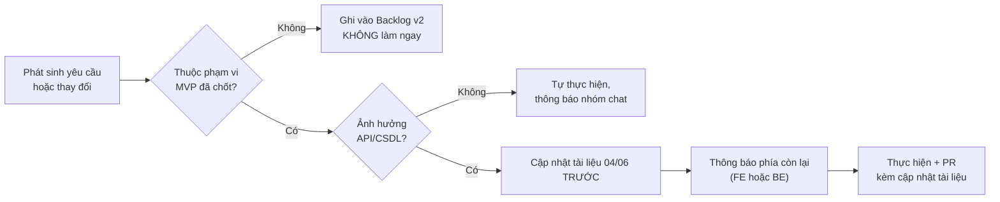

# 09 – KẾ HOẠCH & PHÂN CÔNG CÔNG VIỆC

**Hệ thống:** DMS-KTX
**Phiên bản:** v1.0
**Thời lượng dự án:** 12 tuần · **Phiên bản:** v2.0
**Khối lượng:** ~155 ngày công (đã áp dụng [v1-lite](14-PHIEN-BAN-DON-GIAN-HOA.md))

> Tài liệu này trả lời câu hỏi **"ai làm gì"**. Câu hỏi **"làm vào lúc nào và làm thế nào"** nằm ở `13-LO-TRINH-TRIEN-KHAI.md`.

---

## 1. Cơ cấu nhóm và vai trò

> ⚠️ Điền tên thật của thành viên vào cột "Người đảm nhận" trước khi nộp báo cáo.

| # | Vai trò | Người đảm nhận | Trách nhiệm chính | Repo chính |
|---|---------|----------------|-------------------|------------|
| 1 | **Backend Lead**  | Vũ Xuân Khánh | Thiết kế schema Mongoose, khởi tạo dự án BE, xác thực & phân quyền, module `residencies`/`contracts`, review code BE. Kiêm: lập kế hoạch, theo dõi tiến độ, chủ trì họp, báo cáo GVHD | `BE_QuanLyKTX` |
| 2 | **Backend Dev 1** | Nguyễn Huy Hoàng | Module `students`, `rooms` (building/room/bed), `dashboard` | `BE_QuanLyKTX` |
| 3 | **Backend Dev 2** | Vũ Tiến Khang | Module `fees` (chỉ số điện nước + hóa đơn), `payments` (VNPay), `requests`, cron job | `BE_QuanLyKTX` |
| 4 | **Frontend Lead** *(kiêm BA)* | Nguyễn Quang Minh | Khung nền FE, layout, routing, phân quyền, dashboard, review code FE. Kiêm: duy trì tài liệu `01`–`03`, làm rõ yêu cầu, viết test case, nghiệm thu UAT | `FE_QuanLyKTX` |
| 5 | **Frontend Dev** | Lại Hải Nam | Các màn hình CRUD, màn hình tài chính, cổng sinh viên, responsive | `FE_QuanLyKTX` |

### 1.1. Vì sao chia 3 backend / 2 frontend

Đối chiếu với WBS ở mục 3, khối lượng nghiêng hẳn về backend:

| Phía | Ngày công | Tỷ lệ | Số người | Tải mỗi người |
|------|-----------|-------|----------|---------------|
| Backend | ~62 MD | 52% | 3 | ~21 MD |
| Frontend | ~41 MD | 34% | 2 | ~20 MD |
| Chung (tài liệu, test, deploy, báo cáo) | ~17 MD | 14% | 5 | ~3 MD |
| **Tổng** | **~120 MD** | | **5** | **~24 MD/người** |

Tải hai bên xấp xỉ bằng nhau — cách chia này hợp lý. Backend nhiều việc hơn vì phải cài toàn bộ 67 quy tắc nghiệp vụ `BR-xx`, còn frontend được hưởng lợi từ Ant Design (Table/Form có sẵn) và từ việc nhân bản mẫu code (`14` mục 15).

### 1.2. Ai đọc tài liệu nào

| Tài liệu | 3 người BE | 2 người FE |
|----------|:----------:|:----------:|
| `PRD.md` · `02` SRS · `07` Phân quyền · `10` Quy trình · `11` Kiểm thử | ✅ | ✅ |
| `API.md` — **hợp đồng chung, đổi phải báo nhau** | ✅ | ✅ |
| `ARCHITECTURE.md` | §3, §9, §10 | §4, §6 |
| `DATA-SCHEMA.md` | ✅ bắt buộc | 🔸 tham khảo khi cần hiểu dữ liệu |
| `03` Phân tích nghiệp vụ (67 quy tắc BR) | ✅ bắt buộc | 🔸 tham khảo |
| `08` Thiết kế giao diện | ❌ | ✅ bắt buộc |
| `14` Mẫu code | mục 15.1–15.3 | mục 15.4–15.6 |

> 📌 **Tài liệu chỉ nằm ở repo `FE_QuanLyKTX/docs/`.** Ba người BE đọc trực tiếp trên GitHub hoặc clone repo FE về máy. **Không sao chép sang repo BE** — hai bản sẽ lệch nhau.

### 1.3. Hai điểm giao nhau bắt buộc phối hợp

| Thời điểm | Việc | Cách làm |
|-----------|------|----------|
| **Đầu mỗi module** | Chốt endpoint trước khi code | Cập nhật `API.md` **trước**, báo trong nhóm chat. FE dựa vào đó viết dữ liệu giả, BE dựa vào đó viết service. Hai bên làm song song, không chờ nhau |
| **Khi nối API thật** | FE tắt mock, trỏ vào backend | Đặt `VITE_USE_MOCK=false`. Nếu response không khớp `API.md` → **sửa bên sai so với tài liệu**, không sửa tài liệu cho khớp code |

Nhờ có lớp dữ liệu giả (`14` mục 4.4), frontend **không bị chặn** dù backend chưa xong module nào.

### 1.4. Chia màn hình frontend cho 2 người

Danh sách đầy đủ **31 màn hình** nằm ở `08` mục 5 (21 có bản vẽ Stitch, 10 code theo khuôn). Thứ tự làm: **giao diện máy tính trước**, bản điện thoại làm sau khi xong toàn bộ.

Màn hình chưa làm hiển thị `PlaceholderPage` nên ứng dụng luôn chạy được — **không ai bị chặn bởi ai**.

**Nguyên tắc chia:** mỗi người sở hữu trọn một luồng nghiệp vụ, **cả phía quản trị lẫn phía sinh viên**. Người làm màn "Duyệt đơn" cũng làm màn "Đăng ký chỗ ở" — hiểu cả hai đầu thì mới xử lý đúng lỗi `ROOM_FULL`. Hai người **không sửa chung file** trong `features/`.

#### Người 4 — Frontend Lead: phòng, đơn đăng ký, hợp đồng, yêu cầu

| # | Màn hình | Mã | Đường dẫn | API client | Độ khó | Ước tính |
|---|----------|----|-----------|------------|:------:|----------|
| — | *Khung nền, layout, routing, phân quyền, mock* | – | – | – | 🔴 | ✅ xong |
| 1 | Loại phòng | SCR-22 | `/admin/room-types` | `roomApi` | 🟡 | 1,0 ngày |
| 2 | Tòa nhà | SCR-21 | `/admin/buildings` | `roomApi` | 🟢 | 0,5 ngày |
| 3 | Phòng — sơ đồ tầng + drawer | SCR-23 | `/admin/rooms` | `roomApi` | 🟡 | 1,5 ngày |
| 4 | **Duyệt đơn đăng ký** | SCR-31 | `/admin/applications` | `applicationApi` | 🔴 | 2,0 ngày |
| 5 | **Cổng SV — Đăng ký chỗ ở 3 bước** | SCR-62 | `/portal/apply` | `portalApi` | 🔴 | 2,0 ngày |
| 6 | Cổng SV — Trang chủ (3 trạng thái) | SCR-61 | `/portal/home` | `portalApi` | 🟡 | 1,0 ngày |
| 7 | Hợp đồng (tab sắp hết hạn + drawer) | SCR-32 | `/admin/contracts` | `contractApi` | 🟡 | 1,0 ngày |
| 8 | **Yêu cầu gia hạn / trả phòng + quyết toán** | SCR-41 | `/admin/requests` | `requestApi` | 🔴 | 1,5 ngày |
| 9 | Cổng SV — Yêu cầu của tôi | SCR-66 | `/portal/my-requests` | `portalApi` | 🟡 | 1,0 ngày |
| 10 | Dashboard | SCR-10 | `/admin/dashboard` | `dashboardApi` | 🟡 | 1,0 ngày |
| 11 | Tài khoản | SCR-81 | `/admin/users` | `authApi` | 🟢 | 1,0 ngày |
| | | | | | | **~13,5 ngày** |

Kiêm thêm: review toàn bộ pull request frontend; giữ `AdminLayout`, `PortalLayout`, `AppRoutes.jsx` và `mocks/` nhất quán.

#### Người 5 — Frontend Dev: tài chính, nhu yếu phẩm, trang cá nhân sinh viên

| # | Màn hình | Mã | Đường dẫn | API client | Độ khó | Ước tính |
|---|----------|----|-----------|------------|:------:|----------|
| 1 | Quản lý sinh viên | SCR-11 | `/admin/students` | `studentApi` | 🟡 | ✅ xong — **dùng làm mẫu** |
| 2 | Danh mục loại phí | SCR-82 | `/admin/fee-types` | `feeApi` | 🟢 | 0,5 ngày |
| 3 | **Nhập chỉ số điện nước** | SCR-51 | `/admin/utility-readings` | `feeApi` | 🔴 | 1,5 ngày |
| 4 | Hóa đơn + lập hàng loạt (modal) | SCR-52, 53 | `/admin/invoices` | `feeApi` | 🟡 | 1,5 ngày |
| 5 | **Chi tiết hóa đơn + ghi nhận thanh toán** | SCR-54, 55 | `/admin/invoices/:id` | `feeApi`, `paymentApi` | 🔴 | 1,5 ngày |
| 6 | Lịch sử thanh toán | SCR-56 | `/admin/payments` | `paymentApi` | 🟢 | 0,5 ngày |
| 7 | Cổng SV — Hóa đơn + kết quả thanh toán | SCR-64, 65 | `/portal/my-invoices`, `/portal/payment-result` | `portalApi`, `paymentApi` | 🟡 | 2,0 ngày |
| 8 | Nhu yếu phẩm (quản trị, 2 tab) | SCR-71 | `/admin/supplies` | `supplyApi` | 🟡 | 1,5 ngày |
| 9 | Cổng SV — Mua sắm + Đơn hàng của tôi | SCR-67, 68 | `/portal/shop`, `/portal/my-orders` | `portalApi` | 🟡 | 2,0 ngày |
| 10 | Cổng SV — Chỗ ở & hợp đồng | SCR-63 | `/portal/my-residence` | `portalApi` | 🟢 | 0,5 ngày |
| 11 | Cổng SV — Hồ sơ cá nhân | SCR-69 | `/portal/profile` | `portalApi` | 🟢 | 0,5 ngày |
| 12 | Đăng ký tài khoản sinh viên | SCR-02 | `/register` | `authApi` | 🟢 | 0,5 ngày |
| | | | | | | **~12,5 ngày** |

Kiêm thêm: sau khi xong toàn bộ bản máy tính, làm bản điện thoại cho cổng sinh viên theo các frame mobile trên Stitch.

> 🟢 CRUD thuần — sao chép màn sinh viên là xong · 🟡 có thêm bộ lọc, tab hoặc một quy tắc nghiệp vụ · 🔴 nhiều bước, nhiều trạng thái — **đọc tài liệu ở bảng dưới trước khi code**.

#### Năm màn hình khó — đọc trước khi bắt tay

| Màn hình | Vì sao khó | Đọc trước |
|----------|------------|-----------|
| Duyệt đơn đăng ký | Giường chỉ **hiển thị**, không cho chọn; đổi phòng chỉ trong cùng loại; gặp `ROOM_FULL` phải giữ nguyên đơn đang mở và tải lại danh sách phòng | `08` mục 6.4 · `03` BR-33→BR-38 |
| Đăng ký chỗ ở | 3 bước giữ trạng thái qua lại; lọc giới tính ở backend; `ROOM_FULL` khi nộp phải quay về bước 2 mà không mất ngày đã chọn | `08` mục 6.10 · `03` BR-06, BR-34 |
| Yêu cầu + quyết toán | Hai loại yêu cầu hiển thị khác nhau; `STUDENT_HAS_DEBT` → hỏi lại rồi gửi `forceConfirm`; con số hoàn cọc đổi màu theo dấu | `08` mục 6.5 · `03` BR-74→BR-77, BR-97 |
| Nhập chỉ số điện nước | Bảng sửa trực tiếp; chặn chỉ số mới < cũ trước khi gửi; số tiền trên giao diện chỉ để xem, backend mới là người chia | `08` mục 6.6 · `03` BR-50→BR-55 |
| Chi tiết hóa đơn + ghi nhận thanh toán | Không cho thu vượt số còn lại; nút hủy tắt khi đã có thanh toán; hóa đơn `supplies` tự kéo đơn hàng sang "chờ nhận" | `08` mục 6.7 · `03` BR-43→BR-46 |

#### Quy ước làm việc giữa hai người

| Việc | Quy ước |
|------|---------|
| Nhánh | `feature/<ten-man-hinh>` — ví dụ `feature/application-review`. Tên nhánh bằng tiếng Anh, không kèm mã task |
| Phạm vi sửa | Chỉ sửa file trong thư mục `features/` mình phụ trách |
| File dùng chung | `components/`, `hooks/`, `utils/`, `layouts/`, `routes/AppRoutes.jsx` — **báo nhau trước khi sửa** |
| Dữ liệu giả | `src/mocks/mockDb.js` dùng chung — báo trong nhóm trước khi thêm/sửa; chạy lại smoke test mock nếu có |
| Gộp nhánh | Tạo pull request, người còn lại review rồi mới gộp vào `main` |
| Trước khi mở PR | `npm run lint` sạch **và** `npm run build` chạy được |

---

## 2. Cấu trúc phân rã công việc (WBS)

```mermaid
flowchart TB
    P["DMS-KTX"] --> W1["1. Khởi động & Phân tích"]
    P --> W2["2. Nền tảng kỹ thuật"]
    P --> W3["3. Phân hệ Quản trị"]
    P --> W4["4. Phân hệ Tài chính"]
    P --> W5["5. Cổng sinh viên"]
    P --> W6["6. Báo cáo & Dashboard"]
    P --> W7["7. Kiểm thử & Hoàn thiện"]
    P --> W8["8. Triển khai & Bàn giao"]

    W1 --> W11["1.1 Khảo sát hiện trạng"]
    W1 --> W12["1.2 Đặc tả yêu cầu"]
    W1 --> W13["1.3 Phân tích nghiệp vụ"]
    W1 --> W14["1.4 Thiết kế CSDL & API"]

    W2 --> W21["2.1 Khởi tạo repo FE/BE"]
    W2 --> W22["2.2 CSDL + migration + seed"]
    W2 --> W23["2.3 Xác thực & phân quyền"]
    W2 --> W24["2.4 Layout, routing, component chung"]

    W3 --> W31["3.1 Quản lý sinh viên"]
    W3 --> W32["3.2 Tòa nhà / Loại phòng / Phòng"]
    W3 --> W33["3.3 Đơn đăng ký & hợp đồng"]
    W3 --> W34["3.4 Yêu cầu gia hạn / trả phòng"]

    W4 --> W41["4.1 Danh mục phí & chỉ số ĐN"]
    W4 --> W42["4.2 Hóa đơn"]
    W4 --> W43["4.3 Thanh toán thủ công"]
    W4 --> W44["4.4 Tích hợp VNPay"]

    W5 --> W51["5.1 Đăng ký tài khoản SV"]
    W5 --> W52["5.2 Đăng ký chỗ ở"]
    W5 --> W53["5.3 Hóa đơn & thanh toán online"]
    W5 --> W54["5.4 Gửi yêu cầu"]
    W5 --> W55["5.5 Nhu yếu phẩm"]

    W6 --> W61["6.1 API tổng hợp"]
    W6 --> W62["6.2 Dashboard + biểu đồ"]

    W7 --> W71["7.1 Unit & Integration test"]
    W7 --> W72["7.2 Kiểm thử hệ thống"]
    W7 --> W73["7.3 Sửa lỗi"]
    W7 --> W74["7.4 Rà soát bảo mật"]

    W8 --> W81["8.1 Deploy"]
    W8 --> W82["8.2 Viết báo cáo"]
    W8 --> W83["8.3 Chuẩn bị demo"]
```

---

## 3. Bảng công việc chi tiết

**Ký hiệu:** BE = Backend · FE = Frontend · BA = Phân tích · PM = Quản lý · `MD` = man-day (ngày công)

### Giai đoạn 1 – Khởi động & Phân tích (Tuần 1–2)

| ID | Công việc | Người | MD | Phụ thuộc | Kết quả bàn giao |
|----|-----------|-------|-----|-----------|------------------|
| T1.1 | Khảo sát hiện trạng, tham khảo hệ thống tương tự | BA, PM | 2 | – | Mục 1.3 của `01` |
| T1.2 | Viết tài liệu tổng quan, chốt phạm vi | PM, BA | 2 | T1.1 | `01-TONG-QUAN-DU-AN.md` |
| T1.3 | Đặc tả yêu cầu chức năng và phi chức năng | BA | 3 | T1.2 | `02-DAC-TA-YEU-CAU.md` |
| T1.4 | Vẽ use case, viết đặc tả use case chi tiết | BA | 2 | T1.3 | Mục 2, 5 của `02` |
| T1.5 | Phân tích nghiệp vụ, quy tắc BR, máy trạng thái | BA, BE Lead | 3 | T1.3 | `03-PHAN-TICH-NGHIEP-VU.md` |
| T1.6 | Thiết kế ERD và từ điển dữ liệu | BE Lead | 3 | T1.5 | `DATA-SCHEMA.md` |
| T1.7 | Chốt kiến trúc và tech stack | BE Lead, FE Lead | 1 | T1.2 | `ARCHITECTURE.md` |
| T1.8 | Thiết kế hợp đồng API | BE Lead, FE Lead | 3 | T1.6 | `API.md` |
| T1.9 | Ma trận phân quyền | BA, BE Lead | 1 | T1.3 | `07-PHAN-QUYEN-BAO-MAT.md` |
| T1.10 | Sitemap, wireframe các màn hình chính | FE Lead | 3 | T1.3 | `08-THIET-KE-GIAO-DIEN.md` |
| T1.11 | Lập kế hoạch, phân công, lộ trình | PM | 2 | Tất cả | `09`, `13` |

### Giai đoạn 2 – Nền tảng kỹ thuật (Tuần 3)

| ID | Công việc | Người | MD | Phụ thuộc | Kết quả bàn giao |
|----|-----------|-------|-----|-----------|------------------|
| T2.1 | Khởi tạo repo backend, cấu trúc thư mục, ESLint/Prettier | BE Lead | 1 | T1.7 | Repo BE chạy được `GET /health` |
| T2.2 | Cài Mongoose, viết các file `*.model.js` cho **16 collection** | BE Lead | 1.5 | T1.6 | Server khởi động, Mongoose tự tạo collection + index |
| T2.3 | Viết script seed dữ liệu mẫu (loại phòng, phòng tự sinh giường, đơn đăng ký, sản phẩm) | BE Dev | 1.5 | T2.2 | `npm run seed` chạy thành công, đủ dữ liệu cho `11` mục 2.3 |
| T2.4 | Middleware nền: error handler, response chuẩn, logger, requestId | BE Lead | 1 | T2.1 | Mọi lỗi trả đúng định dạng |
| T2.5 | API xác thực: login, register, logout, me, đổi mật khẩu, đặt lại mật khẩu (FR-09) | BE Lead | 2 | T2.2, T2.4 | `/auth/*` + `/users/:id/reset-password` chạy được |
| T2.6 | Middleware RBAC + kiểm tra ownership | BE Lead | 1 | T2.5 | `authorize()` hoạt động đúng ma trận |
| T2.7 | Cấu hình FE: React Router, Axios, Ant Design + viết hook `useApi` và `AuthContext` | FE Lead | 1.5 | T1.7 | App chạy, gọi được API (`14` mục 4.1–4.2) |
| T2.8 | AdminLayout, PortalLayout, sidebar, header | FE Lead | 2 | T2.7 | 2 layout hoàn chỉnh |
| T2.9 | Màn hình đăng nhập, `AuthProvider`, `RoleRoute` | FE Lead | 2 | T2.5, T2.8 | ✅ đã xong |
| T2.10 | Component dùng chung: `DataTable`, `StatusTag`, `MoneyText`, `EmptyState`, `PageHeader`, `ErrorBoundary` + hook `useApi` | FE Dev | 2.5 | T2.8 | ✅ đã xong (`14` mục 15.9) |
| T2.11 | Lớp dữ liệu giả `mocks/mockDb.js` + `mocks/mockApi.js` theo `API.md` | FE Lead | 0.5 | T1.8 | ✅ đã xong — FE làm được khi BE chưa xong |
| ~~T2.12~~ | ~~Thiết lập CI~~ — v1-lite: chạy `npm run lint` tay trước khi mở PR | – | 0 | – | – |

### Giai đoạn 3 – Phân hệ Quản trị (Tuần 4–6)

| ID | Công việc | Người | MD | Phụ thuộc | Kết quả bàn giao |
|----|-----------|-------|-----|-----------|------------------|
| T3.1 | API sinh viên: CRUD, tìm kiếm, lọc, export | BE Dev | 3 | T2.6 | 10 endpoint `/students/*` |
| T3.2 | Màn hình quản lý sinh viên (danh sách + modal thêm/sửa) | FE Dev | 3 | T2.10, T3.1 | ✅ đã xong — SCR-11 |
| T3.3 | API tòa nhà / **loại phòng** / phòng (giường tự sinh) + đổi trạng thái giường | BE Dev | 3.5 | T2.6 | `/buildings`, `/room-types`, `/rooms`, `/beds/:id/status` — BR-04, BR-09, BR-10 |
| T3.4 | API phòng còn chỗ (lọc giới tính theo JWT) + chi tiết phòng kèm giường | BE Dev | 1 | T3.3 | `/rooms/available`, `/rooms/:id` — BR-05, BR-06 |
| T3.5 | Màn hình tòa nhà + loại phòng | FE Lead | 1.5 | T3.3 | SCR-21, SCR-22 |
| T3.6 | Màn hình phòng: sơ đồ tầng + drawer chi tiết | FE Lead | 1.5 | T3.4 | SCR-23 |
| ~~T3.7~~ | ~~Màn hình tra cứu giường trống~~ — bỏ ở v2.3: không ai chọn giường | – | 0 | – | – |
| T3.8 | **Service đơn đăng ký: nộp, duyệt (gán giường nguyên tử + bù trừ), từ chối, hủy** | BE Lead | 3.5 | T3.3 | BR-20, BR-21, BR-25, BR-33→BR-38; TC-42, TC-44, TC-53 đạt |
| T3.9 | API hợp đồng: danh sách, chi tiết, sửa điều khoản, chấm dứt, sắp hết hạn | BE Lead | 1.5 | T3.8 | `/api/contracts/*` đầy đủ |
| T3.10 | Màn hình hợp đồng (tab sắp hết hạn + drawer chi tiết) | FE Lead | 1 | T3.9 | SCR-32 |
| T3.11 | **Màn hình duyệt đơn đăng ký** (+ lập đơn hộ) | FE Lead | 2 | T3.8 | SCR-31 |
| ~~T3.12~~ | ~~Màn hình tạo hợp đồng + BedPicker~~ — bỏ ở v2.3: hợp đồng sinh ra khi duyệt đơn | – | 0 | – | – |
| T3.13 | API yêu cầu gia hạn / trả phòng + duyệt | BE Lead | 2.5 | T3.9 | `/requests/*` |
| T3.14 | Màn hình yêu cầu gia hạn / trả phòng + quyết toán | FE Lead | 1.5 | T3.13 | SCR-41 |
| T3.15 | **1 cron job** `dailyJob.js` gồm 5 tác vụ (có tự hủy đơn nhu yếu phẩm quá hạn) | BE Dev | 1 | T3.9 | Job chạy đúng lịch, idempotent (`03` mục 7) |
| T3.16 | API quản lý tài khoản (Admin) | BE Dev | 1.5 | T2.6 | `/users/*` |
| T3.17 | Màn hình quản lý tài khoản | FE Lead | 1 | T3.16 | SCR-81 |

### Giai đoạn 4 – Phân hệ Tài chính (Tuần 6–8)

| ID | Công việc | Người | MD | Phụ thuộc | Kết quả bàn giao |
|----|-----------|-------|-----|-----------|------------------|
| T4.1 | API danh mục phí | BE Dev | 1 | T2.6 | `/fee-types/*` |
| T4.2 | API chỉ số điện nước (gồm nhập hàng loạt) | BE Dev | 2 | T3.3 | `/utility-readings/*` |
| T4.3 | Màn hình danh mục phí + nhập chỉ số điện nước | FE Dev | 2 | T4.1, T4.2 | SCR-82, SCR-51 |
| T4.4 | **Service hóa đơn: tạo, tính tổng, đổi trạng thái** | BE Dev | 3 | T3.8, T4.1 | BR-40→48 |
| T4.5 | **Lập hóa đơn hàng loạt theo kỳ (chia đều điện nước)** | BE Dev | 3 | T4.2, T4.4 | UC-04, BR-48, BR-54 |
| T4.6 | API hủy hóa đơn | BE Dev | 0.5 | T4.4 | BR-46 |
| T4.7 | Màn hình danh sách hóa đơn + lập hàng loạt (modal) | FE Dev | 1.5 | T4.5 | SCR-52, SCR-53 |
| T4.8 | Màn hình chi tiết hóa đơn + modal ghi nhận thanh toán | FE Dev | 1.5 | T4.10 | SCR-54, SCR-55 |
| ~~T4.9~~ | ~~Màn hình lập hóa đơn hàng loạt 3 bước~~ — gộp thành modal ở T4.7 | – | 0 | – | – |
| T4.10 | API ghi nhận thanh toán thủ công + tính lại hóa đơn + kéo đơn nhu yếu phẩm sang `ready` | BE Dev | 2 | T4.4 | BR-43, BR-44, BR-95 |
| T4.11 | Màn hình lịch sử thanh toán | FE Dev | 0.5 | T4.10 | SCR-56 |
| T4.12 | **Tích hợp VNPay: tạo URL + xác thực chữ ký tại Return URL** (không dùng IPN/ngrok) | BE Lead | 2 | T4.10 | UC-05, BR-55→58, `14` mục 4.10 |
| ~~T4.13~~ | ~~Tích hợp ZaloPay~~ — v1-lite: chỉ VNPay | – | 0 | – | – |
| T4.14 | Xử lý idempotent + nút đối soát thủ công | BE Lead | 1.5 | T4.12 | BR-56 |

### Giai đoạn 5 – Cổng sinh viên & Nhu yếu phẩm (Tuần 8–9)

| ID | Công việc | Người | MD | Phụ thuộc | Kết quả bàn giao |
|----|-----------|-------|-----|-----------|------------------|
| T5.1 | API `/portal/*`: hồ sơ, chỗ ở (kèm đồ cấp sẵn, bạn cùng phòng), đơn đăng ký của tôi | BE Dev | 2 | T3.8 | Lọc theo JWT (BR-86) |
| T5.2 | API cổng SV: hồ sơ, chỗ ở, hợp đồng (chỉ đọc, lọc theo JWT) | BE Lead | 1.5 | T3.8 | FR-82, FR-85 |
| T5.3 | API hóa đơn & thanh toán online cho sinh viên | BE Dev | 1.5 | T4.12 | Có kiểm tra ownership |
| T5.4 | API gửi/hủy yêu cầu | BE Dev | 1 | T3.13 | BR-70→78 |
| T5.5 | Trang chủ sinh viên (3 trạng thái) | FE Lead | 1 | T5.1 | SCR-61 |
| T5.6 | Màn hình chỗ ở & hợp đồng + hồ sơ + đăng ký tài khoản | FE Dev | 1.5 | T5.1 | SCR-63, SCR-69, SCR-02 |
| T5.7 | **Màn hình đăng ký chỗ ở 3 bước** | FE Lead | 2 | T3.4, T5.1 | SCR-62 |
| T5.8 | Màn hình hóa đơn (danh sách + chi tiết cùng trang) + thanh toán | FE Dev | 1.5 | T5.3 | SCR-64 |
| T5.9 | Màn hình kết quả thanh toán (có polling) | FE Dev | 0.5 | T5.3 | SCR-65 |
| T5.10 | Màn hình yêu cầu của tôi (+ modal tạo) | FE Lead | 1 | T5.4 | SCR-66 |
| T5.11 | Rà soát giao diện máy tính cổng sinh viên ở 1280px (bản điện thoại làm sau) | FE Dev | 0.5 | T5.10 | NFR-09 |
| T5.12 | API danh mục nhu yếu phẩm (CRUD, loại phòng cấp sẵn) | BE Dev | 1 | T3.3 | `/supply-items/*`, `/portal/supply-items` — BR-90 |
| T5.13 | **Service đơn nhu yếu phẩm: đặt (tính giá ở server), hủy, giao, `markReady`, tự hủy quá hạn** | BE Dev | 3 | T4.10, T5.12 | BR-91→BR-97; TC-152, TC-156, TC-160 đạt |
| T5.14 | Màn hình nhu yếu phẩm quản trị (tab đơn hàng + tab danh mục) | FE Dev | 1.5 | T5.13 | SCR-71 |
| T5.15 | Màn hình mua sắm (cửa hàng + giỏ) + đơn hàng của tôi | FE Dev | 2 | T5.13 | SCR-67, SCR-68 |

### Giai đoạn 6 – Dashboard (Tuần 9–10)

| ID | Công việc | Người | MD | Phụ thuộc | Kết quả bàn giao |
|----|-----------|-------|-----|-----------|------------------|
| T6.1 | API dashboard tổng hợp (tối ưu truy vấn) | BE Dev | 2.5 | T4.4 | `/dashboard/*`, đạt NFR-02 |
| ~~T6.2~~ | ~~API báo cáo + xuất Excel~~ — bỏ ở v2.3: không có trong `08` v3.0; xuất CSV sinh viên nằm ở T3.1 | – | 0 | – | – |
| T6.3 | Màn hình dashboard + thẻ chỉ số | FE Lead | 2.5 | T6.1 | SCR-10 |
| T6.4 | Biểu đồ tỷ lệ lấp đầy theo tòa (Recharts) | FE Lead | 1 | T6.1 | FR-70 |
| ~~T6.5~~ | ~~Trung tâm báo cáo~~ — bỏ ở v2.3 | – | 0 | – | – |

### Giai đoạn 7 – Kiểm thử & Hoàn thiện (Tuần 10–11)

| ID | Công việc | Người | MD | Phụ thuộc | Kết quả bàn giao |
|----|-----------|-------|-----|-----------|------------------|
| T7.1 | ~10 unit test cho 3 hàm tính tiền | BE Dev | 1 | GĐ 4 | `14` mục 8.1 |
| ~~T7.2~~ | ~~Integration test~~ — v1-lite: test bằng Postman thủ công | – | 0 | – | – |
| T7.3 | Thực thi test case, ưu tiên 16 test "không được cắt" | BA | 2 | GĐ 6 | `11` mục 4 + mục 6 |
| T7.4 | Kiểm thử phân quyền theo ma trận | BA, BE Lead | 1.5 | T7.3 | Checklist mục 6 của `07` |
| T7.5 | Sửa lỗi đợt 1 | Cả nhóm | 4 | T7.3 | Hết lỗi Critical/High |
| T7.6 | Rà soát bảo mật (chạy `/security-review`) | BE Lead | 1 | T7.5 | Checklist `07` đạt đủ |
| T7.7 | Tối ưu hiệu năng (index, N+1 query) | BE Lead | 1.5 | T7.5 | Đạt NFR-01, NFR-02 |
| T7.8 | Rà soát giao diện máy tính, thông báo tiếng Việt | FE Lead | 2 | T7.5 | NFR-09, NFR-20 |
| T7.9 | Sửa lỗi đợt 2 | Cả nhóm | 3 | T7.5 | Hết lỗi Medium |

### Giai đoạn 8 – Triển khai & Bàn giao (Tuần 11–12)

| ID | Công việc | Người | MD | Phụ thuộc | Kết quả bàn giao |
|----|-----------|-------|-----|-----------|------------------|
| T8.1 | Deploy backend + CSDL production | BE Lead | 1.5 | T7.9 | API công khai chạy được |
| T8.2 | Deploy frontend | FE Lead | 1 | T8.1 | Web công khai chạy được |
| T8.3 | Nạp dữ liệu demo, tạo tài khoản demo | BE Dev | 1 | T8.1 | 4 tài khoản demo |
| T8.4 | Kiểm thử trên môi trường production | BA | 1 | T8.2 | Biên bản UAT |
| T8.5 | Viết báo cáo đồ án | Cả nhóm | 5 | T8.4 | File báo cáo hoàn chỉnh |
| T8.6 | Viết hướng dẫn sử dụng + hướng dẫn cài đặt | BA, PM | 2 | T8.2 | 2 tài liệu HDSD |
| T8.7 | Chuẩn bị slide + kịch bản demo | PM | 2 | T8.5 | Slide + kịch bản |
| T8.8 | Diễn tập bảo vệ | Cả nhóm | 1 | T8.7 | Biên bản diễn tập |

---

## 4. Tổng hợp khối lượng

| Giai đoạn | v1-lite (MD) | **v2.3 — cộng từ bảng mục 3 (MD)** | Tỷ trọng |
|-----------|--------------|-------------------------------------|----------|
| 1. Khởi động & Phân tích | 25 | **25** | 16% |
| 2. Nền tảng kỹ thuật | 13 | **16,5** | 10% |
| 3. Phân hệ Quản trị | 31 | **29** | 18% |
| 4. Phân hệ Tài chính | 23 | **20,5** | 13% |
| 5. Cổng sinh viên & Nhu yếu phẩm | 18 | **21,5** | 14% |
| 6. Dashboard | 9 | **6** | 4% |
| 7. Kiểm thử & Hoàn thiện | 14 | **16** | 10% |
| 8. Triển khai & Bàn giao | 12 | **14,5** | 9% |
| Dự phòng | 10 | **10** | 6% |
| **Tổng cộng** | **~155** | **~159 ngày công** | 100% |

> **Cột v2.3 được cộng trực tiếp từ cột MD của các bảng ở mục 3**, không ước lượng tay. Nó chênh với cột v1-lite vì hai lý do: (1) v1-lite là số ước lượng từ trước và chưa từng khớp với tổng các bảng; (2) thay đổi ở `PRD.md` §2.10 — bỏ tra cứu giường, tạo hợp đồng, BedPicker, báo cáo; thêm loại phòng, đơn đăng ký, nhu yếu phẩm.
>
> ⚠️ Bảng mục 1.1 (~120 MD theo "Bậc B" của `14`) là **một cách tính khác** và hiện chưa khớp với bảng này. Khi lập kế hoạch sprint, **dùng bảng mục 3–4**.

**Diễn giải:** với nhóm 5 người làm bán thời gian (trung bình 3 ngày công/người/tuần), năng lực = 18 MD/tuần × 12 tuần = **216 ngày công**.

| | Bản đầu | v1-lite → v2.3 |
|---|---------|---------|
| Khối lượng / Năng lực | 206/216 = **95%** — kín, không có chỗ cho sai sót | 155/216 = **72%** · **v2.3: 159/216 = 74%** |

Chi tiết 21 thay đổi giúp giảm 51 ngày công: [`14-PHIEN-BAN-DON-GIAN-HOA.md`](14-PHIEN-BAN-DON-GIAN-HOA.md) mục 2.

**Nếu nhóm ít hơn 5 người:** xem thang cắt giảm 7 bậc tại `14` mục 9. Tóm tắt:
- **4 người** (~144 MD năng lực): cắt bậc 1–2 (sơ đồ tòa nhà, biểu đồ dashboard) → về ~150 MD, vẫn hơi sát.
- **3 người** (~108 MD năng lực): cắt tới bậc 5 → về ~144 MD, vẫn thiếu — cần tăng thời gian đóng góp mỗi người hoặc xin gia hạn.

---

## 5. Ma trận RACI

`R` = Thực hiện · `A` = Chịu trách nhiệm cuối · `C` = Được hỏi ý kiến · `I` = Được thông báo

| Hạng mục | PM | BA | BE Lead | BE Dev | FE Lead | FE Dev |
|----------|----|----|---------|--------|---------|--------|
| Chốt phạm vi dự án | A | R | C | I | C | I |
| Đặc tả yêu cầu | A | R | C | I | C | I |
| Thiết kế CSDL | I | C | A/R | R | I | I |
| Hợp đồng API | I | C | A/R | R | C | I |
| Thiết kế giao diện | I | C | I | I | A/R | R |
| Cài đặt backend | I | I | A | R | I | I |
| Cài đặt frontend | I | I | I | I | A | R |
| Tích hợp thanh toán | I | C | A/R | C | I | C |
| Kiểm thử | I | A/R | C | R | C | R |
| Rà soát bảo mật | I | C | A/R | R | C | I |
| Triển khai | A | I | R | C | R | I |
| Viết báo cáo | A/R | R | C | C | C | C |
| Demo bảo vệ | A/R | R | R | C | R | C |

---

## 6. Quy tắc phối hợp

### 6.1. Nhịp làm việc

| Hoạt động | Tần suất | Thời lượng | Nội dung |
|-----------|----------|------------|----------|
| **Standup** | Thứ 2 & Thứ 5 | 15 phút | Mỗi người: hôm qua làm gì, hôm nay làm gì, đang vướng gì |
| **Sprint Planning** | Đầu mỗi sprint (2 tuần) | 60 phút | Chọn task, ước lượng, phân công |
| **Sprint Review** | Cuối mỗi sprint | 45 phút | Demo những gì đã làm được cho cả nhóm |
| **Retrospective** | Cuối mỗi sprint | 30 phút | Điều gì tốt, điều gì cần cải thiện |
| **Báo cáo GVHD** | 2 tuần/lần | 30 phút | Tiến độ, vướng mắc, xin ý kiến |

### 6.2. Kênh liên lạc

| Kênh | Dùng cho | Thời gian phản hồi kỳ vọng |
|------|----------|----------------------------|
| Nhóm chat (Zalo/Discord) | Trao đổi hằng ngày, hỏi nhanh | Trong ngày |
| GitHub Issues/Projects | Theo dõi task, báo lỗi | Trong ngày |
| GitHub PR | Review code | Trong 24 giờ |
| Họp trực tiếp/online | Quyết định quan trọng, gỡ vướng lớn | Theo lịch |

### 6.3. Quy tắc khi phát sinh thay đổi

### 6.4. Xử lý khi bị chặn (blocked)

1. Thử tự gỡ trong tối đa **2 giờ**.
2. Chưa xong → đăng vào nhóm chat, nêu rõ: đang làm gì, lỗi gì, đã thử cách nào.
3. Sau 1 ngày vẫn chặn → báo PM để điều chỉnh phân công hoặc đổi task.
4. Ghi lại vướng mắc và cách giải quyết vào Wiki nhóm để người sau không mắc lại.

---

## 7. Theo dõi tiến độ

### 7.1. Bảng theo dõi sprint

| Sprint | Tuần | Mục tiêu | Cam kết (MD) | Hoàn thành | Ghi chú |
|--------|------|----------|--------------|------------|---------|
| Sprint 0 | 1–2 | Hoàn thiện tài liệu | 25 | | |
| Sprint 1 | 3–4 | Nền tảng + Quản lý sinh viên | 24 | | |
| Sprint 2 | 5–6 | Cơ sở vật chất + Hợp đồng | 29 | | |
| Sprint 3 | 7–8 | Tài chính + Thanh toán | 25 | | |
| Sprint 4 | 9–10 | Cổng SV + Dashboard | 26 | | |
| Sprint 5 | 11–12 | Kiểm thử + Triển khai + Báo cáo | 26 | | |

### 7.2. Chỉ số theo dõi

| Chỉ số | Cách đo | Ngưỡng cảnh báo |
|--------|---------|-----------------|
| Tỷ lệ hoàn thành sprint | Task xong / task cam kết | < 80% → xem lại ước lượng |
| Số lỗi mở | Đếm issue nhãn `bug` chưa đóng | > 15 → dừng phát triển tính năng, tập trung sửa lỗi |
| Thời gian PR chờ review | Từ lúc mở đến lúc merge | > 48 giờ → nhắc trong standup |
| Số yêu cầu vượt phạm vi | Đếm mục ghi vào Backlog v2 | > 10 → họp lại về phạm vi |

---

## 8. Lịch sử phiên bản

| Phiên bản | Ngày | Người thực hiện | Nội dung thay đổi |
|-----------|------|------------------|-------------------|
| v1.0 | 11/09/2026 | PM | Khởi tạo WBS, phân công, RACI, quy tắc phối hợp |
| **v2.3** | **13/09/2026** | FE Lead | **Đăng ký theo phòng + nhu yếu phẩm + ưu tiên máy tính.** Mục 1.4 chia lại 31 màn hình theo luồng nghiệp vụ (FE Lead ~13,5 ngày · FE Dev ~12,5 ngày), 5 màn hình khó kèm tài liệu phải đọc. Bảng công việc: viết lại T3.3→T3.12 (loại phòng, đơn đăng ký), thêm T5.12→T5.15 (nhu yếu phẩm), gạch tra cứu giường, BedPicker, tạo hợp đồng, báo cáo; đánh dấu các task FE đã xong. Mục 4 **cộng lại từ bảng**: ~159 MD (74% năng lực). |
| v2.2 | 12/09/2026 | FE Lead | Thêm mục **1.4**: chia 21 màn hình cho 2 người frontend (mỗi người ~8,5 ngày), đánh dấu 3 màn hình khó cần đọc nghiệp vụ trước, chốt quy ước nhánh và phạm vi sửa file |
| v2.1 | 12/09/2026 | PM | Chốt mô hình **2 repo** và phân công **3 backend / 2 frontend**; thêm mục 1.1 (lý do chia), 1.2 (ai đọc tài liệu nào), 1.3 (hai điểm giao nhau bắt buộc phối hợp) |
| v2.0 | 12/09/2026 | PM | **Rà soát theo bộ tài liệu v2.0:** nhóm 5 người; bỏ task chuyển phòng và task API nộp đơn; đổi tên task theo module mới (`residencies`, `fees`) |
| v1.1 | 12/09/2026 | PM | **Áp dụng v1-lite:** khối lượng 206 → 155 ngày công; bỏ T2.12 (CI), T4.13 (ZaloPay), T7.2 (integration test); rút gọn T2.2, T2.10, T2.11, T3.15, T4.12, T7.1, T7.3. Chức năng giữ nguyên — xem `14` |
