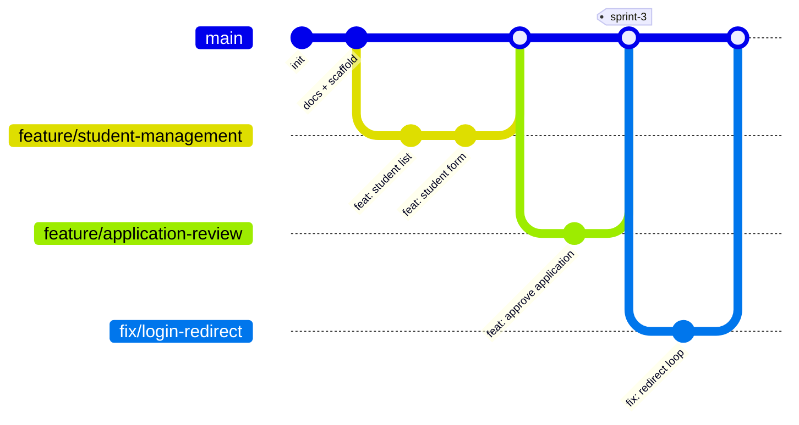
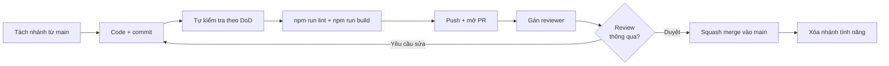

# 10 – QUY TRÌNH LÀM VIỆC & QUY ƯỚC CODE

**Hệ thống:** DMS-KTX
**Phiên bản:** v1.3
**Đối tượng:** Toàn bộ thành viên nhóm phát triển

> Đọc tài liệu này **trước khi commit dòng code đầu tiên**.

---

## 1. Quy trình Git

### 1.1. Mô hình nhánh

Nhóm dùng mô hình **`main` + nhánh tính năng** — không có nhánh `develop` (quyết định đơn giản hóa, `14` mục 13 B2). Hai repo `FE_QuanLyKTX` và `BE_QuanLyKTX` dùng chung quy ước này.



| Nhánh | Mục đích | Quy tắc |
|-------|----------|---------|
| `main` | Mã luôn chạy được; bản deploy lấy từ đây | Chỉ nhận merge qua Pull Request. Ngoại lệ duy nhất: đợt dựng khung ban đầu (tài liệu + scaffold) đã đẩy thẳng |
| `feature/*` | Phát triển một tính năng | Tách từ `main`, merge lại vào `main` |
| `fix/*` | Sửa lỗi | Tách từ `main` |
| `refactor/*` · `docs/*` · `chore/*` | Tái cấu trúc, tài liệu, cấu hình | Tách từ `main` |

> Đánh dấu mốc cuối sprint bằng **tag** trên `main` (`sprint-1`, `sprint-2`…) thay vì một nhánh riêng.

### 1.2. Quy ước đặt tên nhánh

```
<type>/<short-description-in-english>
```

> ⚠️ **Tên nhánh viết bằng TIẾNG ANH**, chữ thường, các từ nối bằng dấu gạch ngang. Không kèm mã task, không dùng tiếng Việt kể cả khi đã bỏ dấu.

**`<type>`** dùng đúng bộ với commit: `feature` · `fix` · `refactor` · `docs` · `chore` · `hotfix`

**Ví dụ đúng:**
```
feature/frontend-foundation
feature/student-crud-api
feature/vnpay-integration
feature/contract-approval
fix/invoice-total-calculation
refactor/contract-service
docs/update-api-contract
chore/setup-eslint-prettier
```

**Ví dụ sai:**

| Sai | Vì sao |
|-----|--------|
| `feature/T2.7-frontend-foundation` | Thừa mã task — mã task ghi trong mô tả PR, không ghi vào tên nhánh |
| `feature/cau-hinh-nen-frontend` | Tiếng Việt không dấu — vẫn là tiếng Việt |
| `feature/Quan-Ly-Sinh-Vien` | Tiếng Việt + viết hoa |
| `nguyen-lam` | Đặt theo tên người, không biết nhánh làm gì |
| `test`, `new-branch`, `sua-loi` | Không mô tả được nội dung |
| `feature/add_student_page` | Dùng gạch dưới thay vì gạch ngang |

> 💡 Mã task (`T3.8`) vẫn cần, nhưng ghi ở **mô tả Pull Request** trong mục "Yêu cầu liên quan" — xem mẫu PR ở mục 1.4.

### 1.3. Quy ước commit (Conventional Commits)

```
<type>(<scope>): <short description in English>

[optional body]

[optional footer]
```

> ⚠️ **Commit message viết bằng TIẾNG ANH.** Dùng động từ nguyên thể, chữ thường, không chấm cuối câu.

| `type` | Dùng khi | Ví dụ |
|--------|----------|-------|
| `feat` | Thêm tính năng mới | `feat(student): add student list page` |
| `fix` | Sửa lỗi | `fix(invoice): correct utility cost rounding` |
| `refactor` | Sửa cấu trúc code, không đổi hành vi | `refactor(api): extract axios error helpers` |
| `style` | Định dạng code, không đổi logic | `style: apply prettier formatting` |
| `docs` | Sửa tài liệu | `docs: update API contract for payments` |
| `test` | Thêm/sửa test | `test(money): cover utility split remainder` |
| `chore` | Cấu hình, dependency, công cụ build | `chore: install antd and react-router` |
| `perf` | Tối ưu hiệu năng | `perf(dashboard): add index on contract end_date` |

**`<scope>` gợi ý:** `auth`, `student`, `building`, `room-type`, `room`, `application`, `contract`, `invoice`, `payment`, `request`, `supply`, `dashboard`, `portal`, `layout`, `api`, `mock`, `config`.

**Ví dụ:**
```
feat(application): approve application with automatic bed assignment

- Claim the lowest free bed with an atomic findOneAndUpdate
- Create residency, active contract and the two first invoices
- Release the bed if a later step fails
- Enforce BR-20, BR-21, BR-25, BR-35, BR-36

Closes #42
```

```
fix(invoice): correct rounding when splitting utility cost

Math.round() made the sum of per-student shares exceed the room total.
Switched to Math.floor() and assigned the remainder to the student with
the smallest student code, per BR-54.
```

**Quy tắc:**
- Mô tả ngắn ≤ 72 ký tự, **viết bằng tiếng Anh**, dùng động từ nguyên thể (`add`, `fix`, `update`, `remove`), không viết hoa chữ đầu, không chấm cuối câu.
- Phần thân (nếu có) cũng viết tiếng Anh, cách dòng tiêu đề đúng 1 dòng trống.
- **Một commit = một thay đổi logic.** Không gộp "sửa lỗi login + thêm màn hình hóa đơn" vào một commit.
- Commit thường xuyên, tối thiểu mỗi ngày một lần push.

### 1.4. Quy trình Pull Request



**Mẫu mô tả PR:**
```markdown
## Nội dung
Cài đặt API duyệt đơn đăng ký lưu trú (T3.8).

## Yêu cầu liên quan
- FR-31, FR-33, FR-34, UC-02
- BR-20, BR-21, BR-25, BR-35, BR-36

## Đã làm
- [x] `applicationService.approve()` gán giường bằng `findOneAndUpdate` nguyên tử
- [x] Tạo Residency + Contract `active` + 2 hóa đơn kỳ đầu
- [x] Trả giường về `available` nếu bước sau lỗi
- [x] Xử lý phòng hết chỗ giữa chừng (409 `ROOM_FULL`)
- [x] Khớp `API.md` §5.1

## Cách kiểm thử
1. Đăng nhập bằng `staff@ktx.edu.vn`
2. Gọi `POST /contracts/5/approve`
3. Kiểm tra: hợp đồng → ACTIVE, giường → OCCUPIED, có hóa đơn mới

## Ảnh chụp màn hình
(nếu là thay đổi giao diện)

## Lưu ý cho reviewer
Chú ý phần chiếm giường bằng `findOneAndUpdate` có điều kiện ở dòng 45.
```

**Quy tắc PR:**
- PR nhỏ, tối đa ~400 dòng thay đổi. PR lớn hơn nên tách ra.
- **Bắt buộc 1 người review** trước khi merge. Nhóm ≤ 3 người: PM hoặc Lead review.
- Reviewer phản hồi trong 24 giờ.
- Merge bằng **Squash and merge** để giữ lịch sử `main` sạch.
- Sau khi merge, xóa nhánh tính năng.

### 1.5. Xử lý xung đột

1. **Rebase thường xuyên** để giảm xung đột:
   ```bash
   git checkout main && git pull
   git checkout feature/student-management
   git rebase main
   ```
2. Khi xung đột, mở file, giữ lại phần đúng, xóa các dấu `<<<<<<<`, `=======`, `>>>>>>>`.
3. Xung đột ở file dùng chung (`*.model.js`, `mocks/mockDb.js`, `AppRoutes.jsx`, `API.md`) → **hỏi người viết đoạn kia**, đừng tự đoán.
4. **Cấm** dùng `git push --force` lên `main`. Trên nhánh riêng của mình, dùng `--force-with-lease` thay vì `--force`.

---

## 2. Quy ước code

### 2.1. Quy tắc chung

| Hạng mục | Quy ước |
|----------|---------|
| Thụt lề | 2 dấu cách (không dùng tab) |
| Dấu chấm phẩy | Có |
| Dấu nháy | Nháy đơn `'` cho chuỗi JS, nháy kép `"` cho JSX attribute |
| Độ dài dòng | Tối đa 100 ký tự |
| Mã hóa file | UTF-8, kết thúc dòng LF |
| Ngôn ngữ trong code | Tên biến/hàm bằng **tiếng Anh**; chuỗi hiển thị cho người dùng bằng **tiếng Việt**; ghi chú (comment) bằng **tiếng Việt** |
| Ngôn ngữ commit message | **Tiếng Anh** (xem mục 1.3) |
| Ngôn ngữ tên nhánh Git | **Tiếng Anh** (xem mục 1.2) |

### 2.2. Quy ước đặt tên

| Loại | Quy ước | Ví dụ |
|------|---------|-------|
| Biến, hàm | `camelCase` | `studentList`, `calculateTotalAmount()` |
| Hằng số | `UPPER_SNAKE_CASE` | `MAX_PAGE_SIZE`, `CONTRACT_STATUS` |
| Class, Component React | `PascalCase` | `ContractService`, `StudentListPage` |
| File component React | `PascalCase.jsx` | `StudentListPage.jsx` |
| File khác (JS) | `camelCase.js` | `axiosClient.js`, `formatter.js` |
| File backend theo tầng | `<tên>.<tầng>.js` | `student.service.js`, `contract.controller.js` |
| Collection MongoDB | `PascalCase` số ít | `Student`, `UtilityReading` |
| Trường trong document | `camelCase` | `studentCode`, `pricePerMonth` |
| Biến môi trường | `UPPER_SNAKE_CASE` | `JWT_SECRET` |
| Hàm boolean | Bắt đầu bằng `is`, `has`, `can` | `isActive`, `hasDebt`, `canApprove` |
| Hàm xử lý sự kiện | Bắt đầu bằng `handle` | `handleSubmit`, `handleApprove` |
| Custom hook | Bắt đầu bằng `use` | `useStudents`, `useDebounce` |

### 2.3. Quy ước Frontend (React)

**Thứ tự bên trong một component:**
```jsx
export default function StudentListPage() {
  // 1. Hooks lấy dữ liệu ngoài
  const [searchParams, setSearchParams] = useSearchParams();
  const { user } = useAuth();

  // 2. State cục bộ
  const [selectedIds, setSelectedIds] = useState([]);

  // 3. Gọi API lấy dữ liệu
  const { data, meta, loading, error, refetch } = useApi(() => studentApi.getList(filters), [filters]);

  // 4. Giá trị dẫn xuất
  const canCreate = can(user, 'student:create');

  // 5. Effect
  useEffect(() => { /* ... */ }, []);

  // 6. Hàm xử lý sự kiện
  const handleSearch = (value) => { /* ... */ };

  // 7. Render sớm cho các trạng thái đặc biệt
  if (error) return <Alert type="error" message={error} showIcon />;

  // 8. JSX chính
  return ( /* ... */ );
}
```

**Quy tắc bắt buộc:**
- ❌ **Không** gọi `axios` trực tiếp trong component — luôn đi qua `features/<x>/api/*.api.js` và hook `useApi`.
- ❌ **Không** viết logic nghiệp vụ trong component (tính tiền, chọn giường, kiểm tra quy tắc) — để backend xử lý. Số tiền frontend tính chỉ để **hiển thị trước**, không bao giờ gửi lên.
- ❌ **Không** dùng `dangerouslySetInnerHTML` với dữ liệu người dùng nhập.
- ❌ **Không** hardcode chuỗi hiển thị trạng thái — dùng `constants/statuses.js`.
- ✅ Component > 200 dòng thì tách nhỏ.
- ✅ Mọi danh sách render phải có `key` ổn định (dùng `id`, không dùng chỉ số mảng).
- ✅ Mọi form phải có trạng thái loading khi đang gửi và khóa nút submit.

**Ví dụ tổ chức đúng** (đúng như code đang có trong repo):
```js
// features/students/api/student.api.js — chỉ gọi HTTP, có công tắc dữ liệu giả
export const studentApi = {
  getList: (params) => (USE_MOCK ? mockStudents.getList(params) : axiosClient.get('/students', { params })),
  create:  (data)   => (USE_MOCK ? mockStudents.create(data)    : axiosClient.post('/students', data)),
};

// features/students/pages/StudentsPage.jsx — lấy dữ liệu bằng useApi, hiển thị bằng DataTable
const [filters, setFilters] = useState({ page: 1, limit: 20, search: '' });
const { data, meta, loading, error, refetch } = useApi(() => studentApi.getList(filters), [filters]);

// Ghi dữ liệu: await trực tiếp trong hàm xử lý rồi refetch — KHÔNG dùng useApi
const handleDeactivate = async (id) => {
  await studentApi.deactivate(id);
  refetch();
};
```

> Dự án **không dùng React Query / Zustand**. Xem `14` mục 15.9.

### 2.4. Quy ước Backend (Node.js)

**Route + controller — mỏng, không chứa nghiệp vụ:**
```js
// ✅ ĐÚNG — modules/residencies/application.routes.js
router.patch('/:id/approve', authenticate, authorize('admin', 'staff'), asyncHandler(async (req, res) => {
  const result = await applicationService.approve(req.params.id, req.user.id, req.body);
  res.json({ code: 'OK', message: 'Đã duyệt và xếp phòng', data: result });
}));

// ❌ SAI — nghiệp vụ lọt vào route
router.patch('/:id/approve', async (req, res) => {
  const app = await Application.findById(req.params.id);
  if (app.status !== 'pending') return res.status(400).json({ error: 'Sai trạng thái' });
  const bed = await Bed.findOne({ roomId: app.requestedRoomId, status: 'available' }); // ❌ còn race condition
  // ... 50 dòng nghiệp vụ nữa
});
```

**Service — chứa nghiệp vụ, ghi theo thứ tự "rủi ro nhất trước":**
```js
// modules/residencies/application.service.js
// Không dùng transaction (cần replica set) — xem ARCHITECTURE.md §3.5 và 03 BR-36
const approve = async (applicationId, approverId, { roomId } = {}) => {
  const app = await Application.findById(applicationId);
  if (!app) throw new ApiError(404, 'NOT_FOUND', 'Không tìm thấy đơn đăng ký');
  if (app.status !== 'pending') {
    throw new ApiError(422, 'APPLICATION_NOT_PENDING', 'Đơn đăng ký đã được xử lý');
  }

  const targetRoomId = roomId || app.requestedRoomId;
  const room = await roomService.getRoomForApproval(targetRoomId, app);   // BR-35 cùng loại, BR-06 giới tính

  // 1. Bước rủi ro nhất: gán giường nguyên tử (BR-20). Thất bại ở đây thì chưa ghi gì cả.
  const bed = await bedService.claimBedInRoom(room._id);                   // ném 409 ROOM_FULL nếu hết chỗ

  try {
    // 2–5. Các bước sau — lỗi thì trả giường lại
    const residency = await residencyService.createActive(app, bed, approverId);
    const contract  = await contractService.createFromApplication(app, residency, room.roomTypeId);
    const invoices  = await invoiceService.createInitialInvoices(contract);  // BR-25: HAI hóa đơn

    app.status = 'approved';
    Object.assign(app, { assignedRoomId: room._id, assignedBedId: bed._id, contractId: contract._id,
                         reviewedBy: approverId, reviewedAt: new Date() });
    await app.save();

    logger.info(`[AUDIT] application ${app.applicationCode} approved by ${approverId}`);
    return { application: app, assigned: { roomNumber: room.roomNumber, bedCode: bed.bedCode }, contract, invoices };
  } catch (err) {
    await bedService.markBedAvailable(bed._id);                             // BR-36
    throw err;
  }
};
```

**Quy tắc bắt buộc:**
- ❌ **Không** truy vấn CSDL trực tiếp trong route/controller.
- ❌ **Không** đụng vào `req`/`res` trong service.
- ❌ **Không** dùng `try/catch` bọc từng route chỉ để trả lỗi — dùng `asyncHandler` + error middleware. (`try/catch` trong service để **bù trừ** như trả giường ở trên thì được.)
- ❌ **Không** "đọc trạng thái rồi ghi" ở hai câu lệnh riêng — đưa điều kiện vào `findOneAndUpdate` (NFR-15).
- ❌ **Không** gọi model của module khác — gọi service của module đó (`ARCHITECTURE.md` §3.4).
- ✅ Thao tác ghi nhiều collection: bước rủi ro nhất làm trước, lỗi ở bước sau thì bù trừ (NFR-15, `ARCHITECTURE.md` §3.5).
- ✅ Mọi lỗi nghiệp vụ ném bằng `new ApiError(httpStatus, CODE, message)` với `CODE` có trong `API.md` §13.
- ✅ Mọi endpoint có validate đầu vào.

### 2.5. Ghi chú (comment)

**Viết comment khi:**
- Giải thích **tại sao** làm vậy, không phải làm **cái gì** (code đã nói rồi).
- Đánh dấu chỗ cài đặt một quy tắc nghiệp vụ: `// BR-51: chia đều tiền điện, phần dư dồn cho MSSV nhỏ nhất`
- Cảnh báo cạm bẫy: `// Phải khóa hàng trước khi kiểm tra, nếu không sẽ bị race condition`
- Ghi nợ kỹ thuật: `// TODO(T7.7): thêm index vào cột này khi dữ liệu > 10k bản ghi`

**Không viết comment kiểu:**
```js
// Lấy danh sách sinh viên
const students = await getStudents();   // ❌ thừa
```

---

## 3. Định nghĩa Hoàn thành (Definition of Done)

Một task **chỉ được** đánh dấu hoàn thành khi thỏa **toàn bộ** các mục sau:

### 3.1. Với task Backend

| # | Tiêu chí | ☐ |
|---|----------|---|
| 1 | Code chạy đúng theo đặc tả yêu cầu (`FR-xx`) | ☐ |
| 2 | Đã cài đặt đủ các quy tắc nghiệp vụ (`BR-xx`) liên quan | ☐ |
| 3 | Có middleware `authenticate` + `authorize` đúng theo ma trận `07` | ☐ |
| 4 | Có validate dữ liệu đầu vào | ☐ |
| 5 | Thao tác ghi nhiều collection làm bước rủi ro nhất trước (cập nhật nguyên tử) và có bù trừ khi bước sau lỗi | ☐ |
| 6 | Lỗi trả về đúng mã HTTP và `code` có trong `API.md` §13, thông báo tiếng Việt | ☐ |
| 7 | Đã test thủ công bằng Postman đủ luồng thành công + các luồng lỗi | ☐ |
| 8 | Đã cập nhật `API.md` nếu API thay đổi | ☐ |
| 9 | ESLint không báo lỗi (tự chạy `npm run lint` trước khi mở PR) | ☐ |
| 10 | Đã mở PR, có người review duyệt | ☐ |

### 3.2. Với task Frontend

| # | Tiêu chí | ☐ |
|---|----------|---|
| 1 | Giao diện khớp bản vẽ Stitch và hành vi khớp đặc tả `08` | ☐ |
| 2 | Dữ liệu đi qua `features/<x>/api` (mock hoặc thật) — không còn dữ liệu cứng trong component | ☐ |
| 3 | Xử lý đủ 4 trạng thái: loading, có dữ liệu, rỗng, lỗi | ☐ |
| 4 | Thông báo lỗi hiển thị đúng `message` từ backend | ☐ |
| 5 | Form có validate phía client + hiển thị lỗi tại trường nhập | ☐ |
| 6 | Nút nguy hiểm có modal xác nhận | ☐ |
| 7 | Ẩn/hiện đúng theo vai trò người dùng | ☐ |
| 8 | Chạy tốt trên màn hình 1280px; không vỡ giao diện ở 360px (bản mobile làm sau — `08` mục 9) | ☐ |
| 9 | Toàn bộ chữ hiển thị bằng tiếng Việt, đúng chính tả | ☐ |
| 10 | Console không có lỗi hoặc warning | ☐ |
| 11 | ESLint không báo lỗi (tự chạy `npm run lint` trước khi mở PR) | ☐ |
| 12 | Đã mở PR, có người review duyệt | ☐ |

### 3.3. Với một tính năng hoàn chỉnh (cả FE + BE)

| # | Tiêu chí | ☐ |
|---|----------|---|
| 1 | Toàn bộ DoD của FE và BE đều đạt | ☐ |
| 2 | Đã chạy được luồng end-to-end trên môi trường local | ☐ |
| 3 | Đã viết test case tương ứng trong `11-KE-HOACH-KIEM-THU.md` | ☐ |
| 4 | Đã demo cho cả nhóm trong Sprint Review | ☐ |
| 5 | Tài liệu liên quan đã cập nhật | ☐ |

---

## 4. Quy trình code review

### 4.1. Reviewer kiểm tra gì?

**Theo thứ tự ưu tiên:**

1. **Tính đúng đắn** — code có làm đúng việc cần làm không? Có bỏ sót quy tắc `BR-xx` nào không?
2. **Bảo mật** — có thiếu kiểm tra quyền không? Có lỗ hổng IDOR không? Có lộ dữ liệu nhạy cảm không?
3. **Toàn vẹn dữ liệu** — có chỗ nào "đọc rồi ghi" gây race condition không? Thao tác ghi nhiều collection có bù trừ khi lỗi giữa chừng không?
4. **Xử lý lỗi** — các trường hợp biên đã xử lý chưa? Thông báo lỗi có hữu ích không?
5. **Tính dễ đọc** — tên biến có rõ nghĩa không? Hàm có quá dài không?
6. **Trùng lặp** — có đoạn nào lặp lại logic đã có sẵn ở chỗ khác không?

### 4.2. Cách viết nhận xét review

**Tốt:**
> Dòng 45: nếu tạo `Contract` lỗi thì giường đã chuyển `occupied` mà không có ai ở. Cần bọc các bước sau khi gán giường trong `try/catch` và gọi `bedService.markBedAvailable()` — tham khảo `applicationService.approve()` ở mục 2.4.

**Không tốt:**
> Code này sai rồi.

**Quy ước tiền tố:**
- `[Chặn]` — phải sửa mới merge được
- `[Nên]` — nên sửa nhưng không chặn merge
- `[Hỏi]` — chỉ muốn hiểu rõ, không yêu cầu sửa
- `[Khen]` — ghi nhận đoạn code làm tốt

---

## 5. Công cụ và cấu hình

### 5.1. `.gitignore` (chung cho cả 2 repo)

```gitignore
node_modules/
dist/
build/
.env
.env.local
.env.*.local
*.log
npm-debug.log*
.DS_Store
Thumbs.db
.vscode/*
!.vscode/extensions.json
.idea/
coverage/
*.sqlite
uploads/
```

> ⚠️ Kiểm tra `.env` đã trong `.gitignore` **trước** commit đầu tiên. Nếu lỡ commit secret, phải đổi toàn bộ secret đó — xóa commit thôi là không đủ vì lịch sử vẫn lưu.

### 5.2. Extension VS Code nên cài

| Extension | Mục đích |
|-----------|----------|
| ESLint | Bắt lỗi code theo quy ước |
| Prettier | Tự định dạng khi lưu |
| Mongoose | Highlight và autocomplete cho `các file *.model.js` |
| Thunder Client / REST Client | Test API ngay trong editor |
| GitLens | Xem lịch sử từng dòng code |
| Error Lens | Hiện lỗi ngay trên dòng |
| Markdown Preview Mermaid Support | Xem sơ đồ Mermaid trong tài liệu này |

### 5.3. Cấu hình chung

**`.editorconfig`:**
```ini
root = true

[*]
indent_style = space
indent_size = 2
end_of_line = lf
charset = utf-8
trim_trailing_whitespace = true
insert_final_newline = true

[*.md]
trim_trailing_whitespace = false
```

**`.prettierrc`:**
```json
{
  "semi": true,
  "singleQuote": true,
  "jsxSingleQuote": false,
  "printWidth": 100,
  "tabWidth": 2,
  "trailingComma": "es5",
  "arrowParens": "always",
  "endOfLine": "lf"
}
```

**GitHub Actions – `.github/workflows/ci.yml`** *(tùy chọn — v1 không bắt buộc CI, xem v1.1; mỗi người tự chạy lint + build trước khi mở PR)*:
```yaml
name: CI
on:
  pull_request:
    branches: [main]

jobs:
  check:
    runs-on: ubuntu-latest
    steps:
      - uses: actions/checkout@v4
      - uses: actions/setup-node@v4
        with:
          node-version: 20
          cache: npm
      - run: npm ci
      - run: npm run lint
      - run: npm test --if-present
      - run: npm run build --if-present
```

---

## 6. Quản lý task trên GitHub Projects

### 6.1. Các cột trên bảng

| Cột | Ý nghĩa | Điều kiện chuyển sang cột tiếp theo |
|-----|---------|--------------------------------------|
| **Backlog** | Chưa lên kế hoạch sprint | Được chọn vào sprint |
| **Todo** | Đã lên kế hoạch sprint này | Có người nhận |
| **In Progress** | Đang làm | Đã mở PR |
| **In Review** | Đang chờ review | PR được duyệt |
| **Done** | Đã merge vào `main` và đạt DoD | – |

### 6.2. Nhãn (labels)

| Nhãn | Màu | Dùng cho |
|------|-----|----------|
| `backend` | Xanh dương | Task backend |
| `frontend` | Tím | Task frontend |
| `docs` | Xám | Tài liệu |
| `bug` | Đỏ | Lỗi |
| `priority:high` | Cam đậm | Cần làm ngay |
| `blocked` | Đen | Đang bị chặn |
| `v2` | Xanh nhạt | Ngoài phạm vi v1, làm sau |

### 6.3. Mẫu báo lỗi (Bug report)

```markdown
## Mô tả lỗi
Khi duyệt hợp đồng của sinh viên đã có hợp đồng khác, hệ thống trả lỗi 500 thay vì 422.

## Các bước tái hiện
1. Đăng nhập `staff@ktx.edu.vn`
2. Vào Đăng ký lưu trú
3. Duyệt đơn của SV2024001 (sinh viên này đã có HĐ đang hiệu lực)

## Kết quả mong đợi
Trả 422 kèm thông báo "Sinh viên đã có hợp đồng đang hiệu lực"

## Kết quả thực tế
Trả 500, giao diện hiện "Có lỗi xảy ra"

## Mức độ
High — nhân viên không hiểu vì sao thao tác thất bại

## Môi trường
Local · Chrome 140 · commit `a1b2c3d`

## Ảnh/Log
(đính kèm)
```

---

## 7. Những lỗi thường gặp cần tránh

| Lỗi | Hậu quả | Cách tránh |
|-----|---------|-----------|
| Commit file `.env` | Lộ secret key | Kiểm tra `.gitignore` trước commit đầu |
| Đổi tên/kiểu một field trong `*.model.js` mà không báo | Dữ liệu cũ trong Atlas lệch với schema mới, API trả thiếu field | Sửa `DATA-SCHEMA.md` trước, báo nhóm, xóa dữ liệu seed cũ rồi seed lại |
| FE tự tính tiền rồi gửi lên BE | Có thể bị giả mạo số tiền | Mọi tính toán tiền do BE làm |
| Ghi nhiều collection mà không bù trừ khi lỗi | Giường `occupied` nhưng không có ai ở | Bước rủi ro nhất trước + `try/catch` trả giường (mục 2.4) |
| Tìm giường trống rồi mới `save()` ở câu lệnh riêng | Hai người cùng một giường | Một lệnh `findOneAndUpdate({ roomId, status: 'available' }, …, { sort: { bedNumber: 1 } })` (`03` mục 4.1) |
| Nhận `bedId` hoặc giá tiền từ client | Sinh viên tự chọn giường / tự đặt giá | Giường do hệ thống gán; giá luôn đọc từ CSDL (BR-38, BR-92) |
| So sánh ObjectId bằng `===` | Kiểm tra quyền sở hữu luôn sai | Dùng `a.equals(b)` hoặc `String(a) === String(b)` |
| Dùng `studentId` từ query trong `/portal/*` | Lỗ hổng IDOR nghiêm trọng | Luôn lấy từ `req.user.studentId` |
| PR quá lớn (>1000 dòng) | Reviewer không đọc nổi, lọt lỗi | Tách thành nhiều PR nhỏ |
| Merge PR chưa chạy `npm run build` | `main` không build được, cả nhóm bị chặn | DoD bắt buộc lint + build |
| Làm tính năng không có trong `02` | Phình phạm vi, trễ tiến độ | Kiểm tra `FR-xx` trước khi code |
| Hardcode chuỗi trạng thái ở nhiều nơi | Sửa một chỗ sót chỗ khác | Dùng `constants/statuses.js` |
| Không pull trước khi bắt đầu làm | Xung đột lớn khi merge | `git pull` đầu mỗi buổi làm việc |

---

## 8. Lịch sử phiên bản

| Phiên bản | Ngày | Người thực hiện | Nội dung thay đổi |
|-----------|------|------------------|-------------------|
| v1.0 | 11/09/2026 | BE Lead, FE Lead | Chốt Git flow, quy ước code, DoD, quy trình review |
| **v1.3** | **13/09/2026** | Cả nhóm | **Đồng bộ với quyết định đã chốt:** mô hình nhánh chỉ còn `main` + `feature/*` (bỏ `develop` theo `14` B2); mẫu frontend dùng `useApi` + `DataTable` (bỏ React Query không có trong dự án); mẫu backend viết lại thành `applicationService.approve()` bằng Mongoose thật — **bản cũ còn cú pháp Prisma và chữ bị thay nhầm vào giữa code (`phiên ghi nhiều bước(…)`)**, không chạy được. Quy tắc "bọc transaction" đổi thành "bước rủi ro nhất trước + bù trừ" cho khớp NFR-15. Thứ tự tham số `ApiError` thống nhất. Thêm 3 lỗi thường gặp (nhận `bedId`/giá từ client, so sánh ObjectId, merge chưa build). |
| v1.2 | 12/09/2026 | Cả nhóm | Chốt **commit message và tên nhánh Git đều viết bằng tiếng Anh**. Tên nhánh theo dạng `<type>/<short-description>`, **không kèm mã task** (mã task ghi trong mô tả PR). Bổ sung bảng `type` kèm ví dụ, danh sách `scope` gợi ý, và bảng ví dụ sai |
| v1.1 | 12/09/2026 | BE Lead | **Áp dụng v1-lite:** ví dụ mã nguồn đổi sang `updateMany` có điều kiện; bỏ tầng Repository khỏi quy ước phân tầng; bỏ yêu cầu CI trong DoD. Xem `14` |
