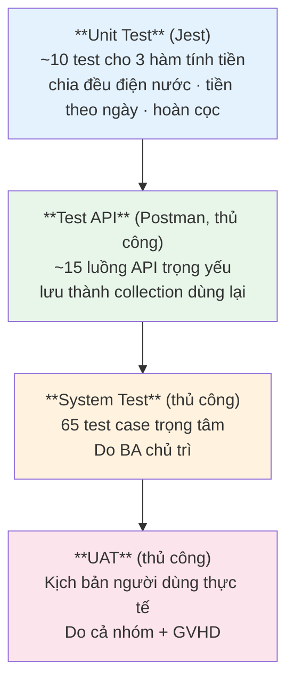

# 11 – KẾ HOẠCH KIỂM THỬ

**Hệ thống:** DMS-KTX
**Phiên bản:** v1.0
**Người phụ trách:** BA (chủ trì) + toàn nhóm

> ⚠️ **Đang áp dụng v1-lite:** thực thi **65 test case trọng tâm** thay vì toàn bộ 128, và chỉ viết **~10 unit test** cho các hàm tính tiền thay vì yêu cầu độ phủ 60%. Danh sách test giữ lại và lý do: [`14` mục 8](14-PHIEN-BAN-DON-GIAN-HOA.md). Toàn bộ test case vẫn được liệt kê đầy đủ dưới đây để đưa vào Phụ lục C của báo cáo.

---

## 1. Mục tiêu và phạm vi kiểm thử

### 1.1. Mục tiêu

1. Xác nhận 100% yêu cầu ưu tiên **Must (M)** trong `02-DAC-TA-YEU-CAU.md` hoạt động đúng.
2. Xác nhận toàn bộ quy tắc nghiệp vụ **BR-xx** trong `03-PHAN-TICH-NGHIEP-VU.md` được thực thi.
3. Phát hiện và loại bỏ toàn bộ lỗi mức **Critical/High** trước khi bàn giao.
4. Xác nhận không có lỗ hổng phân quyền (đặc biệt là IDOR trong cổng sinh viên).

### 1.2. Phạm vi

**Trong phạm vi:**
- Kiểm thử chức năng toàn bộ 8 module MVP
- Kiểm thử phân quyền theo ma trận RBAC
- Kiểm thử tích hợp cổng thanh toán (sandbox)
- Kiểm thử giao diện trên Chrome, Edge, Firefox
- Kiểm thử responsive trên 3 kích thước màn hình
- Kiểm thử hiệu năng cơ bản (đáp ứng NFR-01, NFR-02)

**Ngoài phạm vi:**
- Kiểm thử tải cao (> 100 người dùng đồng thời)
- Kiểm thử thâm nhập chuyên sâu (penetration testing)
- Kiểm thử trên trình duyệt cũ (IE, Safari < 15)
- Kiểm thử khả năng phục hồi sau sự cố hạ tầng

---

## 2. Chiến lược kiểm thử

### 2.1. Các cấp độ kiểm thử

### 2.2. Ưu tiên kiểm thử theo rủi ro

| Mức | Module | Lý do ưu tiên cao | Mức độ kiểm thử |
|-----|--------|-------------------|------------------|
| 🔴 **Rất cao** | Hợp đồng (xếp giường) | Sai → 2 người một giường, hỏng dữ liệu | System + **test đồng thời (TC-72)** |
| 🔴 **Rất cao** | Thanh toán | Sai → sai tiền, mất tiền | Unit + System + **test chữ ký/trùng lặp bằng Postman** |
| 🔴 **Rất cao** | Phân quyền cổng SV | Sai → lộ dữ liệu cá nhân | System test toàn bộ endpoint |
| 🟠 **Cao** | Hóa đơn (tính tiền) | Sai → sai công nợ | Unit + System |
| 🟠 **Cao** | Xác thực | Sai → không ai dùng được | Integration + System |
| 🟡 **Trung bình** | Sinh viên, cơ sở vật chất | CRUD thông thường | System test |
| 🟢 **Thấp** | Dashboard, báo cáo | Chỉ đọc, sai không hỏng dữ liệu | System test |

### 2.3. Môi trường kiểm thử

| Môi trường | Dùng cho | Dữ liệu |
|------------|----------|---------|
| Local | Unit test, integration test, test trong lúc phát triển | Dữ liệu seed, reset được |
| Staging | System test, kiểm thử tích hợp | Bản sao dữ liệu demo |
| Production | UAT cuối cùng, smoke test | Dữ liệu demo chính thức |

### 2.4. Tài khoản kiểm thử

| Vai trò | Tài khoản | Mật khẩu | Dùng để test |
|---------|-----------|----------|--------------|
| Admin | `admin@ktx.edu.vn` | `Admin@123` | Toàn quyền |
| Staff | `staff@ktx.edu.vn` | `Staff@123` | Nghiệp vụ hằng ngày |
| Viewer | `viewer@ktx.edu.vn` | `Viewer@123` | Kiểm tra chỉ đọc |
| Student A | `sv001@ktx.edu.vn` | `Student@123` | Sinh viên đang lưu trú, có công nợ |
| Student B | `sv002@ktx.edu.vn` | `Student@123` | Sinh viên chưa lưu trú (test đăng ký) |
| Student C | `sv003@ktx.edu.vn` | `Student@123` | Dùng để test IDOR (truy cập dữ liệu của A) |

---

## 3. Tiêu chí vào/ra

### 3.1. Tiêu chí bắt đầu kiểm thử hệ thống

| # | Tiêu chí |
|---|----------|
| 1 | Toàn bộ chức năng ưu tiên `M` đã cài đặt xong và merge vào `develop` |
| 2 | Hệ thống deploy được lên staging và chạy ổn định |
| 3 | Dữ liệu seed đã nạp đầy đủ (≥ 3 tòa, ≥ 50 phòng, ≥ 100 SV) |
| 4 | Test case đã viết xong và được nhóm rà soát |
| 5 | 6 tài khoản kiểm thử đã sẵn sàng |

### 3.2. Tiêu chí kết thúc kiểm thử

| # | Tiêu chí |
|---|----------|
| 1 | 100% test case ưu tiên **Cao** đã thực thi |
| 2 | ≥ 95% trong **65 test case trọng tâm** đã thực thi (xem `14` mục 8.2) |
| 3 | Tỷ lệ đạt (Pass rate) ≥ 95% |
| 4 | **0 lỗi Critical, 0 lỗi High** còn mở |
| 5 | Lỗi Medium còn mở ≤ 5, đã được ghi nhận và chấp nhận |
| 6 | Checklist bảo mật (mục 6 của `07`) đạt 14/14 |
| 7 | Biên bản UAT được nhóm ký xác nhận |

### 3.3. Phân loại mức độ lỗi

| Mức | Định nghĩa | Ví dụ | Thời hạn sửa |
|-----|------------|-------|--------------|
| **Critical** | Hỏng dữ liệu, lộ dữ liệu, hệ thống không dùng được | 2 SV cùng 1 giường; SV xem được hóa đơn người khác | Ngay lập tức |
| **High** | Chức năng chính không hoạt động, không có cách khắc phục tạm | Không duyệt được hợp đồng; tính sai tiền | Trong 1 ngày |
| **Medium** | Chức năng lỗi nhưng có cách khắc phục tạm | Bộ lọc sai; xuất Excel thiếu cột | Trong 3 ngày |
| **Low** | Lỗi giao diện, chính tả, không ảnh hưởng chức năng | Lệch căn lề; sai chính tả | Nếu còn thời gian |

---

## 4. Test case

**Ký hiệu:** ✅ Đạt · ❌ Không đạt · ⏸ Chưa test

### 4.1. Module xác thực & phân quyền

| ID | Tiêu đề | Điều kiện trước | Các bước | Kết quả mong đợi | FR/BR | Ưu tiên | KQ |
|----|---------|-----------------|----------|------------------|-------|---------|-----|
| TC-01 | Đăng nhập thành công bằng email | Có tài khoản `staff@ktx.edu.vn` | 1. Mở `/login` 2. Nhập email + mật khẩu đúng 3. Bấm Đăng nhập | Chuyển đến `/admin/dashboard`, hiện tên người dùng ở header | FR-01 | Cao | ⏸ |
| TC-02 | Đăng nhập thành công bằng MSSV | Có tài khoản SV | Nhập `SV2024001` + mật khẩu | Chuyển đến `/portal/home` | FR-01 | Cao | ⏸ |
| TC-03 | Đăng nhập sai mật khẩu | – | Nhập mật khẩu sai | Hiện "Email hoặc mật khẩu không đúng", **không** nói rõ trường nào sai | FR-01 | Cao | ⏸ |
| TC-04 | Khóa tài khoản sau 5 lần sai | – | Nhập sai mật khẩu 5 lần liên tiếp | Lần thứ 6 trả 429, báo còn bao nhiêu phút | FR-05 | TB | ⏸ |
| TC-05 | Truy cập trang cần quyền khi chưa đăng nhập | Đã đăng xuất | Gõ trực tiếp `/admin/students` | Chuyển về `/login` | FR-04 | Cao | ⏸ |
| TC-06 | Viewer không thấy nút thao tác | Đăng nhập Viewer | Mở danh sách sinh viên | Không có nút "Thêm SV", "Sửa", "Xóa" | FR-04 | Cao | ⏸ |
| TC-07 | **Viewer gọi API ghi bị chặn** | Đăng nhập Viewer, lấy token | Dùng Postman gọi `POST /students` | Trả `403 FORBIDDEN` | FR-04 | **Rất cao** | ⏸ |
| TC-08 | **Student gọi API quản trị bị chặn** | Đăng nhập SV, lấy token | Gọi `GET /students` | Trả `403 FORBIDDEN` | FR-04 | **Rất cao** | ⏸ |
| TC-09 | Staff không truy cập được quản lý tài khoản | Đăng nhập Staff | Gọi `GET /users` | Trả `403` | FR-06 | Cao | ⏸ |
| TC-10 | Đổi mật khẩu thành công | Đã đăng nhập | Nhập đúng mật khẩu cũ + mật khẩu mới hợp lệ | Đổi thành công, đăng nhập lại được bằng mật khẩu mới | FR-07 | TB | ⏸ |
| TC-11 | Đổi mật khẩu sai mật khẩu cũ | Đã đăng nhập | Nhập sai mật khẩu hiện tại | Báo lỗi, không đổi | FR-07 | TB | ⏸ |
| TC-12 | Đăng ký tài khoản SV với MSSV đã có hồ sơ | Hồ sơ SV2024005 tồn tại, chưa có tài khoản | Đăng ký với MSSV đó | Tạo tài khoản, `linkStatus = LINKED` | FR-85 | Cao | ⏸ |
| TC-13 | Đăng ký trùng MSSV đã có tài khoản | SV2024001 đã có tài khoản | Đăng ký lại MSSV này | Trả `409 STUDENT_CODE_EXISTS` | FR-85 | Cao | ⏸ |
| TC-14 | Token hết hạn tự refresh | Đăng nhập, chờ token hết hạn | Thực hiện thao tác bất kỳ | Tự refresh, thao tác thành công, không bị đăng xuất | FR-08 | TB | ⏸ |
| TC-15 | Đặt lại mật khẩu hộ người dùng | Đăng nhập Staff | Gọi `POST /users/25/reset-password` | Trả mật khẩu tạm **một lần**, `mustChangePassword = true`; đăng nhập bằng mật khẩu cũ thất bại | FR-09 | Cao | ⏸ |
| TC-16 | **Buộc đổi mật khẩu tạm** | Sau TC-15 | Đăng nhập bằng mật khẩu tạm rồi thử gọi API nghiệp vụ bất kỳ | Bị chặn, buộc chuyển sang màn hình đổi mật khẩu | BR-18 | Cao | ⏸ |
| TC-17 | **Staff không reset được mật khẩu Admin** | Đăng nhập Staff | Gọi reset-password trên tài khoản Admin | Trả `403` — chặn leo thang đặc quyền | BR-83 | **Rất cao** | ⏸ |

### 4.2. Module quản lý sinh viên

| ID | Tiêu đề | Các bước | Kết quả mong đợi | FR/BR | Ưu tiên | KQ |
|----|---------|----------|------------------|-------|---------|-----|
| TC-20 | Thêm sinh viên hợp lệ | Nhập đủ thông tin bắt buộc, lưu | Tạo thành công, hiện trong danh sách | FR-10 | Cao | ⏸ |
| TC-21 | Thêm sinh viên trùng MSSV | Nhập MSSV đã tồn tại | Trả `409 STUDENT_CODE_EXISTS`, hiện lỗi tại ô MSSV | FR-11, BR-11 | Cao | ⏸ |
| TC-22 | Thêm SV thiếu trường bắt buộc | Bỏ trống họ tên | Chặn submit, hiện lỗi tại trường đó | FR-10 | TB | ⏸ |
| TC-23 | Thêm SV với SĐT sai định dạng | Nhập `123abc` | Báo lỗi định dạng SĐT | BR-16 | TB | ⏸ |
| TC-24 | Thêm SV dưới 16 tuổi | Nhập ngày sinh năm 2015 | Báo lỗi tuổi | BR-15 | Thấp | ⏸ |
| TC-25 | Tìm kiếm theo tên | Gõ "Trần" vào ô tìm | Hiện các SV có chữ "Trần" | FR-15 | Cao | ⏸ |
| TC-26 | Tìm kiếm theo MSSV | Gõ "SV2024001" | Hiện đúng 1 kết quả | FR-15 | Cao | ⏸ |
| TC-27 | Lọc theo trạng thái lưu trú | Chọn "Đang ở" | Chỉ hiện SV có hợp đồng ACTIVE | FR-15 | Cao | ⏸ |
| TC-28 | Lọc kết hợp nhiều điều kiện | Chọn tòa B2 + giới tính Nữ | Kết quả thỏa cả 2 điều kiện | FR-15 | TB | ⏸ |
| TC-29 | Phân trang | Chuyển sang trang 2 | Hiện 20 bản ghi tiếp theo, không trùng trang 1 | FR-96 | Cao | ⏸ |
| TC-30 | Cập nhật thông tin SV | Sửa SĐT, lưu | Cập nhật thành công, hiện giá trị mới | FR-13 | Cao | ⏸ |
| TC-31 | **Vô hiệu hóa SV còn hợp đồng** | Chọn SV đang ở, bấm vô hiệu hóa | Trả `422 STUDENT_HAS_ACTIVE_CONTRACT`, không thay đổi | FR-14, BR-13 | **Cao** | ⏸ |
| TC-32 | **Vô hiệu hóa SV còn công nợ** | Chọn SV đã trả phòng nhưng còn nợ | Trả `422 STUDENT_HAS_DEBT` | FR-14, BR-14 | **Cao** | ⏸ |
| TC-33 | Vô hiệu hóa SV hợp lệ | Chọn SV không hợp đồng, không nợ | Thành công, SV chuyển trạng thái không hoạt động | FR-14 | TB | ⏸ |
| TC-34 | Xuất Excel danh sách | Lọc rồi bấm Export | Tải file .xlsx đúng dữ liệu đã lọc | FR-18 | Thấp | ⏸ |

### 4.3. Module cơ sở vật chất

| ID | Tiêu đề | Các bước | Kết quả mong đợi | FR/BR | Ưu tiên | KQ |
|----|---------|----------|------------------|-------|---------|-----|
| TC-40 | Thêm tòa nhà | Nhập mã, tên, số tầng, giới tính | Tạo thành công | FR-20 | TB | ⏸ |
| TC-41 | Thêm tòa nhà trùng mã | Nhập mã đã có | Trả `409` | BR-01 | TB | ⏸ |
| TC-42 | Thêm phòng | Chọn tòa, nhập số phòng, sức chứa, giá | Tạo thành công | FR-21 | Cao | ⏸ |
| TC-43 | Thêm phòng trùng số trong cùng tòa | Nhập số phòng đã có trong tòa đó | Trả `409` | BR-02 | Cao | ⏸ |
| TC-44 | Thêm phòng trùng số ở tòa khác | Số phòng 301 ở tòa B3 (B2 đã có 301) | **Thành công** (chỉ duy nhất trong phạm vi tòa) | BR-02 | TB | ⏸ |
| TC-45 | Sinh nhanh giường | Phòng 8 người, bấm sinh giường | Tạo 8 giường A1–A8 trạng thái trống | FR-23 | Cao | ⏸ |
| TC-46 | **Thêm giường vượt sức chứa** | Phòng 8 giường đã đủ, thêm giường thứ 9 | Trả `422 ROOM_CAPACITY_EXCEEDED` | FR-24, BR-04 | **Cao** | ⏸ |
| TC-47 | Giảm sức chứa dưới số giường hiện có | Phòng 8 giường, sửa capacity = 6 | Trả `422` | BR-09 | TB | ⏸ |
| TC-48 | **Chuyển giường đang có người sang bảo trì** | Chọn giường OCCUPIED | Trả `422`, không đổi trạng thái | FR-27, BR-08 | **Cao** | ⏸ |
| TC-49 | Chuyển giường trống sang bảo trì | Chọn giường AVAILABLE | Thành công, giường → MAINTENANCE | FR-27 | TB | ⏸ |
| TC-50 | Giường bảo trì không hiện trong tra cứu trống | Sau TC-49, mở tra cứu giường trống | Giường đó không xuất hiện | FR-28 | Cao | ⏸ |
| TC-51 | Xóa tòa nhà đang có hợp đồng | Chọn tòa có SV đang ở, bấm xóa | Trả `422 RESOURCE_IN_USE` | FR-25, BR-07 | Cao | ⏸ |
| TC-52 | Sơ đồ tòa nhà hiển thị đúng | Mở sơ đồ tòa B2 | Số phòng và tỷ lệ `đã ở/sức chứa` khớp dữ liệu thật | FR-26 | TB | ⏸ |
| TC-53 | Lọc giường trống theo khoảng giá | Đặt giá tối đa 400.000 | Chỉ hiện phòng có giá ≤ 400.000 | FR-28 | TB | ⏸ |

### 4.4. Module hợp đồng (rủi ro cao nhất)

| ID | Tiêu đề | Các bước | Kết quả mong đợi | FR/BR | Ưu tiên | KQ |
|----|---------|----------|------------------|-------|---------|-----|
| TC-60 | Tạo hợp đồng trực tiếp thành công | Chọn SV chưa ở + giường trống + thời hạn hợp lệ | Tạo HĐ ACTIVE, giường → OCCUPIED, sinh hóa đơn kỳ đầu | FR-31, BR-25 | **Rất cao** | ⏸ |
| TC-61 | **Xếp vào giường đã có người** | Chọn giường OCCUPIED | Trả `409 BED_NOT_AVAILABLE` | FR-32, BR-20 | **Rất cao** | ⏸ |
| TC-62 | **SV đã có hợp đồng hiệu lực** | Chọn SV đang ở, tạo HĐ mới | Trả `422 STUDENT_HAS_ACTIVE_CONTRACT` | FR-33, BR-21 | **Rất cao** | ⏸ |
| TC-63 | **Giới tính không khớp phòng** | Xếp SV nam vào phòng có `gender = FEMALE` | Trả `422 GENDER_MISMATCH` | FR-34, BR-06 | **Rất cao** | ⏸ |
| TC-63b | **Nam nữ ở chung phòng trong tòa MIXED** | Tòa B3 (`MIXED`), phòng 101 có `gender = MALE` đang có SV nam. Xếp một SV nữ vào giường trống của phòng này | Trả `422 GENDER_MISMATCH`. ⚠️ Đây là lỗ hổng dễ lọt nhất nếu code chỉ kiểm tra `building.gender_policy` | BR-06, BR-17 | **Rất cao** | ⏸ |
| TC-64 | Thời hạn dưới 1 tháng | start 01/09, end 15/09 | Trả `422` | BR-23 | Cao | ⏸ |
| TC-65 | Thời hạn quá 12 tháng | start 01/09/2026, end 01/09/2028 | Trả `422` | BR-24 | TB | ⏸ |
| TC-66 | SV nộp đơn đăng ký | Cổng SV → chọn giường → nộp | HĐ PENDING, giường → RESERVED | FR-30 | **Rất cao** | ⏸ |
| TC-67 | Giường RESERVED không hiện trong tra cứu trống | Sau TC-66, tra cứu giường trống | Giường đó không xuất hiện | BR-05 | **Rất cao** | ⏸ |
| TC-68 | Duyệt đơn thành công | Staff duyệt đơn PENDING | HĐ → ACTIVE, giường → OCCUPIED, tạo hóa đơn cọc + phòng | FR-35, UC-03 | **Rất cao** | ⏸ |
| TC-69 | **Kiểm tra hóa đơn kỳ đầu** | Sau TC-68, mở danh sách hóa đơn của SV | Có **đúng 2 hóa đơn**: một `DEPOSIT` (`periodMonth = null`) và một `MONTHLY` (kỳ = tháng của `start_date`); cả hai hạn = start + 7 ngày | BR-25, BR-26 | **Rất cao** | ⏸ |
| TC-69b | **Không thất thu điện nước kỳ đầu** | SV được duyệt HĐ ngày 05/10. Cuối tháng 10 chạy lập hóa đơn hàng loạt kỳ 10/2026 | SV **không bị bỏ qua**: hệ thống bổ sung dòng tiền điện + tiền nước vào hóa đơn `MONTHLY` 10/2026 đã có và tính lại tổng. ⚠️ Nếu SV biến mất khỏi đợt lập hóa đơn ⇒ đang dính lỗi thất thu của BR-25/BR-48 | BR-25, BR-48, FR-59 | **Rất cao** | ⏸ |
| TC-70 | Từ chối đơn | Staff từ chối, nhập lý do | HĐ → REJECTED, giường → AVAILABLE, SV xem được lý do | FR-35 | Cao | ⏸ |
| TC-71 | Từ chối không nhập lý do | Bấm từ chối, để trống lý do | Chặn submit | FR-35 | TB | ⏸ |
| TC-72 | **Race condition: 2 SV cùng chọn 1 giường** | Mở 2 trình duyệt, 2 SV cùng nộp đơn vào giường A5 gần như đồng thời | 1 thành công, 1 nhận `409`, **tuyệt đối không** tạo 2 HĐ trên 1 giường | BR-20 | **Rất cao** | ⏸ |
| TC-73 | Chấm dứt hợp đồng trước hạn | Staff chấm dứt HĐ ACTIVE | HĐ → TERMINATED, giường → AVAILABLE, hiện biên bản thanh lý | FR-39 | Cao | ⏸ |
| TC-74 | Chuyển phòng | Chọn giường đích trống hợp lệ | Giường cũ → AVAILABLE, giường mới → OCCUPIED, ghi lịch sử | FR-29 | TB | ⏸ |
| TC-75 | Chuyển phòng sang giường đã có người | Chọn giường OCCUPIED | Trả `409` | FR-29 | TB | ⏸ |
| TC-76 | Cảnh báo hợp đồng sắp hết hạn | Tạo HĐ hết hạn sau 20 ngày, mở dashboard | HĐ xuất hiện trong danh sách sắp hết hạn | FR-38, BR-29 | Cao | ⏸ |
| TC-77 | Job tự động hết hạn hợp đồng | Sửa `end_date` về hôm qua, chạy JOB-01 | HĐ → EXPIRED, giường → AVAILABLE | FR-37, BR-28 | Cao | ⏸ |
| TC-78 | Job hủy đơn chờ duyệt quá 7 ngày | Tạo HĐ PENDING với `created_at` 8 ngày trước, chạy JOB-02 | HĐ → CANCELLED, giường → AVAILABLE | BR-27 | TB | ⏸ |

### 4.5. Module tài chính

| ID | Tiêu đề | Các bước | Kết quả mong đợi | FR/BR | Ưu tiên | KQ |
|----|---------|----------|------------------|-------|---------|-----|
| TC-80 | Nhập chỉ số điện nước | Nhập CS đầu 1250, cuối 1610 | Tính đúng tiêu thụ 360 kWh, thành tiền 900.000đ | FR-56 | Cao | ⏸ |
| TC-81 | **Chỉ số cuối nhỏ hơn chỉ số đầu** | Nhập đầu 1610, cuối 1250 | Trả `422`, chặn lưu | BR-49 | **Cao** | ⏸ |
| TC-82 | Nhập trùng chỉ số cho phòng/kỳ | Nhập lại kỳ đã có | Trả `409` | – | TB | ⏸ |
| TC-83 | Sửa chỉ số đã lập hóa đơn | Sửa bản ghi có `is_invoiced = true` | Trả `422`, chặn sửa | – | TB | ⏸ |
| TC-84 | Tạo hóa đơn thủ công | Thêm 2 dòng phí, lưu | Tổng tiền = tổng các dòng, trạng thái UNPAID | FR-58, BR-41 | Cao | ⏸ |
| TC-85 | **Lập hóa đơn hàng loạt** | Chọn kỳ 10/2026, xác nhận | Tạo đúng số hóa đơn = số SV đang ở, mỗi HĐ có 3 dòng phí | FR-59, UC-04 | **Rất cao** | ⏸ |
| TC-86 | **Kiểm tra chia đều tiền điện nước** | Phòng 6 SV, tiền điện 900.000đ | Mỗi SV 150.000đ, tổng đúng 900.000đ | BR-51 | **Rất cao** | ⏸ |
| TC-87 | **Chia có dư** | Phòng 7 SV, tiền nước 576.000đ | 6 SV mỗi người 82.285đ, SV có MSSV nhỏ nhất 82.290đ, tổng = 576.000đ | BR-51 | **Rất cao** | ⏸ |
| TC-88 | Bỏ qua phòng chưa nhập chỉ số | Có 2 phòng chưa nhập, lập hóa đơn | 2 phòng đó nằm trong danh sách bỏ qua, các phòng khác vẫn lập bình thường | UC-04 E1 | Cao | ⏸ |
| TC-89 | Không lập trùng hóa đơn | Lập lại kỳ 10/2026 lần 2 | SV đã có hóa đơn bị bỏ qua, không tạo trùng | BR-48 | **Cao** | ⏸ |
| TC-90 | Ghi nhận thanh toán đủ | Hóa đơn 646.000đ, ghi nhận 646.000đ | `paidAmount = 646.000`, trạng thái → PAID | FR-63 | **Rất cao** | ⏸ |
| TC-91 | **Thanh toán một phần** | Hóa đơn 646.000đ, ghi nhận 400.000đ | Còn nợ 246.000đ, trạng thái → PARTIALLY_PAID | FR-62, BR-43 | **Rất cao** | ⏸ |
| TC-92 | **Thanh toán vượt số nợ** | Hóa đơn còn nợ 246.000đ, nhập 500.000đ | Trả `422 PAYMENT_EXCEEDS_REMAINING` | BR-44 | **Rất cao** | ⏸ |
| TC-93 | Thanh toán hóa đơn đã trả đủ | Chọn hóa đơn PAID, ghi nhận thêm | Trả `422 INVOICE_ALREADY_PAID` | BR-46 | Cao | ⏸ |
| TC-94 | Hủy hóa đơn chưa thanh toán | Chọn HĐ UNPAID, hủy | Thành công, trạng thái → CANCELLED | FR-69 | TB | ⏸ |
| TC-95 | **Hủy hóa đơn đã có thanh toán** | Chọn HĐ PARTIALLY_PAID, hủy | Trả `422 INVOICE_HAS_PAYMENT` | BR-47 | **Cao** | ⏸ |
| TC-96 | Job đánh dấu quá hạn | Sửa `due_date` về hôm qua, chạy JOB-03 | Hóa đơn → OVERDUE | FR-68, BR-60 | Cao | ⏸ |

### 4.6. Module thanh toán trực tuyến

| ID | Tiêu đề | Các bước | Kết quả mong đợi | FR/BR | Ưu tiên | KQ |
|----|---------|----------|------------------|-------|---------|-----|
| TC-100 | Tạo URL thanh toán VNPay | SV bấm thanh toán 246.000đ | Nhận `paymentUrl`, tạo payment PENDING với `transactionRef` | FR-64 | **Rất cao** | ⏸ |
| TC-101 | **Thanh toán thành công qua sandbox** | Vào URL, nhập thẻ test, xác nhận | IPN về → payment SUCCESS → hóa đơn cập nhật `paidAmount`, → PAID | FR-65, UC-05 | **Rất cao** | ⏸ |
| TC-102 | Người dùng hủy giao dịch | Vào URL, bấm hủy | Payment → FAILED, hóa đơn **không** đổi | UC-05 E2 | Cao | ⏸ |
| TC-103 | **Chữ ký sai** | Gọi `POST /payments/vnpay/verify` bằng Postman với `vnp_SecureHash` bịa | Trả `400 INVALID_SIGNATURE`, hóa đơn **không** đổi, có log cảnh báo. ⭐ Không cần ngrok | BR-57, FR-65 | **Rất cao** | ⏸ |
| TC-104 | **Gửi trùng (idempotent)** | Gọi lại `verify` lần 2 với đúng bộ tham số đã thành công | Trả `200` kèm `alreadyConfirmed: true`, **chỉ 1** bản ghi payment, `paidAmount` không bị cộng đôi | BR-56, FR-66 | **Rất cao** | ⏸ |
| TC-105 | **Số tiền không khớp** | Gọi `verify` với `vnp_Amount` khác số đã tạo (phải ký lại cho đúng chữ ký) | Trả `422 AMOUNT_MISMATCH`, payment → NEEDS_RECONCILIATION, hóa đơn không đổi | BR-58 | **Rất cao** | ⏸ |
| TC-106 | Mã giao dịch không tồn tại | Gọi `verify` với `vnp_TxnRef` bịa | Trả `404 NOT_FOUND` | – | Cao | ⏸ |
| TC-107 | **Sinh viên đóng trình duyệt giữa chừng** | Thanh toán xong nhưng không quay về Return URL. Nhân viên bấm "Đối soát giao dịch" | Giao dịch từ `PENDING` chuyển đúng sang `SUCCESS`, hóa đơn cập nhật | FR-67 | **Cao** | ⏸ |
| TC-108 | Job hết hạn giao dịch treo | Tạo payment PENDING, chờ 16 phút, chạy JOB-04 | Payment → EXPIRED | BR-59 | TB | ⏸ |
| ~~TC-109~~ | ~~Thanh toán qua ZaloPay~~ | **Bỏ ở v1-lite** — chỉ tích hợp VNPay | – | FR-64 | – | ➖ |

### 4.7. Module cổng sinh viên (trọng tâm bảo mật)

| ID | Tiêu đề | Các bước | Kết quả mong đợi | FR/BR | Ưu tiên | KQ |
|----|---------|----------|------------------|-------|---------|-----|
| TC-120 | Xem thông tin cư trú | SV A đăng nhập, mở "Chỗ ở của tôi" | Hiện đúng tòa/phòng/giường/hợp đồng của SV A | FR-87 | Cao | ⏸ |
| TC-121 | **IDOR: xem hóa đơn người khác** | SV C đăng nhập, gọi `GET /portal/my-invoices/201` (hóa đơn của SV A) | Trả `403 FORBIDDEN_RESOURCE` | FR-89, BR-85 | **Rất cao** | ⏸ |
| TC-122 | **IDOR: thanh toán hóa đơn người khác** | SV C gọi `POST /portal/my-invoices/201/pay` | Trả `403` | FR-89 | **Rất cao** | ⏸ |
| TC-123 | **IDOR: hủy đơn người khác** | SV C gọi `DELETE /portal/applications/43` (đơn của SV B) | Trả `403` | FR-89 | **Rất cao** | ⏸ |
| TC-124 | **Truyền studentId giả trong query** | SV C gọi `GET /portal/my-invoices?studentId=12` | Chỉ trả hóa đơn của SV C, **bỏ qua** tham số truyền lên | BR-85 | **Rất cao** | ⏸ |
| TC-125 | Bạn cùng phòng chỉ hiện thông tin công khai | Mở "Bạn cùng phòng" | Chỉ có họ tên + MSSV, **không** có SĐT/CCCD/email | FR-87 | **Cao** | ⏸ |
| TC-126 | Hồ sơ cá nhân chỉ đọc | Mở trang hồ sơ | Không có nút Sửa, mọi ô ở chế độ chỉ đọc | FR-90 | Cao | ⏸ |
| TC-127 | Tra cứu giường trống lọc theo giới tính | SV nữ mở tra cứu | Chỉ hiện tòa Nữ và Hỗn hợp, không hiện tòa Nam | FR-88, BR-06 | Cao | ⏸ |
| TC-128 | Gửi yêu cầu gia hạn | SV có HĐ ACTIVE, gửi yêu cầu | Tạo request PENDING | FR-45 | Cao | ⏸ |
| TC-129 | **Gửi 2 yêu cầu cùng loại** | Gửi tiếp yêu cầu gia hạn thứ 2 | Trả `409 DUPLICATE_PENDING_REQUEST` | FR-47, BR-71 | **Cao** | ⏸ |
| TC-130 | SV chưa có hợp đồng gửi yêu cầu | SV B (chưa ở) gửi yêu cầu gia hạn | Trả `422 CONTRACT_NOT_ACTIVE` | BR-70 | Cao | ⏸ |
| TC-131 | Ngày gia hạn không hợp lệ | Nhập ngày kết thúc mới < ngày hiện tại của HĐ | Trả `422` | BR-72 | TB | ⏸ |
| TC-132 | SV tự hủy yêu cầu | Hủy request đang PENDING của mình | Thành công, request → CANCELLED | BR-78 | TB | ⏸ |
| TC-133 | Duyệt gia hạn | Staff duyệt | HĐ cập nhật `end_date` mới, sinh hóa đơn kỳ gia hạn, **không** thu lại cọc | FR-50, BR-53, BR-74 | **Rất cao** | ⏸ |
| TC-134 | **Duyệt trả phòng khi còn nợ** | Staff duyệt, `forceConfirm = false` | Trả `422 STUDENT_HAS_DEBT` kèm cảnh báo | FR-52, BR-76 | **Rất cao** | ⏸ |
| TC-135 | **Duyệt trả phòng có xác nhận** | Gửi lại với `forceConfirm = true` | HĐ → TERMINATED, giường → AVAILABLE, sinh hóa đơn `SETTLEMENT`, hiện biên bản thanh lý đúng số tiền | FR-51, BR-75, BR-54b | **Rất cao** | ⏸ |
| TC-135b | **Ghi nhận chi trả hoàn cọc** | Sau TC-136, nhân viên xác nhận đã trả tiền cọc cho SV | Có bản ghi `payment` trạng thái `REFUNDED` gắn hóa đơn `SETTLEMENT`, ghi rõ người thực hiện và thời điểm | BR-54a | Cao | ⏸ |
| TC-136 | **Kiểm tra tính tiền hoàn cọc** | Cọc 500.000đ, công nợ 246.000đ | Hoàn lại 254.000đ | BR-54 | **Rất cao** | ⏸ |
| TC-137 | Công nợ lớn hơn cọc | Cọc 500.000đ, công nợ 700.000đ | Hoàn 0đ, SV còn nợ 200.000đ | BR-54 | Cao | ⏸ |

### 4.8. Module dashboard & báo cáo

| ID | Tiêu đề | Các bước | Kết quả mong đợi | FR | Ưu tiên | KQ |
|----|---------|----------|------------------|-----|---------|-----|
| TC-150 | Số liệu dashboard khớp thực tế | Mở dashboard, đối chiếu với truy vấn SQL trực tiếp | Các con số khớp nhau | FR-75 | Cao | ⏸ |
| TC-151 | Tỷ lệ lấp đầy tính đúng | Kiểm tra công thức (loại trừ giường bảo trì) | Khớp công thức mục 5.1 của `03` | FR-75 | Cao | ⏸ |
| TC-152 | Dashboard phản hồi nhanh | Đo thời gian tải với 400 giường, 120 SV | < 2 giây | NFR-02 | Cao | ⏸ |
| TC-153 | Viewer không thấy khối "Cần xử lý" | Đăng nhập Viewer, mở dashboard | Khối thao tác bị ẩn | FR-04 | TB | ⏸ |
| TC-154 | Xuất báo cáo giường trống | Bấm xuất Excel | Tải file đúng dữ liệu | FR-80 | TB | ⏸ |
| TC-155 | Biểu đồ doanh thu | Mở dashboard | Biểu đồ hiển thị 12 tháng, số liệu khớp bảng payment | FR-79 | TB | ⏸ |

### 4.9. Kiểm thử phi chức năng

| ID | Tiêu đề | Cách kiểm tra | Tiêu chí đạt | NFR | KQ |
|----|---------|---------------|--------------|-----|-----|
| TC-160 | Hiệu năng API danh sách | Postman đo `GET /students?limit=50` với 1000 SV | < 500 ms | NFR-01 | ⏸ |
| TC-161 | Hiệu năng dashboard | Đo `GET /dashboard/summary` | < 2 s | NFR-02 | ⏸ |
| TC-162 | Tốc độ tải trang FE | Lighthouse trên trang đăng nhập | FCP < 3 s | NFR-03 | ⏸ |
| TC-163 | Responsive mobile | Mở cổng SV trên màn 375px | Không cuộn ngang, mọi nút bấm được | NFR-09 | ⏸ |
| TC-164 | Responsive tablet | Mở khu quản trị trên màn 768px | Sidebar thu gọn, bảng cuộn ngang được | NFR-09 | ⏸ |
| TC-165 | Tương thích trình duyệt | Chạy luồng chính trên Chrome, Edge, Firefox | Hoạt động giống nhau | NFR-12 | ⏸ |
| TC-166 | Tiếng Việt toàn hệ thống | Rà toàn bộ màn hình và thông báo | Không còn chuỗi tiếng Anh lọt ra giao diện | NFR-19 | ⏸ |
| TC-167 | Lỗi 500 không lộ stack trace | Gây lỗi chủ ý | Response chỉ có thông báo chung, không có stack | NFR-18 | ⏸ |
| TC-168 | Xác nhận trước thao tác nguy hiểm | Thử xóa/chấm dứt/hủy | Luôn có modal xác nhận nêu rõ hậu quả | NFR-11 | ⏸ |

---

## 5. Kịch bản UAT (nghiệm thu cuối)

> Chạy tuần tự trên môi trường production. Mỗi kịch bản mô phỏng một ngày làm việc thực tế.

### UAT-01: Chu trình đầy đủ của một sinh viên (30 phút)

| Bước | Vai | Thao tác | Kiểm chứng |
|------|-----|----------|------------|
| 1 | Staff | Thêm hồ sơ SV mới "Nguyễn Văn Test" (SV9999) | Hiện trong danh sách |
| 2 | Student | Đăng ký tài khoản bằng MSSV SV9999 | Tạo được tài khoản, tự liên kết hồ sơ |
| 3 | Student | Tra cứu giường trống, chọn tòa phù hợp giới tính | Chỉ hiện tòa hợp lệ |
| 4 | Student | Nộp đơn đăng ký vào giường cụ thể | Đơn PENDING, giường RESERVED |
| 5 | Staff | Mở "Đơn chờ duyệt", thấy đơn mới | Hiện đủ thông tin, có dự kiến hóa đơn |
| 6 | Staff | Duyệt đơn | HĐ ACTIVE, giường OCCUPIED, có hóa đơn cọc + phòng |
| 7 | Student | Xem "Chỗ ở của tôi" | Hiện đúng phòng/giường |
| 8 | Student | Mở hóa đơn, thanh toán VNPay toàn bộ | Hóa đơn → PAID |
| 9 | Staff | Nhập chỉ số điện nước cho phòng đó | Tính đúng tiêu thụ |
| 10 | Staff | Lập hóa đơn kỳ | SV có hóa đơn tháng mới |
| 11 | Student | Thanh toán một phần (50%) | Trạng thái → PARTIALLY_PAID |
| 12 | Student | Gửi yêu cầu trả phòng | Request PENDING |
| 13 | Staff | Duyệt trả phòng (còn nợ → phải xác nhận) | Cảnh báo hiện ra đúng |
| 14 | Staff | Xác nhận | HĐ TERMINATED, giường AVAILABLE, biên bản thanh lý đúng số |
| 15 | Admin | Mở dashboard | Số giường trống tăng 1, số SV đang ở giảm 1 |

### UAT-02: Nghiệp vụ hằng tháng của nhân viên (20 phút)

| Bước | Thao tác | Kiểm chứng |
|------|----------|------------|
| 1 | Nhập chỉ số điện nước cho toàn bộ phòng của tòa B2 | Lưu thành công |
| 2 | Lập hóa đơn hàng loạt kỳ hiện tại | Xem trước hiện cảnh báo phòng thiếu chỉ số |
| 3 | Xử lý các phòng thiếu, lập lại | Tạo đủ hóa đơn |
| 4 | Kiểm tra ngẫu nhiên 3 hóa đơn | Số tiền khớp công thức tính tay |
| 5 | Ghi nhận thanh toán tiền mặt cho 5 SV | Trạng thái cập nhật đúng |
| 6 | Xem báo cáo công nợ | Danh sách khớp thực tế |
| 7 | Xử lý 3 yêu cầu gia hạn | HĐ cập nhật, sinh hóa đơn gia hạn |
| 8 | Xuất báo cáo giường trống ra Excel | File tải về đúng dữ liệu |

### UAT-03: Kiểm tra phân quyền (15 phút)

| Bước | Thao tác | Kiểm chứng |
|------|----------|------------|
| 1 | Đăng nhập Viewer, thử mọi chức năng | Chỉ xem được, không có nút thao tác |
| 2 | Dùng token Viewer gọi API ghi qua Postman | Trả 403 |
| 3 | Đăng nhập SV C, thử truy cập dữ liệu SV A qua URL và API | Trả 403 ở mọi trường hợp |
| 4 | Đăng nhập Staff, thử vào `/admin/users` | Chuyển về trang 403 |
| 5 | Đăng xuất, gõ URL trang quản trị | Chuyển về `/login` |

---

## 6. Mẫu báo cáo kiểm thử

### 6.1. Bảng tổng hợp

| Module | Tổng TC | Đã chạy | Đạt | Không đạt | Tỷ lệ đạt |
|--------|---------|---------|-----|-----------|-----------|
| Xác thực & phân quyền | 17 | | | | |
| Quản lý sinh viên | 15 | | | | |
| Cơ sở vật chất | 14 | | | | |
| Hợp đồng | 21 | | | | |
| Tài chính | 17 | | | | |
| Thanh toán online | 10 | | | | |
| Cổng sinh viên | 19 | | | | |
| Dashboard & báo cáo | 6 | | | | |
| Phi chức năng | 9 | | | | |
| **Tổng** | **128** | | | | |

### 6.2. Bảng theo dõi lỗi

| ID lỗi | Test case | Mô tả | Mức độ | Người phát hiện | Người sửa | Trạng thái | Ngày đóng |
|--------|-----------|-------|--------|------------------|-----------|------------|-----------|
| BUG-01 | | | | | | Mở / Đang sửa / Đã sửa / Đã xác minh | |

---

## 7. Lịch sử phiên bản

| Phiên bản | Ngày | Người thực hiện | Nội dung thay đổi |
|-----------|------|------------------|-------------------|
| v1.0 | 11/09/2026 | BA | Khởi tạo kế hoạch kiểm thử, 122 test case, 3 kịch bản UAT |
| v1.2 | 12/09/2026 | BA | **Áp dụng v1-lite:** rút xuống 65 test case trọng tâm (giữ 100% test ưu tiên Rất cao/Cao); bỏ yêu cầu độ phủ 60%, thay bằng ~10 unit test cho hàm tính tiền; integration test thay bằng Postman collection. Xem `14` mục 8 |
| v1.1 | 12/09/2026 | BA | Thêm 7 test case cho các lỗ hổng phát hiện khi rà soát chéo: TC-15/16/17 (đặt lại mật khẩu, chống leo thang đặc quyền), TC-63b (nam nữ chung phòng tòa MIXED), TC-69/69b (tách hóa đơn cọc, chống thất thu điện nước kỳ đầu), TC-135b (ghi nhận hoàn cọc). Tổng: **128 test case** |
