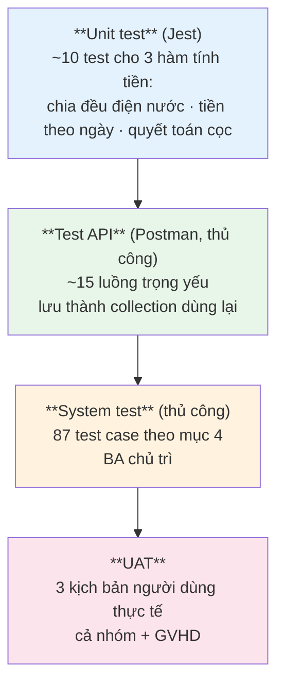

# 11 – KẾ HOẠCH KIỂM THỬ

**Hệ thống:** DMS – Hệ thống quản lý ký túc xá
**Phiên bản:** v2.0 (MongoDB + Mongoose)
**Người phụ trách:** BA chủ trì + toàn nhóm

> Mọi test case phải truy vết về một `FR-xx` trong `02-DAC-TA-YEU-CAU.md` hoặc một `BR-xx` trong `03-PHAN-TICH-NGHIEP-VU.md`.
> Mã lỗi và định dạng response xem `API.md` mục 12.

---

## 1. Mục tiêu và phạm vi

### 1.1. Mục tiêu

1. Xác nhận 100% yêu cầu ưu tiên **Must (M)** hoạt động đúng.
2. Xác nhận các quy tắc nghiệp vụ `BR-xx` được thực thi ở tầng service.
3. Loại bỏ toàn bộ lỗi mức **Critical/High** trước khi bàn giao.
4. Xác nhận không có lỗ hổng phân quyền, đặc biệt là **IDOR** ở cổng sinh viên.

### 1.2. Phạm vi

**Trong phạm vi:** kiểm thử chức năng 9 module · phân quyền RBAC · tích hợp cổng thanh toán sandbox · giao diện trên Chrome/Edge/Firefox · responsive 3 kích thước · hiệu năng cơ bản (NFR-01, NFR-02).

**Ngoài phạm vi:** test tải cao (> 100 người đồng thời) · penetration testing chuyên sâu · trình duyệt cũ (IE, Safari < 15) · khả năng phục hồi sau sự cố hạ tầng.

---

## 2. Chiến lược kiểm thử

### 2.1. Các cấp độ

### 2.2. Ưu tiên theo rủi ro

| Mức | Module | Sai thì hậu quả gì | Cách test |
|-----|--------|---------------------|-----------|
| 🔴 **Rất cao** | Đăng ký lưu trú (chiếm giường) | 2 sinh viên một giường, hỏng dữ liệu | System + **test đồng thời (TC-42)** |
| 🔴 **Rất cao** | Thanh toán (webhook) | Sai tiền, mất tiền, ghi nhận 2 lần | Unit + **test chữ ký/trùng lặp bằng Postman** |
| 🔴 **Rất cao** | Phân quyền cổng sinh viên | Lộ dữ liệu cá nhân | System test toàn bộ endpoint `/api/portal/*` |
| 🟠 **Cao** | Hóa đơn & chỉ số điện nước | Sai công nợ, thất thu | Unit + System |
| 🟠 **Cao** | Quyết toán tiền cọc | Không đối soát được sổ sách | System |
| 🟡 **Trung bình** | Sinh viên, cơ sở vật chất | CRUD thông thường | System |
| 🟢 **Thấp** | Dashboard | Chỉ đọc, sai không hỏng dữ liệu | System |

### 2.3. Môi trường & tài khoản

| Môi trường | Dùng cho |
|------------|----------|
| Local | Unit test, test API bằng Postman, test trong lúc phát triển |
| Staging | System test (87 test case) |
| Production | UAT cuối cùng + smoke test |

| Vai trò | Tài khoản | Mật khẩu | Dùng để test |
|---------|-----------|----------|--------------|
| admin | `admin@dorm.local` | `Admin@123` | Toàn quyền |
| staff | `staff@dorm.local` | `Staff@123` | Nghiệp vụ hằng ngày |
| viewer | `viewer@dorm.local` | `Viewer@123` | Kiểm tra chỉ đọc |
| student A | `sv001@dorm.local` | `Student@123` | Đang lưu trú, có công nợ |
| student B | `sv002@dorm.local` | `Student@123` | Chưa lưu trú |
| student C | `sv003@dorm.local` | `Student@123` | **Dùng để test IDOR** (truy cập dữ liệu của A) |

> Dữ liệu seed tối thiểu: 2 tòa nhà, 20 phòng (10 nam + 10 nữ), 80 giường, 40 sinh viên, đủ hợp đồng ở cả 4 trạng thái.

---

## 3. Tiêu chí vào/ra

### 3.1. Bắt đầu kiểm thử hệ thống khi

| # | Tiêu chí |
|---|----------|
| 1 | Toàn bộ chức năng ưu tiên `M` đã cài đặt và merge vào `main` |
| 2 | Hệ thống deploy được lên staging và chạy ổn định |
| 3 | Dữ liệu seed đã nạp đầy đủ |
| 4 | 6 tài khoản kiểm thử sẵn sàng |

### 3.2. Kết thúc kiểm thử khi

| # | Tiêu chí |
|---|----------|
| 1 | 100% test case ưu tiên **Rất cao** và **Cao** đã thực thi |
| 2 | ≥ 95% tổng số test case đã thực thi |
| 3 | Tỷ lệ đạt ≥ 95% |
| 4 | **0 lỗi Critical, 0 lỗi High** còn mở |
| 5 | Lỗi Medium còn mở ≤ 5, đã ghi nhận và chấp nhận |
| 6 | Checklist bảo mật (`07` mục 6) đạt đủ |
| 7 | Biên bản UAT được nhóm ký xác nhận |

### 3.3. Phân loại mức độ lỗi

| Mức | Định nghĩa | Ví dụ | Hạn sửa |
|-----|------------|-------|---------|
| **Critical** | Hỏng dữ liệu, lộ dữ liệu, hệ thống không dùng được | 2 SV một giường; SV xem được hóa đơn người khác | Ngay lập tức |
| **High** | Chức năng chính hỏng, không có cách khắc phục tạm | Không kích hoạt được hợp đồng; tính sai tiền | Trong 1 ngày |
| **Medium** | Lỗi nhưng có cách khắc phục tạm | Bộ lọc sai; xuất CSV thiếu cột | Trong 3 ngày |
| **Low** | Giao diện, chính tả | Lệch căn lề | Nếu còn thời gian |

---

## 4. Test case

**Ký hiệu kết quả:** ✅ Đạt · ❌ Không đạt · ⏸ Chưa test

### 4.1. Xác thực & phân quyền (12)

| ID | Tiêu đề | Các bước | Kết quả mong đợi | Truy vết | Ưu tiên | KQ |
|----|---------|----------|------------------|----------|---------|-----|
| TC-01 | Đăng nhập thành công | Nhập `staff@dorm.local` + mật khẩu đúng | Trả `code: "OK"` kèm token và user; chuyển tới `/admin/dashboard` | FR-01 | Cao | ⏸ |
| TC-02 | Sinh viên đăng nhập | Nhập `sv001@dorm.local` + mật khẩu | Chuyển tới `/portal/home`, **không** vào được khu quản trị | FR-01 | Cao | ⏸ |
| TC-03 | Sai mật khẩu | Nhập mật khẩu sai | `401 UNAUTHORIZED`, thông báo chung "Email hoặc mật khẩu không đúng" — **không** nói rõ trường nào sai | FR-01 | Cao | ⏸ |
| TC-04 | Giới hạn tần suất đăng nhập | Gọi `/api/auth/login` liên tục quá ngưỡng | Trả `429` | FR-05 | TB | ⏸ |
| TC-05 | Chưa đăng nhập mà gõ URL quản trị | Đăng xuất rồi gõ `/admin/students` | Chuyển về `/login` | FR-04 | Cao | ⏸ |
| TC-06 | Viewer không thấy nút thao tác | Đăng nhập viewer, mở danh sách sinh viên | Không có nút "Thêm", "Sửa", "Vô hiệu hóa" | FR-04 | Cao | ⏸ |
| TC-07 | **Viewer gọi API ghi bị chặn** | Dùng token viewer gọi `POST /api/students` bằng Postman | `403 FORBIDDEN` | FR-04 | **Rất cao** | ⏸ |
| TC-08 | **Student gọi API quản trị bị chặn** | Dùng token student gọi `GET /api/students` | `403 FORBIDDEN` | FR-04 | **Rất cao** | ⏸ |
| TC-09 | Staff không quản lý được tài khoản | Dùng token staff gọi `GET /api/users` | `403 FORBIDDEN` | FR-06 | Cao | ⏸ |
| TC-10 | Đặt lại mật khẩu hộ người dùng | Staff gọi `POST /api/users/:id/reset-password` | Trả mật khẩu tạm **một lần**, `mustChangePassword: true`; mật khẩu cũ không dùng được nữa | FR-09 | Cao | ⏸ |
| TC-11 | **Buộc đổi mật khẩu tạm** | Đăng nhập bằng mật khẩu tạm rồi gọi API nghiệp vụ bất kỳ | Bị chặn, buộc chuyển sang màn hình đổi mật khẩu | BR-85 | Cao | ⏸ |
| TC-12 | **Staff không reset được mật khẩu admin** | Staff gọi reset-password trên tài khoản admin | `403` — chặn leo thang đặc quyền | BR-84 | **Rất cao** | ⏸ |

### 4.2. Quản lý sinh viên (7)

| ID | Tiêu đề | Các bước | Kết quả mong đợi | Truy vết | Ưu tiên | KQ |
|----|---------|----------|------------------|----------|---------|-----|
| TC-20 | Thêm sinh viên hợp lệ | Nhập đủ trường bắt buộc gồm **giới tính** | Tạo thành công, hiện trong danh sách | FR-10 | Cao | ⏸ |
| TC-21 | Trùng mã số sinh viên | Nhập `studentCode` đã tồn tại | `409 DUPLICATE_ENTRY`, lỗi hiện ngay tại ô MSSV | FR-11, BR-11 | Cao | ⏸ |
| TC-22 | Thiếu giới tính | Bỏ trống giới tính | Chặn submit — giới tính bắt buộc vì cần cho BR-06 | BR-12 | Cao | ⏸ |
| TC-23 | Sai định dạng số điện thoại | Nhập `123abc` | Báo lỗi định dạng | BR-15 | TB | ⏸ |
| TC-24 | Tìm kiếm và phân trang | Gõ từ khóa, chuyển trang 2 | Kết quả đúng; response có `{ items, total, page, limit }` | FR-15, FR-90 | Cao | ⏸ |
| TC-25 | **Vô hiệu hóa SV còn hợp đồng** | Chọn SV đang lưu trú | `422 STUDENT_HAS_ACTIVE_CONTRACT`, không thay đổi | FR-14, BR-13 | **Cao** | ⏸ |
| TC-26 | **Vô hiệu hóa SV còn công nợ** | Chọn SV đã trả phòng nhưng còn nợ | `422 STUDENT_HAS_DEBT` | FR-14, BR-14 | **Cao** | ⏸ |

### 4.3. Tòa nhà, phòng & giường (8)

| ID | Tiêu đề | Các bước | Kết quả mong đợi | Truy vết | Ưu tiên | KQ |
|----|---------|----------|------------------|----------|---------|-----|
| TC-30 | Tạo phòng có giới tính | Tạo phòng với `gender: "female"` | Tạo thành công | FR-21, FR-29 | Cao | ⏸ |
| TC-31 | **Tạo phòng thiếu giới tính** | Bỏ trống `gender` | `400 VALIDATION_ERROR` — trường bắt buộc | FR-29 | **Cao** | ⏸ |
| TC-32 | Trùng số phòng trong cùng tòa | Nhập số phòng đã có | `409 DUPLICATE_ENTRY` | BR-02 | Cao | ⏸ |
| TC-33 | Trùng số phòng ở tòa khác | Phòng `101` ở tòa B trong khi tòa A đã có `101` | **Thành công** — chỉ duy nhất trong phạm vi tòa | BR-02 | TB | ⏸ |
| TC-34 | Sinh nhanh giường | Phòng sức chứa 4, bấm sinh giường | Tạo 4 giường trạng thái `available` | FR-23 | Cao | ⏸ |
| TC-35 | **Thêm giường vượt sức chứa** | Phòng 4 giường đã đủ, thêm giường thứ 5 | `409 ROOM_CAPACITY_EXCEEDED` | FR-24, BR-04 | **Cao** | ⏸ |
| TC-36 | **Chuyển giường đang có người sang bảo trì** | Chọn giường `occupied` | `422 BED_OCCUPIED`, không đổi trạng thái | FR-27, BR-08 | **Cao** | ⏸ |
| TC-37 | Giường bảo trì không hiện trong tra cứu trống | Sau TC-36, mở `GET /api/beds/available` | Giường đó không xuất hiện | FR-28 | Cao | ⏸ |

### 4.4. Đăng ký lưu trú & hợp đồng (11) — trọng tâm

| ID | Tiêu đề | Các bước | Kết quả mong đợi | Truy vết | Ưu tiên | KQ |
|----|---------|----------|------------------|----------|---------|-----|
| TC-40 | Xếp sinh viên vào giường thành công | Staff chọn SV + giường trống đúng giới tính | Tạo `Residency` `active`, `Bed` → `occupied`, `Contract` → `pending` | FR-30 | **Rất cao** | ⏸ |
| TC-41 | **Xếp vào giường đã có người** | Chọn giường `occupied` | `409 BED_NOT_AVAILABLE` | FR-31, BR-20 | **Rất cao** | ⏸ |
| TC-42 | **Tranh chấp: 2 Staff cùng xếp vào 1 giường** | Mở 2 trình duyệt, 2 Staff cùng bấm xếp vào giường X gần như đồng thời | 1 thành công, 1 nhận `409`. **Tuyệt đối không** tạo 2 Residency `active` trên cùng giường | BR-20 | **Rất cao** | ⏸ |
| TC-43 | **Giới tính không khớp phòng** | Xếp SV nam vào phòng `gender: "female"` | `422 GENDER_MISMATCH` | FR-29, BR-06 | **Rất cao** | ⏸ |
| TC-44 | **Nam nữ ở chung phòng (bẫy kiểm tra sai tầng)** | Phòng đang có 3 SV nữ, thử xếp 1 SV nam vào giường trống của phòng đó | `422 GENDER_MISMATCH`. ⚠️ Lỗi lọt nếu code chỉ kiểm tra ở mức tòa nhà thay vì `Room.gender` | BR-06 | **Rất cao** | ⏸ |
| TC-45 | **SV đã có hợp đồng đang mở** | Xếp SV đang lưu trú vào giường khác | `422 STUDENT_HAS_ACTIVE_CONTRACT` | FR-32, BR-21 | **Rất cao** | ⏸ |
| TC-46 | **Kích hoạt hợp đồng sinh 2 hóa đơn** | Staff kích hoạt hợp đồng `pending` | Trả **mảng 2 hóa đơn**: một `type: "deposit"` (`billingPeriod: null`) và một `type: "monthly"`; hạn = `startDate + 7 ngày` | FR-34, BR-25, BR-26 | **Rất cao** | ⏸ |
| TC-47 | Giá hợp đồng chốt tại thời điểm ký | Sau khi kích hoạt, đổi `Room.pricePerBed` | `Contract.monthlyPrice` **không** thay đổi | BR-27 | Cao | ⏸ |
| TC-48 | Chấm dứt hợp đồng trước hạn | Staff chấm dứt hợp đồng `active` | `Contract` → `terminated`, `Residency` → `closed`, `Bed` → `available` | FR-38 | Cao | ⏸ |
| TC-49 | Cảnh báo hợp đồng sắp hết hạn | Tạo hợp đồng hết hạn sau 20 ngày, mở dashboard | Hợp đồng xuất hiện trong danh sách sắp hết hạn | FR-37, BR-29 | Cao | ⏸ |
| TC-50 | Job tự cho hợp đồng hết hạn | Sửa `endDate` về hôm qua, chạy job | `Contract` → `expired`, `Residency` → `closed`, `Bed` → `available` | FR-36, BR-28 | Cao | ⏸ |

### 4.5. Chỉ số điện nước & hóa đơn (12)

| ID | Tiêu đề | Các bước | Kết quả mong đợi | Truy vết | Ưu tiên | KQ |
|----|---------|----------|------------------|----------|---------|-----|
| TC-60 | Nhập chỉ số điện nước | Nhập CS điện đầu 1250 → cuối 1610 | Tính đúng 360 kWh × 2 500 = 900 000 đ | FR-59 | Cao | ⏸ |
| TC-61 | **Chỉ số cuối nhỏ hơn chỉ số đầu** | Nhập đầu 1610, cuối 1250 | `422 INVALID_METER_READING`, chặn lưu | BR-50 | **Cao** | ⏸ |
| TC-62 | Chỉ số đầu kỳ tự điền | Mở kỳ mới cho phòng đã có kỳ trước | Chỉ số đầu = chỉ số cuối kỳ trước | BR-51 | TB | ⏸ |
| TC-63 | **Sửa chỉ số đã lập hóa đơn** | Sửa bản ghi có `isInvoiced: true` | `422 READING_ALREADY_INVOICED` | BR-53 | Cao | ⏸ |
| TC-64 | Đơn giá chốt trên bản ghi | Sau khi lập hóa đơn, đổi đơn giá điện trong `FeeType` | Hóa đơn cũ **không** đổi số tiền | BR-52 | Cao | ⏸ |
| TC-65 | **Lập hóa đơn hàng loạt** | Chọn kỳ, xác nhận | Tạo đúng số hóa đơn = số SV đang ở; mỗi hóa đơn có 3 dòng: phòng + điện + nước | FR-47 | **Rất cao** | ⏸ |
| TC-66 | **Chia đều điện nước — chia hết** | Phòng 6 SV, tiền điện 900 000 đ | Mỗi SV 150 000 đ; tổng đúng 900 000 đ | BR-54 | **Rất cao** | ⏸ |
| TC-67 | **Chia đều điện nước — có dư** | Phòng 7 SV, tiền nước 576 000 đ | 6 SV × 82 285 đ + 1 SV × 82 290 đ = **đúng 576 000 đ** | BR-54 | **Rất cao** | ⏸ |
| TC-68 | Bỏ qua phòng chưa nhập chỉ số | 2 phòng chưa nhập, chạy lập hóa đơn | 2 phòng nằm trong danh sách `skipped`; các phòng khác vẫn lập bình thường | FR-47 | Cao | ⏸ |
| TC-69 | Phòng không có sinh viên | Phòng trống hoàn toàn trong kỳ | Không lập hóa đơn điện nước cho phòng đó | BR-55 | TB | ⏸ |
| TC-70 | **Không thất thu điện nước kỳ đầu** | SV được xếp giường ngày 05/10. Cuối tháng 10 chạy lập hóa đơn kỳ 2026-10 | SV **không bị bỏ qua**: hệ thống **bổ sung** dòng điện + nước vào hóa đơn `monthly` đã có, `updated` tăng 1. ⚠️ Nếu SV biến mất khỏi đợt lập ⇒ đang dính lỗi gộp hóa đơn cọc | BR-25, BR-48 | **Rất cao** | ⏸ |
| TC-71 | **Hủy hóa đơn đã có thanh toán** | Chọn hóa đơn `partial`, bấm hủy | `422 INVOICE_HAS_PAYMENT` | FR-58, BR-46 | **Cao** | ⏸ |

### 4.6. Thanh toán (10)

| ID | Tiêu đề | Các bước | Kết quả mong đợi | Truy vết | Ưu tiên | KQ |
|----|---------|----------|------------------|----------|---------|-----|
| TC-80 | Ghi nhận thanh toán đủ | Hóa đơn 646 000 đ, ghi nhận 646 000 đ | `paidAmount = 646000`, trạng thái → `paid` | FR-51 | **Rất cao** | ⏸ |
| TC-81 | **Thanh toán một phần** | Hóa đơn 646 000 đ, ghi nhận 400 000 đ | Còn nợ 246 000 đ, trạng thái → `partial` | FR-50, BR-43 | **Rất cao** | ⏸ |
| TC-82 | **Thanh toán vượt số còn nợ** | Còn nợ 246 000 đ, nhập 500 000 đ | `422 PAYMENT_EXCEEDS_REMAINING` | BR-44 | **Rất cao** | ⏸ |
| TC-83 | Thanh toán hóa đơn đã trả đủ | Chọn hóa đơn `paid`, ghi nhận thêm | `422 INVOICE_ALREADY_PAID` | BR-45 | Cao | ⏸ |
| TC-84 | Tạo phiên thanh toán VNPay | SV bấm thanh toán 246 000 đ | Nhận `redirectUrl` + `transactionRef`; tạo `Payment` `pending` | FR-52, FR-53 | **Rất cao** | ⏸ |
| TC-85 | **Thanh toán thành công qua sandbox** | Vào URL, nhập thẻ test, xác nhận | Webhook về → `Payment` `success` → hóa đơn `paid` | FR-54 | **Rất cao** | ⏸ |
| TC-86 | **Webhook chữ ký sai** | Gọi webhook bằng Postman với chữ ký bịa | `400 GATEWAY_SIGNATURE_INVALID`, hóa đơn **không** đổi, có log cảnh báo. ⭐ Test được ngay trên localhost | BR-61 | **Rất cao** | ⏸ |
| TC-87 | **Webhook gửi trùng (idempotent)** | Gọi lại đúng webhook đã thành công lần 2 | Xác nhận nhưng **chỉ 1** bản ghi `Payment`; `paidAmount` **không** bị cộng đôi | FR-55, BR-62 | **Rất cao** | ⏸ |
| TC-88 | **Webhook số tiền không khớp** | Gọi webhook với số tiền khác số đã tạo | Hóa đơn không đổi, giao dịch được đánh dấu cần đối soát | BR-63 | **Rất cao** | ⏸ |
| TC-89 | SV đóng trình duyệt giữa chừng | Thanh toán xong nhưng không quay lại. Staff bấm "Đối soát" | Giao dịch từ `pending` chuyển đúng sang `success`, hóa đơn cập nhật | FR-56 | Cao | ⏸ |

### 4.7. Gia hạn, trả phòng & quyết toán cọc (10)

| ID | Tiêu đề | Các bước | Kết quả mong đợi | Truy vết | Ưu tiên | KQ |
|----|---------|----------|------------------|----------|---------|-----|
| TC-100 | Gửi yêu cầu gia hạn | SV có hợp đồng `active`, gửi yêu cầu | Tạo `Request` `pending` | FR-60 | Cao | ⏸ |
| TC-101 | **Gửi 2 yêu cầu cùng loại** | Gửi tiếp yêu cầu gia hạn thứ 2 | `409 DUPLICATE_PENDING_REQUEST` | FR-62, BR-71 | **Cao** | ⏸ |
| TC-102 | SV chưa có hợp đồng gửi yêu cầu | SV B (chưa lưu trú) gửi yêu cầu | `422 CONTRACT_NOT_ACTIVE` | BR-70 | Cao | ⏸ |
| TC-103 | SV tự hủy yêu cầu | Hủy `Request` đang `pending` của chính mình | Thành công, `Request` → `cancelled` | FR-67, BR-79 | TB | ⏸ |
| TC-104 | Từ chối không nhập lý do | Staff bấm từ chối, để trống `reviewNote` | Chặn — bắt buộc nhập lý do | FR-64, BR-78 | TB | ⏸ |
| TC-105 | **Duyệt gia hạn** | Staff duyệt | `endDate` dời đúng, sinh hóa đơn `monthly` kỳ gia hạn, **không** thu lại tiền cọc | FR-65, BR-73 | **Rất cao** | ⏸ |
| TC-106 | **Duyệt trả phòng khi còn nợ** | Staff duyệt, không gửi `forceConfirm` | `422 STUDENT_HAS_DEBT` kèm số tiền còn nợ | FR-69, BR-75 | **Rất cao** | ⏸ |
| TC-107 | **Duyệt trả phòng có xác nhận** | Gửi lại với `forceConfirm: true` | `Contract` → `terminated`, `Residency` → `closed`, `Bed` → `available`, sinh hóa đơn `settlement` | FR-66, BR-74 | **Rất cao** | ⏸ |
| TC-108 | **Quyết toán tiền cọc** | Cọc 500 000 đ, công nợ 246 000 đ | Hoàn 254 000 đ; **có bản ghi `Payment` loại `refund`** ghi rõ người thực hiện và thời điểm | FR-68, BR-76, BR-77 | **Rất cao** | ⏸ |
| TC-109 | Công nợ lớn hơn cọc | Cọc 500 000 đ, công nợ 700 000 đ | Hoàn 0 đ; hóa đơn `settlement` ghi SV còn nợ 200 000 đ | BR-76 | Cao | ⏸ |

### 4.8. Cổng sinh viên — trọng tâm bảo mật (9)

| ID | Tiêu đề | Các bước | Kết quả mong đợi | Truy vết | Ưu tiên | KQ |
|----|---------|----------|------------------|----------|---------|-----|
| TC-120 | Xem thông tin cư trú | SV A mở "Chỗ ở của tôi" | Hiện đúng tòa/phòng/giường/hợp đồng + tóm tắt công nợ của SV A | FR-82 | Cao | ⏸ |
| TC-121 | **IDOR: xem hóa đơn người khác** | SV C gọi `GET /api/portal/my-invoices/<id của SV A>` | `403 FORBIDDEN` | FR-85, BR-86 | **Rất cao** | ⏸ |
| TC-122 | **IDOR: thanh toán hóa đơn người khác** | SV C gọi checkout với `invoiceId` của SV A | `403 FORBIDDEN` | FR-85 | **Rất cao** | ⏸ |
| TC-123 | **IDOR: hủy yêu cầu người khác** | SV C gọi `DELETE /api/portal/my-requests/<id của SV B>` | `403 FORBIDDEN` | FR-85 | **Rất cao** | ⏸ |
| TC-124 | **Truyền studentId giả trong query** | SV C gọi `GET /api/portal/my-invoices?studentId=<A>` | Chỉ trả hóa đơn của SV C — tham số bị **bỏ qua hoàn toàn** | BR-86 | **Rất cao** | ⏸ |
| TC-125 | Không lộ dữ liệu nhạy cảm | SV xem thông tin phòng mình | Không trả SĐT người liên hệ khẩn cấp của SV khác | FR-93 | **Cao** | ⏸ |
| TC-126 | Hồ sơ cá nhân chỉ đọc | SV mở trang hồ sơ | Không có nút Sửa; mọi ô ở chế độ chỉ đọc | FR-86 | Cao | ⏸ |
| TC-127 | Tra cứu giường trống chỉ đọc | SV mở danh sách giường trống | Xem được thông tin phòng/giá; **không** có nút đăng ký (v1: Staff xếp giường) | FR-83 | Cao | ⏸ |
| TC-128 | Xem lịch sử thanh toán | SV mở lịch sử | Chỉ hiện giao dịch của chính mình | FR-84 | Cao | ⏸ |

### 4.9. Dashboard & phi chức năng (9)

| ID | Tiêu đề | Cách kiểm tra | Tiêu chí đạt | Truy vết | KQ |
|----|---------|---------------|--------------|----------|-----|
| TC-140 | Số liệu dashboard khớp thực tế | Đối chiếu với truy vấn `mongosh` trực tiếp | Các con số khớp | FR-70 | ⏸ |
| TC-141 | **Bất biến số giường** | Kiểm tra `GET /api/dashboard/occupancy` | `total = occupied + available + maintenance` | FR-70 | ⏸ |
| TC-142 | Viewer không thấy nút thao tác trên dashboard | Đăng nhập viewer | Chỉ hiển thị số liệu | FR-04 | ⏸ |
| TC-143 | Hiệu năng API danh sách | Postman đo `GET /api/students?limit=50` | < 500 ms | NFR-01 | ⏸ |
| TC-144 | Hiệu năng dashboard | Đo `GET /api/dashboard/summary` | < 2 giây | NFR-02 | ⏸ |
| TC-145 | Responsive mobile | Mở cổng SV ở 375px | Không cuộn ngang, mọi nút bấm được | NFR-09 | ⏸ |
| TC-146 | Tương thích trình duyệt | Chạy luồng chính trên Chrome, Edge, Firefox | Hoạt động giống nhau | NFR-12 | ⏸ |
| TC-147 | Giao diện tiếng Việt | Rà toàn bộ màn hình và thông báo | Không còn chuỗi tiếng Anh lọt ra giao diện | NFR-20 | ⏸ |
| TC-148 | Lỗi 500 không lộ stack trace | Gây lỗi chủ ý | Response chỉ có `{ code, message }`, không có stack | NFR-18 | ⏸ |

**Tổng: 88 test case.**

---

## 5. Kịch bản UAT

### UAT-01: Vòng đời trọn vẹn một sinh viên (30 phút)

| # | Vai | Thao tác | Kiểm chứng |
|---|-----|----------|------------|
| 1 | Staff | Thêm hồ sơ SV mới, giới tính **nữ** | Hiện trong danh sách |
| 2 | Staff | Tạo phòng `gender: female` + sinh 4 giường | 4 giường `available` |
| 3 | Staff | Thử xếp một SV **nam** vào phòng đó | Bị chặn `GENDER_MISMATCH` ✅ |
| 4 | Staff | Xếp SV nữ vừa tạo vào một giường | `Residency` `active`, giường `occupied`, hợp đồng `pending` |
| 5 | Staff | Kích hoạt hợp đồng | Hợp đồng `active` + **2 hóa đơn** (cọc, tiền phòng) |
| 6 | Student | Đăng ký tài khoản, đăng nhập, xem "Chỗ ở của tôi" | Hiện đúng phòng/giường/hợp đồng |
| 7 | Student | Thanh toán hóa đơn tiền cọc qua VNPay | Hóa đơn → `paid` |
| 8 | Staff | Nhập chỉ số điện nước cho phòng đó | Tính đúng tiêu thụ |
| 9 | Staff | Lập hóa đơn kỳ | SV **được bổ sung** dòng điện/nước vào hóa đơn tháng đã có |
| 10 | Student | Thanh toán một phần (50%) | Trạng thái → `partial` |
| 11 | Student | Gửi yêu cầu trả phòng | `Request` `pending` |
| 12 | Staff | Duyệt trả phòng (còn nợ → phải xác nhận) | Cảnh báo `STUDENT_HAS_DEBT` hiện đúng |
| 13 | Staff | Xác nhận `forceConfirm` | Hợp đồng `terminated`, giường `available`, **hóa đơn `settlement` + `Payment` refund** |
| 14 | Admin | Mở dashboard | Giường trống tăng 1, SV đang ở giảm 1 |

### UAT-02: Nghiệp vụ hằng tháng của nhân viên (20 phút)

| # | Thao tác | Kiểm chứng |
|---|----------|------------|
| 1 | Nhập chỉ số điện nước toàn bộ phòng của một tòa | Lưu thành công |
| 2 | Chạy lập hóa đơn kỳ | Xem trước cảnh báo phòng thiếu chỉ số |
| 3 | Xử lý phòng thiếu, chạy lại | Tạo đủ hóa đơn |
| 4 | Kiểm tra ngẫu nhiên 3 hóa đơn | Số tiền khớp công thức tính tay; **tổng các phần chia = tổng phòng** |
| 5 | Ghi nhận thanh toán tiền mặt cho 5 SV | Trạng thái cập nhật đúng |
| 6 | Xử lý 3 yêu cầu gia hạn | Hợp đồng dời hạn, sinh hóa đơn kỳ mới, **không thu lại cọc** |
| 7 | Xuất CSV danh sách sinh viên | File tải về mở đúng bằng Excel, tiếng Việt không lỗi font |

### UAT-03: Kiểm tra phân quyền (15 phút)

| # | Thao tác | Kiểm chứng |
|---|----------|------------|
| 1 | Đăng nhập viewer, thử mọi chức năng | Chỉ xem được |
| 2 | Dùng token viewer gọi API ghi bằng Postman | `403` |
| 3 | Đăng nhập SV C, thử truy cập dữ liệu SV A qua URL và API | `403` ở mọi trường hợp |
| 4 | Đăng nhập staff, thử vào `/admin/users` | Chuyển về trang 403 |
| 5 | Đăng xuất, gõ URL trang quản trị | Chuyển về `/login` |

---

## 6. Mẫu báo cáo kết quả

| Module | Tổng TC | Đã chạy | Đạt | Không đạt | Tỷ lệ đạt |
|--------|---------|---------|-----|-----------|-----------|
| Xác thực & phân quyền | 12 | | | | |
| Quản lý sinh viên | 7 | | | | |
| Tòa nhà, phòng, giường | 8 | | | | |
| Lưu trú & hợp đồng | 11 | | | | |
| Chỉ số điện nước & hóa đơn | 12 | | | | |
| Thanh toán | 10 | | | | |
| Gia hạn, trả phòng, cọc | 10 | | | | |
| Cổng sinh viên | 9 | | | | |
| Dashboard & phi chức năng | 9 | | | | |
| **Tổng** | **88** | | | | |

**Bảng theo dõi lỗi**

| ID lỗi | Test case | Mô tả | Mức độ | Người phát hiện | Người sửa | Trạng thái | Ngày đóng |
|--------|-----------|-------|--------|------------------|-----------|------------|-----------|
| BUG-01 | | | | | | Mở / Đang sửa / Đã sửa / Đã xác minh | |

> **Không được cắt** dù thiếu thời gian: TC-42 (tranh chấp giường), TC-44 (nam nữ chung phòng), TC-70 (thất thu điện nước), TC-86/87/88 (bảo mật webhook), TC-108 (quyết toán cọc), TC-121→124 (IDOR). Đây là 11 test bảo vệ những lỗi nghiêm trọng nhất.

---

## 7. Lịch sử phiên bản

| Phiên bản | Ngày | Nội dung |
|-----------|------|----------|
| v1.0 | 11/09/2026 | Khởi tạo, 122 test case (PostgreSQL) |
| v1.1 | 12/09/2026 | Thêm 7 test case sau rà soát chéo |
| v1.2 | 12/09/2026 | Rút xuống 65 test case trọng tâm |
| **v2.0** | **12/09/2026** | **Viết lại theo stack MongoDB và phạm vi v2.** Bỏ test SV tự nộp đơn, chuyển phòng, giường giữ chỗ (đều ngoài phạm vi). Thêm test giới tính phòng (TC-43, TC-44), chỉ số điện nước (TC-60→64), quyết toán cọc (TC-108, TC-109), bảo mật webhook (TC-86→88). Enum chữ thường, mã lỗi theo `API.md`, tài khoản test dùng email. **Tổng: 88 test case.** |
