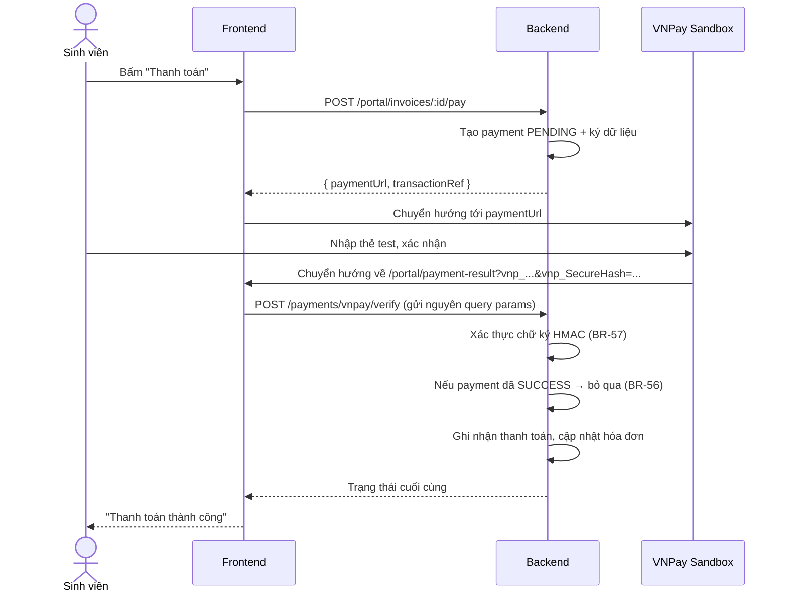

# 14 – PHIÊN BẢN ĐƠN GIẢN HÓA (v1-lite)

**Hệ thống:** DMS-KTX
**Phiên bản:** v1.0
**Ngày ban hành:** 12/09/2026
**Trạng thái:** ✅ **Đang áp dụng** — thay thế các lựa chọn kỹ thuật tương ứng trong `03`, `04`, `05`, `06`, `09`, `11`, `13`

> 🎯 **Nhóm đã chọn BẬC B (mức nhẹ nhàng, dành cho người mới bắt đầu).** Đọc **mục 2** để nắm 21 thay đổi nền, rồi đọc **mục 13** để biết 10 thay đổi hạ thêm một bậc. Nếu chỉ có thời gian đọc một phần, đọc **mục 15 — mẫu code một module hoàn chỉnh** — đó là thứ dùng được ngay.

**Mục lục nhanh:** 1 lý do · 2 bảng 21 thay đổi · 3 công nghệ · 4 cách làm từng thay đổi · 5 CSDL · 6 cấu trúc thư mục · 7 lộ trình · 8 kiểm thử · 9 thang cắt giảm · 10 cách viết vào báo cáo · **13 Bậc B** · **14 lộ trình tự học** · **15 mẫu code** · 16 việc cần làm ngay

---

## 1. Vì sao có tài liệu này

Sau khi rà soát bộ tài liệu thiết kế, nhóm nhận thấy **khối lượng kỹ thuật vượt quá năng lực và quỹ thời gian thực tế**. Thay vì cắt chức năng (làm hỏng giá trị của đề tài), nhóm chọn **giữ nguyên toàn bộ chức năng nhưng đổi cách cài đặt sang phương án đơn giản hơn**.

### 1.1. Nguyên tắc đơn giản hóa

| # | Nguyên tắc | Diễn giải |
|---|------------|-----------|
| 1 | **Không cắt chức năng** | Toàn bộ 8 module, 85 yêu cầu `FR-xx` giữ nguyên. Người dùng cuối không thấy khác biệt nào. |
| 2 | **Không đánh đổi tính đúng đắn** | Mọi quy tắc nghiệp vụ `BR-xx` vẫn được thực thi. Phương án mới phải **đúng**, chỉ được phép kém "chuyên nghiệp" hơn, không được phép sai. |
| 3 | **Ưu tiên thứ nhóm đã biết** | Bỏ thư viện/kỹ thuật phải học mới, nếu có cách làm bằng kiến thức sẵn có mà vẫn đạt kết quả. |
| 4 | **Ít khái niệm hơn > ít dòng code hơn** | Một hook tự viết 30 dòng dễ hiểu hơn một thư viện 0 dòng nhưng phải học 5 khái niệm mới. |
| 5 | **Nêu rõ đánh đổi** | Mỗi thay đổi ghi rõ mất gì, để viết vào phần "Hạn chế" của báo cáo một cách trung thực. |

### 1.2. Kết quả

| Chỉ số | Thiết kế gốc | Bậc A (v1-lite) | **Bậc B (nhẹ nhàng)** |
|--------|--------------|-----------------|------------------------|
| Chức năng (`FR-xx`) | 85 | 85 | **85 — giữ nguyên** |
| Quy tắc nghiệp vụ (`BR-xx`) | 71 | 71 | **71 — giữ nguyên** |
| Màn hình / route | 43 | 43 | **32** (form gộp vào modal) |
| Thư viện phải học | 13 | 6 | **6** |
| Bảng CSDL | 15 | 13 | **13** |
| Tầng kiến trúc backend | 3 | 2 | **2** (controller gộp vào route) |
| Số file backend / module | 3 | 3 | **2** |
| Cron job | 6 | 1 | **1** |
| Repository Git | 2 | 2 | **1** (2 thư mục) |
| Nhánh Git chính | main + develop | main + develop | **chỉ main** |
| Khối lượng | ~206 MD | ~155 MD | **~120 MD** |
| Test case thủ công | 128 | 65 | **50** |

**Bậc B là mức đang áp dụng.** Mục 2–12 mô tả Bậc A; mục 13 mô tả phần hạ thêm của Bậc B.

> 📌 **Cách dùng tài liệu này:** khi tài liệu này và tài liệu khác nói khác nhau về **cách cài đặt**, lấy theo tài liệu này. Về **chức năng và nghiệp vụ**, `02` và `03` vẫn là chuẩn.

---

## 2. Bảng tổng hợp 21 thay đổi

| # | Hạng mục | Phương án cũ (khó) | Phương án mới (dễ) | Tiết kiệm |
|---|----------|--------------------|--------------------|-----------|
| **Kiến trúc backend** |
| 1 | Phân tầng | Controller → Service → Repository | **Controller → Service** (Service gọi Prisma trực tiếp) | 5 MD |
| 2 | Chống xếp trùng giường | `SELECT ... FOR UPDATE` + partial unique index | **`UPDATE ... WHERE status='AVAILABLE'` rồi kiểm tra số dòng bị ảnh hưởng** | 4 MD |
| 3 | Kiểm tra dữ liệu đầu vào | Zod schema cho từng endpoint | **Hàm `validate()` tự viết ~25 dòng** | 2 MD |
| 4 | Tác vụ nền | 6 cron job riêng | **1 cron job chạy 4 việc + suy diễn trạng thái khi đọc** | 2 MD |
| 5 | Nhật ký hệ thống | Bảng `audit_log` + màn hình tra cứu | **Ghi ra file log bằng `console.log` có định dạng** | 2 MD |
| 6 | Cấu hình hệ thống | Bảng `system_config` + màn hình | **File hằng số `config/settings.js`** | 2 MD |
| **Xác thực** |
| 7 | Phiên đăng nhập | Access token 60 phút + refresh token + thu hồi | **1 JWT hạn 7 ngày** | 3 MD |
| 8 | Chống dò mật khẩu | Đếm lần sai + khóa 15 phút + cột `locked_until` | **Chỉ dùng `express-rate-limit`** | 1 MD |
| **Frontend** |
| 9 | Quản lý dữ liệu server | TanStack Query | **Hook `useApi` tự viết ~35 dòng** | 3 MD |
| 10 | Quản lý state đăng nhập | Zustand | **React Context (1 file)** | 1 MD |
| 11 | Form & kiểm tra dữ liệu | React Hook Form + Zod | **`Form` của Ant Design (có sẵn `rules`)** | 3 MD |
| 12 | Chạy trước khi có API | MSW mock server | **Mảng dữ liệu giả trong file `api/*.js` + cờ env** | 2 MD |
| **Thanh toán** |
| 13 | Cổng thanh toán | VNPay + ZaloPay | **Chỉ VNPay** | 2 MD |
| 14 | Nhận kết quả giao dịch | IPN (server-to-server) + ngrok | **Xác thực chữ ký tại Return URL** + nút đối soát thủ công | 3 MD |
| **Xuất dữ liệu** |
| 15 | Xuất Excel | Thư viện `exceljs` | **Xuất CSV (~8 dòng code)** | 1.5 MD |
| 16 | Xuất PDF hợp đồng/hóa đơn | `pdfmake` / `puppeteer` | **In bằng trình duyệt (`window.print()` + CSS `@media print`)** | 2 MD |
| 17 | Nhập hàng loạt | Import Excel có báo lỗi từng dòng | **Bỏ — dữ liệu nhập tay hoặc qua script seed** | 1.5 MD |
| **Chất lượng & vận hành** |
| 18 | Tài liệu API | Swagger/OpenAPI sinh từ code | **Postman collection chia sẻ trong nhóm** | 1.5 MD |
| 19 | Kiểm thử tự động | Jest + Supertest, độ phủ 60% | **~10 unit test cho các hàm tính tiền** | 3 MD |
| 20 | Kiểm thử thủ công | 128 test case | **65 test case trọng tâm** | 2 MD |
| 21 | CI | GitHub Actions | **Chạy `npm run lint` tay trước khi mở PR** | 0.5 MD |
| | | | **Tổng tiết kiệm** | **~48 MD** |

---

## 3. Công nghệ sau khi đơn giản hóa

### 3.1. Frontend — còn 3 thư viện chính

| Hạng mục | Dùng gì | Ghi chú |
|----------|---------|---------|
| UI | **React 19 + Vite** | Đã có sẵn |
| Định tuyến | **React Router 7** | Bắt buộc |
| Thư viện giao diện | **Ant Design 6** | Giữ lại — đây là thứ **tiết kiệm nhiều thời gian nhất**. Table, Form, DatePicker, Modal, Select đều có sẵn. Hỗ trợ React 19 sẵn |
| Gọi API | **Axios** | Cấu hình 1 lần trong `api/axiosClient.js` |
| Biểu đồ | **Recharts 3** | Chỉ dùng ở 1–2 biểu đồ dashboard |
| Ngày tháng | **Day.js** | Đi kèm Ant Design, không cần cài thêm |
| Quản lý dữ liệu | ~~TanStack Query~~ → **hook `useApi` tự viết** | Xem mục 4.1 |
| State đăng nhập | ~~Zustand~~ → **React Context** | Xem mục 4.2 |
| Form | ~~React Hook Form + Zod~~ → **Ant Design Form** | Xem mục 4.3 |
| Mock API | ~~MSW~~ → **dữ liệu giả trong file api** | Xem mục 4.4 |

**Lệnh cài đặt frontend (đầy đủ):**
```bash
npm install react-router-dom axios antd @ant-design/icons dayjs recharts
```

**Phiên bản đã cài và kiểm chứng build thành công (12/09/2026):**

| Gói | Phiên bản | Vai trò |
|-----|-----------|---------|
| `react`, `react-dom` | 19.2.8 | Có sẵn |
| `vite` | 8.3.0 | Có sẵn |
| `antd` | **6.6.3** | Toàn bộ giao diện: Table, Form, Modal, DatePicker, Select… |
| `@ant-design/icons` | 6.3.4 | Bộ biểu tượng |
| `react-router-dom` | 7.18.3 | Điều hướng trang |
| `axios` | 1.20.0 | Gọi API |
| `dayjs` | 1.11.23 | Ngày tháng (antd dùng chung) |
| `recharts` | 3.10.1 | Biểu đồ dashboard |

> ✅ Đã chạy `npm run build` với cả 7 gói — build thành công, không lỗi tương thích. Đây là bộ **đầy đủ**, không cần cài gì thêm cho toàn bộ frontend.

### 3.1.1. ⚠️ Hai điểm khác biệt của Ant Design 6 so với v5

Tài liệu thiết kế ban đầu viết theo **antd 5**; thực tế nhóm cài **antd 6**. Gần như toàn bộ API giống nhau (`Table`, `Form`, `Input`, `Select`, `DatePicker`, `Input.Search` đều còn nguyên), chỉ có **2 chỗ** cần nhớ:

**(1) `destroyOnClose` đã đổi tên thành `destroyOnHidden`**

```jsx
<Modal destroyOnClose />    {/* ❌ vẫn chạy nhưng cảnh báo deprecated */}
<Modal destroyOnHidden />   {/* ✅ dùng cái này */}
```

**(2) Dùng `App.useApp()` thay cho `message` / `Modal.confirm` gọi trực tiếp**

Gọi trực tiếp `message.success(...)` vẫn chạy, nhưng thông báo **nằm ngoài cây React** nên không nhận được theme và locale tiếng Việt. Cách đúng:

```jsx
// main.jsx — bọc App của antd MỘT LẦN ở ngoài cùng
import { ConfigProvider, App as AntApp } from 'antd';
import viVN from 'antd/locale/vi_VN';

<ConfigProvider locale={viVN}>
  <AntApp>
    <AuthProvider>
      <BrowserRouter><App /></BrowserRouter>
    </AuthProvider>
  </AntApp>
</ConfigProvider>
```

```jsx
// Trong component bất kỳ — lấy message và modal từ hook
import { App } from 'antd';

export default function StudentListPage() {
  const { message, modal } = App.useApp();     // ⭐ thay vì import { message, Modal } rồi gọi thẳng

  const handleDelete = (record) => {
    modal.confirm({
      title: 'Xác nhận vô hiệu hóa',
      content: `Vô hiệu hóa sinh viên ${record.fullName}?`,
      okText: 'Vô hiệu hóa', cancelText: 'Hủy',
      onOk: async () => {
        await studentApi.deactivate(record.id);
        message.success('Đã vô hiệu hóa');
        refetch();
      },
    });
  };
}
```

> 📌 Mẫu code ở **mục 15** đã viết theo cách gọi trực tiếp cho dễ đọc. Khi code thật, đổi sang `App.useApp()` như trên — chỉ thay 2 dòng đầu của mỗi component có dùng `message` hoặc `Modal.confirm`.

### 3.2. Backend — còn 6 thư viện chính

| Hạng mục | Dùng gì | Ghi chú |
|----------|---------|---------|
| Runtime | **Node.js 20 LTS** | |
| Framework | **Express 4** | |
| ORM | **Prisma 5** | Giữ lại — viết schema dễ hơn SQL tay rất nhiều, migration tự động |
| CSDL | **PostgreSQL** (hoặc MySQL đều được) | Sau khi bỏ partial unique index, **hai hệ đều chạy như nhau** — chọn cái nào nhóm cài dễ hơn |
| Xác thực | **jsonwebtoken + bcrypt** | |
| Bảo mật | **cors, helmet, express-rate-limit** | Mỗi cái 1 dòng cấu hình |
| Cron | **node-cron** | Chỉ 1 job |
| Validation | ~~Zod~~ → **hàm tự viết** | Xem mục 4.5 |
| Tài liệu API | ~~Swagger~~ → **Postman** | |
| Xuất file | ~~exceljs~~ → **tự ghép chuỗi CSV** | Xem mục 4.7 |
| Log | ~~Pino~~ → **`console.log` có tiền tố** | |

**Lệnh cài đặt backend (đầy đủ):**
```bash
npm install express cors helmet dotenv bcrypt jsonwebtoken @prisma/client node-cron express-rate-limit
npm install -D prisma nodemon
```

---

## 4. Cách làm cụ thể từng thay đổi

### 4.1. Thay TanStack Query bằng hook `useApi`

**Tạo file `src/hooks/useApi.js` — viết một lần, dùng cả dự án:**

```js
import { useState, useEffect, useCallback } from 'react';

/**
 * Gọi API và quản lý 3 trạng thái: đang tải / có dữ liệu / lỗi.
 * @param apiFunc  hàm gọi API, ví dụ: () => studentApi.getList(filters)
 * @param deps     mảng phụ thuộc, đổi thì gọi lại (giống useEffect)
 */
export function useApi(apiFunc, deps = []) {
  const [data, setData]         = useState(null);
  const [meta, setMeta]         = useState(null);
  const [loading, setLoading]   = useState(true);
  const [error, setError]       = useState(null);

  const fetchData = useCallback(async () => {
    setLoading(true);
    setError(null);
    try {
      const res = await apiFunc();
      setData(res.data.data);
      setMeta(res.data.meta ?? null);
    } catch (err) {
      setError(err.response?.data?.message || 'Không kết nối được máy chủ');
    } finally {
      setLoading(false);
    }
    // eslint-disable-next-line react-hooks/exhaustive-deps
  }, deps);

  useEffect(() => { fetchData(); }, [fetchData]);

  // refetch: gọi lại sau khi thêm/sửa/xóa thành công
  return { data, meta, loading, error, refetch: fetchData };
}
```

**Dùng trong màn hình:**
```jsx
export default function StudentListPage() {
  const [filters, setFilters] = useState({ page: 1, limit: 20, search: '' });

  const { data: students, meta, loading, error, refetch } = useApi(
    () => studentApi.getList(filters),
    [filters]                       // filters đổi → tự gọi lại API
  );

  const handleDelete = async (id) => {
    await studentApi.deactivate(id);
    message.success('Đã vô hiệu hóa sinh viên');
    refetch();                      // tải lại danh sách
  };

  if (error) return <Alert type="error" message={error} />;

  return (
    <Table
      dataSource={students}
      loading={loading}
      rowKey="id"
      pagination={{
        current: meta?.page,
        total: meta?.total,
        pageSize: meta?.limit,
        onChange: (page) => setFilters({ ...filters, page }),
      }}
      columns={columns}
    />
  );
}
```

**Đánh đổi:** không có bộ nhớ đệm tự động — chuyển trang rồi quay lại sẽ gọi API lần nữa. Với quy mô đồ án, điều này **không ảnh hưởng gì**.

### 4.2. Thay Zustand bằng React Context

**`src/context/AuthContext.jsx`:**

```jsx
import { createContext, useContext, useState } from 'react';
import { authApi } from '../api/authApi';

const AuthContext = createContext(null);

export function AuthProvider({ children }) {
  const [user, setUser] = useState(() => {
    try { return JSON.parse(localStorage.getItem('user')); } catch { return null; }
  });

  const login = async (username, password) => {
    const res = await authApi.login({ username, password });
    const { token, user: u } = res.data.data;
    localStorage.setItem('token', token);
    localStorage.setItem('user', JSON.stringify(u));
    setUser(u);
    return u;
  };

  const logout = () => {
    localStorage.removeItem('token');
    localStorage.removeItem('user');
    setUser(null);
  };

  return (
    <AuthContext.Provider value={{ user, login, logout, isAuthenticated: !!user }}>
      {children}
    </AuthContext.Provider>
  );
}

export const useAuth = () => useContext(AuthContext);
```

Bọc ở `main.jsx`: `<AuthProvider><App /></AuthProvider>`. Dùng ở bất kỳ đâu: `const { user, logout } = useAuth();`

### 4.3. Thay React Hook Form + Zod bằng Form của Ant Design

Ant Design Form đã có sẵn cơ chế kiểm tra dữ liệu qua thuộc tính `rules` — **không cần thư viện nào thêm**:

```jsx
<Form form={form} layout="vertical" onFinish={handleSubmit}>
  <Form.Item
    name="studentCode"
    label="Mã số sinh viên"
    rules={[
      { required: true, message: 'Vui lòng nhập MSSV' },
      { pattern: /^[A-Za-z0-9]{6,20}$/, message: 'MSSV gồm 6–20 ký tự chữ và số' },
    ]}
  >
    <Input placeholder="VD: SV2024001" />
  </Form.Item>

  <Form.Item
    name="phone"
    label="Số điện thoại"
    rules={[{ pattern: /^0\d{9}$/, message: 'SĐT gồm 10 số, bắt đầu bằng 0' }]}
  >
    <Input />
  </Form.Item>

  <Form.Item
    name="dateOfBirth"
    label="Ngày sinh"
    rules={[{ required: true, message: 'Vui lòng chọn ngày sinh' }]}
  >
    <DatePicker format="DD/MM/YYYY" style={{ width: '100%' }} />
  </Form.Item>

  <Button type="primary" htmlType="submit" loading={submitting}>Lưu</Button>
</Form>
```

**Hiển thị lỗi từ backend vào đúng ô nhập:**
```js
catch (err) {
  const errors = err.response?.data?.errors;   // [{ field, message }]
  if (errors) {
    form.setFields(errors.map(e => ({ name: e.field, errors: [e.message] })));
  } else {
    message.error(err.response?.data?.message || 'Có lỗi xảy ra');
  }
}
```

### 4.4. Thay MSW bằng dữ liệu giả trong file API

```js
// src/api/studentApi.js
import axiosClient from './axiosClient';
import { mockStudents } from '../mocks/mockData';

const USE_MOCK = import.meta.env.VITE_USE_MOCK === 'true';

export const studentApi = {
  getList: (params) => {
    if (USE_MOCK) {
      // Giả lập độ trễ mạng và đúng cấu trúc response của backend
      return new Promise((resolve) =>
        setTimeout(() => resolve({
          data: {
            success: true,
            data: mockStudents,
            meta: { page: 1, limit: 20, total: mockStudents.length, totalPages: 1 },
          },
        }), 300)
      );
    }
    return axiosClient.get('/students', { params });
  },

  create: (data) => axiosClient.post('/students', data),
};
```

> ⚠️ **Bắt buộc:** dữ liệu giả phải có **đúng cấu trúc** `{ success, data, meta }` như `06-DAC-TA-API.md`. Nếu không, khi nối API thật sẽ phải sửa lại toàn bộ màn hình.

### 4.5. Thay Zod bằng hàm `validate()` tự viết

**`src/utils/validate.js` (backend):**

```js
import { ApiError } from './ApiError.js';

/**
 * rules ví dụ:
 * { studentCode: { required: true, maxLength: 20 },
 *   phone:       { pattern: /^0\d{9}$/, message: 'SĐT không hợp lệ' },
 *   capacity:    { required: true, type: 'number', min: 1, max: 20 } }
 */
export function validate(body, rules) {
  const errors = [];

  for (const [field, rule] of Object.entries(rules)) {
    const value = body[field];
    const empty = value === undefined || value === null || value === '';

    if (rule.required && empty) {
      errors.push({ field, message: rule.message || `Trường ${field} là bắt buộc` });
      continue;
    }
    if (empty) continue;                       // không bắt buộc và bỏ trống thì bỏ qua

    if (rule.type === 'number' && isNaN(Number(value))) {
      errors.push({ field, message: `Trường ${field} phải là số` });
      continue;
    }
    if (rule.maxLength && String(value).length > rule.maxLength) {
      errors.push({ field, message: `Trường ${field} tối đa ${rule.maxLength} ký tự` });
    }
    if (rule.pattern && !rule.pattern.test(String(value))) {
      errors.push({ field, message: rule.message || `Trường ${field} sai định dạng` });
    }
    if (rule.min !== undefined && Number(value) < rule.min) {
      errors.push({ field, message: `Trường ${field} phải ≥ ${rule.min}` });
    }
    if (rule.max !== undefined && Number(value) > rule.max) {
      errors.push({ field, message: `Trường ${field} phải ≤ ${rule.max}` });
    }
  }

  if (errors.length) {
    throw new ApiError(400, 'Dữ liệu không hợp lệ', 'VALIDATION_ERROR', errors);
  }
}
```

**Dùng ngay đầu hàm service:**
```js
export const createStudent = async (body) => {
  validate(body, {
    studentCode: { required: true, maxLength: 20 },
    fullName:    { required: true, maxLength: 150 },
    gender:      { required: true },
    phone:       { pattern: /^0\d{9}$/, message: 'Số điện thoại phải gồm 10 số, bắt đầu bằng 0' },
  });
  // ... phần còn lại
};
```

### 4.6. ⭐ Chống xếp trùng giường — thay khóa hàng bằng UPDATE có điều kiện

**Đây là thay đổi quan trọng nhất.** Phương án cũ (`SELECT ... FOR UPDATE` + partial unique index) đúng nhưng khó hiểu và khó viết đúng. Phương án mới **cũng đúng** mà chỉ là một câu `UPDATE` thường.

**Nguyên lý:** một câu `UPDATE` đơn lẻ trong CSDL quan hệ là **thao tác nguyên tử**. Nếu đưa điều kiện "chỉ đổi khi trạng thái đang là AVAILABLE" vào mệnh đề `WHERE`, thì khi hai người cùng chạy, **chỉ một người nhận được kết quả "đã đổi 1 dòng"**, người còn lại nhận "đã đổi 0 dòng". Chỉ cần kiểm tra con số đó.

```js
// services/contract.service.js
export const createApplication = async ({ studentId, bedId, startDate, endDate }) => {
  return prisma.$transaction(async (tx) => {
    // 1. Kiểm tra sinh viên chưa có hợp đồng đang mở (BR-21)
    const existing = await tx.contract.findFirst({
      where: { studentId, status: { in: ['PENDING', 'ACTIVE'] } },
    });
    if (existing) {
      throw new ApiError(422, 'Sinh viên đã có hợp đồng đang hiệu lực', 'STUDENT_HAS_ACTIVE_CONTRACT');
    }

    // 2. Kiểm tra giới tính phòng khớp sinh viên (BR-06, BR-17)
    const bed = await tx.bed.findUnique({
      where: { id: bedId },
      include: { room: true },
    });
    if (!bed) throw new ApiError(404, 'Không tìm thấy giường', 'NOT_FOUND');

    const student = await tx.student.findUnique({ where: { id: studentId } });
    if (bed.room.gender !== student.gender) {
      throw new ApiError(422, `Phòng này chỉ dành cho sinh viên ${bed.room.gender === 'MALE' ? 'nam' : 'nữ'}`, 'GENDER_MISMATCH');
    }

    // 3. ⭐ GIỮ CHỖ GIƯỜNG — nguyên tử, chống hai người cùng chọn (BR-20)
    const updated = await tx.bed.updateMany({
      where: { id: bedId, status: 'AVAILABLE' },   // ← điều kiện nằm trong WHERE
      data:  { status: 'RESERVED' },
    });

    if (updated.count === 0) {
      // 0 dòng bị đổi ⇒ giường đã bị người khác lấy trong tích tắc vừa rồi
      throw new ApiError(409, 'Giường này vừa được đăng ký, vui lòng chọn giường khác', 'BED_NOT_AVAILABLE');
    }

    // 4. Tạo hợp đồng
    return tx.contract.create({
      data: {
        contractCode: await generateContractCode(tx),
        studentId, bedId, startDate, endDate,
        monthlyPrice: bed.room.pricePerMonth,
        depositAmount: SETTINGS.DEFAULT_DEPOSIT,
        status: 'PENDING',
      },
    });
  });
};
```

**Khi duyệt hợp đồng, dùng đúng kỹ thuật đó:**
```js
const updated = await tx.bed.updateMany({
  where: { id: contract.bedId, status: 'RESERVED' },
  data:  { status: 'OCCUPIED' },
});
if (updated.count === 0) {
  throw new ApiError(409, 'Giường không còn ở trạng thái giữ chỗ', 'BED_NOT_AVAILABLE');
}
```

**So sánh hai phương án:**

| | `FOR UPDATE` + partial index | `updateMany` có điều kiện |
|---|---|---|
| Số dòng code | ~15 (gồm truy vấn SQL thô) | **3** |
| Cần viết SQL thô | Có (`$queryRaw`) | Không |
| Cần migration thủ công | Có (partial index) | Không |
| Chạy trên MySQL | Phải dùng cột sinh (rất rối) | **Chạy y hệt** |
| Chống race condition | ✅ | ✅ |
| Dễ giải thích khi bảo vệ | Khó | **Dễ** |

> 💡 **Điểm cộng khi báo cáo:** đây vẫn là một giải pháp race condition đàng hoàng, thậm chí còn dễ trình bày hơn. Viết vào mục 4.4.1 của báo cáo (`12` mục 4) theo mạch: *nêu vấn đề → vì sao kiểm tra rồi mới ghi là sai → vì sao UPDATE có điều kiện là đúng*.

**Test vẫn phải làm:** TC-72 (hai trình duyệt cùng nộp đơn vào một giường) vẫn phải đạt.

### 4.7. Xuất CSV thay cho Excel

```js
// utils/csv.js
export function toCsv(rows, columns) {
  const escape = (v) => {
    const s = String(v ?? '');
    // Chặn CSV injection (xem 07 mục 5.2)
    const safe = /^[=+\-@]/.test(s) ? `'${s}` : s;
    return `"${safe.replace(/"/g, '""')}"`;
  };
  const header = columns.map((c) => escape(c.title)).join(',');
  const body = rows.map((r) => columns.map((c) => escape(r[c.key])).join(',')).join('\n');
  return '' + header + '\n' + body;   // BOM để Excel đọc đúng tiếng Việt
}

// controller
const csv = toCsv(students, [
  { key: 'studentCode', title: 'MSSV' },
  { key: 'fullName',    title: 'Họ tên' },
  { key: 'roomNumber',  title: 'Phòng' },
  { key: 'totalDebt',   title: 'Công nợ' },
]);
res.setHeader('Content-Type', 'text/csv; charset=utf-8');
res.setHeader('Content-Disposition', 'attachment; filename="danh-sach-sinh-vien.csv"');
res.send(csv);
```

> ⚠️ Ký tự `` (BOM) ở đầu file là **bắt buộc** — thiếu nó Excel sẽ hiển thị tiếng Việt thành ký tự lỗi.

### 4.8. In PDF bằng trình duyệt

Không cần thư viện. Tạo một trang chỉ để in, thêm CSS ẩn các phần thừa, rồi gọi `window.print()`. Người dùng chọn "Lưu thành PDF" trong hộp thoại in của trình duyệt.

```css
@media print {
  .no-print, .ant-layout-sider, .ant-layout-header, .ant-btn { display: none !important; }
  .print-area { width: 100%; padding: 0; }
  @page { margin: 1.5cm; }
}
```
```jsx
<Button className="no-print" onClick={() => window.print()}>🖨 In hóa đơn</Button>
<div className="print-area">{/* nội dung hóa đơn */}</div>
```

### 4.9. Gộp 6 cron job thành 1

```js
// jobs/dailyJob.js
import cron from 'node-cron';

async function runDailyTasks() {
  console.log('[CRON] Bắt đầu tác vụ hằng ngày', new Date().toISOString());
  const today = new Date();

  // 1. Hợp đồng hết hạn → EXPIRED, giải phóng giường (BR-28)
  const expired = await prisma.contract.findMany({
    where: { status: 'ACTIVE', endDate: { lt: today } },
    select: { id: true, bedId: true },
  });
  for (const c of expired) {
    await prisma.$transaction([
      prisma.contract.update({ where: { id: c.id }, data: { status: 'EXPIRED' } }),
      prisma.bed.update({ where: { id: c.bedId }, data: { status: 'AVAILABLE' } }),
    ]);
  }
  console.log(`[CRON] Đã cho hết hạn ${expired.length} hợp đồng`);

  // 2. Đơn chờ duyệt quá 7 ngày → CANCELLED (BR-27)
  // 3. Hóa đơn quá hạn → OVERDUE (BR-60)
  // 4. Giao dịch treo quá 15 phút → EXPIRED (BR-59)
  // ... viết tương tự, mỗi việc ~10 dòng

  console.log('[CRON] Hoàn tất');
}

// Chạy 00:05 mỗi ngày
export function startJobs() {
  if (process.env.ENABLE_CRON !== 'true') return;
  cron.schedule('5 0 * * *', runDailyTasks, { timezone: 'Asia/Ho_Chi_Minh' });
}

// Cho phép chạy tay để test: npm run job
if (process.argv[2] === 'run-now') runDailyTasks().then(() => process.exit(0));
```

> 💡 Thêm `"job": "node src/jobs/dailyJob.js run-now"` vào `package.json` để test job mà không phải chờ đến nửa đêm.

### 4.10. ⭐ Thanh toán VNPay — bỏ IPN, xác thực tại Return URL

**Vì sao đổi:** IPN là lời gọi từ máy chủ VNPay đến máy chủ của ta. Khi lập trình ở máy cá nhân, VNPay **không gọi được vào `localhost`**, buộc phải dựng ngrok — thêm một công cụ, thêm một lớp trục trặc, và rất khó gỡ lỗi.

**Phương án mới:** sau khi thanh toán, VNPay chuyển hướng **trình duyệt** về `Return URL` kèm các tham số và chữ ký. Frontend lấy nguyên chuỗi tham số đó gửi về backend; backend **xác thực chữ ký HMAC** rồi mới ghi nhận.



```js
// controllers/payment.controller.js
export const verifyVnpayReturn = asyncHandler(async (req, res) => {
  const params = { ...req.body };                  // toàn bộ vnp_* frontend gửi lên
  const receivedHash = params.vnp_SecureHash;
  delete params.vnp_SecureHash;
  delete params.vnp_SecureHashType;

  // 1. Xác thực chữ ký — không có secret thì không giả mạo được (BR-57)
  const signData = new URLSearchParams(sortObject(params)).toString();
  const expectedHash = crypto
    .createHmac('sha512', process.env.VNP_HASH_SECRET)
    .update(Buffer.from(signData, 'utf-8'))
    .digest('hex');

  if (receivedHash !== expectedHash) {
    console.warn('[BẢO MẬT] Chữ ký VNPay không hợp lệ:', params.vnp_TxnRef);
    throw new ApiError(400, 'Chữ ký giao dịch không hợp lệ', 'INVALID_SIGNATURE');
  }

  const result = await paymentService.confirmPayment({
    transactionRef: params.vnp_TxnRef,
    amount: Number(params.vnp_Amount) / 100,
    success: params.vnp_ResponseCode === '00',
    gatewayTxnId: params.vnp_TransactionNo,
    raw: params,
  });

  res.json(ApiResponse.success(result));
});
```

```js
// services/payment.service.js — phần quan trọng: idempotent (BR-56)
export const confirmPayment = async ({ transactionRef, amount, success, gatewayTxnId, raw }) => {
  return prisma.$transaction(async (tx) => {
    const payment = await tx.payment.findUnique({ where: { transactionRef } });
    if (!payment) throw new ApiError(404, 'Không tìm thấy giao dịch', 'NOT_FOUND');

    // Đã xử lý rồi thì trả về luôn, KHÔNG ghi nhận lần hai (BR-56)
    if (payment.status === 'SUCCESS') {
      return { alreadyConfirmed: true, payment };
    }
    // Số tiền không khớp → cần đối soát tay, không tự cập nhật (BR-58)
    if (Number(payment.amount) !== amount) {
      await tx.payment.update({
        where: { id: payment.id },
        data: { status: 'NEEDS_RECONCILIATION', gatewayResponse: raw },
      });
      throw new ApiError(422, 'Số tiền giao dịch không khớp, cần đối soát', 'AMOUNT_MISMATCH');
    }

    if (!success) {
      await tx.payment.update({ where: { id: payment.id }, data: { status: 'FAILED', gatewayResponse: raw } });
      return { payment, invoice: null };
    }

    await tx.payment.update({
      where: { id: payment.id },
      data: { status: 'SUCCESS', paidAt: new Date(), gatewayTxnId, gatewayResponse: raw },
    });
    const invoice = await recalculateInvoice(tx, payment.invoiceId);   // BR-43
    return { payment, invoice };
  });
};
```

**Đánh đổi phải ghi vào báo cáo:** nếu sinh viên **đóng trình duyệt ngay sau khi thanh toán** mà chưa kịp quay về, giao dịch sẽ ở trạng thái `PENDING` dù tiền đã trừ. Khắc phục bằng **nút "Đối soát giao dịch"** cho nhân viên (đã có sẵn `POST /payments/:id/reconcile` — gọi API truy vấn kết quả của VNPay để cập nhật). Ở hệ thống chạy thật nên bổ sung IPN; ở phạm vi đồ án, phương án này là đủ.

> ✅ **Vẫn giữ được điểm:** cả 3 test case bảo mật quan trọng nhất — chữ ký sai (TC-103), gửi trùng (TC-104), lệch số tiền (TC-105) — đều vẫn kiểm tra được bằng cách gọi thẳng `POST /payments/vnpay/verify` bằng Postman. **Không cần ngrok.**

### 4.11. Bỏ refresh token

```js
// Đăng nhập: chỉ cấp một token
const token = jwt.sign(
  { userId: user.id, role: user.role, studentId: user.studentId },
  process.env.JWT_SECRET,
  { expiresIn: '7d' }
);
```

```js
// api/axiosClient.js — interceptor gọn lại còn thế này
axiosClient.interceptors.request.use((config) => {
  const token = localStorage.getItem('token');
  if (token) config.headers.Authorization = `Bearer ${token}`;
  return config;
});

axiosClient.interceptors.response.use(
  (res) => res,
  (err) => {
    if (err.response?.status === 401) {
      localStorage.clear();
      window.location.href = '/login';       // hết hạn thì đăng nhập lại
    }
    return Promise.reject(err);
  }
);
```

**Đánh đổi:** token sống 7 ngày, nếu bị lộ thì kẻ tấn công dùng được lâu hơn. Chấp nhận được ở phạm vi đồ án; ghi vào mục "Hạn chế" của báo cáo.

### 4.12. Bỏ bảng `system_config` — dùng file hằng số

```js
// config/settings.js
export const SETTINGS = {
  CONTRACT_EXPIRING_WARNING_DAYS: 30,   // BR-29
  CONTRACT_PENDING_EXPIRE_DAYS: 7,      // BR-27
  INVOICE_DUE_DAY_OF_MONTH: 10,
  ELECTRICITY_PRICE: 2500,              // đ/kWh
  WATER_PRICE: 12000,                   // đ/m³
  DEFAULT_DEPOSIT: 500000,
  PAYMENT_TIMEOUT_MINUTES: 15,          // BR-59
  DORMITORY_NAME: 'Ký túc xá ABC',
};
```

**Đánh đổi:** muốn đổi đơn giá điện phải sửa code và deploy lại, thay vì sửa trên giao diện. Với KTX, các giá này gần như không đổi trong một học kỳ nên không ảnh hưởng thực tế.

> ⚠️ **Ngoại lệ quan trọng:** đơn giá điện/nước tại thời điểm lập hóa đơn **vẫn phải lưu vào bảng `utility_reading`** (cột `electricity_unit_price`, `water_unit_price`). Nếu chỉ đọc từ file hằng số, khi đổi giá thì hóa đơn cũ sẽ bị tính lại sai.

### 4.13. Bỏ bảng `audit_log` — ghi log ra file

```js
// utils/logger.js
export const logAction = (userId, action, entity, entityId, extra = '') => {
  console.log(`[AUDIT] ${new Date().toISOString()} | user=${userId} | ${action} | ${entity}#${entityId} | ${extra}`);
};

// Dùng ở service
logAction(approverId, 'APPROVE', 'contract', contractId, `bed=${bed.bedLabel}`);
```

Trên Render, log này xem được ở tab **Logs**. Đủ để truy vết khi cần, và vẫn trình bày được trong báo cáo là "có ghi nhật ký thao tác".

---

## 5. Cơ sở dữ liệu sau đơn giản hóa — 13 bảng

| # | Bảng | Trạng thái |
|---|------|-----------|
| 1 | `user` | Giữ (bỏ cột `locked_until`, `failed_login_count`) |
| 2 | `student` | Giữ nguyên |
| 3 | `building` | Giữ nguyên |
| 4 | `room` | Giữ nguyên (có `gender` theo BR-17) |
| 5 | `bed` | Giữ nguyên |
| 6 | `contract` | Giữ nguyên (**không cần** partial unique index) |
| 7 | `fee_type` | Giữ nguyên |
| 8 | `invoice` | Giữ nguyên |
| 9 | `invoice_item` | Giữ nguyên |
| 10 | `payment` | Giữ nguyên |
| 11 | `request` | Giữ nguyên |
| 12 | `utility_reading` | Giữ nguyên |
| 13 | `room_transfer` | Giữ nguyên |
| ~~14~~ | ~~`audit_log`~~ | ❌ Bỏ → ghi log file (mục 4.13) |
| ~~15~~ | ~~`system_config`~~ | ❌ Bỏ → file hằng số (mục 4.12) |

**Ràng buộc bỏ đi:**
- ❌ `uq_contract_active_bed` (partial unique index) → thay bằng `updateMany` có điều kiện (mục 4.6)
- ❌ `uq_contract_active_student` → kiểm tra bằng `findFirst` trong transaction
- ✅ **Giữ lại** `uq_invoice_period` — ràng buộc này quan trọng và Prisma tạo được dễ dàng bằng `@@unique`

> ✅ **Lợi ích phụ:** sau khi bỏ partial unique index, **MySQL và PostgreSQL chạy giống hệt nhau**. Nhóm được tự do chọn hệ CSDL nào cài dễ hơn, không cần đọc mục 8 của `04` nữa.

---

## 6. Cấu trúc thư mục sau đơn giản hóa

### 6.1. Backend — 2 tầng

```
src/
├── server.js
├── app.js
├── config/
│   ├── env.js
│   ├── database.js          # export prisma client
│   └── settings.js          # ⭐ MỚI: hằng số thay bảng system_config
├── middlewares/
│   ├── auth.middleware.js   # authenticate + authorize (gộp 1 file)
│   └── error.middleware.js
├── routes/                  # 14 file router
├── controllers/             # mỏng: nhận req → gọi service → trả res
├── services/                # ⭐ TOÀN BỘ nghiệp vụ + gọi Prisma trực tiếp
├── utils/
│   ├── ApiError.js
│   ├── ApiResponse.js
│   ├── asyncHandler.js
│   ├── validate.js          # ⭐ MỚI: thay Zod
│   ├── csv.js               # ⭐ MỚI: thay exceljs
│   ├── codeGenerator.js
│   └── logger.js
├── gateways/
│   └── vnpay.js             # chỉ còn VNPay
└── jobs/
    └── dailyJob.js          # ⭐ 1 file duy nhất
```
**Đã bỏ:** `repositories/`, `validators/`, `docs/swagger.js`, `gateways/zalopay.js`, 5 file job.

### 6.2. Frontend

```
src/
├── main.jsx                 # bọc <AuthProvider> + <ConfigProvider locale={viVN}>
├── App.jsx
├── api/                     # axiosClient.js + 11 file *Api.js
├── context/
│   └── AuthContext.jsx      # ⭐ MỚI: thay Zustand
├── hooks/
│   ├── useApi.js            # ⭐ MỚI: thay TanStack Query
│   └── useDebounce.js
├── components/
│   ├── common/              # StatusTag, MoneyText, ConfirmModal, EmptyState, PageHeader
│   └── layout/              # AdminLayout, PortalLayout
├── pages/                   # ⭐ Gộp phẳng theo module, bỏ cấu trúc features/ nhiều tầng
│   ├── auth/
│   ├── students/
│   ├── facilities/
│   ├── contracts/
│   ├── invoices/
│   ├── payments/
│   ├── requests/
│   ├── dashboard/
│   └── portal/
├── routes/
│   ├── AppRoutes.jsx
│   └── RoleRoute.jsx        # gộp ProtectedRoute vào đây
├── constants/
│   ├── statuses.js          # giữ nguyên — rất quan trọng
│   └── roles.js
├── mocks/
│   └── mockData.js          # ⭐ MỚI: thay MSW
└── utils/
    ├── formatter.js
    └── permission.js
```

**Đã bỏ:** cấu trúc `features/<x>/{pages,components,hooks}` 3 tầng → gộp còn `pages/<module>/`. `components/table/`, `components/form/` (dùng thẳng Ant Design).

---

## 7. Lộ trình sau đơn giản hóa

Vẫn 12 tuần, nhưng **có thêm dư địa**:

| Sprint | Tuần | Trước (MD) | Sau (MD) | Thay đổi chính |
|--------|------|------------|----------|----------------|
| S0 Chuẩn bị | 1–2 | 25 | **25** | Không đổi (tài liệu đã xong) |
| S1 Nền tảng | 3–4 | 34 | **24** | Bỏ refresh token, Repository, MSW, CI, Swagger |
| S2 Cốt lõi | 5–6 | 36 | **29** | Xếp giường đơn giản hơn nhiều (mục 4.6) |
| S3 Tài chính | 7–8 | 34 | **25** | Bỏ ZaloPay, bỏ IPN/ngrok, CSV thay Excel |
| S4 Cổng SV + BC | 9–10 | 32 | **26** | Form Ant Design, hook đơn giản |
| S5 Hoàn thiện | 11–12 | 34 | **26** | 65 test case thay 128, bỏ test tự động diện rộng |
| Dự phòng | – | 11 | **0** | Phần dư nằm luôn trong các sprint |
| **Tổng** | | **206** | **155** | **↓ 25%** |

**Bậc B hạ tiếp xuống ~120 ngày công** nhờ 10 thay đổi ở mục 13 (1 repo, 1 nhánh, gộp file, form dùng modal, làm mẫu rồi nhân bản).

| Quy mô nhóm | Năng lực (MD) | Bậc A (155 MD) | **Bậc B (120 MD)** |
|-------------|---------------|----------------|---------------------|
| 6 người | 216 | kín 72% | **kín 56% — thoải mái** |
| 5 người | 180 | kín 86% | **kín 67% — ổn** |
| 4 người | 144 | kín 108% ❌ | **kín 83% — sát nhưng làm được** |
| 3 người | 108 | không khả thi | **kín 111% ❌ — cần cắt thêm theo mục 9** |

*(Giả định mỗi người đóng góp 3 ngày công/tuần trong 12 tuần.)*

> 💡 **Với nhóm intern, hãy dành hẳn tuần 2 cho việc tự học** theo mục 14.1. Thời gian đó đã được tính vào 120 ngày công. Bỏ qua bước học để "làm cho nhanh" thường khiến Sprint 2–3 chậm gấp đôi.

---

## 8. Kiểm thử sau đơn giản hóa

### 8.1. Bỏ yêu cầu độ phủ 60%

Thay bằng: **viết unit test cho đúng 3 hàm nguy hiểm nhất**, khoảng 10 test:

| Hàm | Vì sao phải test | Số test |
|-----|------------------|---------|
| `splitUtilityCost(total, students)` | Chia đều có dư, dễ sai tổng (BR-51) | 4 |
| `calculateProRatedRent(price, days, daysInMonth)` | Tính tiền theo ngày khi trả sớm (BR-32) | 3 |
| `calculateSettlement(deposit, debt)` | Hoàn cọc, trường hợp âm (BR-54) | 3 |

```js
// tests/money.test.js
import { splitUtilityCost } from '../src/utils/money.js';

test('chia đều hết', () => {
  expect(splitUtilityCost(900000, 6)).toEqual([150000,150000,150000,150000,150000,150000]);
});

test('chia có dư — tổng phải bằng đúng số ban đầu', () => {
  const parts = splitUtilityCost(576000, 7);
  expect(parts.reduce((a,b) => a+b, 0)).toBe(576000);   // ⭐ bất biến quan trọng nhất
  expect(parts[0]).toBe(82290);                          // người đầu nhận phần dư
  expect(parts[1]).toBe(82285);
});
```

### 8.2. Rút gọn từ 128 xuống 65 test case thủ công

**Giữ lại toàn bộ test ưu tiên "Rất cao" và "Cao"** (đây là những thứ làm hỏng dữ liệu hoặc lộ dữ liệu), **bỏ bớt các test ưu tiên "Trung bình"/"Thấp"** của CRUD thông thường.

| Module | Trước | Sau | Giữ lại |
|--------|-------|-----|---------|
| Xác thực & phân quyền | 17 | 9 | TC-01, 03, 05, 07, 08, 09, 15, 16, 17 |
| Sinh viên | 15 | 6 | TC-20, 21, 25, 27, 31, 32 |
| Cơ sở vật chất | 14 | 6 | TC-42, 43, 45, 46, 48, 50 |
| **Hợp đồng** | 21 | **15** | Giữ gần hết — đây là trọng tâm đề tài |
| **Tài chính** | 17 | **12** | Giữ toàn bộ test tính tiền |
| **Thanh toán online** | 10 | **7** | Giữ TC-100→105 (bảo mật), bỏ ZaloPay |
| **Cổng sinh viên** | 19 | **12** | Giữ toàn bộ TC-121→124 (chống IDOR) |
| Dashboard & báo cáo | 6 | 3 | TC-150, 151, 154 |
| Phi chức năng | 9 | 5 | TC-162, 163, 165, 166, 168 |
| **Tổng** | **128** | **65** | |

> ⚠️ **Tuyệt đối không cắt:** TC-72 (race condition), TC-69b (thất thu điện nước), TC-63b (nam nữ chung phòng), TC-103/104/105 (bảo mật thanh toán), TC-121→124 (IDOR). Đây là 8 test bảo vệ những lỗi nghiêm trọng nhất.

---

## 9. Nếu vẫn thấy khó — cắt tiếp theo thứ tự này

Chỉ dùng khi đến cuối tuần 8 vẫn chậm tiến độ. Cắt từ trên xuống, **dừng ngay khi đủ**:

| Bậc | Cắt gì | Tiết kiệm | Ảnh hưởng tới báo cáo |
|-----|--------|-----------|------------------------|
| 1 | Sơ đồ tòa nhà trực quan (FR-26) → dùng bảng phòng thường | 2 MD | Nhẹ, chỉ kém đẹp |
| 2 | Chuyển phòng (FR-29) | 3 MD | Ghi vào mục Hạn chế |
| 3 | Biểu đồ dashboard (FR-79) → giữ các thẻ chỉ số | 2 MD | Nhẹ |
| 4 | Báo cáo công nợ + doanh thu (FR-81, 82) → giữ báo cáo giường trống | 3 MD | Ghi vào Hạn chế |
| 5 | In PDF (FR-41, FR-71) | 1 MD | Không đáng kể |
| 6 | Vai trò Viewer → còn 3 vai trò | 2 MD | Nhẹ, RBAC vẫn chứng minh được |
| 7 | Thanh toán online (FR-64) → chỉ ghi nhận thủ công | 6 MD | **Nặng** — mất một điểm nhấn kỹ thuật lớn |

**Không bao giờ cắt:** xác thực & phân quyền · hợp đồng lưu trú · hóa đơn · cổng sinh viên cơ bản · kiểm thử · deploy.

---

## 10. Cách trình bày trong báo cáo

Đơn giản hóa **không phải điểm trừ** nếu trình bày đúng cách. Viết vào mục **3.1.4 "Lựa chọn công nghệ và lý do"** của báo cáo (xem `12` mục 1):

> *"Nhóm cân nhắc giữa hai phương án chống tranh chấp khi xếp giường: khóa hàng bi quan (`SELECT ... FOR UPDATE`) kết hợp partial unique index, và cập nhật có điều kiện nguyên tử (`UPDATE ... WHERE status = 'AVAILABLE'`). Cả hai đều ngăn được tình trạng hai sinh viên cùng một giường. Nhóm chọn phương án thứ hai vì: (1) không cần viết SQL thô, giảm nguy cơ cài đặt sai; (2) không phụ thuộc partial index — tính năng chỉ PostgreSQL hỗ trợ — nên hệ thống chạy được trên cả MySQL; (3) mã nguồn ngắn hơn, dễ kiểm thử và dễ bảo trì. Đánh đổi là không khóa được nhiều bản ghi trong một thao tác phức tạp, nhưng nghiệp vụ của hệ thống không có nhu cầu đó."*

**Mẫu lập luận dùng lại được cho mọi lựa chọn:** *đã cân nhắc những phương án nào → chọn cái nào → vì ba lý do cụ thể → đánh đổi là gì → vì sao đánh đổi đó chấp nhận được trong bối cảnh này.*

Giảng viên đánh giá cao **lập luận có cân nhắc** hơn là dùng công nghệ phức tạp mà không giải thích được vì sao. Ngược lại, dùng TanStack Query hay `FOR UPDATE` mà không trả lời được "vì sao chọn nó" mới là điểm trừ thật.

---

## 13. BẬC B — Hạ thêm một bậc cho nhóm mới bắt đầu

> Áp dụng khi cả nhóm ở mức **intern/mới học**, chưa từng làm dự án web hoàn chỉnh. 10 thay đổi dưới đây **không cắt chức năng nào**, chỉ giảm số file phải viết và số khái niệm phải nắm.

| # | Hạng mục | Bậc A | **Bậc B** | Tiết kiệm |
|---|----------|-------|-----------|-----------|
| B1 | Repository Git | 2 repo riêng | **1 repo, 2 thư mục** `frontend/` + `backend/` | Ít thao tác Git, 1 lần clone |
| B2 | Nhánh Git | `main` + `develop` + `feature/*` | **`main` + `feature/*`** (bỏ `develop`) | Bớt một lần merge mỗi tính năng |
| B3 | File backend mỗi module | route + controller + service | **route (gộp controller) + service** | ↓ 1 file × 14 module = 14 file |
| B4 | Màn hình thêm/sửa | Trang riêng + route riêng | **Modal ngay trong trang danh sách** | ↓ 11 màn hình, ↓ 11 route |
| B5 | Dữ liệu mẫu | 400 giường, 120 SV | **200 giường, 60 SV** | Seed nhanh, dễ kiểm tra bằng mắt |
| B6 | Sơ đồ tòa nhà | Vẽ lưới tùy biến | **Lưới `Card` của Ant Design** | Không phải tự vẽ CSS |
| B7 | Biểu đồ | 2 biểu đồ Recharts | **1 biểu đồ cột** + thanh `Progress` cho tỷ lệ lấp đầy | Bớt học 1 loại biểu đồ |
| B8 | Lọc/tìm kiếm | Đồng bộ với URL query string | **State thường trong component** | Bớt `useSearchParams` |
| B9 | Thứ tự làm việc | FE và BE song song từ đầu | **Làm mẫu trọn 1 module trước (mục 15), rồi nhân bản** | Học 1 lần, lặp 8 lần |
| B10 | Tài liệu phải đọc trước khi code | 7 tài liệu | **3: `02` (chức năng) · `14` mục 15 (mẫu code) · `06` (API của module đang làm)** | Đỡ ngợp |

### 13.1. B1 — Một repository, hai thư mục

```
FE_QuanLyKTX/              ← repo duy nhất
├── frontend/              ← toàn bộ code React (chuyển src/, index.html, vite.config.js vào đây)
├── backend/               ← toàn bộ code Node.js
├── docs/                  ← bộ tài liệu (giữ nguyên)
└── README.md
```

```bash
# Chạy 2 terminal
cd frontend && npm run dev     # http://localhost:5173
cd backend  && npm run dev     # http://localhost:5000
```

**Khi deploy:** cả Vercel và Render đều có ô **Root Directory** — điền `frontend` cho Vercel, `backend` cho Render. Chỉ cần cấu hình một lần.

### 13.2. B2 — Chỉ dùng nhánh `main`

```bash
git checkout main && git pull          # đầu mỗi buổi làm
git checkout -b feature/student-management
# ... code ...
git add . && git commit -m "feat(student): add student list page"
git push -u origin feature/student-management
# Mở PR trên GitHub → 1 người xem qua → Merge vào main → xóa nhánh
```

Vẫn giữ 2 quy tắc quan trọng nhất: **không push thẳng vào `main`** và **mỗi tính năng một nhánh**. Chỉ bỏ tầng `develop` ở giữa.

### 13.3. B3 — Gộp controller vào file route

Mỗi module backend chỉ còn **2 file**:

```js
// backend/src/routes/student.routes.js   ← route + xử lý request gộp làm một
import express from 'express';
import * as studentService from '../services/student.service.js';
import { authenticate, authorize } from '../middlewares/auth.middleware.js';
import { asyncHandler } from '../utils/asyncHandler.js';

const router = express.Router();

router.get('/', authenticate, authorize('ADMIN', 'STAFF', 'VIEWER'), asyncHandler(async (req, res) => {
  const result = await studentService.getList(req.query);
  res.json({ success: true, data: result.data, meta: result.meta });
}));

router.post('/', authenticate, authorize('ADMIN', 'STAFF'), asyncHandler(async (req, res) => {
  const student = await studentService.create(req.body);
  res.status(201).json({ success: true, message: 'Thêm sinh viên thành công', data: student });
}));

export default router;
```

**Quy tắc vẫn phải giữ:** file route **chỉ** đọc `req` và trả `res`. Mọi câu `if` nghiệp vụ và mọi lời gọi `prisma` nằm trong `services/`. Gộp file **không** có nghĩa là gộp trách nhiệm.

### 13.4. B4 — Form thêm/sửa dùng Modal, không tạo trang riêng

Thay vì 3 màn hình (danh sách / thêm mới / sửa) với 3 route, chỉ còn **1 màn hình** chứa một `Modal`:

```jsx
export default function StudentListPage() {
  const [filters, setFilters] = useState({ page: 1, limit: 20, search: '' });
  const [modalOpen, setModalOpen] = useState(false);
  const [editing, setEditing]     = useState(null);   // null = thêm mới, có giá trị = sửa

  const { data, meta, loading, refetch } = useApi(() => studentApi.getList(filters), [filters]);

  const openAdd  = ()      => { setEditing(null); setModalOpen(true); };
  const openEdit = (record) => { setEditing(record); setModalOpen(true); };

  const handleSaved = () => { setModalOpen(false); refetch(); };

  return (
    <>
      <Button type="primary" onClick={openAdd}>+ Thêm sinh viên</Button>
      <Table dataSource={data} loading={loading} rowKey="id" columns={columns(openEdit)} />
      <StudentFormModal open={modalOpen} student={editing}
                        onCancel={() => setModalOpen(false)} onSaved={handleSaved} />
    </>
  );
}
```

**Áp dụng cho:** sinh viên, tòa nhà, phòng, giường, loại phí, chỉ số điện nước, người dùng, hợp đồng (tạo mới), ghi nhận thanh toán. Các màn hình **chi tiết** (hợp đồng, hóa đơn, sinh viên) vẫn giữ trang riêng vì nội dung dài.

**Số màn hình: 43 → 32.**

### 13.5. B6 — Sơ đồ tòa nhà bằng lưới Card

Không tự vẽ. Dùng `Row`/`Col`/`Card` của Ant Design, tô màu viền theo mức lấp đầy:

```jsx
const COLOR = { EMPTY: '#52C41A', PARTIAL: '#FAAD14', FULL: '#FF4D4F', MAINTENANCE: '#8C8C8C' };

<Row gutter={[12, 12]}>
  {floor.rooms.map((room) => (
    <Col key={room.id} xs={12} sm={8} md={6} lg={4}>
      <Card size="small" hoverable onClick={() => openRoom(room.id)}
            styles={{ body: { textAlign: 'center', padding: 12 } }}
            style={{ borderTop: `4px solid ${COLOR[room.fillLevel]}` }}>
        <div style={{ fontWeight: 600 }}>{room.roomNumber}</div>
        <div>{room.occupied}/{room.capacity}</div>
      </Card>
    </Col>
  ))}
</Row>
```

Khoảng 20 dòng, tự responsive, bấm được — đủ để demo và chụp ảnh vào báo cáo.

---

## 14. Lộ trình tự học — cần biết gì trước mỗi sprint

> Dành cho thành viên chưa từng làm web hoàn chỉnh. **Không học hết rồi mới làm** — học đúng phần cần cho sprint sắp tới, rồi làm ngay.

### 14.1. Trước Sprint 1 (học trong tuần 2, ~10 giờ/người)

| # | Chủ đề | Thời lượng | Học ở đâu | Biết là đủ khi… |
|---|--------|-----------|-----------|------------------|
| 1 | JavaScript hiện đại: `async/await`, destructuring, spread, arrow function, optional chaining | 3h | javascript.info | Đọc hiểu được đoạn code ở mục 15 |
| 2 | React cơ bản: component, props, `useState`, `useEffect`, render danh sách, xử lý sự kiện | 4h | react.dev — mục "Learn React" | Tự viết được một trang hiện danh sách từ mảng |
| 3 | HTTP và REST: GET/POST/PATCH/DELETE, mã trạng thái, JSON body, header | 1h | Đọc `06` mục 1 + tự thử vài API công khai bằng Postman | Giải thích được 200/201/401/403/404/409/422 |
| 4 | SQL cơ bản: SELECT, WHERE, JOIN, khóa chính/khóa ngoại | 2h | w3schools.com/sql | Đọc hiểu 6 truy vấn mẫu ở `04` mục 5 |

**Người làm Backend học thêm:** Express routing + middleware (2h), Prisma Quickstart (2h).
**Người làm Frontend học thêm:** React Router (1h), Ant Design — riêng `Table` và `Form` (2h).

### 14.2. Học đúng lúc cho từng sprint

| Sprint | Cần học trước | Thời lượng |
|--------|---------------|------------|
| S1 | JWT là gì, `localStorage`, axios interceptor | 2h |
| S2 | **Transaction trong CSDL** — vì sao cần, `prisma.$transaction` | 2h |
| S3 | HMAC/chữ ký số ở mức khái niệm (không cần hiểu toán) | 1h |
| S4 | `useEffect` với mảng phụ thuộc, điều kiện render | 1h |
| S5 | Biến môi trường, quy trình deploy | 2h |

### 14.3. Ba thứ KHÔNG cần học ở dự án này

| Không cần học | Vì sao |
|---------------|--------|
| TypeScript | Dự án dùng JavaScript thuần |
| Redux / TanStack Query / Zustand | Đã thay bằng `useApi` + Context, 2 file tự viết |
| Docker, Kubernetes, CI/CD | Deploy bằng giao diện web của Vercel/Render |
| GraphQL, WebSocket, microservices | Ngoài phạm vi hoàn toàn |
| Viết SQL thô nâng cao | Prisma lo phần này |

---

## 15. ⭐ Mẫu code một module hoàn chỉnh — làm 1 lần, nhân bản 8 lần

> **Đây là phần quan trọng nhất của tài liệu.** Làm **trọn vẹn** module "Quản lý sinh viên" theo mẫu dưới đây trong Sprint 1. Tám module còn lại (tòa nhà, phòng, giường, hợp đồng, hóa đơn, thanh toán, yêu cầu, người dùng) **sao chép cấu trúc này rồi đổi tên và đổi trường** — không phải nghĩ lại từ đầu.

### 15.1. Backend — file 1/2: `backend/prisma/schema.prisma` (phần của module)

```prisma
model Student {
  id          BigInt   @id @default(autoincrement())
  studentCode String   @unique @map("student_code") @db.VarChar(20)
  fullName    String   @map("full_name") @db.VarChar(150)
  dateOfBirth DateTime @map("date_of_birth") @db.Date
  gender      String   @db.VarChar(10)
  phone       String?  @db.VarChar(15)
  email       String?  @unique @db.VarChar(150)
  className   String?  @map("class_name") @db.VarChar(50)
  faculty     String?  @db.VarChar(100)
  isActive    Boolean  @default(true) @map("is_active")
  createdAt   DateTime @default(now()) @map("created_at")
  updatedAt   DateTime @updatedAt @map("updated_at")

  contracts   Contract[]
  invoices    Invoice[]

  @@map("student")
}
```

### 15.2. Backend — file 2/2: `backend/src/services/student.service.js`

```js
import { prisma } from '../config/database.js';
import { ApiError } from '../utils/ApiError.js';
import { validate } from '../utils/validate.js';

// ---------- LẤY DANH SÁCH (có tìm kiếm, lọc, phân trang) ----------
export const getList = async (query) => {
  const page  = Number(query.page)  || 1;
  const limit = Math.min(Number(query.limit) || 20, 100);
  const skip  = (page - 1) * limit;

  // Xây điều kiện lọc
  const where = { isActive: query.isActive === 'false' ? false : true };
  if (query.search) {
    where.OR = [
      { fullName:    { contains: query.search, mode: 'insensitive' } },
      { studentCode: { contains: query.search, mode: 'insensitive' } },
      { phone:       { contains: query.search } },
    ];
  }
  if (query.gender)  where.gender  = query.gender;
  if (query.faculty) where.faculty = query.faculty;

  // Đếm và lấy dữ liệu cùng lúc cho nhanh
  const [total, students] = await Promise.all([
    prisma.student.count({ where }),
    prisma.student.findMany({
      where, skip, take: limit,
      orderBy: { createdAt: 'desc' },
      include: {
        contracts: {
          where: { status: 'ACTIVE' },
          take: 1,
          include: { bed: { include: { room: { include: { building: true } } } } },
        },
      },
    }),
  ]);

  // Làm phẳng dữ liệu cho frontend dễ dùng
  const data = students.map((s) => {
    const c = s.contracts[0];
    return {
      id: Number(s.id),
      studentCode: s.studentCode,
      fullName: s.fullName,
      gender: s.gender,
      phone: s.phone,
      className: s.className,
      faculty: s.faculty,
      isActive: s.isActive,
      residence: c ? {
        buildingCode: c.bed.room.building.code,
        roomNumber:   c.bed.room.roomNumber,
        bedLabel:     c.bed.bedLabel,
      } : null,
    };
  });

  return { data, meta: { page, limit, total, totalPages: Math.ceil(total / limit) } };
};

// ---------- THÊM MỚI ----------
export const create = async (body) => {
  validate(body, {
    studentCode: { required: true, maxLength: 20 },
    fullName:    { required: true, maxLength: 150 },
    gender:      { required: true },
    dateOfBirth: { required: true },
    phone:       { pattern: /^0\d{9}$/, message: 'Số điện thoại phải gồm 10 số, bắt đầu bằng 0' },
  });

  // BR-11: MSSV duy nhất
  const existed = await prisma.student.findUnique({ where: { studentCode: body.studentCode } });
  if (existed) {
    throw new ApiError(409, 'Mã số sinh viên đã tồn tại', 'STUDENT_CODE_EXISTS',
      [{ field: 'studentCode', message: 'Mã số sinh viên đã tồn tại' }]);
  }

  const student = await prisma.student.create({
    data: { ...body, dateOfBirth: new Date(body.dateOfBirth) },
  });
  return { ...student, id: Number(student.id) };
};

// ---------- CẬP NHẬT ----------
export const update = async (id, body) => {
  const student = await prisma.student.findUnique({ where: { id: BigInt(id) } });
  if (!student) throw new ApiError(404, 'Không tìm thấy sinh viên', 'NOT_FOUND');

  const updated = await prisma.student.update({
    where: { id: BigInt(id) },
    data: { ...body, ...(body.dateOfBirth && { dateOfBirth: new Date(body.dateOfBirth) }) },
  });
  return { ...updated, id: Number(updated.id) };
};

// ---------- VÔ HIỆU HÓA (BR-13, BR-14) ----------
export const deactivate = async (id) => {
  const activeContract = await prisma.contract.findFirst({
    where: { studentId: BigInt(id), status: { in: ['PENDING', 'ACTIVE'] } },
  });
  if (activeContract) {
    throw new ApiError(422, 'Sinh viên đang có hợp đồng hiệu lực, không thể vô hiệu hóa',
      'STUDENT_HAS_ACTIVE_CONTRACT');
  }

  const unpaid = await prisma.invoice.findFirst({
    where: { studentId: BigInt(id), status: { in: ['UNPAID', 'PARTIALLY_PAID', 'OVERDUE'] } },
  });
  if (unpaid) {
    throw new ApiError(422, 'Sinh viên còn công nợ chưa thanh toán', 'STUDENT_HAS_DEBT');
  }

  await prisma.student.update({ where: { id: BigInt(id) }, data: { isActive: false } });
  return { id: Number(id), isActive: false };
};
```

> 💡 **Lưu ý về `BigInt`:** Prisma trả `BigInt` cho khóa chính, mà `JSON.stringify` không xử lý được kiểu này. Luôn `Number(x.id)` trước khi trả về. Hoặc đổi `BigInt` thành `Int` trong schema nếu thấy phiền — với quy mô đồ án thì `Int` là quá đủ.

### 15.3. Frontend — file 1/3: `frontend/src/api/studentApi.js`

```js
import axiosClient from './axiosClient';

export const studentApi = {
  getList:    (params) => axiosClient.get('/students', { params }),
  getById:    (id)     => axiosClient.get(`/students/${id}`),
  create:     (data)   => axiosClient.post('/students', data),
  update:     (id, data) => axiosClient.patch(`/students/${id}`, data),
  deactivate: (id)     => axiosClient.patch(`/students/${id}/status`, { isActive: false }),
};
```

### 15.4. Frontend — file 2/3: `frontend/src/pages/students/StudentFormModal.jsx`

> 💡 Với antd 6, đổi `import { ..., message } from 'antd'` thành `const { message } = App.useApp();` và `destroyOnClose` thành `destroyOnHidden` — xem mục 3.1.1.

```jsx
import { useEffect, useState } from 'react';
import { Modal, Form, Input, Select, DatePicker, message } from 'antd';
import dayjs from 'dayjs';
import { studentApi } from '../../api/studentApi';

export default function StudentFormModal({ open, student, onCancel, onSaved }) {
  const [form] = Form.useForm();
  const [saving, setSaving] = useState(false);
  const isEdit = !!student;

  // Mỗi lần mở modal: đổ dữ liệu cũ (khi sửa) hoặc xóa trắng (khi thêm)
  useEffect(() => {
    if (!open) return;
    if (isEdit) {
      form.setFieldsValue({ ...student, dateOfBirth: dayjs(student.dateOfBirth) });
    } else {
      form.resetFields();
    }
  }, [open, student]);

  const handleSubmit = async (values) => {
    setSaving(true);
    try {
      const payload = { ...values, dateOfBirth: values.dateOfBirth.format('YYYY-MM-DD') };
      if (isEdit) await studentApi.update(student.id, payload);
      else        await studentApi.create(payload);

      message.success(isEdit ? 'Cập nhật thành công' : 'Thêm sinh viên thành công');
      onSaved();
    } catch (err) {
      // Lỗi theo từng trường → hiển thị ngay dưới ô nhập
      const fieldErrors = err.response?.data?.errors;
      if (fieldErrors) {
        form.setFields(fieldErrors.map((e) => ({ name: e.field, errors: [e.message] })));
      } else {
        message.error(err.response?.data?.message || 'Có lỗi xảy ra, vui lòng thử lại');
      }
    } finally {
      setSaving(false);
    }
  };

  return (
    <Modal
      open={open}
      title={isEdit ? 'Sửa thông tin sinh viên' : 'Thêm sinh viên'}
      onCancel={onCancel}
      onOk={() => form.submit()}
      confirmLoading={saving}
      okText="Lưu"
      cancelText="Hủy"
      destroyOnClose
    >
      <Form form={form} layout="vertical" onFinish={handleSubmit}>
        <Form.Item name="studentCode" label="Mã số sinh viên"
          rules={[{ required: true, message: 'Vui lòng nhập MSSV' }]}>
          <Input placeholder="VD: SV2024001" disabled={isEdit} />
        </Form.Item>

        <Form.Item name="fullName" label="Họ và tên"
          rules={[{ required: true, message: 'Vui lòng nhập họ tên' }]}>
          <Input />
        </Form.Item>

        <Form.Item name="gender" label="Giới tính"
          rules={[{ required: true, message: 'Vui lòng chọn giới tính' }]}>
          <Select options={[{ value: 'MALE', label: 'Nam' }, { value: 'FEMALE', label: 'Nữ' }]} />
        </Form.Item>

        <Form.Item name="dateOfBirth" label="Ngày sinh"
          rules={[{ required: true, message: 'Vui lòng chọn ngày sinh' }]}>
          <DatePicker format="DD/MM/YYYY" style={{ width: '100%' }} />
        </Form.Item>

        <Form.Item name="phone" label="Số điện thoại"
          rules={[{ pattern: /^0\d{9}$/, message: 'SĐT gồm 10 số, bắt đầu bằng 0' }]}>
          <Input />
        </Form.Item>

        <Form.Item name="className" label="Lớp"><Input /></Form.Item>
        <Form.Item name="faculty"  label="Khoa"><Input /></Form.Item>
      </Form>
    </Modal>
  );
}
```

### 15.5. Frontend — file 3/3: `frontend/src/pages/students/StudentListPage.jsx`

```jsx
import { useState } from 'react';
import { Table, Button, Input, Space, Tag, Modal, message } from 'antd';
import { useApi } from '../../hooks/useApi';
import { useAuth } from '../../context/AuthContext';
import { can } from '../../utils/permission';
import { studentApi } from '../../api/studentApi';
import StudentFormModal from './StudentFormModal';

export default function StudentListPage() {
  const { user } = useAuth();
  const [filters, setFilters]     = useState({ page: 1, limit: 20, search: '' });
  const [modalOpen, setModalOpen] = useState(false);
  const [editing, setEditing]     = useState(null);

  const { data, meta, loading, error, refetch } = useApi(
    () => studentApi.getList(filters),
    [filters]
  );

  const handleDeactivate = (record) => {
    Modal.confirm({
      title: 'Xác nhận vô hiệu hóa',
      content: `Vô hiệu hóa sinh viên ${record.fullName} (${record.studentCode})?`,
      okText: 'Vô hiệu hóa', okButtonProps: { danger: true }, cancelText: 'Hủy',
      onOk: async () => {
        try {
          await studentApi.deactivate(record.id);
          message.success('Đã vô hiệu hóa');
          refetch();
        } catch (err) {
          message.error(err.response?.data?.message || 'Không thể vô hiệu hóa');
        }
      },
    });
  };

  const columns = [
    { title: 'MSSV',   dataIndex: 'studentCode', width: 120 },
    { title: 'Họ tên', dataIndex: 'fullName' },
    { title: 'Giới tính', dataIndex: 'gender', width: 90,
      render: (g) => (g === 'MALE' ? 'Nam' : 'Nữ') },
    { title: 'Lớp',    dataIndex: 'className', width: 130 },
    { title: 'Chỗ ở',  dataIndex: 'residence', width: 150,
      render: (r) => r ? <Tag color="blue">{`${r.buildingCode}-${r.roomNumber}-${r.bedLabel}`}</Tag>
                       : <span style={{ color: '#999' }}>—</span> },
    { title: 'Thao tác', width: 160, render: (_, record) => (
        <Space>
          {can(user, 'student:create') &&
            <a onClick={() => { setEditing(record); setModalOpen(true); }}>Sửa</a>}
          {can(user, 'student:delete') &&
            <a style={{ color: '#FF4D4F' }} onClick={() => handleDeactivate(record)}>Vô hiệu hóa</a>}
        </Space>
      ) },
  ];

  if (error) return <div style={{ color: '#FF4D4F' }}>{error}</div>;

  return (
    <>
      <Space style={{ marginBottom: 16, justifyContent: 'space-between', width: '100%' }}>
        <Input.Search
          placeholder="Tìm theo tên, MSSV, số điện thoại..."
          allowClear style={{ width: 340 }}
          onSearch={(v) => setFilters({ ...filters, search: v, page: 1 })}
        />
        {can(user, 'student:create') && (
          <Button type="primary" onClick={() => { setEditing(null); setModalOpen(true); }}>
            + Thêm sinh viên
          </Button>
        )}
      </Space>

      <Table
        rowKey="id"
        columns={columns}
        dataSource={data || []}
        loading={loading}
        pagination={{
          current: meta?.page, pageSize: meta?.limit, total: meta?.total,
          showTotal: (t) => `Tổng ${t} sinh viên`,
          onChange: (page) => setFilters({ ...filters, page }),
        }}
      />

      <StudentFormModal
        open={modalOpen}
        student={editing}
        onCancel={() => setModalOpen(false)}
        onSaved={() => { setModalOpen(false); refetch(); }}
      />
    </>
  );
}
```

### 15.6. Cách nhân bản cho 8 module còn lại

| Bước | Việc làm | Thời gian ước tính |
|------|----------|--------------------|
| 1 | Sao chép `student.service.js` → `building.service.js`, đổi `prisma.student` thành `prisma.building` | 15 phút |
| 2 | Sửa `where` tìm kiếm và danh sách trường trong `validate()` | 15 phút |
| 3 | Thêm các quy tắc `BR-xx` riêng của module (tra `03` mục 3) | 30–60 phút |
| 4 | Sao chép `student.routes.js`, đổi tên service và đường dẫn | 10 phút |
| 5 | Sao chép `studentApi.js` → `buildingApi.js` | 5 phút |
| 6 | Sao chép 2 file màn hình, đổi `columns` và các `Form.Item` | 45 phút |
| | **Tổng mỗi module CRUD** | **~2,5 giờ** |

Các module có nghiệp vụ phức tạp (hợp đồng, hóa đơn, thanh toán) mất nhiều hơn — phần **thêm** chính là các quy tắc `BR-xx`, còn khung sườn vẫn y hệt.

> ✅ **Kiểm chứng trước khi nhân bản:** module sinh viên phải chạy trọn vẹn — thêm được, sửa được, tìm kiếm được, phân trang đúng, vô hiệu hóa bị chặn khi còn hợp đồng. Chỉ khi đó mới sao chép. Nhân bản một khung sườn còn lỗi sẽ nhân luôn lỗi ra 8 chỗ.

---

## 16. Việc cần làm ngay sau khi áp dụng tài liệu này

| # | Việc | Người | ☐ |
|---|------|-------|---|
| 1 | Cả nhóm đọc mục 2 (21 thay đổi), mục 13 (10 thay đổi Bậc B) và **mục 15 (mẫu code)** | Cả nhóm | ☐ |
| 2 | Gộp về **1 repo** với 2 thư mục `frontend/` + `backend/` (B1) | Lead | ☐ |
| 3 | Bỏ nhánh `develop`, chỉ dùng `main` + `feature/*` (B2) | Lead | ☐ |
| 4 | Cài đặt dependency theo mục 3 (5 gói FE, 8 gói BE) | Lead | ☐ |
| 5 | Viết 3 file nền: `useApi.js`, `AuthContext.jsx`, `validate.js` | FE Lead + BE Lead | ☐ |
| 6 | Bỏ `audit_log`, `system_config` khỏi `schema.prisma`; thêm `config/settings.js` | BE Lead | ☐ |
| 7 | **Làm trọn module "Quản lý sinh viên" theo mục 15 và chạy thật được** | Cả nhóm cùng làm | ☐ |
| 8 | Mỗi người tự học theo mục 14.1 trong tuần 2 | Cả nhóm | ☐ |
| 9 | Cập nhật bảng theo dõi tiến độ theo số ngày công mới (~120 MD) | PM | ☐ |

---

## 17. Lịch sử phiên bản

| Phiên bản | Ngày | Người thực hiện | Nội dung thay đổi |
|-----------|------|------------------|-------------------|
| v1.0 | 12/09/2026 | Cả nhóm | Ban hành phiên bản đơn giản hóa **Bậc A**: 21 thay đổi kỹ thuật, giữ nguyên 100% chức năng, giảm khối lượng 206 → 155 ngày công |
| v1.2 | 12/09/2026 | FE Lead | Cài đặt thật và kiểm chứng: **antd 6.6.3** (không phải 5.x như thiết kế ban đầu), recharts 3.10.1, react-router-dom 7.18.3. Đã chạy `npm run build` thành công với React 19 + Vite 8. Bổ sung mục 3.1.1 nêu 2 khác biệt của antd 6 |
| v1.1 | 12/09/2026 | Cả nhóm | Bổ sung **Bậc B** cho nhóm mới bắt đầu (mục 13): 10 thay đổi thêm — 1 repo, 1 nhánh Git, gộp controller vào route, form dùng modal, làm mẫu 1 module rồi nhân bản. Thêm **lộ trình tự học** (mục 14) và **mẫu code một module hoàn chỉnh** (mục 15). Khối lượng 155 → **120 ngày công**. Chức năng vẫn giữ nguyên 85 FR |
